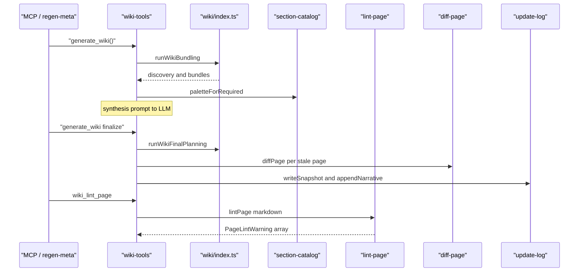
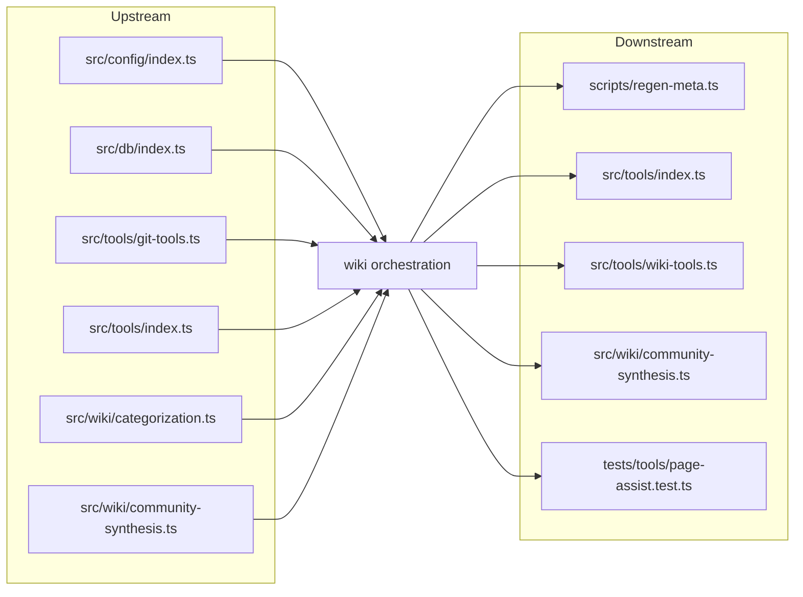

# Wiki orchestration

> [Architecture](../architecture.md)
>
> Generated from `b47d98e` · 2026-04-26

The wiki orchestration community is the user-visible surface of the Louvain-led wiki pipeline. It owns the public functions that callers reach when they run, resume, lint, or diff a wiki regeneration: `runWikiBundling`, `runWikiFinalPlanning`, `getPagePayload`, the synthesis prompt rendering and validation helpers, the section catalog used to seed page shapes, the cheap pattern-based linter, and the structural diff that grounds the update log narrative. Six files cover this surface — three of them (`src/wiki/index.ts`, `src/wiki/lint-page.ts`, `src/wiki/update-log.ts`, `src/tools/wiki-tools.ts`) are documented in their own sub-pages because they carry enough internal complexity to warrant a drill-down. This page covers the architecture-level prose plus inline coverage of the smaller members.

## Entry points

- `runWikiBundling(db, projectDir, cluster?)` — phases 1–3 of the pipeline. Runs discovery, categorization, and Louvain clustering; returns the community bundles the synthesis LLM needs to name communities and pick sections.
- `runWikiFinalPlanning(db, projectDir, gitRef, discovery, …)` — phase 4–5. After all syntheses are stored, builds the page tree, prefetches per-page content, and writes the manifest plus content cache.
- `getPagePayload(pageIndex, manifest, content)` — focused payload for a single page (`generate_wiki(page: N)`). Returns title, purpose, sections, bundle, and link map.
- `renderSynthesisPrompt`, `validateSynthesisPayload`, `requiredSectionsFor`, `mergeRequiredSections`, `clipDocPreview`, `communityIdFor` — synthesis helpers re-exported from `src/wiki/community-synthesis.ts`.
- `runDiscovery`, `runCategorization`, `buildPageTree`, `prefetchContent`, `buildPagePayload`, `buildCommunityBundles` — the per-phase implementations re-exported for callers (`src/tools/wiki-tools.ts`, `scripts/regen-meta.ts`) that need to drive a phase in isolation.
- `lintPage(markdown, opts?)` — pattern-based zero-LLM lint over a rendered page; returns `PageLintWarning[]`.
- `diffPage(wikiPath, meta, oldBody, newBody)` — pure structural diff (added/removed/rewritten sections, citation drift, mermaid diff, numeric literal drift) used as grounding for the update log narrator.
- `SECTION_CATALOG`, `catalogEntry`, `paletteEntries`, `paletteForRequired`, `renderCatalog` — section shape catalog.
- `appendInitLog`, `appendQueueStub`, `appendFallbackLog`, `appendNarrative`, `writeSnapshot`, `readSnapshot`, `deleteSnapshot`, `snapshotPath`, `migrateHeader`, `SNAPSHOT_FILENAME` — update-log writers (covered by the `src/wiki/update-log.ts` sub-page).
- `registerWikiTools`, `suggestedQueriesFor`, `communityReadBreadcrumbs` — MCP tool registration (covered by the `src/tools/wiki-tools.ts` sub-page).

## Per-file breakdown

### `src/wiki/section-catalog.ts` — section shape catalog

The catalog is a 236-LOC file that exports `SECTION_CATALOG: SectionCatalogEntry[]` plus four lookup helpers. Each entry has `id`, `title`, `purpose`, `shape`, and `exampleBody` fields; the synthesis LLM receives the catalog alongside a community bundle and either picks an entry, adapts one, or invents a new section. When it picks a catalog entry, the `shape` field is copied verbatim into the synthesis payload so the page-writing step knows how to structure the section without re-reading the catalog. The leading doc comment is explicit: "Not content to reuse — examples to base shape decisions on." The four helpers are `catalogEntry(id)` (single-entry lookup for shape-inlining), `paletteEntries()` (the evergreen palette materialized from `CATALOG_PALETTE_IDS`), `paletteForRequired(requiredIds)` (filters the palette to entries that match a synthesis's required-section list), and `renderCatalog(entries, includeExample)` (formats the catalog for inclusion in a prompt). The non-obvious bit: the catalog is a single source of truth for both the synthesis prompt and the writing rules — adding a new shape here automatically makes it available to the next regen, but the writing rules themselves live in `wiki/_meta/writing-rules.md` (a generated artifact).

### `src/wiki/diff-page.ts` — pure structural page diff

A 168-LOC pure function that takes two markdown bodies and produces a `PageDiff` for the update-log narrator. The signature is `diffPage(wikiPath, meta, oldBody, newBody): PageDiff`, where `meta` is `{ title, kind, status: "stale" | "added", triggers: string[] }`. It parses sections by H2 heading, computes added/removed sections by set difference on the heading list, then flags a section as `sectionsRewritten` when either `byteDelta >= 0.3` (30% byte change) or `paraDelta >= 0.5` (50% paragraph-count change) — the thresholds are inline literals in the function body. It also extracts citations (file path references), numeric literals, and Mermaid blocks, and reports drift on each set. There is no LLM in this file. Its output is fed to the narrative generator as grounding so the update log leads with what actually changed on the page rather than which trigger files fired.

## How it works

The pipeline starts when an MCP client (or `scripts/regen-meta.ts`) calls `generate_wiki()` with no artifacts. `registerWikiTools` in `src/tools/wiki-tools.ts` routes the call to `runWikiBundling` in `src/wiki/index.ts:44-66`, which logs `[wiki] bundling <N> files, <M> chunks (cluster=<mode>)`, runs `runDiscovery`, then logs `[wiki] discovery <ms>ms — <N> communities` before continuing to `runCategorization` and finally calling `buildCommunityBundles`. The bundle is paired with the section palette returned by `paletteForRequired` (driven by required-section ids) and fed to the synthesis LLM through `renderSynthesisPrompt`.

After every community has a stored synthesis (`write_synthesis`), the caller invokes `runWikiFinalPlanning(db, projectDir, gitRef, discovery, …)`. This phase calls `buildPageTree` to derive the manifest, `prefetchContent` to populate the content cache, and finally writes the meta artifacts under `wiki/_meta/` (the bundles, classified inventory, discovery output, isolate-doc list, and stored syntheses). From here, individual page payloads are served by `getPagePayload(pageIndex, manifest, content)`.

When the user runs a regen-incremental, the orchestrator reads the stored snapshot via `readSnapshot(wikiDir)`, runs `diffPage` per stale page, then calls `appendNarrative(wikiDir, newRef, narrative)` to record what changed. `lintPage(markdown, opts)` is invoked separately (via `wiki_lint_page` in `src/tools/wiki-tools.ts`) to surface fabricated paths, reserved Mermaid IDs, prose hedges, and constant-citation drift before the page ships.

## Dependencies and consumers

- **Depends on:** `src/config/index.ts`, [Database Layer](db-layer.md), [MCP Tool Handlers](mcp-tools.md) (`src/tools/git-tools.ts`, `src/tools/index.ts`), `src/wiki/categorization.ts`, `src/wiki/community-synthesis.ts`, plus the per-phase modules re-exported through `src/wiki/index.ts`.
- **Depended on by:** `scripts/regen-meta.ts`, [MCP Tool Handlers](mcp-tools.md) (which re-exports tool registration), `src/wiki/community-synthesis.ts` (cyclic re-export), and `tests/tools/page-assist.test.ts`.

## Internals

- **`runWikiBundling` is logged through `console.error`, not the project logger.** Look at `src/wiki/index.ts:44-66` — the bundling phase emits `[wiki] bundling …` and `[wiki] discovery …ms` directly to stderr so progress shows up in `bun run` output without depending on `LOG_LEVEL`. Anything that wants to suppress wiki progress has to redirect stderr.
- **The synthesis re-exports from `src/wiki/index.ts` are single-source-of-truth.** `buildCommunityBundles`, `renderSynthesisPrompt`, `validateSynthesisPayload`, `communityIdFor`, `requiredSectionsFor`, `mergeRequiredSections`, and `clipDocPreview` all originate in `src/wiki/community-synthesis.ts` and are re-exported here. Tests and tools must import from `src/wiki` (the package entry), not the implementation file, because the entry is what ships the contract.
- **`SECTION_CATALOG` ids are load-bearing strings.** The synthesis output references catalog entries by id (`shape: "lifecycle-flow"`); changing an id without migrating stored syntheses silently breaks page rendering because `requiredSectionsFor` will fail to look the id up. Add new ids freely; never rename.
- **`diffPage`'s rewrite thresholds are intentionally lossy.** `byteDelta >= 0.3` and `paraDelta >= 0.5` are tuned to catch substantive prose rewrites without flagging trivial whitespace changes. A targeted single-paragraph fix in a long section will fall under both thresholds and not appear in `sectionsRewritten` — the narrator will only mention it via citation/literal drift. This is a feature: it keeps the update log focused on architectural changes.
- **`lintPage` is purely pattern-based.** The leading comment in `src/wiki/lint-page.ts` is explicit: "Cheap, zero-LLM lint … catches the classes of drift that show up most often: fabricated file paths and Mermaid node IDs that collide with reserved keywords." It runs in milliseconds over the entire wiki and produces advisory warnings — the LLM is expected to fix them in place during finalize.
- **`MERMAID_RESERVED_IDS` lives in `src/wiki/lint-page.ts`** as the canonical list of bare node IDs that silently break diagram rendering: `graph`, `subgraph`, `end`, `flowchart`, `direction`, `classdef`, `class`, `style`, `linkstyle`, `click`, `default`, plus the four direction tokens `tb`, `td`, `bt`, `rl`, `lr`, `le`. Adding a token here is a one-line change that retroactively flags every page using it.
- **`SNAPSHOT_FILENAME = "_pre-regen-snapshot.json"`** in `src/wiki/update-log.ts` is the on-disk name of the pre-regen snapshot. The leading underscore puts it at the top of `wiki/_meta/` listings and is the only mechanism that distinguishes it from synthesis artifacts.

## Tuning

| Name | Default | Effect | When to change |
|------|---------|--------|----------------|
| `SNAPSHOT_FILENAME` | `"_pre-regen-snapshot.json"` (`src/wiki/update-log.ts`) | Filename used for the pre-regen snapshot in `wiki/_meta/`. | Don't — every consumer hard-codes the value via the export. |
| `SECTION_CATALOG` palette | static array (`src/wiki/section-catalog.ts`) | Determines which section shapes the synthesis LLM picks from. | When adding a new section pattern that should be available to all communities. |
| `byteDelta >= 0.3` (rewrite threshold) | inline literal in `diffPage` | Marks a section as `sectionsRewritten` when its byte length changes by 30%+. | Lower to catch smaller edits in the update log; raise to filter noise on long pages. |
| `paraDelta >= 0.5` (rewrite threshold) | inline literal in `diffPage` | Marks a section as `sectionsRewritten` when paragraph count changes by 50%+. | Lower if narrative misses substantive paragraph-level rewrites; raise on prose-heavy communities. |
| `cluster: ClusterMode` | `"files"` (`src/wiki/index.ts:44-66`) | Switches Louvain between file-level and symbol-level clustering. | Pass `"symbols"` when file-level communities are too coarse on small projects. |
| `LintPageOptions.knownFilePaths` | `undefined` (`src/wiki/lint-page.ts`) | When set, enables the `missing-file` check against fabricated paths. | Always provide during finalize; omitting it disables the most useful lint. |

The bundle ships fourteen tunables under the synthesis-helper umbrella — `buildCommunityBundles`, `buildPagePayload`, `buildPageTree`, `clipDocPreview`, `communityIdFor`, `mergeRequiredSections`, `prefetchContent`, `renderSynthesisPrompt`, `requiredSectionsFor`, `runCategorization`, `runDiscovery`, and `validateSynthesisPayload` — all of which are re-exported from `src/wiki/community-synthesis.ts` and `src/wiki/community-detection.ts` through `src/wiki/index.ts`. They are called out by the synthesis tooling as named entry points but carry no tunable values; their bodies live in the [Wiki Pipeline — Types & Internals](wiki-pipeline-internals.md) community.

## Why it's built this way

Splitting orchestration into a thin façade (`src/wiki/index.ts`) and per-phase implementation modules (discovery, categorization, page-tree, content-prefetch, page-payload, community-synthesis) lets the synthesis LLM drive each phase independently and lets test harnesses inject after any phase. A monolithic `runWiki()` would make incremental regens impossible — the snapshot/diff path needs to call `prefetchContent` without re-running discovery, and the rewrite-page tool needs to build a single payload without re-running the full pipeline.

The catalog of section shapes lives in code (`SECTION_CATALOG`) rather than in `wiki/_meta/` or `writing-rules.md` because the synthesis prompt builds at runtime: `renderCatalog` and `paletteForRequired` need typed access to entries to filter and render them. A markdown-only catalog would force the LLM to parse the rules every call and would lose the `id`-based reference that ties stored syntheses to shapes across regens.

`diffPage` is deliberately LLM-free. Calling an LLM here would couple the structural diff (which is fast and deterministic) to a model call that adds latency, cost, and stochasticity. Keeping it pure means the narrative generator can be re-prompted without re-diffing, and the same `PageDiff` can be cached and re-rendered.

`lintPage` is the same shape decision in miniature. The fast-path warnings (missing files, reserved Mermaid ids, prose hedges) are caught by patterns; the expensive checks that require source resolution (`constant-value-drift`, `line-range-drift`) ride on cheap chunk metadata. Avoiding an LLM in the lint loop is what makes `wiki_lint_page` viable as a per-page feedback tool.

## Trade-offs

- **The façade re-exports everything.** `src/wiki/index.ts` re-exports nineteen names. Cost: any contributor reading the file sees a long manifest before reaching `runWikiBundling` and `runWikiFinalPlanning`. Acceptable because callers should never reach into per-phase modules directly — the re-exports define the public contract.
- **`diffPage` reports rewrites by heuristics, not by AST.** The 30%/50% thresholds are chosen empirically. Cost: a reader making many small edits to a long section will not see "rewritten" in the update log, even when the cumulative change is substantial. Acceptable because the citation/literal drift checks catch the meaningful semantic changes.
- **`lintPage` is pattern-based, not AST-based.** It cannot follow scope or detect rename refactors. Cost: an aliased import that points at a stale function name will not be flagged. Acceptable because finalize-time human review handles those cases, and the runtime cost of an AST pass over the full wiki is prohibitive.
- **`SECTION_CATALOG` is a single static array.** No project-specific overrides. Cost: a downstream user who wants a new shape must fork or PR. Acceptable because the project ships generic and project-local shapes are better expressed as variants of catalog entries within the synthesis itself.
- **Section ids are the durable contract.** Renaming an id breaks stored syntheses. Cost: catalog id naming must be conservative. Acceptable because the alternative — versioned catalogs or migration tooling — would dwarf the catalog's complexity.

## Common gotchas

- **Don't import from per-phase modules.** Always import from `src/wiki/index.ts` (the package entry). Importing `runDiscovery` from `src/wiki/discovery.ts` directly bypasses the contract and breaks when the implementation moves.
- **`SECTION_CATALOG` ids are case-sensitive.** A synthesis that stores `shape: "Lifecycle-Flow"` will fail `requiredSectionsFor` lookup against `"lifecycle-flow"`. Lowercase-kebab is the convention; the validation step catches mismatches but the error message points at the synthesis, not the catalog.
- **`diffPage` returns a `PageDiff` even when nothing changed.** `null` is reserved for "both bodies missing"; an empty diff (no added/removed/rewritten sections, no citation drift, no literal drift) is still a valid `PageDiff`. The narrator must check the constituent fields to decide whether to emit prose.
- **`lintPage` warnings are advisory only.** A page can ship with warnings; the lint does not block finalize. Tooling that wants a hard gate must inspect the warnings array and fail explicitly. The pattern in `wiki_lint_page` is to surface them as feedback, not enforcement.
- **`runWikiBundling` does not write `wiki/_meta/`.** Only `runWikiFinalPlanning` does. Calling bundling without final planning leaves the synthesis LLM with bundles in memory that disappear when the process exits.
- **`SNAPSHOT_FILENAME` collides with synthesis artifact naming.** The leading underscore is intentional but means a `find wiki/_meta -name '_*.json'` includes the snapshot. Filter by basename match against `SNAPSHOT_FILENAME` rather than glob.

## Sub-pages

- [src/tools/wiki-tools.ts](wiki-orchestration/wiki-tools.md) — the MCP tool surface that drives every wiki phase from outside the process.
- [src/wiki/index.ts](wiki-orchestration/index.md) — the package façade, the bundling and final-planning entry points, and the canonical re-export list.
- [src/wiki/lint-page.ts](wiki-orchestration/lint-page.md) — the pattern-based lint engine, including the reserved-id list and the citation drift checks.
- [src/wiki/update-log.ts](wiki-orchestration/update-log.md) — snapshot persistence, init/queue/fallback log writers, and narrative append.

## See also

- [Architecture](../architecture.md)
- [Data flows](../data-flows.md)
- [Database Layer](db-layer.md)
- [Getting started](../getting-started.md)
- [MCP Tool Handlers](mcp-tools.md)
- [src/tools/wiki-tools.ts](wiki-orchestration/wiki-tools.md)
- [src/wiki/index.ts](wiki-orchestration/index.md)
- [src/wiki/lint-page.ts](wiki-orchestration/lint-page.md)
- [src/wiki/update-log.ts](wiki-orchestration/update-log.md)
- [Wiki Pipeline — Types & Internals](wiki-pipeline-internals.md)
