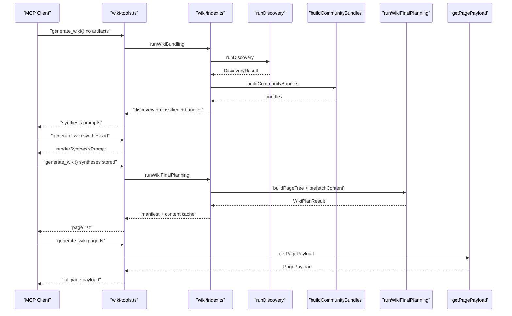
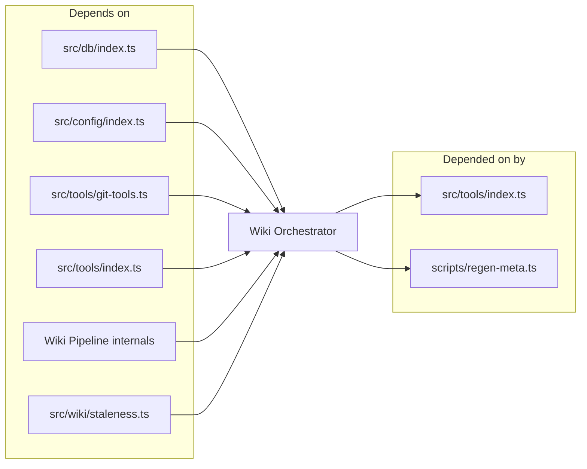

# Wiki Orchestrator & MCP Tools

> [Architecture](../architecture.md)
>
> Generated from `79e963f` · 2026-04-26

The wiki orchestrator community is the machinery that turns a `generate_wiki()` MCP call into a structured page payload. It spans five files: the MCP tool registration layer (`src/tools/wiki-tools.ts`), the barrel that composes the wiki pipeline phases (`src/wiki/index.ts`), the zero-LLM linter (`src/wiki/lint-page.ts`), the curated section-shape catalog (`src/wiki/section-catalog.ts`), and the append-only update log writer (`src/wiki/update-log.ts`). Together they orchestrate the six-phase wiki generation pipeline from the MCP side without owning any of the core algorithmic logic — that lives in the [Wiki Pipeline — Types & Internals](wiki-pipeline-internals.md) community.

## Per-file breakdown

### `src/wiki/index.ts` — Pipeline barrel and orchestration functions

This file is the only entry point into the wiki pipeline from outside the `src/wiki/` directory. It re-exports every phase function from its sub-modules and adds two orchestrating functions that sequence multiple phases into a single call.

`runWikiBundling(db, projectDir, cluster)` runs phases 1–3: `runDiscovery`, `runCategorization`, and `buildCommunityBundles`. It logs timing to stderr at each stage and returns `{ discovery, classified, bundles, unmatchedDocs }` — everything the synthesis LLM needs to decide community names, slugs, and section shapes. This is the "first half" of planning and is intentionally synchronous (except for DB reads inside discovery).

`runWikiFinalPlanning(db, projectDir, gitRef, discovery, classified, bundles, syntheses, unmatchedDocs, config, cluster)` runs phases 4–5: `buildPageTree` and `prefetchContent`. It takes the synthesis payloads already stored by the LLM and builds the manifest and content cache, accumulating warnings from all phases. This is the "second half" of planning and is async because prefetch fetches embeddings.

`getPagePayload(pageIndex, manifest, content)` is a thin wrapper around `buildPagePayload` — it selects one page from the pre-built manifest and content cache and returns the structured payload the LLM uses to write that page.

The re-export surface covers `runDiscovery`, `runCategorization`, `buildPageTree`, `prefetchContent`, `buildPagePayload`, `buildCommunityBundles`, `renderSynthesisPrompt`, `validateSynthesisPayload`, `communityIdFor`, `requiredSectionsFor`, `mergeRequiredSections`, and `clipDocPreview`.

### `src/tools/wiki-tools.ts` — MCP tool registration for wiki operations

The largest file in the community at 1920 lines, this registers all wiki-related MCP tools against the server. The primary tool is `generate_wiki`, which gates on a state machine: no artifacts triggers bundling; `synthesis` returns a synthesis prompt; a complete syntheses file triggers final planning; `page: N` returns a page payload; `finalize: true` runs the validation checklist; `resume: true` lists missing pages; `incremental: true` re-runs bundling and reports stale pages.

Key helpers exported from this file:

- `communityReadBreadcrumbs(payload)` extracts the ordered list of ancestor pages from a page payload's breadcrumb chain, returning `ReadBreadcrumb[]` for use in step-by-step writing instructions.
- `suggestedQueriesFor(payload)` derives semantic queries the writer should run before drafting each section, surfacing error paths and constants that the bundle misses.

The file embeds the full writing rules as a string constant (`WRITING_RULES`) that is returned verbatim as part of every page payload. It also contains `safeRead(path)` — a `try/catch` wrapper around `readFileSync` that returns `null` on any error rather than throwing, used when reading optional artifact files during orchestration.

### `src/wiki/section-catalog.ts` — Section shape registry

`SECTION_CATALOG` is an array of `SectionCatalogEntry` objects, each with `id`, `title`, `purpose`, `shape` (a structural description), and `exampleBody` (a concrete example to reason from, not to copy). The catalog exists because the synthesis LLM needs a bounded vocabulary of section shapes — without it, every community would invent its own structure and the wiki would be visually inconsistent.

`renderCatalog(entries, includeExample)` serializes the catalog to a markdown string for injection into synthesis prompts. By default it omits example bodies to save tokens; pass `includeExample: true` when the LLM needs the concrete patterns.

`paletteForRequired(requiredIds)` selects the catalog entries for a specific set of required section IDs. This is used during synthesis to show only the shapes the LLM must use, rather than the full 15+ entry catalog.

`catalogEntry(id)` is a direct lookup by ID, used when inlining a shape into a page payload.

`paletteEntries()` returns the evergreen subset of catalog entries — the shapes that apply broadly across community types, filtered by `CATALOG_PALETTE_IDS` (a module-private constant).

### `src/wiki/lint-page.ts` — Zero-LLM wiki page linter

`lintPage(markdown, opts)` runs a battery of pattern-based checks against a generated wiki page without calling any LLM or DB. The `LintWarningKind` union covers eleven warning kinds: `missing-file`, `constant-missing`, `constant-value-drift`, `constant-uncited`, `member-uncited`, `line-range-drift`, `citation-symbol-drift`, `prose-hedge`, `mermaid-reserved-id`, `mermaid-unquoted-label`, and `mermaid-html-in-alias`.

`MERMAID_RESERVED_IDS` is the canonical set of tokens that silently break Mermaid rendering: `graph`, `subgraph`, `end`, `flowchart`, `direction`, `classdef`, `class`, `style`, `linkstyle`, `click`, `default`, and the direction shorthands `tb`, `td`, `bt`, `rl`, `lr`, `le`.

`lintPathRefs` scans backtick-fenced path references in prose (outside code blocks) against a known-file-paths set, flagging anything that looks like a path but isn't in the index. It builds a basename index first so shorthand paths (e.g. a bare module name instead of the full project-relative form `src/db/index.ts`) are flagged with a `missing-file` warning.

### `src/wiki/update-log.ts` — Append-only generation log

Two functions write to `wiki/_update-log.md`:

- `appendInitLog(wikiDir, gitRef, manifest)` records a full initialization entry with page counts broken down by kind (community, sub-page, top-level).
- `appendIncrementalLog(wikiDir, sinceRef, newRef, changedFileCount, report)` records a `sinceRef → newRef` incremental update with lists of regenerated, added, and removed pages.

Both append deterministically from structured data — no LLM involvement. The log file is named `_update-log.md` (leading underscore so it sorts to the top in directory listings) and is not itself a wiki page.

## How it works

1. The first `generate_wiki()` call (no parameters) triggers `runWikiBundling`, which runs discovery, categorization, and bundle construction. The result is serialized to `wiki/_meta/` and the list of community IDs is returned.
2. The caller calls `generate_wiki(synthesis: id)` for each community ID to get a synthesis prompt. `renderSynthesisPrompt` assembles the community bundle, the section catalog (via `paletteForRequired`), and writing rules into a structured prompt. The LLM writes a synthesis payload and the tool persists it via `validateSynthesisPayload`.
3. Once all syntheses are stored, a subsequent `generate_wiki()` call detects the complete syntheses file and runs `runWikiFinalPlanning`: builds the page tree (manifest) and prefetches content for all pages.
4. `generate_wiki(page: N)` calls `getPagePayload(N, manifest, content)` and returns the payload for page N, including pre-run semantic query results, the community bundle, exports, tunables, and the link map.
5. `generate_wiki(finalize: true)` runs the validation checklist (lint sweep, broken link check, missing page detection).

## Dependencies and consumers

Depends on: `src/db/index.ts` (DB access), `src/config/index.ts` (project config), `src/tools/git-tools.ts` (git root detection and raw git output for staleness), `src/tools/index.ts` (the `resolveProject` helper), the wiki pipeline internals (`community-detection`, `community-synthesis`, `content-prefetch`, `page-payload`, `page-tree`, `staleness`).

Depended on by: `src/tools/index.ts` (imports `registerWikiTools`) and `scripts/regen-meta.ts` (imports `src/wiki/index.ts` directly for offline meta regeneration).

## Tuning

The behavior of the wiki pipeline can be altered without code changes through several parameters:

- **`cluster` mode** (`"files"` | `"symbols"`): Passed to `generate_wiki` and forwarded to `runWikiBundling`. File-level Louvain is the default and works for most projects; symbol-level is finer-grained but slower and requires a populated symbol graph.
- **`SECTION_CATALOG`**: Adding or modifying entries in `src/wiki/section-catalog.ts` changes which section shapes are available to the synthesis LLM. The `CATALOG_PALETTE_IDS` constant (module-private) controls which entries appear in the evergreen palette shown in every synthesis prompt.
- **Lint rule thresholds**: `lintPathRefs` only fires when `opts.knownFilePaths` is provided. The Mermaid reserved-ID check uses `MERMAID_RESERVED_IDS` — adding tokens to that set will flag additional node IDs in future lint passes.
- **Split community triggers**: Controlled in `src/wiki/community-detection.ts` by `MAX_SIZE_FRACTION = 0.18` and `MIN_SPLIT_SIZE = 8`. A community must exceed `max(8, floor(n * 0.18))` members to be split on a second Louvain pass.

## Internals

**Lint warning kinds.** The eleven `LintWarningKind` values map to distinct checks: `missing-file` fires on path-like backtick tokens not in the file index; `constant-uncited` fires when a tunable declared in source never appears in prose; `member-uncited` fires on community members not mentioned on the page; `line-range-drift` fires when a cited line range no longer matches the live source; `mermaid-reserved-id` fires on bare Mermaid node IDs that collide with parser keywords; `mermaid-unquoted-label` fires on labels with punctuation that must be quoted; `mermaid-html-in-alias` fires on HTML tags inside sequenceDiagram participant aliases.

**Breadcrumb vs. suggested-query distinction.** `communityReadBreadcrumbs` extracts the static ancestor chain from the payload's breadcrumb field — this is used to build the `> [Parent](path)` header. `suggestedQueriesFor` derives the dynamic list of `read_relevant` queries the writer should execute before drafting each section — these are derived from section purposes and are not stored in the manifest.

**Section catalog lookup mechanics.** When `generate_wiki(synthesis: id)` is called, `paletteForRequired` selects only the catalog entries whose IDs appear in the community's required-sections list. This limits the catalog to 3–5 entries rather than the full 15+, reducing token cost while still giving the LLM the shapes it needs. The full catalog is available via `renderCatalog()` when a synthesis needs broader guidance.

**Artifact file layout.** The orchestrator reads and writes several JSON files inside the `wiki/_meta/` directory, including the discovery result, classified inventory, community bundles, synthesis payloads, the page manifest, and the content cache. The `safeRead` helper returns `null` when any of these is missing, allowing the state machine to detect which phase has completed.

## Why it's built this way

The MCP tool layer (`src/tools/wiki-tools.ts`) is kept separate from the pipeline barrel (`src/wiki/index.ts`) because the pipeline functions are also called from `scripts/regen-meta.ts` (an offline script that regenerates metadata without going through MCP). Embedding MCP-specific concerns (Zod schemas, `resolveProject`, streaming progress) in the pipeline itself would make it impossible to call without an MCP server.

The section catalog (`section-catalog.ts`) exists as a separate file rather than inline constants in `wiki-tools.ts` because it is also imported by `community-synthesis.ts` during bundle building. A shared catalog ensures the shapes available during synthesis are exactly the shapes the page writer is given.

`lint-page.ts` is pattern-based and zero-LLM by design. Running Louvain, embedding, and DB queries on every page would make the finalize pass too slow to be a feedback loop. Pattern checks run in milliseconds over the full wiki.

## Trade-offs

Storing intermediate artifacts in `wiki/_meta/` as JSON files makes the pipeline resumable — if synthesis fails halfway, the caller can retry from the stored bundles. The cost is that stale artifacts can cause confusing behavior if the source changes between phases. The `incremental: true` mode detects staleness, but only at the manifest level.

The section catalog is a closed set — the LLM can invent sections outside the catalog, but they won't have a `shape` field and the writing instructions won't know how to structure them. This is a deliberate trade-off: consistency over flexibility.

## Common gotchas

**Calling `generate_wiki(page: N)` before `runWikiFinalPlanning` completes returns an error.** The manifest and content cache must exist on disk. If the manifest artifact is missing from `wiki/_meta/`, the tool returns an instruction to run bundling first.

**`safeRead` returns `null` silently.** If a `_meta/` artifact is missing or corrupt, `safeRead` returns `null` and the state machine interprets this as "phase not started". Corrupt JSON (not missing files) will cause a parse error that propagates — `safeRead` only catches file-not-found errors.

**The section catalog `exampleBody` is for reasoning, not copying.** The `includeExample: false` default in `renderCatalog` means example bodies are hidden from the LLM during synthesis. When examples are included (`includeExample: true`), they are illustrative patterns, not templates — copying them verbatim produces generic pages.

**Lint warnings are advisory, not blocking.** `lintPage` returns a list of `PageLintWarning` objects; it doesn't throw. The finalize pass collects and displays them, but writing a page with warnings is not prevented. Fix warnings before marking a page as complete.

## See also

- [Architecture](../architecture.md)
- [Data flows](../data-flows.md)
- [Database Layer](db-layer.md)
- [Getting started](../getting-started.md)
- [MCP Tool Handlers](mcp-tools.md)
- [Wiki Pipeline — Types & Internals](wiki-pipeline-internals.md)
