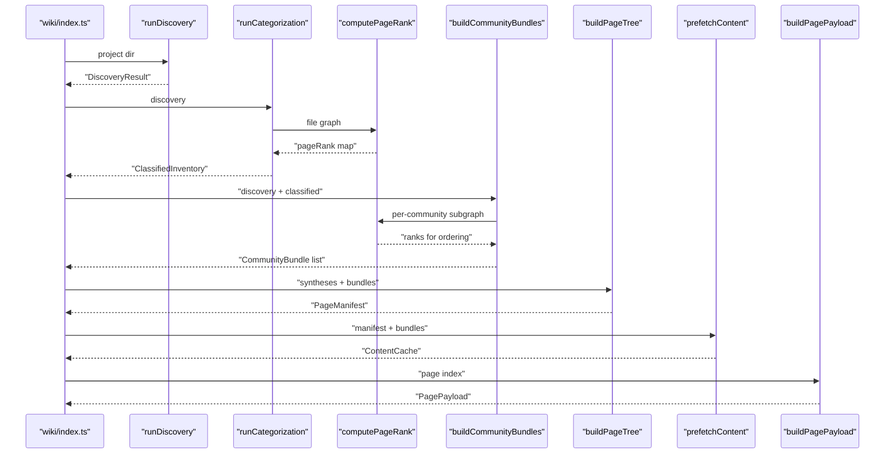
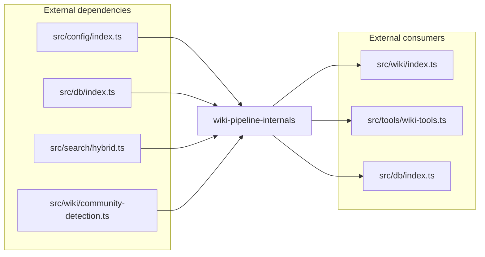

# Wiki Pipeline — Types & Internals

> [Architecture](../architecture.md)
>
> Generated from `b47d98e` · 2026-04-26

This community is the algorithmic core of wiki generation: every type contract that flows between phases, the PageRank scorer that orders bundles, the bundle builder that pre-gathers everything an LLM needs to plan a page, the page-tree assembler, the staleness classifier, the per-payload payload assembler, and the kind-specific semantic-query templates. The orchestration shell lives in [Wiki orchestration](wiki-orchestration.md); this is what it calls.

## Per-file breakdown

### `src/wiki/types.ts` — The data contract for every wiki phase

This is the highest-PageRank file in the community and the only place where the shapes shared between phases live. Nothing in `src/wiki/types.ts` does work — it defines `FileLevelGraph`, `DiscoveryResult`, `ClassifiedInventory`, `CommunityBundle`, `SynthesisPayload`, `ManifestPage`, `PageManifest`, `PageContentCache`, `ArchitectureBundle`, `GettingStartedBundle`, `PagePayload`, `WikiPlanResult`, `PreRegenSnapshot`, and `PageDiff`. A drill-down sub-page covers each of these shapes individually; see [src/wiki/types.ts](wiki-pipeline-internals/src-wiki-types-ts.md).

The non-obvious detail is the structural progression: `DiscoveryResult` feeds `ClassifiedInventory` (Phase 2), which feeds `CommunityBundle[]` (Phase 3), which combines with `SynthesesFile` to produce `PageManifest` (Phase 4), and finally `PagePayload` (Phase 5). `PageContentCache` is the per-page slice of the manifest's content cache — one per wiki path — and ships the right bundle variant for the page's kind plus pre-run `prefetchedQueries`.

### `src/wiki/community-synthesis.ts` — Bundle builder + section requirements

908 LOC, the second-largest file in the community. It exports `buildCommunityBundles` (Phase 3 entry point), `requiredSectionsFor` (data-driven section requirements), `classifyMembers` and `isSplitCommunity` (split-community decisions), `communityIdFor` (stable hash of member files), `clipDocPreview`, and a handful of size constants. A drill-down sub-page covers it: [src/wiki/community-synthesis.ts](wiki-pipeline-internals/community-synthesis.md).

The `DEPTH_PROFILE` object centralises every section-firing threshold: `perFile.minFiles = 3` × `minExports = 5`, `flow.minFiles = 2`, `internals.minLoc = 400` / `minTunables = 8` / `minFiles = 10`, `depGraph.minEdges = 3`, and `deep.minTopMemberLoc = 800` / `minFiles = 10`. The deep profile fires `design-rationale`, `trade-offs`, and `common-gotchas` so a large community doesn't flatten into a symbol dump. Bundle caps include `MAX_EXPORTS_IN_BUNDLE`, `MAX_EXPORTS_LOW_COHESION = 15`, `LOW_COHESION_THRESHOLD = 0.15`, `MAX_TUNABLES = 40`, `MAX_COMMITS = 10`, `MAX_SIGNATURE_BYTES = 240`, `MAX_PREVIEW_LINES = 60`, `MAX_PREVIEW_BYTES_PER_FILE = 2 * 1024`, `MAX_TOTAL_PREVIEW_BYTES = 24 * 1024`, `MAX_NEARBY_DOC_BYTES = 2 * 1024`, `MAX_TOTAL_NEARBY_DOC_BYTES = 12 * 1024`, `EXTERNAL_DEP_SAMPLE = 5`, and `MAX_PER_FILE_EDGES = 30`. `TUNABLE_TYPES` is the literal `new Set(["constant", "variable"])`.

### `src/wiki/page-tree.ts` — Manifest builder from synthesis payloads

`buildPageTree` is the Phase 4 entry point. It folds `SynthesesFile.payloads` into a `PageManifest` of community pages under `wiki/communities/<slug>.md` plus three hardcoded aggregates at `wiki/architecture.md`, `wiki/data-flows.md`, and `wiki/getting-started.md`. Split communities — those `isSplitCommunity` flags — also emit `wiki/communities/<slug>/<sub-slug>.md` sub-pages, one per "big" member, sharing the parent `communityId` so prefetch can re-scope the bundle.

The depth-auto thresholds are `DEPTH_FULL_FILE_COUNT = 10`, `DEPTH_STANDARD_FILE_COUNT = 4`, `DEPTH_FULL_TOP_LOC = 400`, and `DEPTH_FULL_TUNABLE_COUNT = 8`. A community with ≥10 files goes `full`; ≥4 goes `standard`; otherwise `brief`. LOC and tunable signals can promote a small-but-complex community to `full` even when file count alone wouldn't. The publicly-exported `AGGREGATE_PAGE_PATHS` lists the three aggregate paths so staleness/orchestrator code doesn't hardcode them. Path-shaping helpers: `COMMUNITIES_DIR = "communities"`, fixed paths `ARCHITECTURE_PATH`, `GETTING_STARTED_PATH`, `DATA_FLOWS_PATH`. Split communities always escalate to `full` regardless of size — they own a per-file breakdown for small members plus a Sub-pages signpost.

### `src/wiki/content-prefetch.ts` — Phase-5 content cache assembler

631 LOC. Builds the `ContentCache` keyed by wiki path. For community pages, it ships the matching `CommunityBundle`; for architecture pages, an `ArchitectureBundle` (top hubs, meta-graph, cross-cutting files, repo-root doc previews, supplementary docs); for getting-started pages, a `GettingStartedBundle` (README, package manifest, top community, CLI entry points, config files, origin commits). It also runs every `semanticQueriesFor(kind)` query through `searchChunks` and inlines the top-K hits as `prefetchedQueries`, capped per chunk. A drill-down sub-page covers it: [src/wiki/content-prefetch.ts](wiki-pipeline-internals/content-prefetch.md).

`scopeBundleToFiles(parent, files, projectDir)` is the export that makes split communities work. Given a parent `CommunityBundle` and a subset of its `memberFiles`, it returns a new bundle with `exports`, `tunables`, `annotations`, `recentCommits`, `memberLoc`, and `pageRank` filtered to the subset. The top-ranked member is recomputed from the subset so sub-pages can ground prose in real source.

### `src/wiki/page-payload.ts` — Per-page payload assembler

`buildPagePayload(pageIndex, manifest, content)` is what `generate_wiki(page: N)` returns. It reads the manifest's pages in `order`-sorted slots, looks up `content[wikiPath]`, computes a `linkMap`, builds breadcrumbs, pre-renders the breadcrumb line and the See also block, attaches `semanticQueries` from `semanticQueriesFor(kind)`, and ships `prefetchedQueries` from the cache. The pre-rendered blocks exist because in the v2 run zero of twelve community pages grew a See also block when guidance was prose-only — pre-rendering moves the heading and links from "writer must remember" to "writer copies verbatim".

### `src/wiki/semantic-queries.ts` — Kind-specific writer queries

`SEMANTIC_QUERIES` is a `Record<string, string[]>` mapping page kinds (`architecture`, `community`, `community-file`, `getting-started`, `guide`) to three queries each. `semanticQueriesFor(kind)` returns the array, or `[]` for unknown kinds. The community kind ships `["public API and exported function signatures", "tunable constants thresholds and magic numbers exported", "error paths fallback handling and try/catch comments"]`. These queries are run during Phase 5 prefetch and shipped inline on every page payload, so the writer LLM doesn't burn turns calling `read_relevant` on the same dimensions.

### `src/wiki/pagerank.ts` — Power-iteration PageRank on a graphology graph

`computePageRank(graph, opts)` runs PageRank with defaults `damping = 0.85`, `tolerance = 1e-6`, `maxIterations = 100`. Dangling nodes (zero out-edges) have their rank distributed uniformly each iteration, so the algorithm doesn't leak mass on graph sinks. Iteration is over `graph.nodes()` in insertion order, so callers must sort node inserts for determinism — every callsite in this community does. Helpers `rankedNodes` and `topKByPageRank` sort descending with deterministic node-id tiebreak.

### `src/wiki/categorization.ts` — Symbol & file classification (Phase 2)

`runCategorization(db, discovery, projectDir)` deduplicates symbols via `TYPE_PRIORITY` (class < interface < enum < type < function < variable < constant), classifies each into `tier ∈ {entity, bridge}` and `scope ∈ {cross-cutting, shared, local}`, and runs a global PageRank over the file-level import graph to flag the top 5% as `isTopHub`. The constant `SYMBOL_TYPES` lists every symbol kind pulled from `file_exports`: `class`, `interface`, `type`, `enum`, `function`, `variable`, `constant`. The earlier list was missing `constant` defensively, so 26-language tree-sitter parsers that emit `constant` separately had every community ship `tunables: []` — a real regression the comment now warns against. `topK = Math.max(200, discovery.fileCount * 2)` per type, ensuring small projects don't starve and large ones aren't truncated.

### `src/wiki/staleness.ts` — Per-page regeneration classifier

`classifyStaleness` decides which pages must be regenerated given an old manifest, a new manifest, the new bundles, the stored syntheses, the top-hub set, the entry-point set, and the changed-files set. A community page is stale if any of its `memberFiles` is in `changedFiles`. An aggregate page (architecture, getting-started, data-flows) is stale if the community set shifted — any community appeared, disappeared, or got a new id — or if any changed file is also a top hub or entry point. `missingSyntheses` lists community ids in `newBundles` that don't have a stored synthesis yet; the orchestrator prompts the LLM for those before rebuilding.

### `src/wiki/isolate-docs.ts` — Markdown/text isolate attachment

A "graph isolate" is a node the resolver couldn't parse — `fanIn === 0 && fanOut === 0 && exports.length === 0`. In practice, that's markdown, shell scripts, config, and data files. `collectIsolateDocs` filters those by extension to `DOC_EXTENSIONS = {".md", ".mdx", ".rst", ".txt", ".sh", ".bash", ".zsh", ".fish"}`, reads them off disk, and applies the cohesion-aware caps `MAX_DOCS_HIGH_COHESION = 8` / `MAX_DOCS_LOW_COHESION = 3` (low-cohesion threshold `LOW_COHESION_THRESHOLD = 0.15`). `attachIsolateDocs` matches each doc to a community by shared directory prefix with `MIN_SHARED_SEGMENTS = 2` so a stray doc under `src/` doesn't trivially attach to the largest community. Unmatched docs flow up to the architecture bundle.

## How it works

1. `runDiscovery` parses the project into a `FileLevelGraph` and a `DirectoryLevelGraph`, runs Louvain to produce a `DiscoveryModule` tree, and returns a `DiscoveryResult` carrying both graphs plus the modules.
2. `runCategorization` pulls every export from the symbol DB, deduplicates via `TYPE_PRIORITY`, classifies tier/scope per symbol, and runs `computePageRank` over the file graph to pick the top 5% as `isTopHub`.
3. `buildCommunityBundles` turns each `DiscoveryModule` into a `CommunityBundle` — sorted member files, exports ordered by per-community PageRank, tunables (capped at `MAX_TUNABLES = 40`), per-member LOC, external consumers/dependencies, recent commits (capped at `MAX_COMMITS = 10`), annotations, member previews, and nearby docs. The community id is `communityIdFor(memberFiles)` — a SHA-256 prefix over the sorted member set.
4. The orchestrator persists bundles, prompts the LLM for one `SynthesisPayload` per community via `renderSynthesisPrompt`, validates each, and stores them in `SynthesesFile`.
5. `buildPageTree` fuses `SynthesesFile.payloads` with the bundles to emit a `PageManifest`: one community page per synthesis (`wiki/communities/<slug>.md`), one sub-page per "big" member of split communities, plus the three fixed aggregates.
6. `prefetchContent` walks every manifest page, attaches the right bundle variant and pre-runs the `semanticQueriesFor(kind)` queries through `searchChunks`, and stores the result keyed by wiki path in `ContentCache`.
7. `buildPagePayload(N, manifest, content)` slices one page out of the manifest, attaches the `linkMap`, breadcrumbs, pre-rendered blocks, and prefetched query hits, and returns the `PagePayload` the writer LLM consumes.
8. On subsequent runs, `classifyStaleness` compares old manifest, new manifest, and changed files to pick which pages to regenerate; `missingSyntheses` flags community ids needing a fresh synthesis.

## Dependencies and consumers

Member files import from the database (`src/db/index.ts`, `src/db/types.ts`), the hybrid searcher (`src/search/hybrid.ts`) for prefetched query execution, the project config (`src/config/index.ts`), and the Louvain stage (`src/wiki/community-detection.ts`). The community is depended on by the orchestration barrel (`src/wiki/index.ts`) and the MCP tool layer (`src/tools/wiki-tools.ts`); call `depended_on_by` on a member for the full list.

## Data shapes

The pipeline is shaped by four phase-boundary types, each defined in `src/wiki/types.ts`. `DiscoveryResult` carries the file count, chunk count, last-indexed timestamp, the Louvain `DiscoveryModule` tree (each with `cohesion = internalEdges / maxPossibleEdges`), and both `FileLevelGraph` and `DirectoryLevelGraph` slices used downstream by PageRank and bundle building.

`CommunityBundle` is the deterministic, LLM-input shape for one community. It carries `communityId` (SHA-256 prefix over sorted `memberFiles`), the sorted `memberFiles`, `exports` (capped at `MAX_EXPORTS_IN_BUNDLE` for cohesive communities or `MAX_EXPORTS_LOW_COHESION` for grab-bags below `LOW_COHESION_THRESHOLD = 0.15`), `tunables` (capped at `MAX_TUNABLES = 40`), `topMemberLoc` and per-member `memberLoc`, the pre-cap `tunableCount` and `exportCount` so the writer can say "shown N of M", `externalConsumers` and `externalDependencies` (sampled at `EXTERNAL_DEP_SAMPLE = 5`), per-member `consumersByFile` and `dependenciesByFile` maps (capped at `MAX_PER_FILE_EDGES = 30`), `recentCommits` (capped at `MAX_COMMITS = 10`), `annotations`, `topRankedFile`, `memberPreviews` (capped at `MAX_PREVIEW_LINES = 60` and `MAX_PREVIEW_BYTES_PER_FILE = 2 * 1024`, total budget `MAX_TOTAL_PREVIEW_BYTES = 24 * 1024`), per-file `pageRank`, the `cohesion` score, and `nearbyDocs` (per-doc `MAX_NEARBY_DOC_BYTES = 2 * 1024`, aggregate `MAX_TOTAL_NEARBY_DOC_BYTES = 12 * 1024`).

`SynthesisPayload` is the LLM's plan for one community: `communityId` matching the bundle, `name`, `slug` (kebab-case, `/^[a-z0-9-]+$/`), `purpose`, `sections: SectionSpec[]`, and an optional `kind`. `SectionSpec` carries `title`, `purpose`, and an optional `shape` lifted from the section catalog when the LLM picked a shape. `SynthesesFile` is the persistence layer: `version: 1`, `payloads` keyed by community id, and `memberSets` recording which member-file set the synthesis was based on so staleness can compare.

`PageManifest` (version 3) carries `generatedAt`, `lastGitRef`, `pageCount`, the page table keyed by wiki path, and the `cluster` mode. Each `ManifestPage` has a free-form `kind`, `slug`, `title`, `purpose`, `sections`, depth (`full | standard | brief`), `memberFiles`, optional `communityId`, `relatedPages`, and an `order` slot for stable iteration. `PagePayload` is the writer-facing slice of all of the above plus pre-rendered blocks, breadcrumbs, semantic queries, and pre-run query results — everything needed to draft the page in one pass without further tool calls in the common case.

## Tuning

| Name | Value | Purpose |
|------|-------|---------|
| `SEMANTIC_QUERIES` | `Record<string, string[]>` keyed by page kind | Three queries per kind, run during prefetch and shipped on every payload. |
| `BIG_FILE_LOC` | `500` | Per-file LOC threshold for "big" members in split decisions. |
| `BIG_FILE_EXPORTS` | `8` | Per-file export-count threshold for "big" members. |
| `SPLIT_TOTAL_LOC` | `5000` | Total community LOC above which the community always splits. |
| `SPLIT_BIG_MEMBER_COUNT` | `4` | Big-member count above which the community splits. |
| `AGGREGATE_PAGE_PATHS` | `[ARCHITECTURE_PATH, DATA_FLOWS_PATH, GETTING_STARTED_PATH]` | Canonical aggregate paths exposed for staleness/orchestrator. |
| `DEPTH_FULL_FILE_COUNT` | `10` | Member count for auto-`full` depth. |
| `DEPTH_STANDARD_FILE_COUNT` | `4` | Member count for auto-`standard` depth. |
| `DEPTH_FULL_TOP_LOC` | `400` | Top-member LOC that escalates to `full`. |
| `DEPTH_FULL_TUNABLE_COUNT` | `8` | Tunable count that escalates to `full`. |
| `MAX_EXPORTS_IN_BUNDLE` | `60` | Export cap for cohesive bundles. |
| `MAX_EXPORTS_LOW_COHESION` | `15` | Export cap for grab-bag bundles below `LOW_COHESION_THRESHOLD`. |
| `LOW_COHESION_THRESHOLD` | `0.15` | Below this, `MAX_EXPORTS_LOW_COHESION` and `MAX_DOCS_LOW_COHESION` apply. |
| `MAX_TUNABLES` | `40` | Cap on tunables shipped per bundle. |
| `MAX_COMMITS` | `10` | Per-community cap on recent-commit history. |
| `MAX_SIGNATURE_BYTES` | `240` | Hard cap on a single export signature length. |
| `MAX_PREVIEW_LINES` | `60` | Lines per non-top-ranked member preview. |
| `MAX_PREVIEW_BYTES_PER_FILE` | `2 * 1024` | Per-file preview cap. |
| `MAX_TOTAL_PREVIEW_BYTES` | `24 * 1024` | Aggregate preview budget across rank-2..N members. |
| `MAX_NEARBY_DOC_BYTES` | `2 * 1024` | Per-doc cap for nearby docs. |
| `MAX_TOTAL_NEARBY_DOC_BYTES` | `12 * 1024` | Aggregate nearby-doc budget. |
| `EXTERNAL_DEP_SAMPLE` | `5` | Sample size for `externalConsumers` / `externalDependencies` shown in synthesis. |
| `MAX_PER_FILE_EDGES` | `30` | Per-member cap on `consumersByFile` / `dependenciesByFile`. |
| `MAX_DOCS_HIGH_COHESION` | `8` | Nearby-doc count cap for cohesive communities. |
| `MAX_DOCS_LOW_COHESION` | `3` | Nearby-doc count cap for grab-bag communities. |
| `MIN_SHARED_SEGMENTS` | `2` | Minimum overlapping path segments before an isolate doc claims a community. |
| `DOC_EXTENSIONS` | `{".md", ".mdx", ".rst", ".txt", ".sh", ".bash", ".zsh", ".fish"}` | Extensions treated as narrative isolates. |
| `TYPE_PRIORITY` | `class < interface < enum < type < function < variable < constant` | Tiebreak order during symbol deduplication. |
| `SYMBOL_TYPES` | `["class", "interface", "type", "enum", "function", "variable", "constant"]` | DB rows pulled in Phase 2; `constant` is defensive for parsers that emit it separately. |
| PageRank defaults | `damping = 0.85`, `tolerance = 1e-6`, `maxIterations = 100` | Power-iteration parameters. |

## Internals

**`exportCount` is the pre-cap count.** `CommunityBundle.exports.length` reflects the cap (`MAX_EXPORTS_IN_BUNDLE` or `MAX_EXPORTS_LOW_COHESION`); `exportCount` is the original count. The writer is told to phrase truncation as "shown N of M" using these two fields rather than guessing.

**`EXTERNAL_DEP_SAMPLE = 5` is small on purpose.** Bumping it from 5 to 15 increased per-page agentic verification cost by 63% on a real wiki gen — writers cited every shown edge. The synthesis prompt nudges the LLM to call `depended_on_by` / `depends_on` for the full list when naming actually needs it; the small sample plus a count is enough framing.

**Tunables are emitted only for `constant` and `variable` types.** `TUNABLE_TYPES = new Set(["constant", "variable"])`. Other export kinds (functions, classes, types) never reach the tunables array. The earlier missing `constant` in `SYMBOL_TYPES` meant every community shipped `tunables: []` — that bug is the reason the categorization comment explicitly warns against trimming the list.

**Signature truncation is a two-stage cap.** `truncateSignature` first walks brace depth to strip a function body when present, then hard-caps the result at `MAX_SIGNATURE_BYTES = 240` with an ellipsis. Single-line arrow-fn signatures and type aliases can still exceed 240 chars (long generic constraints, union types) — the byte cap handles that.

**Dangling-node mass distribution.** `computePageRank` redistributes the rank of zero-out-degree nodes uniformly each iteration: `danglingShare = damping * danglingSum / n`. Without this, mass sinks to graph terminals and ranks diverge. The undirected community subgraph means dangling nodes are rare; it matters more on the global graph where files with no outgoing imports exist.

**Split-community LOC escalation.** `isSplitCommunity` returns true when `totalLoc >= SPLIT_TOTAL_LOC = 5000` OR `bigCount >= SPLIT_BIG_MEMBER_COUNT = 4`. Big = `loc >= BIG_FILE_LOC = 500` OR `exports >= BIG_FILE_EXPORTS = 8`. The earlier count-based-only trigger split every 10-file community even when each file was 50 LOC; the size-based trigger fires only when the parent page would genuinely be unreadable in one shot.

**`scopeBundleToFiles` rebuilds the top-ranked file from the subset.** A naive subset would inherit the parent bundle's `topRankedFile`, which might not be in the subset. The function recomputes it by sorting subset files by parent `pageRank` descending — so a single-file sub-page always uses that file as its anchor, and a group sub-page picks the highest-ranked member of the group.

**Aggregate staleness is not symmetric with community staleness.** A community page becomes stale when one of its `memberFiles` changes; an aggregate page becomes stale when the community set shifts (any id appeared, disappeared, or changed) or when a top-hub / entry-point file changes. A change inside a non-hub community member never invalidates the aggregate pages.

## Why it's built this way

The pipeline is split into deterministic phases (1, 2, 3 deterministic; the synthesis step takes LLM input via stored payloads; 4 and 5 are deterministic again) so the LLM is a single, isolated step in the middle. Bundle building is pure code: the LLM never sees half-built state, which means an interrupted run can be resumed by reading `wiki/_meta/`. The same property makes the pipeline testable: every phase has a deterministic input and output type that lives in `src/wiki/types.ts`.

`CommunityBundle` is the entire LLM input by design. The synthesis LLM gets exports, tunables, dependencies, recent commits, annotations, member previews, and nearby docs all in one structured prompt — no tool calls during synthesis in the common case. This keeps prompt cost predictable (caps everywhere) and synthesis itself idempotent given a fixed bundle.

The threshold-driven `requiredSectionsFor` is data-driven by deliberate choice. The earlier prompt-only approach let the LLM skip sections like `internals` and `tuning-knobs` on bundles that obviously needed them — quality regressed. Centralising the predicates in a single `DEPTH_PROFILE` object means tuning is configuration change, not grep-and-replace.

PageRank replaced an `isHub` heuristic (`fanIn >= 5` or `fanIn >= 2 && fanOut >= 2`). The magic numbers didn't scale — large projects had hundreds of "hubs", small projects had zero. Top-K-by-PageRank with `topK = max(5, ceil(n * 0.05))` is monotonic in project size: 5 hubs in tiny projects, ~15 in mid-size, ~50 in 1000-file projects.

Pre-rendering the breadcrumb and See also blocks in `buildPagePayload` is a response to a measured failure: in the v2 run, zero of twelve community pages grew a See also block when the rule lived only in prose. Moving the heading and the bulleted list from "writer must remember" to "writer copies verbatim" closed the gap.

The `DEPTH_PROFILE.deep` profile fires `design-rationale`, `trade-offs`, and `common-gotchas` only on `topMemberLoc >= 800` or `files >= 10` because shallow communities don't have enough material to support those sections. Forcing them on a 3-file community produces filler.

## Trade-offs

Storing every intermediate as a JSON artifact in `wiki/_meta/` makes the pipeline resumable and inspectable — but it also means stale artifacts can lie. `incremental: true` mode handles staleness at the page level via `classifyStaleness`, but bundles themselves are not invalidated until a full re-run. The orchestrator's `safeRead` returns `null` on missing artifacts, which is how the state machine detects which phase is done; corrupt JSON propagates as a parse error.

Hard caps everywhere (tunables, exports, previews, commits) keep prompts bounded, but they truncate. `exportCount` and the synthesis prompt's "shown N of M" wording let the writer narrate truncation honestly; the lazy-fetch escape hatch (`depends_on`, `depended_on_by`, `Read`) gives the LLM a path to the full list when naming needs it. Bumping the caps would shift cost from the writer's `read_relevant` calls to upfront prefetch — `EXTERNAL_DEP_SAMPLE`'s 5→15 experiment showed this isn't a free win.

Determinism requires sorted iteration everywhere (member files, edges, exports, tunables) and a seeded PRNG in Louvain. The cost is repeated `.sort()` calls on hot paths; the gain is that two runs over identical input produce identical artifacts, which is what makes the SHA-256 `communityIdFor` work as a regeneration trigger.

`requiredSectionsFor` does not let the LLM skip a section when its predicate fires — the LLM may *add* sections, but missing required sections are appended post-hoc. This trades flexibility for floor quality. Communities with unusual shapes (single-file tools, monolithic config) sometimes get sections that don't quite fit; the writing rules tell the LLM to skip empty sections rather than stub them.

The `cohesion` signal is a denominator-driven heuristic — actual internal edges divided by max possible — so it rewards small dense communities and penalises wide sparse ones. Edge-count alone would over-rate big modules with few internal edges. Cohesion below `LOW_COHESION_THRESHOLD = 0.15` triggers tighter caps (`MAX_EXPORTS_LOW_COHESION`, `MAX_DOCS_LOW_COHESION`) — a real grab-bag stays tight rather than overwhelming the synthesis prompt.

## Common gotchas

**`communityIdFor` hashes the *sorted* member set.** Reordering files changes nothing. Adding or removing one changes the id and produces a "missing synthesis" entry on the next run. This is the regeneration trigger, not a checksum of file contents.

**`SynthesesFile.memberSets[id]` is the authoritative member list during page-tree building.** Even if a bundle for the same id has different `memberFiles` (e.g. mid-run edit), `buildPageTree` uses the member set the synthesis was approved against. Staleness reconciles the drift on the next run.

**Aggregate pages aren't community pages.** They have `kind ∈ {"architecture", "getting-started", "data-flows"}`, no `communityId`, and empty `memberFiles`. Code that walks community pages must filter by `communityId` rather than by path prefix.

**Sub-pages share the parent's `communityId`.** This is what lets `scopeBundleToFiles` reuse the parent bundle. It also means any code keying off `communityId` to find "the page for community X" must check `kind === "community"` first to avoid collapsing a parent and its sub-pages into one entry.

**`DiscoveryModule.cohesion` is `0` for empty or single-file modules.** The denominator is `n*(n-1)`. Downstream code treats `0` as "no edges to measure" rather than "fully disconnected" — single-file communities aren't penalised even though their cohesion is zero.

**The `kind` field on `SynthesisPayload` is free-form.** The LLM can write any string. Most are `"community"`, but the orchestrator doesn't enforce this. Code that branches on kind (like `semanticQueriesFor`) must treat unknown kinds as a no-op rather than throwing.

**`prefetchedQueries` is allowed to be undefined.** `PageContentCache.prefetchedQueries?` is optional; older artifacts predate it. `buildPagePayload` uses `prefetched.prefetchedQueries ?? []` so writer code can iterate unconditionally.

## Sub-pages

- [src/db/types.ts](wiki-pipeline-internals/src-db-types-ts.md) — Database row shapes the wiki pipeline reads.
- [src/wiki/community-synthesis.ts](wiki-pipeline-internals/community-synthesis.md) — Bundle builder, split decisions, section-requirement predicates.
- [src/wiki/content-prefetch.ts](wiki-pipeline-internals/content-prefetch.md) — Phase-5 content cache and bundle scoping.
- [src/wiki/types.ts](wiki-pipeline-internals/src-wiki-types-ts.md) — All phase-boundary types.

## See also

- [Architecture](../architecture.md)
- [Community Detection & Discovery](community-detection.md)
- [Data flows](../data-flows.md)
- [Database Layer](db-layer.md)
- [Getting started](../getting-started.md)
- [src/db/types.ts](wiki-pipeline-internals/src-db-types-ts.md)
- [src/wiki/community-synthesis.ts](wiki-pipeline-internals/community-synthesis.md)
- [src/wiki/content-prefetch.ts](wiki-pipeline-internals/content-prefetch.md)
- [src/wiki/types.ts](wiki-pipeline-internals/src-wiki-types-ts.md)
- [Wiki orchestration](wiki-orchestration.md)
