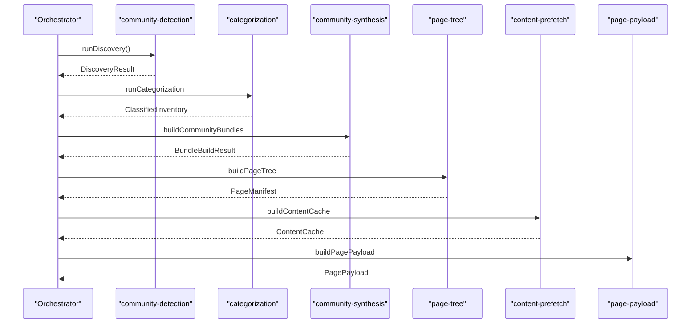
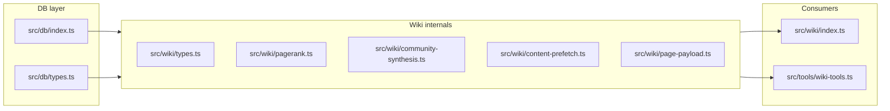

# Wiki Pipeline — Types & Internals

> [Architecture](../architecture.md)
>
> Generated from `79e963f` · 2026-04-26

This community owns the data model, algorithms, and helper modules that power mimirs' wiki generation pipeline. It spans eleven files covering type contracts (`src/wiki/types.ts`, `src/db/types.ts`), PageRank scoring (`src/wiki/pagerank.ts`), community bundling and split logic (`src/wiki/community-synthesis.ts`), doc isolation (`src/wiki/isolate-docs.ts`), categorization (`src/wiki/categorization.ts`), staleness detection (`src/wiki/staleness.ts`), page tree construction (`src/wiki/page-tree.ts`), content prefetching (`src/wiki/content-prefetch.ts`), page payload assembly (`src/wiki/page-payload.ts`), and semantic query templates (`src/wiki/semantic-queries.ts`). Read this before touching any wiki generation step.

## Per-file breakdown

### `src/wiki/types.ts` (top PageRank member)

This file is the shared vocabulary of the entire wiki pipeline. Every stage — discovery, categorization, bundling, page-tree construction, payload assembly — passes data through the interfaces defined here. It is the one file that all other community members import from, and it has no imports of its own within the community.

Key interfaces to know:

- `CommunityBundle` — the unit of data handed to the LLM during synthesis. Contains member file paths, ranked exports, tunables with literal snippets, per-file LOC, PageRank scores, external consumer/dependency maps, recent commits, annotations, and nearby prose docs. The `cohesion` field (internal edges / max possible) gates how aggressively the bundle is trimmed before the LLM sees it.
- `PageManifest` / `ManifestPage` — the persisted page registry. Version 3. Each `ManifestPage` carries kind, slug, title, purpose, sections, depth, member files, community id, and related-page links.
- `SynthesisPayload` — the LLM's output from step 4: community id, human-readable name, kebab slug, 1-2 sentence purpose, and an array of `SectionSpec` objects.
- `PagePayload` — what `generate_wiki(page: N)` returns: the full writing brief including pre-rendered breadcrumbs, a pre-rendered `## See also` block, prefetched semantic query results, the link map, and the page's bundle.
- `PageDepth` — the three verbosity tiers (`"full" | "standard" | "brief"`), which the page-tree auto-assigns based on file count and LOC signals.
- `ContentCache` / `PageContentCache` — the disk cache of prefetched bundles, keyed by wiki path. Avoids re-running expensive DB queries on every `generate_wiki(page: N)` call.
- `PrefetchedQueryHit` — a single result from a pre-run semantic query, byte-capped so the payload stays bounded.

### `src/wiki/pagerank.ts`

Implements power-iteration PageRank over a `graphology` `Graph` instance. Used in two contexts: ranking files within a community (for bundle ordering), and ranking files globally (to replace the old heuristic `isHub` threshold of `fanIn >= 5`).

`computePageRank` defaults to damping `0.85`, tolerance `1e-6`, and max 100 iterations. Dangling nodes (zero out-weight) distribute their rank uniformly to prevent rank leakage. The algorithm is deterministic given deterministic node insertion order — callers sort nodes before inserting to ensure stability across runs.

`rankedNodes` and `topKByPageRank` are convenience wrappers that return nodes sorted descending by score.

### `src/wiki/semantic-queries.ts`

A small lookup table (`SEMANTIC_QUERIES`) that maps page kind to three targeted search queries. The writer runs these with `read_relevant` before drafting matching sections, surfacing error paths, internal constants, and call sites the bundle misses. Query sets exist for `architecture`, `community`, `community-file`, `getting-started`, and `guide`. `semanticQueriesFor(kind)` returns the list or `[]` for unknown kinds — a safe default that avoids writer tool errors.

### `src/wiki/categorization.ts`

Phase 2 of the wiki pipeline. Given `DiscoveryResult` and an indexed DB, it classifies every symbol and file. Symbols are tagged with a `SymbolTier` (`"entity" | "bridge"`) and `Scope` (`"cross-cutting" | "shared" | "local"`). Files get a global PageRank score; the top-K slice of that ranking becomes `isTopHub`, replacing the old `fanIn >= 5` heuristic. `runCategorization` is the single exported function and owns the only SQL queries in this community (via `db.searchSymbols`).

### `src/wiki/isolate-docs.ts`

Finds markdown and shell files that are graph isolates (no imports, no exports) and attaches them to the nearest community by path-prefix proximity. The attachment requires at least `MIN_SHARED_SEGMENTS = 2` overlapping directory segments to prevent shallow false matches. Doc count per community is capped by cohesion: `MAX_DOCS_HIGH_COHESION = 8` for cohesive clusters, `MAX_DOCS_LOW_COHESION = 3` for grab-bags (cohesion < `LOW_COHESION_THRESHOLD = 0.15`). Unmatched docs are returned separately for the architecture bundle.

### `src/wiki/community-synthesis.ts`

The largest file (908 LOC) and the algorithmic core of community bundling and split logic. See [src/wiki/community-synthesis.ts](wiki-pipeline-internals/community-synthesis.md) for full per-file detail.

### `src/wiki/content-prefetch.ts`

Builds the `ContentCache` that backs `generate_wiki(page: N)` calls. For each community page it runs the kind-specific semantic queries, assembles the scoped bundle (full for top-level, `scopeBundleToFiles`-scoped for sub-pages), and caps all content to stay within token budgets. See [src/wiki/content-prefetch.ts](wiki-pipeline-internals/content-prefetch.md) for full detail.

### `src/db/types.ts`

Database row and result interfaces shared between the DB layer and the wiki pipeline. See [src/db/types.ts](wiki-pipeline-internals/src-db-types-ts.md) for full detail.

### `src/wiki/page-payload.ts`

`buildPagePayload(pageIndex, manifest, content)` is the single export used by the MCP tool. It selects the manifest entry at `pageIndex` (sorted by `order`), extracts its content cache entry, assembles the link map (relative paths computed from the wiki directory structure), builds breadcrumbs for sub-pages, pre-renders the breadcrumb trail and `## See also` block, and returns the complete `PagePayload`. The pre-rendering step is the key design decision: with raw guidance in prose only, writers skipped the `## See also` block in 0 of 12 community pages in v2.

### `src/wiki/page-tree.ts`

`buildPageTree` assembles the `PageManifest` from LLM synthesis payloads plus three fixed aggregate pages (architecture, getting-started, data-flows) whose paths are the `AGGREGATE_PAGE_PATHS` constant. Depth auto-assignment: `full` when member count >= `DEPTH_FULL_FILE_COUNT = 10` or top-member LOC >= `DEPTH_FULL_TOP_LOC = 400` or tunable count >= `DEPTH_FULL_TUNABLE_COUNT = 8`; `standard` when member count >= `DEPTH_STANDARD_FILE_COUNT = 4`; `brief` otherwise.

### `src/wiki/staleness.ts`

`classifyStaleness` diffs an old manifest against a new one to produce a `StalenessReport` with three buckets: `stale` (pages whose community member files changed), `added` (new pages), and `removed` (pages no longer in the new manifest). Architecture and getting-started pages are considered stale when any community's member set changes or any top-hub / entry-point file changed. `missingSyntheses` lists community ids that appear in the new bundles but have no stored synthesis — the orchestrator must prompt for those before building a fresh manifest.

## How it works



The pipeline is strictly one-directional: each stage consumes the previous stage's output without looping back. The LLM's synthesis payloads (step 4) are the only external input — they name communities and propose sections. Everything else — split logic, depth assignment, link maps, breadcrumbs — is computed deterministically from the graph and the stored synthesis.

## Dependencies and consumers



The community depends on `src/db/index.ts` (for SQL queries in categorization and bundling) and `src/db/types.ts` (for row shapes). It is consumed by `src/wiki/index.ts` (the orchestrator) and `src/tools/wiki-tools.ts` (the MCP tool layer).

## Data shapes

The four central data types that flow between pipeline stages:

**`CommunityBundle`** — assembled by `buildCommunityBundles`, consumed by `buildPageTree` and `buildContentCache`. Contains everything the LLM needs to name a community: sorted member files, ranked exports (capped at `MAX_EXPORTS_IN_BUNDLE = 60`, or `MAX_EXPORTS_LOW_COHESION = 15` for low-cohesion bundles), tunables with literal snippets (capped at `MAX_TUNABLES = 40`), per-member previews (capped at `MAX_PREVIEW_LINES = 60` lines / `MAX_PREVIEW_BYTES_PER_FILE = 2 * 1024` bytes per file, `MAX_TOTAL_PREVIEW_BYTES = 24 * 1024` bytes total), nearby docs (capped at `MAX_NEARBY_DOC_BYTES = 2 * 1024` bytes per doc / `MAX_TOTAL_NEARBY_DOC_BYTES = 12 * 1024` bytes total), and external edge samples (capped at `EXTERNAL_DEP_SAMPLE = 5`).

**`SynthesisPayload`** — LLM output from step 4. Stored in the `_syntheses` artifact, keyed by `communityId`. The `communityId` is a SHA-256 prefix of the sorted member file list — any file added or removed produces a new id, triggering regeneration.

**`PageManifest`** (version 3) — produced by `buildPageTree`, persisted to the `_manifest` artifact. The authoritative registry of all wiki pages, ordered by `order` field. Sub-pages are also manifest entries; `buildPagePayload` selects by linear index into the sorted entry list.

**`PagePayload`** — the per-page writing brief returned by `generate_wiki(page: N)`. Pre-rendered blocks (`breadcrumb`, `seeAlso`) ensure writers never author those sections themselves, eliminating the class of omission bugs where a writer skips the breadcrumb or `## See also` block.

## Tuning

| Constant | Value | Effect |
|----------|-------|--------|
| `SPLIT_TOTAL_LOC` | `5000` | Total LOC threshold for splitting a community into sub-pages |
| `SPLIT_BIG_MEMBER_COUNT` | `4` | Number of "big" members that triggers a split |
| `BIG_FILE_LOC` | `500` | Per-file LOC threshold for "big" classification |
| `BIG_FILE_EXPORTS` | `8` | Per-file export count threshold for "big" classification |
| `AGGREGATE_PAGE_PATHS` | `[architecture, data-flows, getting-started]` | Fixed paths for the three aggregate pages |
| `SEMANTIC_QUERIES` | (see below) | Kind-to-query mapping shipped on every page payload |
| `DEPTH_FULL_FILE_COUNT` | `10` | Member count that forces `full` depth |
| `DEPTH_FULL_TOP_LOC` | `400` | Top-member LOC that escalates to `full` |
| `DEPTH_FULL_TUNABLE_COUNT` | `8` | Tunable count that escalates to `full` |
| `DEPTH_STANDARD_FILE_COUNT` | `4` | Member count floor for `standard` depth |

`SEMANTIC_QUERIES` maps page kind to three targeted queries:

```
"community": [
  "public API and exported function signatures",
  "tunable constants thresholds and magic numbers exported",
  "error paths fallback handling and try/catch comments"
]
"community-file": [
  "every export const and tunable literal in this file",
  "function signatures and their direct call sites",
  "TODO FIXME workaround and known-bug comments inline"
]
```

## Internals

- **Split thresholds prevent thin sub-pages.** The original count-based split trigger caused every 10-file community to produce 10 sub-pages even when each file was 50 LOC. The size-based trigger (`SPLIT_TOTAL_LOC = 5000` OR `SPLIT_BIG_MEMBER_COUNT = 4` big members) only splits when the parent page would genuinely be unreadable in one shot.

- **`communityIdFor` is the stability anchor.** Community identity is a SHA-256 prefix of the sorted member file list. Adding or removing any file produces a new id, which is exactly the invalidation signal the staleness detector needs. The LLM never sees the id — it only uses it to match synthesis payloads back to bundles.

- **Low-cohesion bundles are aggressively trimmed.** When a community's cohesion (internal edges / max possible) falls below `LOW_COHESION_THRESHOLD = 0.15`, exports are capped at `MAX_EXPORTS_LOW_COHESION = 15` instead of 60, and nearby-doc count drops to `MAX_DOCS_LOW_COHESION = 3`. This prevents the LLM from receiving noise about grab-bag clusters.

- **`buildCommunityBundles` batches DB queries.** Without batching, each bundle made O(communities × members × 4) round-trips to the DB. With batching, it's O(4) queries (for all member files at once) plus per-community lookups against in-memory maps. On 1k-file projects, this was the dominant wall-time cost before the optimization.

- **Pre-rendered blocks eliminate writer omissions.** In v2, writers skipped `## See also` in 0 of 12 community pages when the guidance was prose-only. `buildPagePayload` now pre-renders both the breadcrumb trail and the `## See also` block; writers copy them verbatim. The "Required See also block" heading in the payload makes this impossible to miss.

- **External dep samples are intentionally small.** `EXTERNAL_DEP_SAMPLE = 5` per bundle was tuned down from 30 after writers cited every shown edge, increasing per-page agentic verification work by 63%. Writers can call `depends_on` / `depended_on_by` when the full list matters.

## Why it's built this way

The pipeline is strictly sequential and deterministic by design. The LLM participates only in step 4 (naming communities and proposing sections) — all other stages compute their outputs from the graph and stored synthesis. This means a changed file triggers exactly the right pages for regeneration (via `classifyStaleness`) without requiring a full re-run.

Keeping types in a single file (`src/wiki/types.ts`) rather than co-locating them with implementations lets any stage import only the type it needs without importing the implementation of another stage. This prevents accidental circular dependencies across the pipeline stages.

The `PagePayload` pre-rendered blocks exist because the alternative — telling writers in prose to author those sections — demonstrably failed in practice. Structural guarantees beat documentation.

## Trade-offs

The batch DB query optimization in `buildCommunityBundles` trades memory for latency: it loads all member file rows, dependency edges, and annotation rows into memory before processing any community. On very large projects (tens of thousands of files) this could become a memory pressure point. The current design assumes the indexed file set fits comfortably in process memory alongside the DB, which holds for the projects mimirs is designed for.

The `EXTERNAL_DEP_SAMPLE = 5` cap means bundles under-represent highly connected files. Writers who need the full importer list must call `depended_on_by` explicitly. The cap is a deliberate cost/quality trade-off calibrated against real wiki generation runs.

The split thresholds (`SPLIT_TOTAL_LOC`, `BIG_FILE_LOC`, `BIG_FILE_EXPORTS`) are project-agnostic constants. A project with very large files (e.g., generated code) may split too aggressively; a project with very small files may never split even when the community has 20 members. These are tunable but not currently exposed as config keys.

## Common gotchas

- **Changing a community's member files invalidates its `communityId`**, which means the stored synthesis is no longer matched and the orchestrator will prompt for a new synthesis. If you add a file to a community's directory without re-running `generate_wiki()`, the stored synthesis becomes stale silently — `classifyStaleness` only reports this when the orchestrator calls it with the new bundles.

- **`PageManifest` version 3** — pages load by linear index into `Object.entries(manifest.pages).sort(...)` by `order`. If you manually edit the manifest artifact and disturb the `order` values, `generate_wiki(page: N)` will return the wrong page. Do not hand-edit the manifest.

- **Depth is auto-assigned at `buildPageTree` time**, not at synthesis time. If you add members to a community after synthesizing, the depth may change without a new synthesis — the new depth is computed fresh from the updated bundle. This is intentional (depth follows the actual content, not the LLM's expectation at synthesis time).

- **`semanticQueriesFor` returns `[]` for unknown kinds** — this is a safe no-op, but it means a custom page kind will get no pre-run queries and the writer will have to issue them manually. Add the kind to `SEMANTIC_QUERIES` when introducing a new page type.

## Sub-pages

- [src/db/types.ts](wiki-pipeline-internals/src-db-types-ts.md) — database row and result interfaces shared across the pipeline
- [src/wiki/community-synthesis.ts](wiki-pipeline-internals/community-synthesis.md) — community bundling, split logic, and required-section computation
- [src/wiki/content-prefetch.ts](wiki-pipeline-internals/content-prefetch.md) — content cache construction and bundle scoping for sub-pages
- [src/wiki/types.ts](wiki-pipeline-internals/src-wiki-types-ts.md) — the shared type vocabulary for the entire wiki pipeline

## See also

- [Architecture](../architecture.md)
- [Community Detection & Discovery](community-detection.md)
- [Data flows](../data-flows.md)
- [Database Layer](db-layer.md)
- [Getting started](../getting-started.md)
- [src/db/types.ts](wiki-pipeline-internals/src-db-types-ts.md)
- [src/wiki/community-synthesis.ts](wiki-pipeline-internals/community-synthesis.md)
- [src/wiki/content-prefetch.ts](wiki-pipeline-internals/content-prefetch.md)
- [src/wiki/types.ts](wiki-pipeline-internals/src-wiki-types-ts.md)
- [Wiki Orchestrator & MCP Tools](wiki-orchestrator.md)
