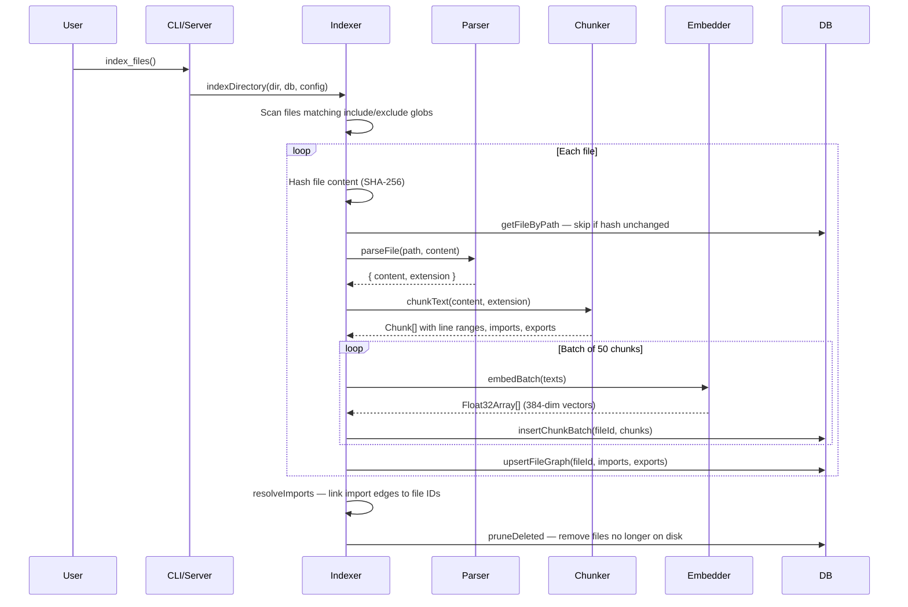
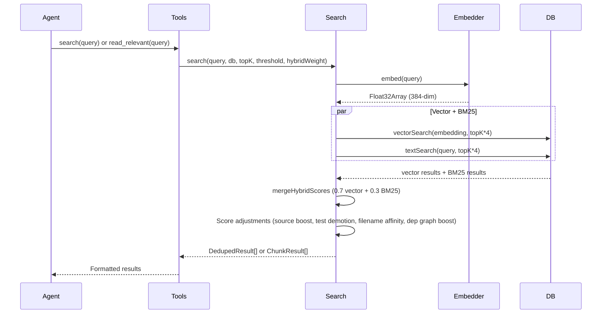
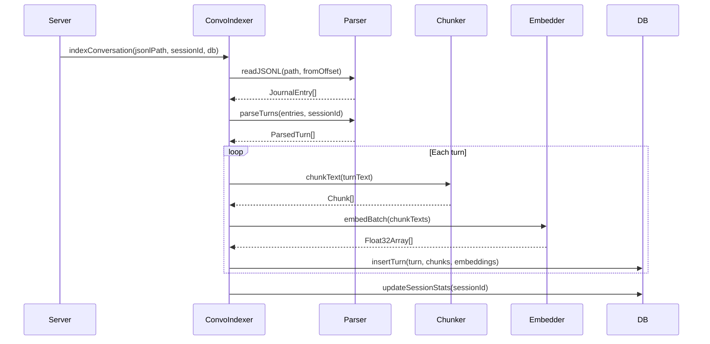

# Data Flow

## Overview

Data enters local-rag through two pipelines: **file indexing** (source code → chunks → embeddings → SQLite) and **search** (query → embed → hybrid retrieval → ranked results). A third pipeline handles **conversation indexing** (JSONL transcripts → parsed turns → embeddings → searchable history).

## Primary Flows

### File Indexing

1. **Scan** — Glob patterns from config select files; exclusions filter out `node_modules`, `dist`, etc.
2. **Hash check** — SHA-256 of file content compared to stored hash. Unchanged files are skipped.
3. **Parse** — `parseFile()` detects the file type by extension and basename, reads content, strips frontmatter from markdown.
4. **Chunk** — `chunkText()` selects a strategy based on extension: tree-sitter AST for 24 languages, heading-based for markdown, specialized splitters for YAML/JSON/SQL/TOML/Dockerfile/Makefile, heuristic blank-line for others, fixed-size fallback for unknown types.
5. **Embed** — Chunks are batched (default 50) and embedded via Transformers.js ONNX. Oversized chunks are windowed and merged.
6. **Store** — Chunks, embeddings, and graph metadata written to SQLite in transactions.
7. **Resolve imports** — Two-pass resolution links import specifiers to indexed file IDs.
8. **Prune** — Files that no longer exist on disk are removed from the index.

### Hybrid Search

1. **Embed query** — The query string is vectorized with the same model used for indexing.
2. **Parallel retrieval** — Vector similarity search (`vec_chunks MATCH`) and BM25 text search (`fts_chunks MATCH`) each return `topK * 4` candidates.
3. **Merge** — Results are combined with configurable weighting (default 70% vector, 30% BM25).
4. **Score adjustments** — Boosts for source files (+10%), filename affinity (+10% per word match), dependency graph centrality (+0.05 * log2(importers+1)). Demotions for test files (-15%), boilerplate (-20%), generated files (-25%).
5. **Deduplicate** — For file-level search, keep only the best-scoring chunk per file.
6. **Threshold & truncate** — Filter results below the threshold, return top K.

### Conversation Indexing

1. **Read** — JSONL session logs are read from a byte offset for incremental indexing.
2. **Parse** — Raw entries are grouped into turns (user message → assistant response + tools).
3. **Chunk & embed** — Turn text is chunked and embedded like source files.
4. **Store** — Turns and their embedded chunks are stored in conversation tables.
5. **Tail** — The server can watch active session logs and index new turns in real time.

## Error Paths

- **Corrupted model cache**: If the embedding model fails to load with a protobuf error, the cache is deleted and the model is re-downloaded automatically.
- **Invalid config**: If `.rag/config.json` has invalid JSON or fails Zod validation, defaults are used and a warning is logged.
- **File too large**: Files over 50 MB are skipped during indexing to prevent OOM.
- **Missing SQLite extension**: On macOS, if Apple's bundled SQLite is used (no extension support), the server throws a clear error directing users to `brew install sqlite`.

## See Also

- [Architecture](architecture.md) — high-level module overview
- [Search module](modules/search/index.md) — hybrid search implementation details
- [Indexing module](modules/indexing/index.md) — file processing pipeline
- [Conversation module](modules/conversation/index.md) — session log parsing and indexing
