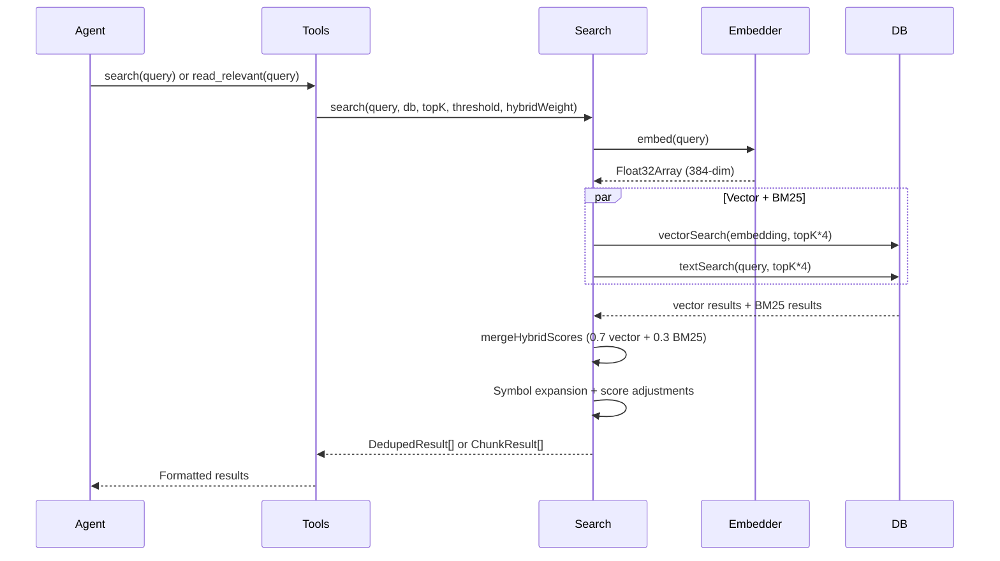
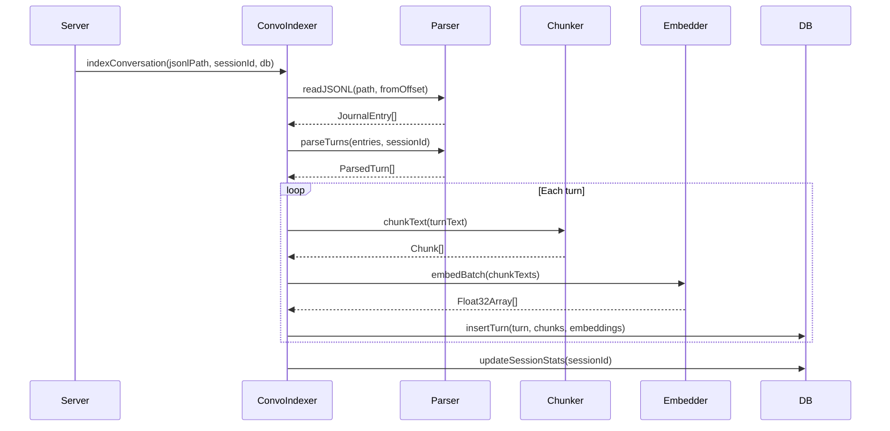

# Data Flow

## Overview

Data enters mimirs through two pipelines: **file indexing** (source code to
chunks to embeddings to SQLite) and **search** (query to embed to hybrid
retrieval to ranked results). A third pipeline handles **conversation
indexing** (JSONL transcripts to parsed turns to embeddings to searchable
history).

## Primary Flows

### File Indexing

1. **Scan** -- Glob patterns from config select files; exclusions filter out `node_modules`, `dist`, etc.
2. **Hash check** -- SHA-256 of file content compared to stored hash. Unchanged files are skipped.
3. **Parse** -- `parseFile()` detects the file type by extension and basename, reads content, strips frontmatter from markdown.
4. **Chunk** -- `chunkText()` selects a strategy based on extension: tree-sitter AST for 30+ languages, heading-based for markdown, heuristic blank-line for others, fixed-size fallback for unknown types.
5. **Embed** -- Chunks are batched (default 50) and embedded via Transformers.js ONNX. Oversized chunks (>256 tokens) are windowed and merged.
6. **Store** -- Chunks, embeddings, and graph metadata written to SQLite in transactions.
7. **Resolve imports** -- Two-pass resolution links import specifiers to indexed file IDs.
8. **Prune** -- Files that no longer exist on disk are removed from the index.

### Incremental Chunking

When `incrementalChunks` is enabled and the file already has hashed chunks in
the database, only chunks whose content hash changed are re-embedded. If more
than 50% of chunks changed, the system falls back to a full re-index. This
path also updates line-number positions for chunks that shifted but didn't
change content.

### Hybrid Search

1. **Embed query** -- The query string is vectorized with the same model used for indexing.
2. **Parallel retrieval** -- Vector similarity search (`vec_chunks MATCH`) and BM25 text search (`fts_chunks MATCH`) each return `topK * 4` candidates.
3. **Merge** -- Results are combined with configurable weighting (default 70% vector, 30% BM25).
4. **Symbol expansion** -- Extracts identifiers from the query and boosts files matching exact symbol names (1.3x boost for existing results, 0.75 base score for symbol-only matches).
5. **Score adjustments** -- Boosts for source files (+10%), filename affinity (+10% per word match), dependency graph centrality (+5% * log2(importers+1)). Demotions for test files (-15%), boilerplate (-20%), generated files (-50%).
6. **Deduplicate** -- For file-level search, keep only the best-scoring chunk per file.
7. **Doc expansion** -- Widens the result window to prevent markdown files from displacing code results.
8. **Threshold and truncate** -- Filter results below the threshold, return top K.

### Conversation Indexing

1. **Discover sessions** -- `discoverSessions()` scans `~/.claude/projects/<encoded-path>/` for JSONL files, returning session metadata sorted by modification time.
2. **Read** -- JSONL session logs are read from a byte offset for incremental indexing.
3. **Parse** -- Raw entries are grouped into turns (user message to assistant response + tools).
4. **Chunk and embed** -- Turn text is chunked and embedded like source files.
5. **Store** -- Turns and their embedded chunks are stored in conversation tables.
6. **Tail** -- The server watches the most recent session's JSONL file and indexes new turns in real time via `startConversationTail()`.

## Error Paths

- **Corrupted model cache**: If the embedding model fails to load with a protobuf error, the cache is deleted and the model is re-downloaded automatically.
- **Invalid config**: If `.mimirs/config.json` has invalid JSON or fails Zod validation, defaults are used and a warning is logged.
- **File too large**: Files over 50 MB are skipped during indexing to prevent OOM.
- **Missing SQLite extension**: On macOS, if Apple's bundled SQLite is used (no extension support), the server throws a clear error directing users to `brew install sqlite`.
- **FTS query failure**: If BM25 search throws (e.g., malformed query syntax), search falls back to vector-only results.
- **Database lock**: WAL mode and a 5-second busy timeout handle most concurrency. Transient lock errors during server startup are logged but not cached; the next tool call retries.
- **Dangerous directories**: `checkIndexDir()` blocks indexing of system directories (home, root, /tmp, /var, /Users) to prevent runaway memory usage.

## See Also

- [Architecture](architecture.md) -- high-level module overview
- [Search module](modules/search/) -- hybrid search implementation details
- [Indexing module](modules/indexing/) -- file processing pipeline
- [Conversation module](modules/conversation/) -- session log parsing and indexing
- [Hybrid Search entity](entities/hybrid-search.md) -- score adjustment details
