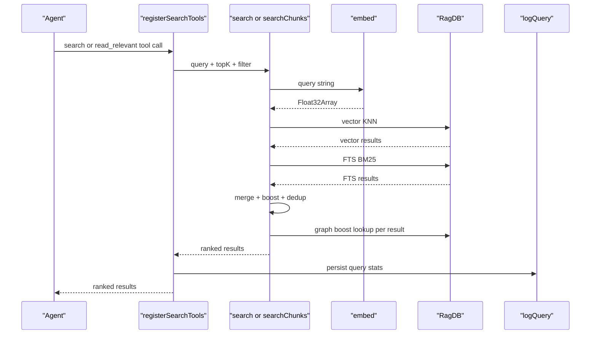
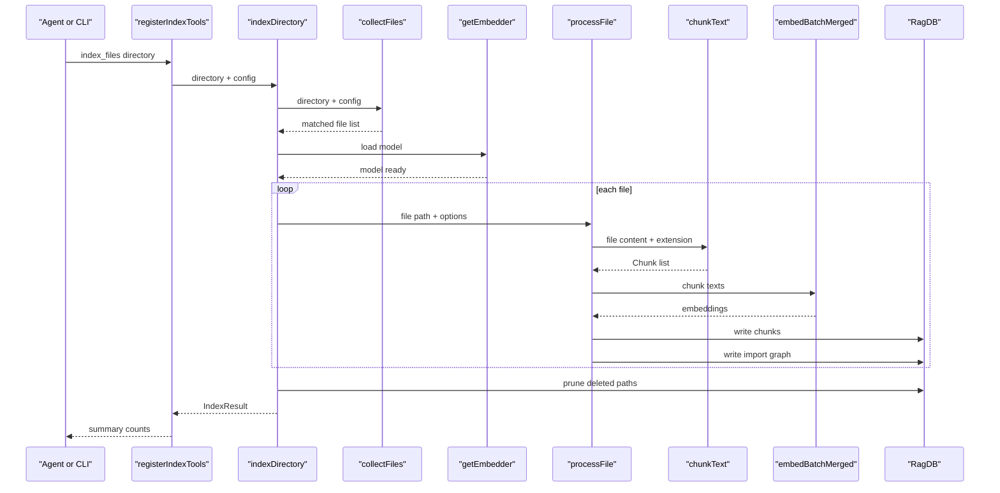
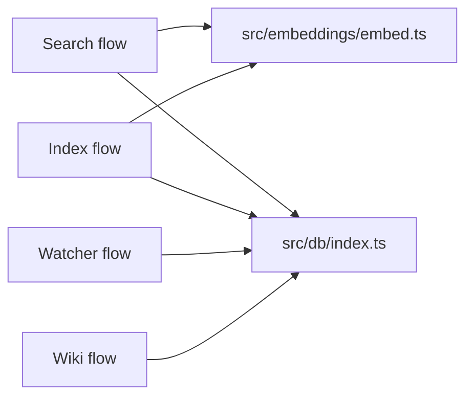

# Data flows

> [Architecture](architecture.md)
>
> Generated from `79e963f` · 2026-04-26

## Overview

Mimirs has four primary triggers, each with its own call path through the community stack. The `search` / `read_relevant` MCP tool call is the most frequent: an agent issues a query, the [Search MCP Tool](communities/search-tool.md) receives it, the [Search Runtime](communities/search-runtime.md) embeds and merges vector + FTS results, and ranked hits come back over the wire. File indexing runs on two triggers: the `index_files` MCP tool call (batch, invoked by agents or the CLI `index` subcommand) and the [Import Graph & File Watcher](communities/graph-watcher.md) (incremental, running in the background during `mimirs watch`). A fourth flow — wiki generation — is triggered by `generate_wiki()` and fans out through [Community Detection & Discovery](communities/community-detection.md) and the [Wiki Pipeline — Types & Internals](communities/wiki-pipeline-internals.md) to produce page payloads.

## Flow 1: Semantic search (search / read_relevant)

The search flow is triggered on every agent query. It is the hottest path in the system.

1. The agent calls the `search` or `read_relevant` MCP tool. The handler lives in `src/tools/search.ts` (registered by `registerSearchTools` inside `src/tools/index.ts`).
2. The handler calls `search()` or `searchChunks()` from `src/search/hybrid.ts`, passing the raw query string, the `RagDB` handle, `topK`, a relevance `threshold`, and the `hybridWeight` (default `DEFAULT_HYBRID_WEIGHT = 0.7`).
3. `search()` calls `embed(query)` from `src/embeddings/embed.ts`, which runs the local transformer model (singleton, initialized once at server start) and returns a `Float32Array`.
4. Two DB queries fire: `db.search()` for vector KNN (via `sqlite-vec`) and `db.textSearch()` for BM25 FTS5. Both fetch `topK * 4` candidates to give the merge step room to deduplicate. If the FTS query fails (malformed query, escape bug), it logs at debug level and falls back to vector-only — the error is never surfaced to the caller.
5. `mergeHybridScores()` interleaves the two result lists using the hybrid weight (0.7 vector, 0.3 BM25 by default). The merged list then passes through a chain of boosting functions: `applyPathBoost` (×1.1 for source files, ×0.85 for tests), `applyFilenameBoost` (up to +10% per matching filename stem word), and `applyGraphBoost` (+0.05 × log₂(importers + 1) per file). Symbol expansion runs in parallel: `extractIdentifiers` pulls camelCase / dotted tokens from the query, looks them up via `db.searchSymbols()`, and merges exact symbol hits at a ×1.3 boost.
6. For `search`, results are deduplicated by file path (best score per file). For `searchChunks` (`read_relevant`), no deduplication happens — two chunks from the same file can both appear, which is intentional for code navigation.
7. The tool handler calls `db.logQuery()` to persist the query, result count, top score, and duration to the `query_log` table for analytics.
8. Ranked results return to the agent over MCP.

### Error paths

FTS failure is the most common non-fatal error path. The `db.textSearch()` call is wrapped in a try/catch inside `search()` and `searchChunks()`; any exception logs at `debug` level and the flow continues with the vector-only candidate set. Filter bypass is another subtle path: `PathFilter` is applied in the SQL for both vector and FTS queries, but symbol expansion calls `db.searchSymbols()` outside those queries. To prevent filter leakage, `matchesFilter()` re-checks each symbol hit in memory before it is merged into the candidate pool.

## Flow 2: Batch file indexing (index_files / mimirs index)

The indexing flow is triggered by the `index_files` MCP tool call or by the `mimirs index <directory>` CLI subcommand. Both paths converge on `indexDirectory()` in `src/indexing/indexer.ts`.

1. `registerIndexTools()` (in `src/tools/index-tools.ts`) receives the MCP request and calls `resolveProject()` to locate the project directory and open the `RagDB`. It then calls `indexDirectory()`.
2. `collectFiles()` walks the directory recursively using `readdir`, filtering against `config.include` and `config.exclude` glob patterns. Files matching `LARGE_PROJECT_WARN_THRESHOLD` trigger a warning. The embedding model is eagerly initialized via `getEmbedder()` before the per-file loop starts so that progress reporting reflects model-loading time rather than hiding it.
3. For each file, `processFile()` runs the full pipeline: (a) hash the file content, (b) skip if the hash matches the DB record for that path, (c) call `chunkText()` in `src/indexing/chunker.ts` to split the content into AST-aware `Chunk` objects, (d) run `embedBatchMerged()` in batches of `config.indexBatchSize` (default 50) so memory stays bounded, (e) detect parent groups with `detectParentGroups()` and create synthetic parent chunks, (f) write child chunks to the DB via `db.insertChunkBatch()`, (g) persist the import/export graph via `db.upsertFileGraph()`.
4. When `config.incrementalChunks` is enabled and the file already has content-hashed chunks in the DB, `processFileIncremental()` fires instead of a full re-index. It computes the diff between old and new chunk hashes: if more than 50% changed it falls through to full re-index; otherwise it deletes stale chunks, updates position metadata for kept chunks, and re-embeds only the new chunks.
5. After all files are processed, `db.pruneDeleted()` removes DB records for paths no longer on disk. The final `IndexResult` (`{ indexed, skipped, pruned, errors }`) is returned to the caller.
6. On error, `processFile()` exceptions are caught per-file, appended to `result.errors`, and reported via `onProgress`. A single errored file does not abort the run.

### Error paths

Per-file errors are isolated: the loop catches each exception, logs it via `onProgress`, and continues to the next file. Abortable runs respect an `AbortSignal` passed through `ProcessFileOptions`; each batch and each iteration checks `signal.aborted` before proceeding. Directory safety is validated up front by `checkIndexDir()`; attempting to index a system directory (home root, `/`) throws before any file is touched. Permission errors on the `.mimirs` directory during `RagDB` construction surface as a structured message directing the user to set `RAG_DB_DIR`.

## Additional flows

### Watcher-triggered incremental re-index

The watcher flow runs when `mimirs watch` is active. `startWatcher()` in `src/indexing/watcher.ts` wraps Node's `fs.watch()` with a DEBOUNCE_MS = 2000 ms debounce and a serial processing queue. When a file event fires: the path is checked against the config include/exclude globs; if it passes, a debounce timer is (re)set. When the timer fires it checks whether the path still exists — if not it schedules a `"remove"` action, otherwise `"index"`. The serial queue (`processing` flag + `nextBatch` map) prevents concurrent `indexFile` calls from interleaving, which would produce race conditions in `buildPathToIdMap`. After a successful re-index, `resolveImportsForFile()` (from `src/graph/resolver.ts`) updates the import graph for the changed file and for every file that imported it (`db.getImportersOf()`), so the dependency graph stays consistent without a full graph rebuild.

### Wiki generation pipeline

Wiki generation is triggered by the `generate_wiki()` MCP tool call, handled by `registerWikiTools()` in `src/tools/wiki-tools.ts`. The pipeline has five logical phases:

1. **Discovery**: `runDiscovery()` in `src/wiki/discovery.ts` extracts the file-level import graph from the DB, runs Louvain community detection (via `src/wiki/community-detection.ts`), and assigns each file to a community. The result is a `DiscoveryResult` containing communities, PageRank scores, hub files, and entry points.
2. **Classification**: the discovery result is classified into a `ClassifiedInventory` that groups files into community buckets, separates test fixtures from source, and identifies markdown isolates.
3. **Synthesis**: for each community, the pipeline assembles a bundle (member files, exports, hub stats, nearby docs) and returns it as a prompt to the LLM. The LLM writes a `SynthesisPayload` naming the community and proposing page sections. These are stored in the `SynthesesFile` on disk.
4. **Manifest build**: once all syntheses are stored, `buildManifest()` constructs the `PageManifest` — the ordered list of `ManifestPage` entries with slugs, titles, sections, depths, and related-page links.
5. **Page payload**: `generate_wiki(page: N)` retrieves the Nth page's `ManifestPage`, assembles its full `PagePayload` (bundle, link map, required header and see-also blocks), and returns it for the LLM to write to disk.

The [Wiki Orchestrator & MCP Tools](communities/wiki-orchestrator.md) page covers the orchestration layer in detail; [Wiki Pipeline — Types & Internals](communities/wiki-pipeline-internals.md) covers the data model, PageRank algorithm, and bundling logic.

## Cross-cutting dependencies

Two files are touched by every flow. `src/embeddings/embed.ts` is imported by 7 of 15 communities (fanIn=77) — it is the only path to the transformer model and is a singleton that lazy-initializes on first call. `src/db/index.ts` (`RagDB`) is imported by 9 of 15 communities (fanIn=59, fanOut=10) and is the sole gateway to all SQLite storage; every read and write for chunks, files, graph, conversations, checkpoints, annotations, and git history passes through its methods.

Test infrastructure note: `tests/helpers.ts` is imported by 67 test files across the codebase and provides shared DB fixtures; it does not participate in any runtime flow.

## See also

- [Architecture](architecture.md)
- [CLI Commands](communities/cli-commands.md)
- [CLI Entry & Core Utilities](communities/cli-entry-core.md)
- [CLI Setup & IDE Integration](communities/cli-setup.md)
- [Community Detection & Discovery](communities/community-detection.md)
- [Config & Embeddings](communities/config-embeddings.md)
- [Conversation Indexer & MCP Server](communities/conversation-server.md)
- [Database Layer](communities/db-layer.md)
- [Getting started](getting-started.md)
- [Git History Indexer & CLI Progress](communities/git-indexer-progress.md)
- [Import Graph & File Watcher](communities/graph-watcher.md)
- [Indexing Pipeline](communities/indexing-pipeline.md)
- [MCP Tool Handlers](communities/mcp-tools.md)
- [Search MCP Tool](communities/search-tool.md)
- [Search Runtime](communities/search-runtime.md)
- [Wiki Orchestrator & MCP Tools](communities/wiki-orchestrator.md)
- [Wiki Pipeline — Types & Internals](communities/wiki-pipeline-internals.md)
