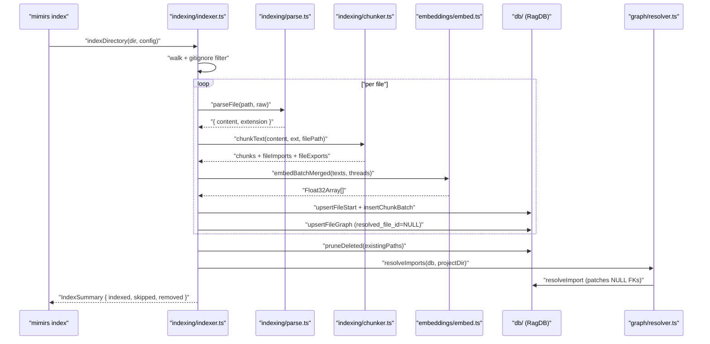
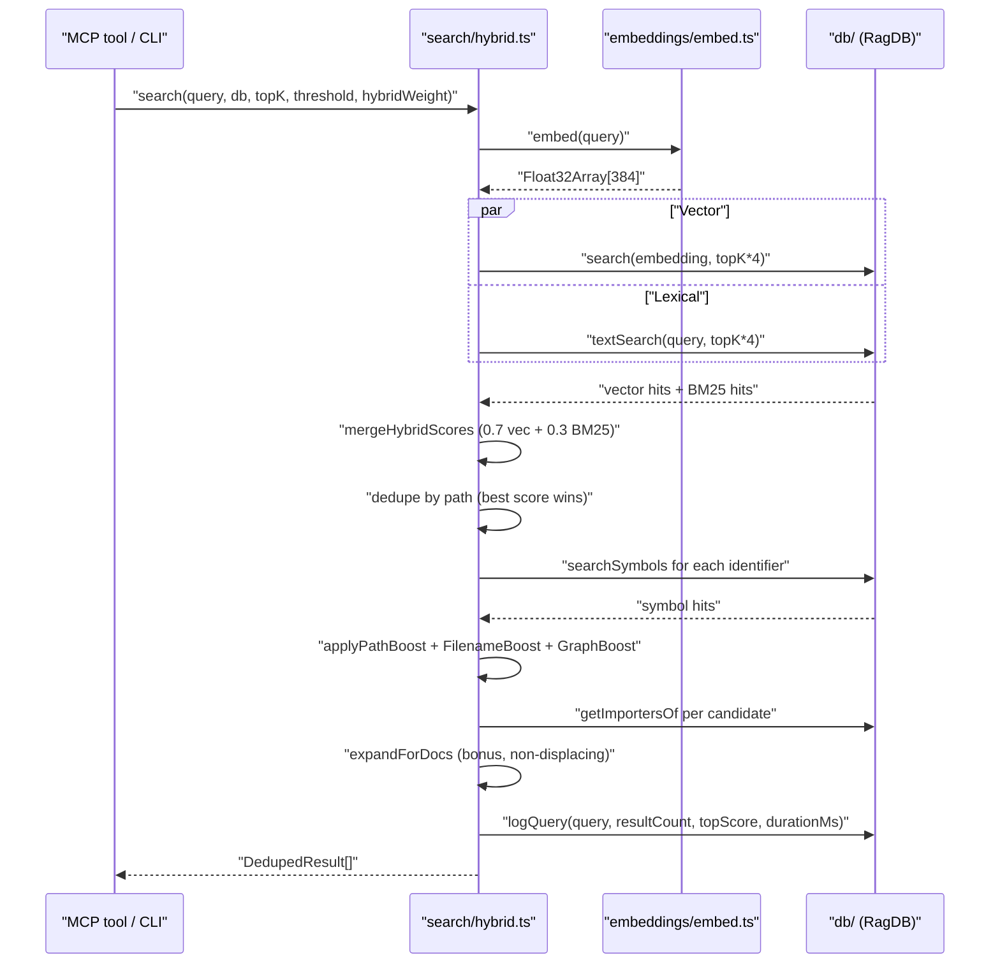
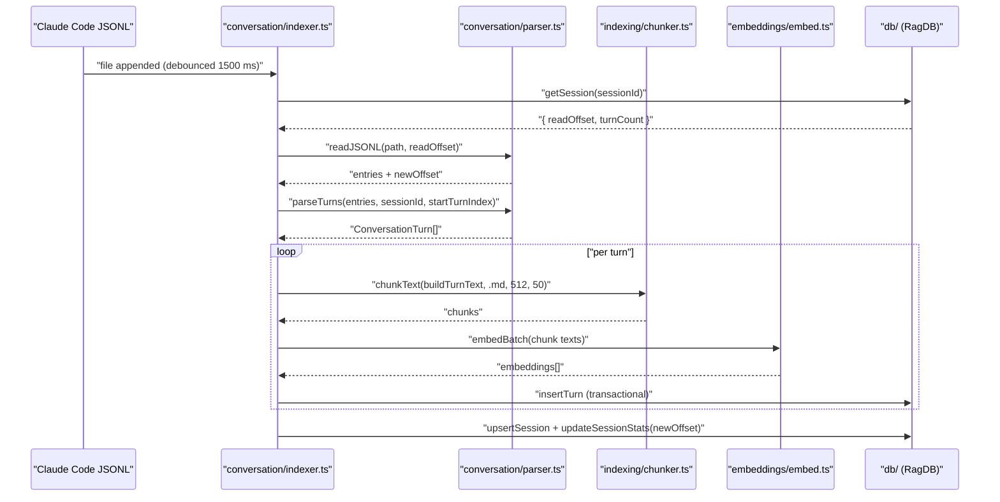
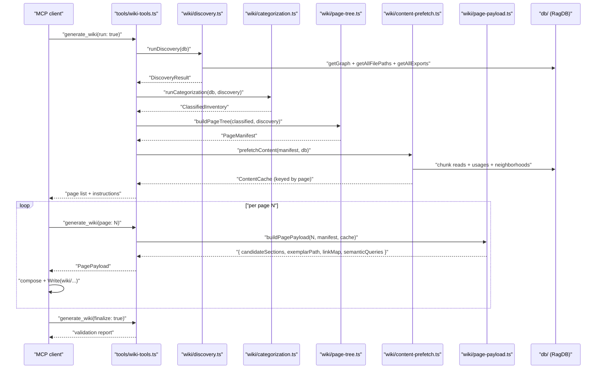

# Data Flows

mimirs has four primary flows that exercise the persistence layer end-to-end: **indexing** (CLI / watcher → `RagDB`), **hybrid search** (MCP tool / CLI → ranked hits), **conversation tail** (filesystem watcher → embedded turns), and **wiki generation** (MCP tool → per-page payloads written to `wiki/`). Each flow funnels through `src/db/index.ts` (`RagDB` facade) as the single persistence boundary; nothing else opens a `Database` handle directly.

## Flow 1: Indexing a project directory

Triggered by `mimirs index` in `src/cli/commands/index-cmd.ts` or the filesystem watcher in `src/indexing/watcher.ts`. Produces rows in `files`, `chunks`, `vec_chunks`, `fts_chunks`, `file_imports`, and `file_exports`.

1. **Walk + filter** — `indexDirectory` walks the tree, respecting `.gitignore` and `config.ignore`. Files above 50 MB or with average line length > 1000 (minified) are skipped before any work happens.
2. **Hash-gate** — each file is read once; `hashString(raw)` is compared against `files.hash`. If equal, the file is skipped — no parse, no chunk, no embed.
3. **Parse + chunk** — `parseFile` strips shebangs / binary; `chunkText` runs AST-aware splitting (`bun-chunk`) for `.ts`/`.tsx`/`.js`/`.py`/`.rs`/`.go`, falling back to blank-line heuristics otherwise. The chunker returns per-chunk `imports` / `exports` / `parentName` / `chunkType`.
4. **Incremental vs full** — if the existing file has chunk hashes and ≤50% of new chunk hashes are novel, `processFileIncremental` deletes only stale chunks, updates kept positions, and embeds just the new ones. Otherwise `processFile` clears and re-embeds the whole file.
5. **Embed** — `embedBatchMerged` (or `embedBatch`) feeds texts through the MiniLM L6 v2 singleton at 384 dims. Batch size defaults to `config.indexBatchSize = 50`.
6. **Write** — `upsertFileStart` updates `files.id` in place (preserves FKs), `insertChunkBatch` writes one transaction per batch: `chunks` + `vec_chunks` raw-byte embeddings. FTS5 stays synced via triggers on `chunks`.
7. **Graph first pass** — `upsertFileGraph` writes `file_imports` rows with `resolved_file_id = NULL` and `file_exports` rows. No file-ordering dependency.
8. **Prune deleted** — `pruneDeleted(Set<walkedPath>)` drops any `files.path` missing from the walk; `ON DELETE CASCADE` clears chunks, vec rows, imports, exports, FTS.
9. **Graph second pass** — after the walk, `resolveImports` iterates `getUnresolvedImports`, resolves each via `bun-chunk`'s resolver plus filesystem fallback, and patches rows with `resolveImport`.

### Error paths

- **Embedding model mismatch** — `getEmbeddingDim()` is read at schema init; changing `config.embedding.model` after indexing produces silently wrong neighbours. Recovery is `mimirs cleanup` + re-index.
- **AST chunker failure** — caught per file and logged at debug; the heuristic splitter takes over for that file. No file is lost.
- **FTS query failure** — search falls back to vector-only at query time (see Flow 2); indexing itself can't hit this path since FTS is trigger-driven.

## Flow 2: Hybrid search query

Triggered by the MCP `search` / `read_relevant` tools in `src/tools/search.ts` or by `mimirs search` in `src/cli/commands/search-cmd.ts`. Produces ranked `DedupedResult[]` (file-level) or `ChunkResult[]` (chunk-level) and logs the query into `query_analytics`.

1. **Embed query** — `embed(query)` reuses the singleton loaded at CLI / server startup via `configureEmbedder`.
2. **Parallel fetch** — `db.search` returns `topK × 4` vector neighbours; `db.textSearch` runs an FTS5 `MATCH` with `sanitizeFTS` quoting. Over-fetching is what lets dedup + boosts surface the right result at position 1.
3. **Hybrid merge** — `mergeHybridScores(vec, text, 0.7)` emits `0.7 × normalised(vec) + 0.3 × normalised(BM25)`. Min-max normalisation per list keeps the two score spaces comparable.
4. **Path dedupe** — one entry per `files.path`; snippets accumulate into an array so multiple strong chunks from the same file all contribute to the preview.
5. **Symbol expansion** — `extractIdentifiers(query)` pulls camelCase / snake_case / PascalCase tokens; each becomes a `searchSymbols` call. Existing hits get a `× 1.3` boost; new ones enter at base score `0.75`.
6. **Path boosts** — `applyPathBoost` (source × 1.1, test × 0.85), `applyFilenameBoost` (stem match + directory match with stricter rules), `applyGraphBoost` (`0.05 × log2(importerCount + 1)` — hubs rise).
7. **Doc expansion** — `expandForDocs` adds markdown matches as bonus results that don't displace code; the code top-K is preserved even when a `.md` file scored higher.
8. **Log** — `db.logQuery` writes the query + resultCount + topScore + durationMs into `query_analytics` for later audit via `search_analytics`.

### Error paths

- **FTS5 parse error** — `sanitizeFTS` quotes operator tokens, but anything it misses is caught in `hybrid.ts` and the query falls back to vector-only results.
- **Empty vector results** — symbol-only hits (score 0.75) can still surface the right file even when semantic match is weak; the path boost then tightens the ranking.

## Flow 3: Conversation tail

Triggered by `mimirs conversation index` in `src/cli/commands/conversation.ts` or by the MCP server at startup. Produces rows in `conversation_sessions`, `conversation_turns`, `conversation_turn_chunks`, `vec_conversation`, `fts_conversation`.

1. **Debounced fire** — the watcher waits `TAIL_DEBOUNCE_MS = 1500` before processing appends so a burst of JSONL writes becomes one indexing pass.
2. **Resume by offset** — `getSession` returns the last `readOffset` (a byte offset into the JSONL). `readJSONL` seeks there and reads to EOF. Offsets are O(append-size), not O(history-length).
3. **Parse + skip** — `parseTurns` pairs user + assistant events into turns. Tool-result content for `Read` / `Glob` / `Write` / `Edit` is dropped (`SKIP_CONTENT_TOOLS`) because the code index already has that content; only the tool name survives.
4. **Chunk + embed** — turn text goes through the same chunker at `.md` / 512 / 50. Batched embeddings reuse the singleton.
5. **Atomic insert** — `insertTurn` wraps the turn row + chunk rows + vec rows in a single `db.transaction(() => ...)`. A crash mid-batch rolls back the whole turn; re-indexing that offset range is safe because `(sessionId, turnIndex)` is unique and the insert returns `0` on duplicate.
6. **Roll-up** — `updateSessionStats` writes `turnCount`, `totalTokens`, `newOffset` in one row update, ready for the next tail tick.

### Error paths

- **File rewrite (not append)** — a file whose size decreases leaves `readOffset` past EOF. The tail detects the size drop and resets the offset to 0 before reading.
- **Duplicate turn** — `insertTurn` returns `0`; the caller treats zero as "already indexed, skip" so overlapping re-reads are free.

## Flow 4: Wiki generation

Triggered by the MCP `generate_wiki` tool in `src/tools/wiki-tools.ts`. Produces `wiki/_discovery.json`, `wiki/_classified.json`, `wiki/_manifest.json`, `wiki/_content.json`, then one markdown file per page as the agent loops through `generate_wiki(page: N)`.

1. **Discovery** — `runDiscovery` reads the resolved graph (`getGraph`), every file path, and every export. Computes fan-in / fan-out, cross-cutting symbol membership, hub scores. Writes `wiki/_discovery.json`.
2. **Categorization** — `runCategorization` tags each file as entity / bridge / leaf and each module as `full` / `standard` / `brief` depending on `value = f(fileCount, exports, fanIn)`. Modules qualify via `value >= MIN_MODULE_VALUE` (8) **or** the structural-importance override (cross-cutting host with `fileCount >= 2`, or `entryFile` present with `fanIn >= 3`).
3. **Page tree** — `buildPageTree` emits one `ManifestPage` per output page with `kind: "module" | "file" | "aggregate"` and an optional `focus` for aggregate pages. Related-page edges are computed at this stage.
4. **Content prefetch** — `prefetchContent` bulk-fetches the expensive data every page will want: full signatures, neighborhoods (forward + reverse imports), usages, cross-cutting inventories, hub tables. Cached by page path into `wiki/_content.json`.
5. **Per-page payload** — `buildPagePayload` returns `candidateSections` (library entries filtered by `applies` predicates), an `exemplarPath` for aggregate pages, a title-keyed `linkMap`, `semanticQueries` the agent can run, and the depth contract (`brief` / `standard` / `full`).
6. **Agent writes** — the agent reads the exemplar or library snippets, fires the suggested `read_relevant` queries, composes the page, and calls `Write`. The agent decides which sections fit; the pipeline supplied the signals.
7. **Finalize** — `generate_wiki(finalize: true)` validates cross-links, checks that every page in the manifest exists, and reports audit flags.

### Error paths

- **Missing page file at finalize** — surfaced as a validation flag, not a crash. The agent is expected to fix and re-finalize.
- **Broken cross-link** — finalize detects link targets not in the manifest and reports them; the link map is the source of truth so mis-typed titles never silently 404.

## See also

- [Architecture](architecture.md)
- [Getting Started](guides/getting-started.md)
- [Conventions](guides/conventions.md)
- [Testing](guides/testing.md)
- [Index](index.md)
