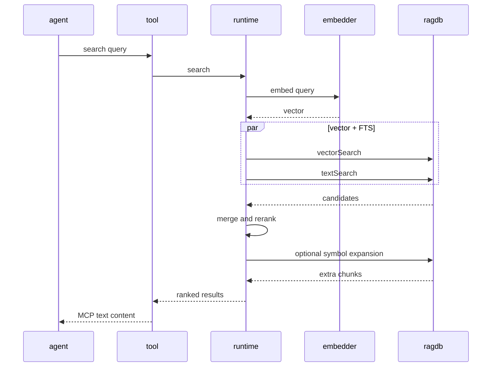
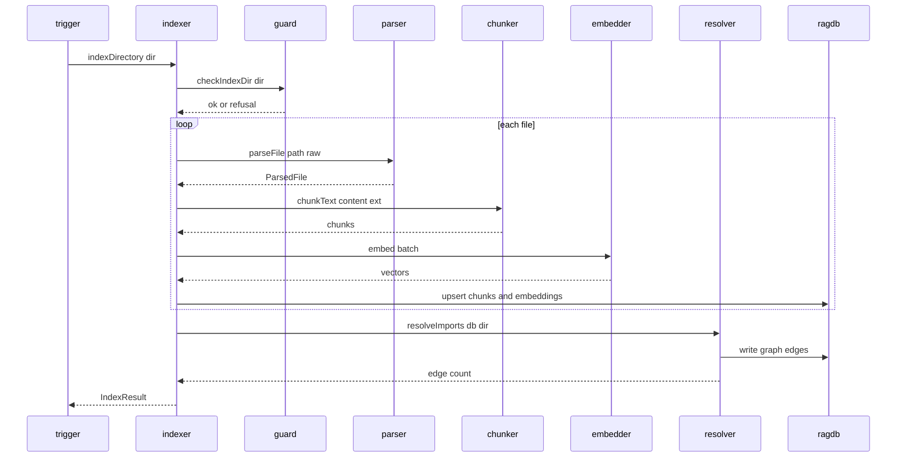
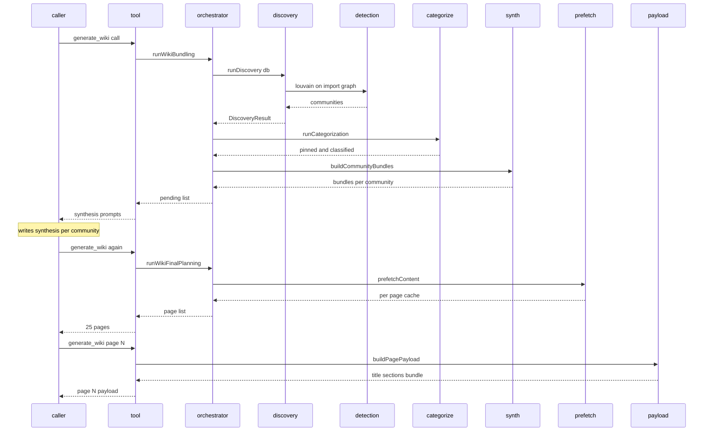

# Data flows

> [Architecture](architecture.md)
>
> Generated from `6a2d580` · 2026-04-26

## Overview

Mimirs has three primary runtime flows. **Search** (the `search` and `read_relevant` MCP tools) is the highest-frequency path — every agent query enters here. **Indexing** runs in two modes: batch on `index_files` and incremental via the file watcher. **Wiki generation** is the heaviest flow, a multi-phase pipeline triggered by `generate_wiki()` that fans out across community detection, content prefetch, and per-page payload assembly. The architecture page shows where these communities live; this page shows what runs in what order when each flow fires.

## Flow 1 — Search and `read_relevant`

An agent issues a `search` or `read_relevant` MCP call. The request lands in the [Search MCP Tool](communities/search-tool.md) adapter (`src/tools/search.ts`), which delegates straight into the [Search Runtime](communities/search-runtime.md) (`src/search/hybrid.ts`). The runtime runs vector and FTS queries against the [Database Layer](communities/db-layer.md) in parallel, merges and reranks the candidates, then returns ranked chunks back to the agent.

Participants: `agent` (MCP client), `tool` is the Search MCP Tool adapter, `runtime` is `src/search/hybrid.ts`, `embedder` is `src/embeddings/embed.ts`, `ragdb` is `src/db/index.ts`.

1. **Adapter** — `src/tools/search.ts` parses MCP arguments, builds the path filter, and calls `search()` from `src/search/hybrid.ts`. No retrieval logic lives in the adapter.
2. **Embed query** — `src/search/hybrid.ts` calls the singleton `embed()` in `src/embeddings/embed.ts` to turn the query string into a 384-dim vector. The model loads once per process.
3. **Vector + FTS in parallel** — `src/db/index.ts` exposes `vectorSearch` (against `sqlite-vec`) and `textSearch` (against the FTS5 virtual table). Both run in the same `RagDB` instance and share the path filter.
4. **Merge and rerank** — `src/search/hybrid.ts` combines the two result sets at a default 70/30 vector/FTS weight, then applies the boost stack: `applyPathBoost` (×1.1 source / ×0.85 test), `applyFilenameBoost`, `applyGraphBoost` (+0.05 × log2(importers+1)), and the boilerplate demotion.
5. **Symbol expansion** — when the query has high lexical signal, `src/search/hybrid.ts` looks up symbol matches in `src/db/index.ts` and merges them with a ×1.3 boost. Re-applies the path filter in memory because the symbol query bypasses SQL filters.
6. **Format and return** — the adapter wraps the results as MCP `text` content. `read_relevant` returns chunk content; `search` returns paths + previews only.

### Error paths

- **FTS failure is non-fatal.** `db.textSearch()` throwing (malformed query, escape bug) logs at debug level and falls back to vector-only. Users do not see the error.
- **Empty index returns empty array.** `search()` does not throw when no chunks have been indexed — it returns `[]`. Callers that need to distinguish "no match" from "no index" must call `index_status` separately.
- **Embedder cold start.** First call after process boot pays the model load cost. Subsequent calls reuse the singleton.

## Flow 2 — Indexing (batch and incremental)

The same end state — chunks embedded into SQLite — is reached through two entry points. The batch path runs when `index_files` is invoked from MCP or the CLI `mimirs index` command. The incremental path runs continuously while `mimirs watch` is active. Both converge inside the [Indexing runtime](communities/indexing-runtime.md) and write through the [Database Layer](communities/db-layer.md).

Participants: `trigger` is the CLI subcommand, MCP `index_files`, or the watcher; `indexer` is `src/indexing/indexer.ts`; `guard` is `src/utils/dir-guard.ts`; `parser` is `src/indexing/parse.ts`; `chunker` is `src/indexing/chunker.ts`; `embedder` is `src/embeddings/embed.ts`; `resolver` is `src/graph/resolver.ts`; `ragdb` is `src/db/index.ts`.

1. **Trigger** — the batch path enters at `indexDirectory` in `src/indexing/indexer.ts`. The watcher path enters at `startWatcher` in `src/indexing/watcher.ts`, which calls `indexFile` per filesystem event with debouncing.
2. **Directory guard** — `checkIndexDir` in `src/utils/dir-guard.ts` refuses obvious mistakes (home directories, system roots) before the index touches them. Returns a `DirCheckResult`; the caller decides whether to proceed.
3. **Parse** — `parseFile` in `src/indexing/parse.ts` reads each file and turns it into a `ParsedFile`. AST-aware extensions (the `KNOWN_EXTENSIONS` set in `src/indexing/chunker.ts`) get tree-sitter parses; everything else falls back to heuristic chunking.
4. **Chunk** — `chunkText` in `src/indexing/chunker.ts` splits the content into semantic chunks (functions, classes, markdown sections). Returns a `ChunkTextResult` with line ranges so search results can cite `path:start-end`.
5. **Embed in batches** — `embed()` in `src/embeddings/embed.ts` runs Transformers.js + ONNX over `all-MiniLM-L6-v2`. The indexer batches multiple chunks per call to amortise the model overhead.
6. **Upsert** — `RagDB` in `src/db/index.ts` upserts file rows, chunk rows, and embedding rows in one transaction. Files are skipped when their content hash matches the stored hash; deleted files are pruned.
7. **Resolve imports** — once chunks are written, `resolveImports` in `src/graph/resolver.ts` walks the parsed import statements and writes `graph_edges` rows. This step is what makes `applyGraphBoost`, `depends_on`, and `find_usages` work.
8. **Watcher loop** — for the incremental path, `startWatcher` keeps the watcher alive and calls `resolveImportsForFile` per change instead of the full graph. Closing the watcher returns control.

### Error paths

- **Parse failure is per-file.** `parseFile` throwing logs and skips that one file; the rest of the directory still indexes.
- **Embedding failure aborts the batch.** A model error during `embed()` propagates — partial batches are not written. Re-running `index_files` resumes from where the hash check says nothing changed.
- **Watcher debounce.** The watcher coalesces rapid edits into a single re-index call. A file edited 50 times in 100ms is indexed once.

## Flow 3 — Wiki generation

`generate_wiki()` is the entry point for the entire wiki pipeline. The first call returns a synthesis prompt list; subsequent calls advance through the phases. Unlike search and indexing, this flow is multi-call by design — it interleaves deterministic computation with LLM-driven steps (synthesis and page writing) and persists state across calls in `wiki/_meta/`.

Participants: `caller` is the agent invoking `generate_wiki`; `tool` is `src/tools/wiki-tools.ts`; `orchestrator` is `src/wiki/index.ts`; `discovery` is `src/wiki/discovery.ts`; `detection` is `src/wiki/community-detection.ts`; `categorize` is `src/wiki/categorization.ts`; `synth` is `src/wiki/community-synthesis.ts`; `prefetch` is `src/wiki/content-prefetch.ts`; `payload` is `src/wiki/page-payload.ts`.

1. **Discovery** — `runDiscovery` in `src/wiki/discovery.ts` reads file rows and import edges from `src/db/index.ts`, then calls `src/wiki/community-detection.ts` (Louvain) to assign each file to a community. Returns a `DiscoveryResult` with per-community PageRank scores.
2. **Categorization** — `runCategorization` in `src/wiki/categorization.ts` classifies which communities get full / standard / brief depth pages and which big files get their own sub-pages.
3. **Bundle communities** — `buildCommunityBundles` in `src/wiki/community-synthesis.ts` extracts exports, tunable constants, hub data, and external edges per community. The bundle is what the synthesis prompt shows the writer.
4. **Synthesis loop** — for each pending community, the agent calls `generate_wiki(synthesis: <id>)` to fetch the bundle, picks a name and slug, and stores the result via `write_synthesis`. Bundles are deterministic; the LLM only chooses presentation.
5. **Final planning** — `runWikiFinalPlanning` in `src/wiki/index.ts` builds the page manifest, computes link maps, and runs `prefetchContent` (`src/wiki/content-prefetch.ts`) to pre-execute the per-page semantic queries.
6. **Per-page payload** — when `generate_wiki(page: N)` fires, `buildPagePayload` in `src/wiki/page-payload.ts` reads the cached prefetch and assembles the final payload (title, sections, bundle, link map). The agent writes the markdown and calls `wiki_lint_page`.
7. **Finalize** — `generate_wiki(finalize: true)` runs the validation checklist; `wiki_finalize_log` and `wiki_finalize_log_apply` append the human-readable change narrative to `wiki/_update-log.md`.

### Error paths

- **Stale syntheses.** When the bundle for a community has changed since the synthesis was stored, the incremental run flags it as pending and the agent must regenerate.
- **Force full regen.** When more than 50% of pages are dirty (`> dirtyRatio` threshold), the planner falls back to a full regen rather than thrashing through incremental writes.
- **Mid-run resume.** `generate_wiki(resume: true)` reports which page files are missing on disk so a partially completed run can finish without redoing the synthesis phase.

## See also

- [Architecture](architecture.md)
- [CLI Commands](communities/cli-commands.md)
- [CLI Entry & Core Utilities](communities/cli-entry-core.md)
- [CLI Setup & IDE Integration](communities/cli-setup.md)
- [Community Detection & Discovery](communities/community-detection.md)
- [Config & Embeddings](communities/config-embeddings.md)
- [Conversation Indexer & MCP Server](communities/conversation-server.md)
- [Database Layer](communities/db-layer.md)
- [Getting started](getting-started.md)
- [Git History Indexer & CLI Progress](communities/git-indexer-progress.md)
- [Indexing runtime](communities/indexing-runtime.md)
- [MCP Tool Handlers](communities/mcp-tools.md)
- [Search MCP Tool](communities/search-tool.md)
- [Search Runtime](communities/search-runtime.md)
- [Wiki orchestration](communities/wiki-orchestration.md)
- [Wiki Pipeline — Types & Internals](communities/wiki-pipeline-internals.md)
