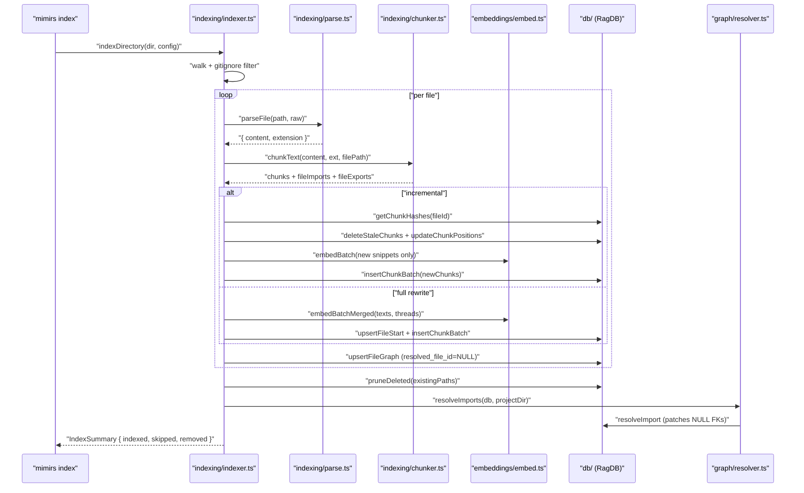
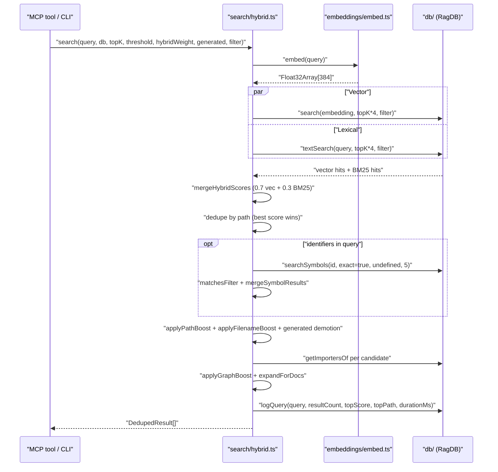
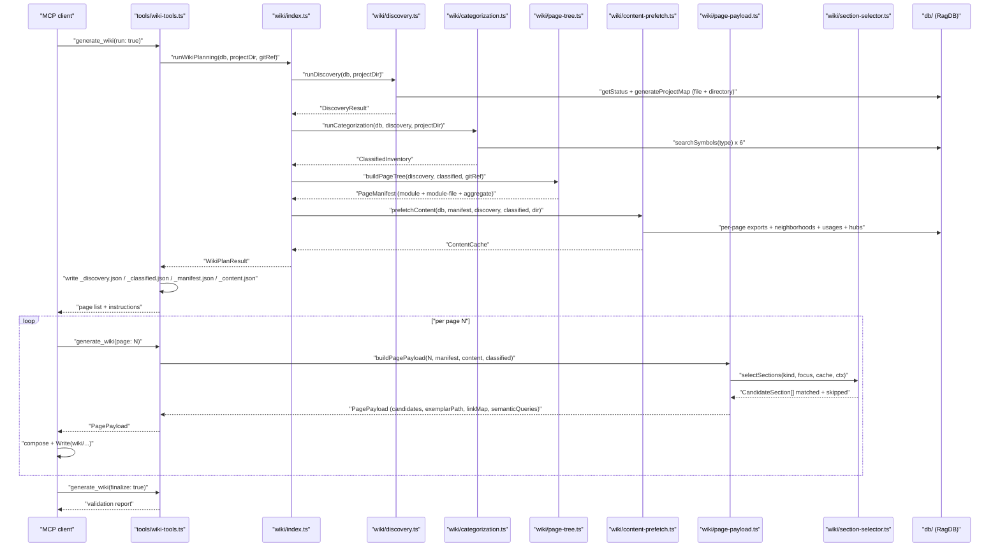

# Data Flows

mimirs has four primary flows that exercise the persistence layer end-to-end: **indexing** (CLI / watcher → `RagDB`), **hybrid search** (MCP tool / CLI → ranked hits), **conversation tail** (filesystem watcher → embedded turns), and **wiki generation** (MCP tool → per-page payloads written to `wiki/`). Each flow funnels through `src/db/index.ts` (`RagDB` facade) as the single persistence boundary; nothing else opens a `Database` handle directly.

A fifth flow worth naming briefly is the **MCP tool call** shape itself: every tool registered in `src/tools/*.ts` runs `resolveProject(directory, getDB)` first to turn an optional `directory` arg into a `{ projectDir, db, config }` trio (with `applyEmbeddingConfig` applied before the first `embed()`), then delegates to the domain module behind the tool. The four flows below are the domain flows; the tool-call shape is the wrapper.

## Flow 1: Indexing a project directory

Triggered by `mimirs index` in `src/cli/commands/index-cmd.ts`, by the MCP `index_files` tool in `src/tools/index-tools.ts`, or by the filesystem watcher in `src/indexing/watcher.ts`. Produces rows in `files`, `chunks`, `vec_chunks`, `fts_chunks`, `file_imports`, and `file_exports`.

1. **Walk + filter** — `indexDirectory` walks the tree, respecting `.gitignore` and `config.ignore`. Files above a size threshold or with average line length above a minified threshold are skipped before any work happens.
2. **Hash-gate** — each file is read once; `hashString(raw)` is compared against `files.hash`. If equal, the file is skipped — no parse, no chunk, no embed.
3. **Parse + chunk** — `parseFile` strips shebangs and handles frontmatter; `chunkText` runs AST-aware splitting via `bun-chunk` for 24 supported languages, falling back to blank-line / paragraph heuristics otherwise. The chunker returns per-chunk `imports` / `exports` / `parentName` / `chunkType` and a content hash per chunk.
4. **Incremental vs full** — when `config.incrementalChunks` is on and the file already has chunks indexed, `processFileIncremental` compares old vs new hash sets. If more than 50 % of new chunks are novel the code falls through to `processFile` (full re-index). Otherwise stale chunks are deleted, kept chunks get position updates, and only the novel chunks are embedded.
5. **Embed** — `embedBatchMerged` (or plain `embedBatch` when `config.embeddingMerge` is off) feeds texts through the MiniLM L6 v2 singleton at 384 dims. Batch size defaults to `config.indexBatchSize = 50`; texts above the 256-token window are split into 32-token-overlap windows and averaged back into a single unit-normalised vector.
6. **Write** — `upsertFileStart` updates `files.id` in place (preserves FKs), `insertChunkBatch` writes one transaction per batch: `chunks` + `vec_chunks` raw-byte embeddings. FTS5 stays synced via triggers on `chunks`.
7. **Graph first pass** — `upsertFileGraph` writes `file_imports` rows with `resolved_file_id = NULL` and `file_exports` rows. No file-ordering dependency.
8. **Prune deleted** — `pruneDeleted(Set<walkedPath>)` drops any `files.path` missing from the walk; `ON DELETE CASCADE` clears chunks, vec rows, imports, exports, and FTS.
9. **Graph second pass** — after the walk, `resolveImports` iterates `getUnresolvedImports`, resolves each via `bun-chunk`'s language-aware resolver plus a JS/TS filesystem fallback (`.ts` / `.tsx` / `.js` / `.jsx` / `index.<ext>`), and patches rows with `resolveImport(importId, resolvedFileId)`.

### Error paths

- **Embedding model mismatch** — `getEmbeddingDim()` is read at schema init; changing `config.embedding.model` after indexing produces silently wrong neighbours because existing `vec_chunks` rows are dimensionally frozen. Recovery is `mimirs cleanup` + re-index.
- **AST chunker failure** — caught per file; the heuristic splitter takes over for that file. No file is lost.
- **Watcher file rewrite** — when the watcher sees a shrink instead of an append, `processFile` falls back to the full-rewrite path rather than attempting incremental diff against a stale hash set.

## Flow 2: Hybrid search query

Triggered by the MCP `search` / `read_relevant` tools in `src/tools/search.ts` or by `mimirs search` / `mimirs read` in `src/cli/commands/search-cmd.ts`. Produces ranked `DedupedResult[]` (file-level) or `ChunkResult[]` (chunk-level) and logs the query into `query_log`.

1. **Embed query** — `embed(query)` reuses the singleton loaded at CLI / server startup via `configureEmbedder`.
2. **Parallel fetch** — `db.search` returns `topK × 4` vector neighbours; `db.textSearch` runs an FTS5 `MATCH` with `sanitizeFTS` quoting every token so `+ - * AND OR NOT NEAR ( )` become literals. Over-fetching by 4× is what lets dedup and boosts surface the right result at position 1. Both accept the optional `PathFilter` (`{ extensions?, dirs?, excludeDirs? }`) and apply it in SQL.
3. **Hybrid merge** — `mergeHybridScores(vec, text, 0.7)` emits `0.7 × normalised(vec) + 0.3 × normalised(BM25)`. Min-max normalisation per list keeps the two score spaces comparable.
4. **Path dedupe** — one entry per `files.path`; snippets accumulate into an array so multiple strong chunks from the same file all contribute to the preview. `searchChunks` skips this step so two chunks from the same file can both appear.
5. **Symbol expansion** — `extractIdentifiers(query)` pulls camelCase / snake_case / PascalCase tokens through a `STOP_WORDS` filter (min 3 chars, requires mixed case / `_` / `.`). Each becomes a `searchSymbols(id, exact=true, undefined, 5)` call. The symbol query bypasses the SQL filters, so each returned path is re-checked in memory via `matchesFilter` before it joins the result map. Existing hits get a `× 1.3` boost (via `Math.max`); new ones enter at base score `0.75`.
6. **Path + filename boosts** — `applyPathBoost` (source `× 1.1`, test `× 0.85`), `applyFilenameBoost` (`+0.1` per query-word match in the filename stem, `+0.05` per match in path segments), `BOILERPLATE_BASENAMES` demotion (`× 0.8` for `types.go`, `types.ts`, `index.d.ts`, etc.), and `× 0.75` for paths matching the user's `config.generated` globs.
7. **Graph boost** — `applyGraphBoost` fetches `getImportersOf(fileId)` and adds `0.05 × log2(importers + 1)` — a file imported by 8 others gets about `+0.15`.
8. **Doc expansion** — `expandForDocs` adds `.md` / `.mdx` matches as bonus results that don't displace code; the code top-K is preserved even when a doc file scored higher.
9. **Log** — `db.logQuery` writes the query + resultCount + topScore + topPath + durationMs into `query_log` for later audit via the `search_analytics` tool.

`searchChunks` follows the same shape with one extra step: `groupByParent` replaces sibling chunks with their parent chunk when ≥ `config.parentGroupingMinCount = 2` children of the same parent appear — one class chunk beats three separate method chunks at representing "this class".

### Error paths

- **FTS5 parse error** — `sanitizeFTS` quotes operator tokens, but anything it misses is caught in `hybrid.ts` and the query falls back to vector-only results. Users don't see the error.
- **Empty vector results** — symbol-only hits (base score `0.75`) can still surface the right file even when semantic match is weak; the path + filename boosts then tighten the ranking.

## Flow 3: Conversation tail

Triggered by `mimirs conversation index` in `src/cli/commands/conversation.ts` or by the MCP server's startup tail. Produces rows in `conversation_sessions`, `conversation_turns`, `conversation_turn_chunks`, `vec_conversation`, and `fts_conversation`.

1. **Debounced fire** — the watcher waits `TAIL_DEBOUNCE_MS = 1500` before processing appends so a burst of JSONL writes becomes one indexing pass.
2. **Resume by offset** — `getSession` returns the last `readOffset` (a byte offset into the JSONL). `readJSONL` `Buffer.alloc`s only the new bytes, `openSync`/`readSync`s them, and returns `{ entries, newOffset }`. Cost is O(append-size), not O(history-length).
3. **Parse + skip** — `parseTurns` pairs user + assistant events into turns. Tool-result content for `Read` / `Glob` / `Write` / `Edit` / `NotebookEdit` is dropped (`SKIP_CONTENT_TOOLS`) because the code index already has that content; only the tool name survives in `toolsUsed`. Other tool results above `SHORT_RESULT_THRESHOLD = 500` chars are truncated.
4. **Chunk + embed** — `buildTurnText(turn)` concatenates user + assistant + tool summaries + file references into a markdown-shaped blob; `chunkText` runs with `".md"` / 512 / 50 so paragraph-fallback splitting applies. Batched embeddings reuse the singleton.
5. **Atomic insert** — `insertTurn` wraps the turn row + chunk rows + vec rows in a single transaction. A crash mid-batch rolls back the whole turn; re-indexing that offset range is safe because `(sessionId, turnIndex)` is unique and `insertTurn` returns `0` on duplicate.
6. **Roll-up** — `updateSessionStats` writes `turnCount`, `totalTokens`, and `newOffset` in one row update, ready for the next tail tick.

### Error paths

- **File rewrite (not append)** — a file whose size decreases leaves `readOffset` past EOF. The tail detects the size drop and resets the offset to 0 before reading.
- **Malformed JSONL line** — `readJSONL` catches the `JSON.parse` throw and moves on; a partial line from a kill signal is silently dropped.
- **Duplicate turn** — `insertTurn` returns `0`; the caller treats zero as "already indexed, skip" so overlapping re-reads are free.

## Flow 4: Wiki generation

Triggered by the MCP `generate_wiki` tool in `src/tools/wiki-tools.ts`. Produces `wiki/_discovery.json`, `wiki/_classified.json`, `wiki/_manifest.json`, `wiki/_content.json`, and then one markdown file per page as the agent loops through `generate_wiki(page: N)`.

1. **Discovery** — `runDiscovery` reads `db.getStatus()` then `generateProjectMap` twice (file-level + directory-level). Directories become `DiscoveryModule` entries via three heuristics: an entry file matching `ENTRY_FILE_PATTERN = /^(index|main|mod|lib|__init__)\./`, external consumers (`fanIn > 0`), or internal cohesion (`>= 2 intra-directory edges` and `totalExports > 0`). Monorepo workspace roots are detected against `WORKSPACE_ROOTS = ["package.json", "Cargo.toml", "go.mod", "pyproject.toml"]` at depth `<= 2`.
2. **Categorization** — `runCategorization` pulls every symbol across six `SYMBOL_TYPES` (`class`, `interface`, `type`, `enum`, `function`, `export`) and classifies in three steps: symbols get `tier = "entity" | "bridge"` and `scope = "cross-cutting" | "shared" | "local"`; files get hub `pathA` (crossroads) or `pathB` (foundational); modules get `value = fanIn * 2 + exports.length + files.length` plus structural overrides. `qualifiesAsModulePage` fires if `value >= MIN_MODULE_VALUE = 8` or either override applies; the `reason` string records which rule fired.
3. **Page tree** — `buildPageTree` emits `kind: "module" | "file" | "aggregate"` pages with a `focus` for the six aggregate narratives. Depth is percentile-based (`full` / `standard` / `brief`); sub-pages kick in when `fileCount >= FILE_THRESHOLD = 10` or `exportCount >= EXPORT_THRESHOLD = 20`, capped at `MAX_SUB_PAGES = 5`. `computeRelatedPages` wires a title-keyed graph.
4. **Content prefetch** — `prefetchContent` bulk-fetches the expensive data every page will want: truncated export signatures (`truncateToSignature` drops function/class bodies but preserves interface/type/enum shapes), neighborhoods, usages (capped at `MAX_USAGES = 10`), cross-cutting inventories, hub tables. The whole prefetch runs once per `runWikiPlanning`; `getPagePayload` is a pure read afterwards.
5. **Per-page payload** — `buildPagePayload` sorts manifest entries by `order`, pulls the cache entry, builds a title-keyed `linkMap` (relative from this page's directory), and hands the cache + context to `selectSections`. Returns: `candidateSections` (the 16-entry library filtered by `applies`), `exemplarPath` for the six aggregate foci with exemplars, `semanticQueries` keyed on `focus ?? kind`, and `additionalTools` breadcrumbs.
6. **Agent writes** — the agent reads the exemplar or library snippets, fires the suggested `read_relevant` queries, composes the page, and calls `Write`. The agent decides which sections fit; the pipeline supplied the signals.
7. **Finalize** — `generate_wiki(finalize: true)` validates cross-links (`linkMap` is the source of truth), checks that every page in the manifest exists on disk, and reports audit flags. `incremental: true` diffs the working tree against `lastGitRef` via `classifyStaleness` and returns only pages whose sources changed.

### Error paths

- **Missing page file at finalize** — surfaced as a validation flag, not a crash. The agent is expected to fix and re-finalize.
- **Broken cross-link** — finalize detects link targets not in the manifest and reports them; mis-typed titles never silently 404.
- **v1 manifest on disk** — the manifest carries `version: 2`; an older v1 is overwritten without a translator. Regeneration is cheap enough that this is intentional.

## See also

- [Architecture](architecture.md)
- [Getting Started](guides/getting-started.md)
- [Conventions](guides/conventions.md)
- [Testing](guides/testing.md)
- [Index](index.md)
