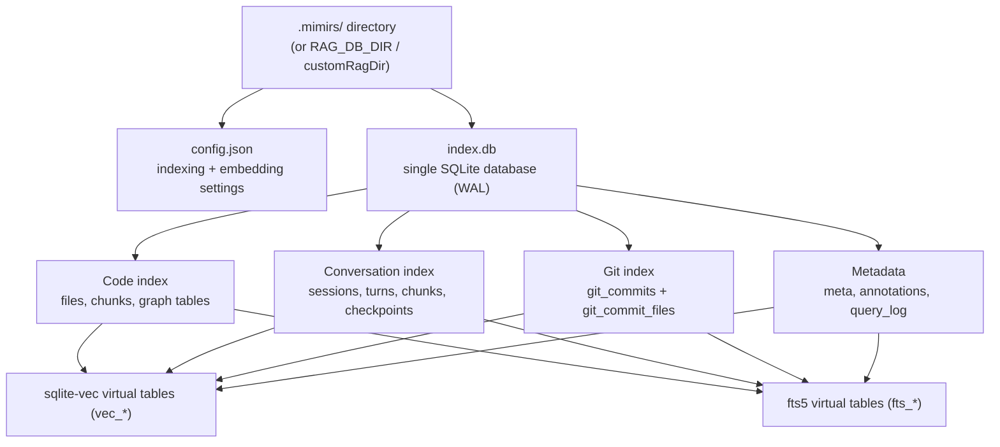

# Data Model

This page is the map of everything mimirs keeps on disk. It explains where the persistent state lives, how the SQLite schema is laid out, which tables back which features, and the few invariants that hold the whole index together. Read it when you are about to add a table, change a column, alter how embeddings are stored, or debug why an index will not open. The per-feature behavior — how a search runs, how a checkpoint is written — lives on the feature pages linked below; here we cover only the shape of the stored data and the contracts around it.

## Where state lives

Everything mimirs persists for a project sits in one directory: `.mimirs/` at the project root. It holds exactly two things that matter — a JSON config file and a single SQLite database.

The database is opened in the `RagDB` constructor (`src/db/index.ts:100-152`). By default it resolves to `<projectDir>/.mimirs/index.db`, but the location is overridable: an explicit `customRagDir` argument wins, otherwise if the `RAG_DB_DIR` environment variable is set the whole `.mimirs` directory is placed there instead (`src/db/index.ts:111-116`). This matters for read-only checkouts and sandboxes — when the project tree cannot be written, you point `RAG_DB_DIR` at a writable path. The constructor creates the directory eagerly and translates a read-only or permission-denied failure (`EROFS`/`EACCES`) into an actionable error that names exactly which path to fix and the env var to set (`src/db/index.ts:118-133`).

Opening the database does a fixed sequence before any query runs: it switches the journal to WAL mode and sets a 5-second busy timeout so concurrent mimirs processes (one per IDE window) do not immediately error on lock contention, it loads the `sqlite-vec` extension that provides the vector tables, then it runs the embedding compatibility guards, the schema bootstrap, and a one-time stamp of the active embedding model (`src/db/index.ts:144-151`). On macOS a one-time `loadCustomSQLite` step first repoints `bun:sqlite` at a Homebrew-built libsqlite3, because Apple's bundled SQLite cannot load extensions and `sqlite-vec` would fail (`src/db/index.ts:51-72`). Linux probes a few common library paths but falls through to bun's built-in SQLite if none match.

## config.json on disk

The config file is `.mimirs/config.json`. It is loaded by `loadConfig` (`src/config/index.ts:140-178`), which has a deliberately simple contract: what is on disk is what runs. There is no merge of partial user config over defaults. If the file is missing, the full default config is written to disk so a user can edit it directly, and those defaults are used. If the file exists but is invalid JSON, or fails schema validation, mimirs logs a warning and falls back to the complete defaults rather than running with a half-applied config.

The schema is a Zod object, `RagConfigSchema` (`src/config/index.ts:17-43`), and `RagConfig` is its inferred type (`src/config/index.ts:45`). The fields that change stored data are:

| Field | Default | What it controls |
| --- | --- | --- |
| `include` / `exclude` / `generated` | large built-in globs | which files get indexed at all (`src/config/index.ts:47-115`) |
| `chunkSize` / `chunkOverlap` | 512 / 50 | how source is split into `chunks` rows |
| `embeddingModel` / `embeddingDim` | unset (→ MiniLM / 384) | which model produces vectors and how wide every `vec_*` column is |
| `embeddingPooling` / `embeddingDtype` | unset | pooling strategy and dtype passed to the embedder (`src/config/index.ts:31-32`) |
| `incrementalChunks`, `embeddingMerge`, `parentGroupingMinCount` | false / true / 2 | chunking + embedding strategy |
| `hybridWeight` / `searchTopK` | 0.5 / 10 | query-time fusion weight and result count, not stored shape |

The embedding fields are the ones with a hard link to the database — they decide the width of every vector column, and `embeddingModel` plus `embeddingPooling`/`embeddingDtype` together decide which vector *space* the index lives in. The glob `include`/`exclude`/`generated` lists are normalized to forward slashes at parse time by a Zod transform, so a Windows-style `node_modules\**` still works as a POSIX glob (`src/config/index.ts:12-15`). `hybridWeight` only tunes how the two retrieval signals are combined at query time: the search layer fuses the vector ranking and the BM25 (keyword) ranking with reciprocal-rank fusion, weighted by this value — it never changes anything stored.

## The embedding compatibility contract

Every vector column in the database is a fixed-width `FLOAT[N]` declared by the `sqlite-vec` extension. `N` is whatever the configured embedding model produces, defaulting to 384 for the bundled `Xenova/all-MiniLM-L6-v2` model (`src/embeddings/embed.ts:17-18`). A `vec0` table built at one width cannot accept vectors of another width, and even at the *same* width a different model — or the same model with different pooling/dtype — produces an incompatible vector space that silently corrupts cosine distances. So the configured embedding and the stored index must agree forever, or until the index is rebuilt. Three pieces of code enforce this.

First, the dimension is applied *before* the schema is created. Unless a caller opts out via `autoEmbeddingConfig: false`, the constructor calls `applyEmbeddingConfigFromDisk` (`src/config/index.ts:197-220`), a synchronous best-effort reader that pulls only the embedding fields (`embeddingModel`, `embeddingDim`, `embeddingPooling`, `embeddingDtype`) out of `config.json` and configures the embedder, so that when `initSchema` later writes `FLOAT[${getEmbeddingDim()}]` the tables are created at the right width by construction (`src/db/index.ts:135-142`). The constructor is synchronous and cannot await the async `loadConfig`, which is why a second, narrower reader exists; the async path still owns writing defaults and surfacing validation warnings. The benchmark-models command is the one caller that opts out, because it drives the embedder itself across multiple models against throwaway indexes.

Second, if the database already exists, the constructor runs `assertEmbeddingDimCompatible` (`src/db/index.ts:228-247`) before touching the schema. It reads the stored `CREATE TABLE` SQL for `vec_chunks` out of `sqlite_master`, parses the declared `FLOAT[N]` with a regex, and compares it to the currently configured dimension. On a mismatch it throws immediately with a message naming both widths and telling the maintainer to restore the previous embedding settings in `config.json` or delete the index — never to silently re-create tables. The stored index wins. This turns an otherwise cryptic vec0 insert failure that would surface deep inside an indexing run into a clear, early error. A fresh database (no `vec_chunks` yet) skips the check and is created at the configured width.

Third, the dim check alone cannot catch a *model* swap, because two different models often share 384 dimensions yet embed into incompatible spaces. So `assertEmbeddingModelCompatible` (`src/db/index.ts:183-211`) records the model identity and verifies it on every open. On first creation `recordEmbeddingModel` writes the configured model id under the `meta` key `embedding_model` and a `meta` key `embedding_variant` capturing pooling and dtype (`src/db/index.ts:213-219`). On a later open, if the recorded `embedding_model` differs from the configured one — or the recorded `embedding_variant` differs — it throws, telling the maintainer to restore the previous `embeddingModel`/`embeddingPooling`/`embeddingDtype` or delete the index. Indexes built before model stamping have no recorded value and are grandfathered (the check skips and stamps going forward). The `meta` table is a simple key/value store (`src/db/index.ts:251-254`) read and written through private `getMeta`/`setMeta` helpers (`src/db/index.ts:160-173`).

## Core code tables: files → chunks → vectors

The heart of the index is a three-layer split created in `initSchema` (`src/db/index.ts:249-306`). The `files` table is one row per indexed file, keyed by a unique `path` with a content `hash` and an `indexed_at` timestamp; the hash is how the indexer decides whether a file changed (`src/db/index.ts:256-261`). The `chunks` table is one row per semantic unit (a function, class, or markdown section) carved out of a file, holding the `snippet` text, the `entity_name` and `chunk_type`, the `start_line`/`end_line` range, a `content_hash`, and a `parts` column of split identifier words (see below); a `chunks.file_id` foreign key cascades on delete, so removing a file drops its chunks (`src/db/index.ts:263-274`). A `parent_id` for nesting is added by the parent-chunk migration.

The chunk text exists in three forms at once, and keeping them in sync is the central invariant of this part of the schema:

- The plain row in `chunks` is the source of truth.
- `vec_chunks` is a `sqlite-vec` virtual table (`vec0`) holding the embedding vector for each chunk, keyed by `chunk_id` (`src/db/index.ts:276-279`).
- `fts_chunks` is an FTS5 virtual table providing keyword search, declared as an external-content table over `chunks` (`content='chunks'`, `src/db/index.ts:281-286`). It indexes **two** columns — `snippet` and `parts` — not just the snippet.

FTS5 external-content tables do not auto-update, so three triggers — `chunks_ai`, `chunks_ad`, `chunks_au` — mirror every insert, delete, and update of a `chunks` row into `fts_chunks`, passing both `snippet` and `parts` through (`src/db/index.ts:288-297`). The vector table needs special handling: a `vec0` virtual table cannot be a foreign-key child, so the cascade that cleans up `chunks` can never reach it. A fourth trigger, `chunks_vec_ad`, fires on every `chunks` delete and removes the matching `vec_chunks` row (`src/db/index.ts:304-306`). This is why the file-re-index path can simply delete a file's chunks and trust that both the FTS and vector mirrors clean themselves up from one place, rather than every caller remembering a manual vector delete — `upsertFileStart` updates the existing `files.id` in place to keep inbound `resolved_file_id` FKs intact (`src/db/files.ts:50-67`). This shape — base table, `vec_*` sibling, `fts_*` sibling, sync mirrors — repeats for conversation chunks, checkpoints, git commits, and annotations.

## Identifier-aware FTS: the `parts` column

The default FTS5 tokenizer splits on punctuation and whitespace but not on case boundaries, so a compound identifier like `getDependsOn` is one opaque token and a keyword search for `depends` cannot match it. The `parts` column closes that gap. For each chunk, `identifierParts(snippet)` (`src/indexing/identifiers.ts:27-44`) scans the snippet for identifier-shaped tokens, splits each compound name into its lowercase word pieces — camelCase, snake_case, kebab, and dotted segments — via `splitIdentifier` (`src/indexing/identifiers.ts:13-20`), and joins the de-duplicated set of pieces (each ≥2 chars) into a space-separated string. Only *multi-part* identifiers contribute; single plain words already live in the snippet, so they are not repeated. `getDependsOn` therefore lands `get depends on` into `parts`, and `fts_chunks` indexes that alongside the raw snippet so both the whole identifier and its words are searchable.

The column is populated at write time, not derived at query time. Every chunk insert writes `parts` in the same statement that writes the snippet — both the batch insert (`src/db/files.ts:100-101`) and the single-chunk parent insert (`src/db/files.ts:147-148`) call `identifierParts(snippet)` inline. The three sync triggers carry `parts` into `fts_chunks` on every insert, delete, and update, so the keyword index never drifts from the column.

This is the only FTS index over two columns; `fts_conversation` (`snippet` only) and `fts_annotations` (`note` only) are single-column, and `fts_git_commits` indexes `message` and `diff_summary` for an unrelated reason. The reciprocal-rank fusion that combines this BM25 signal with vector search is query-time behavior on top of the same stored `fts_chunks` — see [search](tools/search.md).

## In-place migration: backfilling `parts`

An index built before the `parts` column existed needs to be upgraded without re-embedding — the vectors are unchanged, only the keyword index gains a column. `migrateSearchPartsColumn` (`src/db/index.ts:671-721`) does this in place and is ordering-sensitive, so the exact sequence matters.

It first adds the `parts` column with `ALTER TABLE` if missing (`src/db/index.ts:676-678`), then reads the stored `CREATE` SQL for `fts_chunks` from `sqlite_master`; if that SQL already mentions `parts`, the index is current and the migration returns (`src/db/index.ts:680-682`). Otherwise it must rebuild the FTS table, and the critical nuance is that the backfill happens with the triggers **off**. It first drops the `chunks_ai`/`chunks_ad`/`chunks_au` triggers and the old `fts_chunks` table (`src/db/index.ts:687-692`), *then* backfills `parts` for every existing chunk row in one transaction (`src/db/index.ts:694-702`). Backfilling while the old triggers were still live would fire a `'delete'` against a half-built external-content FTS index and raise `SQLITE_CORRUPT_VTAB` — the triggers must be gone before any `UPDATE` touches a chunk. Only after the column is fully backfilled does it recreate `fts_chunks` over `(snippet, parts)`, recreate the three triggers, and seed the whole index from the content table with `INSERT INTO fts_chunks(fts_chunks) VALUES('rebuild')` (`src/db/index.ts:707-720`) — the correct way to populate an external-content FTS table, rather than a per-row insert that would try to delete absent rows. No vectors are touched, so no re-embedding is needed. This migration runs from `initSchema` alongside the additive column migrations (`src/db/index.ts:519`).

## Graph tables: imports, exports, and symbol references

Three tables turn the flat file/chunk store into a dependency and call graph, all created in `initSchema` (`src/db/index.ts:308-347`). `file_imports` records each import statement of a file: the `source` string, the imported `names`, flags for default and namespace imports, and a `resolved_file_id` that points at the imported file once the resolver has matched it (`NULL` for externals, set to null on delete). `file_exports` records each exported symbol with its `name`, `type`, and re-export bookkeeping. `symbol_refs` records each identifier occurrence inside a chunk — its `name`, `line`, the owning `chunk_id` and `file_id`, and a `resolved_export_id` that links the reference to the `file_exports` row it actually calls.

These power [project_map](tools/project-map.md), [depends_on](tools/depends-on.md) / [dependents](tools/dependents.md), and [usages](tools/usages.md). The `resolved_export_id` link is also what the call-graph walks read: [impact](tools/impact.md) follows the reverse edges (callers of an export) to compute a symbol's blast radius, and [trace](tools/trace.md) follows the forward edges (callees) to find every path between two symbols — both are static name-match walks over `symbol_refs` and stop at any ref that resolves to nothing. The contract is that references are written unresolved and resolved in a second pass: `upsertSymbolRefs` replaces all of a file's refs with `resolved_export_id` set to `NULL` (`src/db/graph.ts:12-37`), and `resolveSymbolRefs` later matches each ref name against the file's resolved imports and the target's exports to fill in the link, including a same-file-export pass and a namespace-member pass for `import * as ns` access (`src/db/graph.ts:39-145`). Refs that match nothing (locals, type references, unresolved externals) stay `NULL`, and usage lookups fall back to FTS for those. A row of indexes on `file_id`, `resolved_file_id`, `name`, and `resolved_export_id` keeps these joins fast (`src/db/index.ts:329-347`).

## Conversation tables: sessions, turns, chunks, checkpoints

A parallel index covers Claude Code session transcripts (`src/db/index.ts:349-432`). `conversation_sessions` is one row per `.jsonl` transcript file, tracking its path, start time, turn and token counts, and crucially a `read_offset` and `file_mtime` so re-indexing only reads the new tail of an append-only log; the upsert keys on `session_id` and refreshes mtime, indexed time, and offset on conflict (`src/db/conversation.ts:5-54`). `conversation_turns` is one row per user/assistant exchange, storing both texts plus JSON-encoded `tools_used` and `files_referenced` arrays, uniquely keyed by `(session_id, turn_index)` so re-indexing the same turn is ignored. `conversation_chunks` is the embeddable text of a turn, with its own `vec_conversation` and `fts_conversation` siblings and the same three sync triggers (`conv_chunks_ai/ad/au`, `src/db/index.ts:394-410`); a `conv_chunks_vec_ad` delete trigger mirrors the code path's vector cleanup. Inserting a turn is one transaction that writes the turn with `INSERT OR IGNORE`, bails immediately if `changes()` reports a duplicate, then writes each chunk and each chunk's vector (`src/db/conversation.ts:56-115`). This backs [search_conversation](tools/search-conversation.md).

Checkpoints are durable agent notes stored in `conversation_checkpoints` (`src/db/index.ts:414-432`): `type`, `title`, `summary`, and JSON-encoded `files_involved` and `tags`. Their embeddings live in a separate `vec_checkpoints` table — the base table has no embedding column, deliberately matching the chunks/`vec_chunks` split (`src/db/index.ts:429-432`). Writing a checkpoint is a transaction that inserts the row, grabs `last_insert_rowid()`, then inserts the vector keyed by that id (`src/db/checkpoints.ts:4-49`); search joins `vec_checkpoints` back to the base table and converts vec distance to a `1 / (1 + distance)` score (`src/db/checkpoints.ts:91-144`). This backs [create_checkpoint](tools/create-checkpoint.md), [list_checkpoints](tools/list-checkpoints.md), and [search_checkpoints](tools/search-checkpoints.md). Note checkpoints have no FTS sibling — they are vector-search and list-only.

## Git history: commits and per-file stats

When commit history is indexed, two tables store it (`src/db/index.ts:444-489`). `git_commits` is one row per commit, uniquely keyed by full `hash`, holding the message, author name and email, ISO `date`, a JSON `files_changed` list, aggregate insertion/deletion counts, an `is_merge` flag, `refs`, and a `diff_summary` (`src/db/index.ts:444-459`). `git_commit_files` is the per-file breakdown, with a composite primary key of `(commit_id, file_path)` and an index on `file_path` so [file_history](tools/file-history.md) can look up a path cheaply (`src/db/index.ts:461-468`). Commit embeddings live in `vec_git_commits`, and `fts_git_commits` is an FTS5 table over both `message` and `diff_summary`, kept in sync by the `git_commits_ai`/`git_commits_ad` triggers (`src/db/index.ts:475-489`).

Inserts use `INSERT OR IGNORE` on `git_commits` keyed by hash so re-indexing is safe; only when a row was actually inserted (`changes()` non-zero) does the batch write its vector and per-file rows (`src/db/git-history.ts:21-69`). This, together with `getLastIndexedCommit` reading the newest stored commit by date (`src/db/git-history.ts:71-78`), is what lets the indexer index only new commits. Because `vec_git_commits` and `fts_git_commits` are virtual tables outside the FK cascade, the purge and clear paths delete from all three tables explicitly inside one transaction and then `'rebuild'` the FTS index (`src/db/git-history.ts:313-345`). This backs [mimirs history](cli/history.md), [search_commits](tools/search-commits.md), and [file_history](tools/file-history.md).

## Metadata: model stamp, annotations, and the query log

Three small tables round out the schema. The `meta` key/value table holds the embedding model stamp described above and the durable identity values future opens verify (`src/db/index.ts:251-254`).

`annotations` (`src/db/index.ts:493-513`) stores maintainer notes pinned to a `path` and optional `symbol_name`, with `note` text, `author`, and created/updated timestamps. It has the full trio of siblings — `fts_annotations` for keyword search and `vec_annotations` for semantic search — but the sync is done manually inside `upsertAnnotation` rather than by triggers, because an upsert may update an existing note (deleting the old FTS and vector rows first, then re-inserting both) or insert a brand-new one (`src/db/annotations.ts:4-65`). This backs [annotate](tools/annotate.md), [get_annotations](tools/get-annotations.md), and [delete_annotation](tools/delete-annotation.md).

`query_log` (`src/db/index.ts:434-442`) is a flat, append-only audit table: one row per search with the `query`, `result_count`, `top_score`, `top_path`, `duration_ms`, and `created_at`. It is the only table written purely as a side effect of reads — `db.logQuery` is called at the end of search (`src/db/analytics.ts:3-8`). The aggregation functions read it over a time window: `getAnalytics` computes totals, averages, zero-result queries, low-score queries, top searched terms, and per-day counts (`src/db/analytics.ts:10-67`), while `getAnalyticsTrend` compares the current window against the prior one of equal length (`src/db/analytics.ts:69-116`). This is what powers [search_analytics](tools/search-analytics.md), whose whole purpose is to surface documentation gaps from real query history.

## Schema bootstrap, migrations, and recovery

`initSchema` is the single owner of the schema (`src/db/index.ts:249-523`). Every `CREATE TABLE`, `CREATE VIRTUAL TABLE`, `CREATE INDEX`, and `CREATE TRIGGER` uses `IF NOT EXISTS`, so the constructor runs it unconditionally on every open and it is idempotent for an up-to-date database. After the creates, it runs a series of additive migrations that bring older databases forward by checking `PRAGMA table_info` and `ALTER TABLE ADD COLUMN` for any missing column — the entity columns on `chunks` (`migrateChunksEntityColumns`), the `parent_id` column (`migrateParentChunkColumns`), the import/export graph flag columns (`migrateGraphColumns`), and the identifier-aware `parts` column with its FTS rebuild (`migrateSearchPartsColumn`) — all dispatched in order from one block (`src/db/index.ts:516-522`).

Schema shape changes are also stamped forward-safely. `applySchemaVersion` reads `PRAGMA user_version` and compares it to the `SCHEMA_VERSION` constant exported from this file (`src/db/index.ts:14`, `src/db/index.ts:530-544`). An index written by a *newer* mimirs (a higher stored version) is left alone with a warning rather than downgraded, so an old binary opening a new index proceeds cautiously instead of writing malformed rows; an older index is bumped to the current version after the column-sniffing migrations have already run. This is the forward-safety signal the additive migrations alone lacked.

Two of the post-create steps are recovery passes, not plain migrations. `dedupeChunks` collapses duplicate chunk rows that two concurrent mimirs processes could have written for the same file by `(file_id, chunk_index, content_hash)`, then clears the affected files' `hash` so the next indexing pass re-emits them cleanly (`src/db/index.ts:591-642`). `backfillMissingSymbolRefs` finds files that have resolved imports but zero `symbol_refs` — databases built before the symbol-reference feature shipped — and clears their hash for the same reason (`src/db/index.ts:557-576`). Both lean on the same invariant: clearing `files.hash` is the safe, universal "re-index me" signal, because the indexer re-emits a file whenever its stored hash does not match the file on disk.

The seam for schema changes is therefore narrow and clear. A new table or column goes into `initSchema`; if it must land on existing databases, add a `PRAGMA table_info` guard in a matching `migrate*` method, call it from the migration block (`src/db/index.ts:516-522`), and bump `SCHEMA_VERSION` if the shape changed. A new feature table that follows the embeddable pattern needs four pieces in lockstep — the base table, a `vec_*` sibling at `FLOAT[${getEmbeddingDim()}]`, an `fts_*` external-content sibling, and either sync triggers or manual mirror maintenance — or the vector and keyword views will silently drift out of sync with the base rows. If a new FTS column ever needs backfilling on existing indexes, follow the `parts` migration's rule: drop the triggers and the FTS table before touching content rows, backfill with triggers off, then recreate and `'rebuild'`.

## How indexing and reading touch the store

The write side is driven by indexing: [index_files](tools/index-files.md) and [mimirs init](cli/init.md) populate `files`, `chunks`, the vector/FTS mirrors, and the graph tables. The read side is the long-running server started by [mimirs serve](cli/serve.md), which opens one `RagDB` and routes every tool call through the wrapper methods on the `RagDB` class. That class is the only public surface over the database: each store module (`files`, `search`, `graph`, `conversation`, `checkpoints`, `annotations`, `analytics`, `git-history`) exports plain functions that take a `Database`, and `RagDB` holds the connection and delegates to them (`src/db/index.ts:21-28`). Adding a query means adding a function in the relevant store module and a one-line delegating method on `RagDB`; nothing else opens the database directly.

## Key source files

- `src/db/index.ts` — the `RagDB` class, the full `initSchema` schema (including `chunks.parts` and the two-column `fts_chunks`), the embedding dim/model/variant guards, the `meta` stamp, the schema-version stamp, the `parts` FTS migration, and all other migrations/recovery passes.
- `src/config/index.ts` — `config.json` loading, the `RagConfig` schema and defaults, and the synchronous embedding-config reader the DB constructor depends on.
- `src/indexing/identifiers.ts` — `identifierParts` / `splitIdentifier`, the source of the `parts` column's split-identifier words.
- `src/embeddings/embed.ts` — the default model and dimension and the `getEmbeddingDim` source of truth for vector-column widths.
- `src/db/files.ts` — file/chunk upsert and pruning, the inline `parts` population on insert, and the `chunks`-delete-cascades-to-mirrors behavior.
- `src/db/graph.ts` — symbol-reference write and two-pass resolution against imports and exports.
- `src/db/conversation.ts` — session/turn/chunk inserts for the conversation index.
- `src/db/checkpoints.ts` — checkpoint write and vector search over `vec_checkpoints`.
- `src/db/git-history.ts` — commit batch insert, incremental hashing, and the purge/clear paths across the three git tables.
- `src/db/annotations.ts` — annotation upsert with manual FTS/vector mirror maintenance.
- `src/db/analytics.ts` — `query_log` writer and the windowed aggregation/trend queries.
