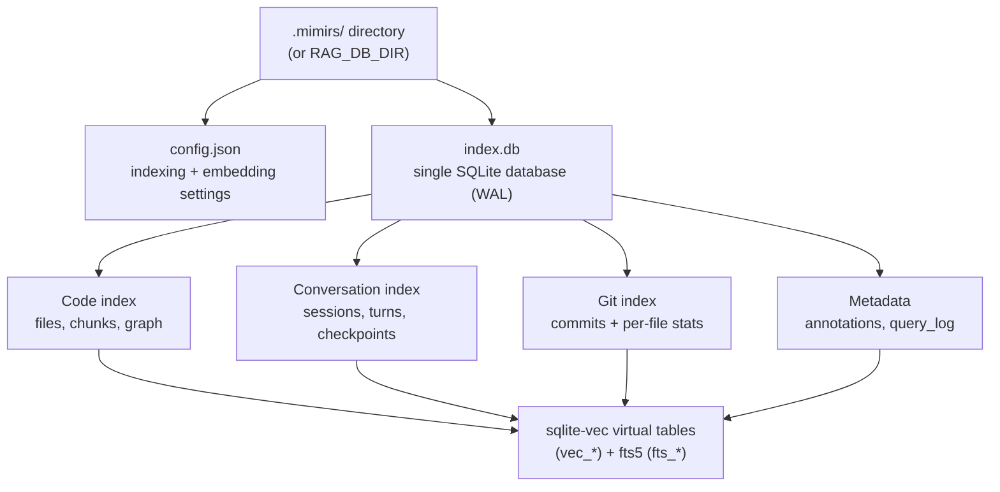

# Data Model

This page is the map of everything mimirs keeps on disk. It explains where the persistent state lives, how the SQLite schema is laid out, which tables back which features, and the few invariants that hold the whole index together. Read it when you are about to add a table, change a column, alter how embeddings are stored, or debug why an index will not open. The per-feature behavior (how a search runs, how a checkpoint is written) lives on the flow pages linked below; here we cover only the shape of the stored data and the contracts around it.

## Where state lives

Everything mimirs persists for a project sits in one directory: `.mimirs/` at the project root. It holds exactly two things that matter — a JSON config file and a single SQLite database.

The database is opened in the `RagDB` constructor (`src/db/index.ts:90-140`). By default it resolves to `<projectDir>/.mimirs/index.db`, but the location is overridable: if the `RAG_DB_DIR` environment variable is set, the whole `.mimirs` directory is placed there instead (`src/db/index.ts:101-106`). This matters for read-only checkouts and sandboxes — when the project tree cannot be written, you point `RAG_DB_DIR` at a writable path. The constructor creates the directory eagerly and translates a read-only or permission-denied failure (`EROFS`/`EACCES`) into an actionable error that names exactly which env var to set (`src/db/index.ts:108-123`).

Opening the database does three things before any query runs: it switches the journal to WAL mode and sets a 5-second busy timeout so concurrent mimirs processes (one per IDE window) do not immediately error on lock contention, it loads the `sqlite-vec` extension that provides the vector tables, and it runs the embedding-dimension guard and the schema bootstrap (`src/db/index.ts:134-139`). On macOS the constructor first repoints `bun:sqlite` at a Homebrew-built libsqlite3, because Apple's bundled SQLite cannot load extensions and `sqlite-vec` would fail (`src/db/index.ts:41-62`).

## config.json on disk

The config file is `.mimirs/config.json`. It is loaded by `loadConfig` (`src/config/index.ts:132-160`), which has a deliberately simple contract: what is on disk is what runs. There is no merge of partial user config over defaults. If the file is missing, the full default config is written to disk so a user can edit it directly, and those defaults are used (`src/config/index.ts:136-140`). If the file exists but is invalid JSON, or fails schema validation, mimirs logs a warning and falls back to the complete defaults rather than running with a half-applied config (`src/config/index.ts:142-159`).

The schema is a Zod object, `RagConfigSchema` (`src/config/index.ts:17-35`), and `RagConfig` is its inferred type. The fields that change stored data are:

| Field | Default | What it controls |
| --- | --- | --- |
| `include` / `exclude` / `generated` | large built-in globs | which files get indexed at all (`src/config/index.ts:40-113`) |
| `chunkSize` / `chunkOverlap` | 512 / 50 | how source is split into `chunks` rows |
| `embeddingModel` / `embeddingDim` | unset (→ MiniLM / 384) | which model produces vectors and how wide they are |
| `incrementalChunks`, `embeddingMerge`, `parentGroupingMinCount` | false / true / 2 | chunking + embedding strategy |
| `hybridWeight` / `searchTopK` | 0.7 / 10 | query-time blend and result count, not stored shape |

The two embedding fields are the ones with a hard link to the database. The glob `include`/`exclude`/`generated` lists are normalized to forward slashes at parse time so a Windows-style `node_modules\**` still works as a POSIX glob (`src/config/index.ts:12-15`).

## The embedding-dimension contract

Every vector column in the database is a fixed-width `FLOAT[N]` declared by the `sqlite-vec` extension. `N` is whatever the configured embedding model produces, defaulting to 384 for the bundled `Xenova/all-MiniLM-L6-v2` model (`src/embeddings/embed.ts:16-17`). A vector table built at one width cannot accept vectors of another width, so the configured model and the stored index must agree forever — or until the index is rebuilt.

Two pieces of code enforce this. First, the dimension is applied *before* the schema is created. The `RagDB` constructor calls `applyEmbeddingConfigFromDisk` (`src/config/index.ts:182-203`), a synchronous best-effort reader that pulls only `embeddingModel` and `embeddingDim` out of `config.json` and configures the embedder, so that when `initSchema` later writes `FLOAT[${getEmbeddingDim()}]` the tables are created at the right width by construction (`src/db/index.ts:125-139`). The constructor is synchronous and cannot await the async `loadConfig`, which is why a second, narrower reader exists; the async path still owns writing defaults and surfacing validation warnings.

Second, if the database already exists, the constructor runs `assertEmbeddingDimCompatible` (`src/db/index.ts:149-168`) before touching the schema. It reads the stored `CREATE TABLE` SQL for `vec_chunks` out of `sqlite_master`, parses the declared `FLOAT[N]`, and compares it to the currently configured dimension. On a mismatch it throws immediately with a message naming both widths and telling the maintainer to restore the previous embedding settings or delete the index — never to silently re-create tables. The stored index wins. This turns an otherwise cryptic vec0 insert failure that would surface deep inside an indexing run into a clear, early error.

## Core code tables: files → chunks → vectors

The heart of the index is a three-layer split created in `initSchema` (`src/db/index.ts:170-200`). The `files` table is one row per indexed file, keyed by a unique `path` with a content `hash` and an `indexed_at` timestamp; the hash is how the indexer decides whether a file changed. The `chunks` table is one row per semantic unit (a function, class, or markdown section) carved out of a file, holding the `snippet` text, the entity name and type, the `start_line`/`end_line` range, a `content_hash`, and a `parent_id` for nesting. A `chunks.file_id` foreign key cascades on delete, so removing a file drops its chunks.

The chunk text exists in three forms at once, and keeping them in sync is the central invariant of this part of the schema:

- The plain row in `chunks` is the source of truth.
- `vec_chunks` is a `sqlite-vec` virtual table (`vec0`) holding the embedding vector for each chunk, keyed by `chunk_id`.
- `fts_chunks` is an FTS5 virtual table providing keyword search, declared as an external-content table over `chunks` (`content='chunks'`).

FTS5 external-content tables do not auto-update, so three triggers — `chunks_ai`, `chunks_ad`, `chunks_au` — mirror every insert, delete, and update of a `chunks` row into `fts_chunks` (`src/db/index.ts:202-211`). The vector table needs special handling: a `vec0` virtual table cannot be a foreign-key child, so the cascade that cleans up `chunks` can never reach it. A fourth trigger, `chunks_vec_ad`, fires on every `chunks` delete and removes the matching `vec_chunks` row (`src/db/index.ts:218-220`). This is why the file-upsert path can simply `DELETE FROM chunks` and trust that both the FTS and vector mirrors clean themselves up from one place, rather than every caller remembering a manual vector delete (`src/db/files.ts:43-57`). At query time, vector search joins back from `vec_chunks` to `chunks` (`src/db/search.ts:67`, `src/db/search.ts:152`). This shape — base table, `vec_*` sibling, `fts_*` sibling, sync triggers — repeats for conversation chunks, checkpoints, git commits, and annotations.

## Graph tables: imports, exports, and symbol references

Three tables turn the flat file/chunk store into a dependency and call graph, all created in `initSchema` (`src/db/index.ts:222-260`). `file_imports` records each import statement of a file: the `source` string, the imported `names`, flags for default and namespace imports, and a `resolved_file_id` that points at the imported file once the resolver has matched it (or `NULL` for externals, set to null on delete). `file_exports` records each exported symbol with its `name`, `type`, and re-export bookkeeping. `symbol_refs` records each identifier occurrence inside a chunk — its `name`, `line`, the owning `chunk_id` and `file_id`, and a `resolved_export_id` that links the reference to the `file_exports` row it actually calls.

These power [`project_map`](tools/project-map.md), `depends_on`/`depended_on_by`, and `find_usages`. The contract is that references are written unresolved and resolved in a second pass: `upsertSymbolRefs` replaces all of a file's refs with `resolved_export_id` set to `NULL` (`src/db/graph.ts:11-26`), and `resolveSymbolRefs` later matches each ref name against the file's resolved imports and the target's exports to fill in the link (`src/db/graph.ts:38-90`). Refs that match nothing (locals, type references, unresolved externals) stay `NULL`, and usage lookups fall back to FTS for those. A row of indexes on `file_id`, `resolved_file_id`, `name`, and `resolved_export_id` keeps these joins fast (`src/db/index.ts:242-260`).

## Conversation tables: sessions, turns, chunks, checkpoints

A parallel index covers Claude Code session transcripts (`src/db/index.ts:262-338`). `conversation_sessions` is one row per `.jsonl` transcript file, tracking its path, start time, turn and token counts, and crucially a `read_offset` and `file_mtime` so re-indexing only reads the new tail of an append-only log (`src/db/conversation.ts:5-22`). `conversation_turns` is one row per user/assistant exchange, storing both texts plus JSON-encoded `tools_used` and `files_referenced` arrays, uniquely keyed by `(session_id, turn_index)` so re-indexing the same turn is ignored. `conversation_chunks` is the embeddable text of a turn, with its own `vec_conversation` and `fts_conversation` siblings and the same three sync triggers (`conv_chunks_ai/ad/au`, `src/db/index.ts:307-316`). Inserting a turn is one transaction that writes the turn, then each chunk, then each chunk's vector, and bails if the turn was a duplicate (`src/db/conversation.ts:56-115`). This backs [`search_conversation`](tools/search-conversation.md).

Checkpoints are durable agent notes stored in `conversation_checkpoints` (`src/db/index.ts:320-333`): `type`, `title`, `summary`, and JSON-encoded `files_involved` and `tags`. Their embeddings live in a separate `vec_checkpoints` table — the base table has no embedding column, deliberately matching the chunks/`vec_chunks` split (`src/db/checkpoints.ts:18-45`). Writing a checkpoint is a transaction that inserts the row, grabs `last_insert_rowid()`, then inserts the vector keyed by that id; search joins `vec_checkpoints` back to the base table and converts vec distance to a `1/(1+distance)` score (`src/db/checkpoints.ts:91-144`). This backs [`create_checkpoint`](tools/create-checkpoint.md). Note checkpoints have no FTS sibling — they are vector-search and list-only.

## Git history: commits and per-file stats

When commit history is indexed, two tables store it (`src/db/index.ts:350-386`). `git_commits` is one row per commit, uniquely keyed by full `hash`, holding the message, author name and email, ISO `date`, a JSON `files_changed` list, aggregate insertion/deletion counts, an `is_merge` flag, `refs`, and a `diff_summary`. `git_commit_files` is the per-file breakdown, with a composite primary key of `(commit_id, file_path)` and an index on `file_path` so [`file_history`](tools/file-history.md) can look up a path cheaply. Commit embeddings live in `vec_git_commits`, and `fts_git_commits` is an FTS5 table over both `message` and `diff_summary` (`src/db/index.ts:376-386`).

Inserts use `INSERT OR IGNORE` on `git_commits` keyed by hash so re-indexing is safe; only when a row was actually inserted does the batch write its vector and per-file rows (`src/db/git-history.ts:21-69`). This is what lets the indexer index only new commits since `getLastIndexedCommit` (`src/db/git-history.ts:71-78`). Because `vec_git_commits` and `fts_git_commits` are virtual tables outside the FK cascade, the purge and clear paths delete from all three tables explicitly inside one transaction and then `'rebuild'` the FTS index (`src/db/git-history.ts:308-340`). This backs [`mimirs history`](cli/history.md) and the [`search_commits`](tools/search-commits.md) tool.

## Metadata: annotations and the query log

Two small tables round out the schema. `annotations` (`src/db/index.ts:399-419`) stores maintainer notes pinned to a `path` and optional `symbol_name`, with `note` text, `author`, and created/updated timestamps. It has the full trio of siblings — `fts_annotations` for keyword search and `vec_annotations` for semantic search — but the sync is done manually inside `upsertAnnotation` rather than by triggers, because an upsert may update an existing note (deleting the old FTS and vector rows first) or insert a new one (`src/db/annotations.ts:4-50`). This backs [`annotate`](tools/annotate.md) and [`get_annotations`](tools/get-annotations.md).

`query_log` (`src/db/index.ts:340-348`) is a flat, append-only audit table: one row per search with the `query`, `result_count`, `top_score`, `top_path`, `duration_ms`, and `created_at`. It is the only table written purely as a side effect of reads — `db.logQuery` is called at the end of search (`src/search/hybrid.ts:388`, `src/search/hybrid.ts:546`). The aggregation functions read it over a time window: `getAnalytics` computes totals, averages, zero-result queries, low-score queries (`top_score < 0.3`), and per-day counts (`src/db/analytics.ts:10-67`), while `getAnalyticsTrend` compares the current window against the prior one (`src/db/analytics.ts:69-116`). This is what powers [`search_analytics`](tools/search-analytics.md), whose whole purpose is to surface documentation gaps from real query history.

## Schema bootstrap, migrations, and recovery

`initSchema` is the single owner of the schema. Every `CREATE TABLE`, `CREATE VIRTUAL TABLE`, `CREATE INDEX`, and `CREATE TRIGGER` uses `IF NOT EXISTS`, so the constructor runs it unconditionally on every open and it is idempotent for an up-to-date database. After the creates, it runs a series of additive migrations that bring older databases forward by checking `PRAGMA table_info` and `ALTER TABLE ADD COLUMN` for any missing column — the entity columns on `chunks`, the `parent_id` column, and the import/export graph flag columns (`src/db/index.ts:527-591`). The `parent_id` index is created in the migration rather than the main schema block, because that is the earliest point the column is guaranteed to exist on an old database.

Two of the post-create steps are recovery passes, not plain migrations. `dedupeChunks` collapses duplicate chunk rows that two concurrent mimirs processes could have written for the same file, then clears the affected files' `hash` so the next indexing pass re-emits them cleanly (`src/db/index.ts:474-525`). `backfillMissingSymbolRefs` finds files that have resolved imports but zero `symbol_refs` — databases built before the symbol-reference feature shipped — and clears their hash for the same reason (`src/db/index.ts:440-459`). Both lean on the same invariant: clearing `files.hash` is the safe, universal "re-index me" signal, because the indexer re-emits a file whenever its stored hash does not match the file on disk.

The seam for schema changes is therefore narrow and clear. A new table or column goes into `initSchema`; if it must land on existing databases, add a `PRAGMA table_info` guard in the matching `migrate*` method. A new feature table that follows the embeddable pattern needs four pieces in lockstep — the base table, a `vec_*` sibling at `FLOAT[${getEmbeddingDim()}]`, an `fts_*` external-content sibling, and either sync triggers or manual mirror maintenance — or the vector and keyword views will silently drift out of sync with the base rows.

## How indexing and reading touch the store

The write side is driven by indexing: [`index_files`](tools/index-files.md) and [`mimirs init`](cli/init.md) populate `files`, `chunks`, the vector/FTS mirrors, and the graph tables. The read side is the long-running server started by [`mimirs serve`](cli/serve.md), which opens one `RagDB` and routes every tool call through the wrapper methods on the `RagDB` class. That class is the only public surface over the database: each store module (`files`, `search`, `graph`, `conversation`, `checkpoints`, `annotations`, `analytics`, `git-history`) exports plain functions that take a `Database`, and `RagDB` holds the connection and delegates to them (`src/db/index.ts:593-897`). Adding a query means adding a function in the relevant store module and a one-line delegating method on `RagDB`; nothing else opens the database directly.

## Key source files

- `src/db/index.ts` — the `RagDB` class, the full `initSchema` schema, the embedding-dim guard, and all migrations/recovery passes.
- `src/config/index.ts` — `config.json` loading, the `RagConfig` schema and defaults, and the synchronous embedding-config reader the DB constructor depends on.
- `src/db/files.ts` — file/chunk upsert and pruning, the source of the `chunks`-delete-cascades-to-mirrors behavior.
- `src/db/graph.ts` — symbol-reference write and two-pass resolution against imports and exports.
- `src/db/conversation.ts` — session/turn/chunk inserts for the conversation index.
- `src/db/checkpoints.ts` — checkpoint write and vector search over `vec_checkpoints`.
- `src/db/git-history.ts` — commit batch insert, incremental hashing, and the purge/clear paths across the three git tables.
- `src/db/analytics.ts` — `query_log` writer and the windowed aggregation/trend queries.
- `src/embeddings/embed.ts` — the default model and dimension and the `getEmbeddingDim` source of truth for vector-column widths.
