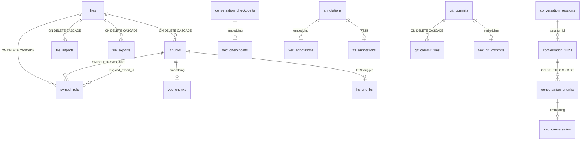

# Data model

This page covers what mimirs stores on disk, where each table lives, and the contracts between tables. It's for someone who needs to understand the persistent state before adding a new query, a new chunk type, or a migration.

Everything is one SQLite file per project: `.mimirs/index.db`, opened by `RagDB` (`src/db/index.ts:89-123`). The schema is created inline by `RagDB.initSchema` (`src/db/index.ts:125-374`); migrations for columns added after the first release run at the end of the same method (`src/db/index.ts:369-373`). There is no separate migration directory — schema evolution is `CREATE TABLE IF NOT EXISTS` plus `ALTER TABLE ADD COLUMN` guarded by `PRAGMA table_info`.

## Core code tables

`files` (`src/db/index.ts:127-132`) is the spine. One row per indexed path with a content hash and indexed-at timestamp. `chunks` (`src/db/index.ts:134-144`) holds per-chunk snippets with optional entity name, chunk type, line range, and a `content_hash` used for dedup. Chunks belong to a file with `ON DELETE CASCADE`, so removing a file evicts everything below.

The graph side is in three more tables. `file_imports` (`src/db/index.ts:168-176`) records each import statement and its resolved target file id once `src/graph/resolver.ts` walks them. `file_exports` (`src/db/index.ts:178-186`) lists exported names with type and re-export source. `symbol_refs` (`src/db/index.ts:194-201`) records each call-site identifier with its line, its containing chunk, and the export it resolved to. The `find_usages` and `depended_on_by` tools read these tables.

The vector and full-text twins of `chunks` are virtual tables: `vec_chunks` (`src/db/index.ts:146-149`) and `fts_chunks` (`src/db/index.ts:151-155`). Triggers (`src/db/index.ts:157-166`) keep the FTS index in sync on insert, update, and delete. The embedding dimension is baked into the `vec0` table definition by interpolating `getEmbeddingDim()`, so changing the embedding model is not a hot-swap — the table has to be re-created at a different dim.

See [index_files](tools/index-files.md) for how chunks and graph rows get written, and [search](tools/search.md) for how the vector + FTS pair is queried.

## Auxiliary tables

Annotations (`src/db/index.ts:346-367`) keep a free-form note per `(path, symbol_name)` plus an embedding so `read_relevant` can pull relevant notes inline. The writer is `upsertAnnotation` in `src/db/annotations.ts:4-60`, which deletes any old FTS/vec rows for the same id and re-inserts under the new note text.

Checkpoints live in `conversation_checkpoints` (`src/db/index.ts:266-285`) with a sibling `vec_checkpoints` for semantic search. Each row is tagged with the session id and turn index from the active Claude Code conversation. See [create_checkpoint](tools/create-checkpoint.md) for the producer.

Conversation indexing has its own subtree: `conversation_sessions` (`src/db/index.ts:208-219`) tracks the JSONL file path, an `mtime`, and a `read_offset` so the tailer can resume after restart. Each user/assistant turn becomes a `conversation_turns` row (`src/db/index.ts:221-233`), and each chunk of turn text becomes a `conversation_chunks` row (`src/db/index.ts:235-240`) with its own `vec_conversation` and `fts_conversation` virtual-table twins.

Git history mirrors the same pattern. `git_commits` (`src/db/index.ts:297-312`) holds one row per commit; `git_commit_files` (`src/db/index.ts:314-321`) is a many-to-many of touched paths used for `file_history` queries; `vec_git_commits` and `fts_git_commits` (`src/db/index.ts:323-333`) are the semantic and keyword indices. See [mimirs history](cli/history.md) for the producer flow.

Analytics is the simplest table. `query_log` (`src/db/index.ts:287-295`) gets one row per search call written by `logQuery` in `src/db/analytics.ts:3-8`. There is no embedding here — the analytics tool reads counts, top scores, and timestamps.

## Cascade behavior on file removal

`removeFile` (and `pruneDeleted` for full project sweeps) deletes a row from `files`. SQLite then cascades through `ON DELETE CASCADE` to `chunks`, `file_imports`, `file_exports`, and `symbol_refs`. The vec/FTS rows for affected chunks are cleaned up by the trigger on `chunks` deletion (`src/db/index.ts:160-162`), which posts a `delete` command into `fts_chunks`. Vector rows in `vec_chunks` are dropped because `chunks_ad` runs an explicit cleanup pattern; the same shape applies to conversation chunks. Annotations and checkpoints are not file-scoped — they survive a file's removal by design, so users can keep a note about a file that was deleted or moved.

## Where embeddings are written and read

Every embedding is produced through `src/embeddings/embed.ts`. The producers are: the chunk-indexer (writes to `vec_chunks`), the annotation upsert (writes to `vec_annotations`), the checkpoint creator (writes to `vec_checkpoints`), the conversation indexer (writes to `vec_conversation`), and the git indexer (writes to `vec_git_commits`). The readers are the corresponding `searchX` methods on `RagDB` (`src/db/index.ts:599-616` for code, `src/db/index.ts:739-744` for conversation). The hybrid blender that combines vector and FTS scores lives in `src/search/hybrid.ts` for code; conversation, checkpoint, and git history have their own thinner blenders that call both backends and merge.

## Key source files

- `src/db/index.ts` — `RagDB` class, full schema, migrations, dedup self-repair, and the surface methods every service calls.
- `src/db/types.ts` — row types (`StoredChunk`, `StoredFile`, `AnnotationRow`, `CheckpointRow`, `GitCommitRow`, `PathFilter`) returned by store methods.
- `src/db/annotations.ts` — annotation upsert/get/search/delete with paired FTS and vec maintenance.
- `src/db/analytics.ts` — `query_log` writer and the analytics aggregations consumed by the analytics tool and CLI.
