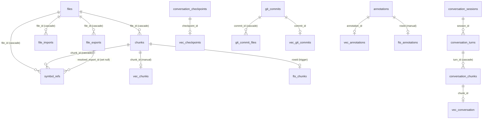

# Data model

This page is the schema reference for anyone changing how mimirs stores state. Everything mimirs persists lives in one SQLite database per project at `.mimirs/index.db`, opened and migrated by the `RagDB` class. This page covers every table, how the vector and full-text indices stay in sync with their base tables, what cascades when a file is removed (and what does not), and where embeddings are written versus read. Per-feature write paths live on the linked flow pages; this page is the map of the storage itself.

## One database, one schema bootstrap

`RagDB` opens `.mimirs/index.db`, sets WAL journaling and a 5-second busy timeout, loads the `sqlite-vec` extension, and runs `initSchema()` (`src/db/index.ts:118-123`). `initSchema` creates every table with `CREATE TABLE IF NOT EXISTS`, so opening an existing database is idempotent, then runs a series of in-place migrations and clean-ups (`src/db/index.ts:125-373`). The schema text in that one method is the source of truth — there is no separate migration directory. To add a table or column, edit `initSchema` and, if existing databases need backfilling, add a migration helper alongside `migrateChunksEntityColumns` and friends (`src/db/index.ts:369-373`).

The active embedding dimension is baked into every vector table at creation time via `getEmbeddingDim()` interpolated into the `vec0` column type, e.g. `embedding FLOAT[${getEmbeddingDim()}]` (`src/db/index.ts:146-149`). This is the data-model side of the embedding contract: a database built with one model's dimension cannot be queried with a different-dimension model, because the `vec0` columns are fixed-width.

## Core code-index tables

The code index is rooted at **`files`**: id, unique `path`, content `hash`, and `indexed_at` (`src/db/index.ts:127-132`). The hash is how re-indexing decides whether a file changed; clearing it forces a re-emit, which the `symbol_refs` backfill exploits (`src/db/index.ts:387-404`).

Each file's content is split into **`chunks`** — one row per function, class, or section — carrying `chunk_index`, the `snippet` text, optional `entity_name`/`chunk_type`, `start_line`/`end_line` for navigation, and a `content_hash`. Chunks reference `files(id)` with `ON DELETE CASCADE` (`src/db/index.ts:134-144`). The TypeScript view of a chunk is `StoredChunk`, which also exposes `parentId` for the parent/child grouping used in search (`src/db/types.ts:1-11`); `parent_id` is added by a migration rather than the base `CREATE TABLE` (`src/db/index.ts:370`).

The dependency graph is three tables. **`file_imports`** records each import statement: `source`, the imported `names`, a `resolved_file_id` pointing at the imported file (or `NULL` if unresolved), and default/namespace flags (`src/db/index.ts:168-176`). **`file_exports`** records each exported symbol with its `name`, `type`, and re-export metadata (`src/db/index.ts:178-186`). **`symbol_refs`** records each in-code reference: the `chunk_id` and `file_id` where it occurs, the symbol `name`, the `line`, and a `resolved_export_id` linking the reference to the export it resolves to (`src/db/index.ts:194-201`). Together these answer "who imports this file", "who calls this symbol", and "where is this defined" — the data behind [search](tools/search.md)'s graph boost and the find-usages tooling.

The two indices that make code search fast are derived from `chunks`, not stored independently. **`vec_chunks`** is a `sqlite-vec` virtual table keyed by `chunk_id` holding the embedding vector (`src/db/index.ts:146-149`). **`fts_chunks`** is an FTS5 contentless table mirroring the `snippet` column, kept in sync by three triggers — `chunks_ai`, `chunks_ad`, `chunks_au` — that insert, tombstone, and re-insert FTS rows on every chunk insert/delete/update (`src/db/index.ts:151-166`). The hybrid search service queries `vec_chunks` for vector neighbors and `fts_chunks` for keyword hits, then merges them; both ultimately resolve back to `chunks` rows.

## Auxiliary tables

Beyond the code index, the same database holds five more record types, each with its own search indices.

**Conversation history** spans three tables. `conversation_sessions` tracks each indexed session by `session_id`, its JSONL path, counts, and a `read_offset` for incremental tailing (`src/db/index.ts:208-219`). `conversation_turns` holds one row per user/assistant exchange, unique on `(session_id, turn_index)`, with the text, tools used, files referenced, and a summary (`src/db/index.ts:221-233`). `conversation_chunks` splits turn text for retrieval and cascades from `conversation_turns` (`src/db/index.ts:235-240`); it has its own `vec_conversation` and `fts_conversation` indices with the same trigger pattern as code chunks (`src/db/index.ts:242-262`).

**Checkpoints** live in `conversation_checkpoints`: a `type` (decision, milestone, blocker, etc.), `title`, `summary`, JSON `files_involved` and `tags`, plus an inline `embedding BLOB`, tagged to the session and turn that created them (`src/db/index.ts:266-277`). Their vectors are also mirrored into a `vec_checkpoints` virtual table for similarity search (`src/db/index.ts:282-285`). The TypeScript shape is `CheckpointRow` (`src/db/types.ts:71-81`). See [create_checkpoint](tools/create-checkpoint.md) for the write path.

**Git history** is `git_commits` (unique `hash`, message, author, date, JSON `files_changed`, line counts, merge flag, `diff_summary`) plus a `git_commit_files` join table keyed by `(commit_id, file_path)` that cascades on commit delete and is indexed by path for per-file history (`src/db/index.ts:297-321`). Commits get both a `vec_git_commits` vector index and an `fts_git_commits` table over `message` and `diff_summary`, again trigger-synced (`src/db/index.ts:323-342`). `GitCommitRow` is the row shape (`src/db/types.ts:83-97`). Per-file commit history is read back through [file_history](tools/file-history.md).

**Annotations** live in the `annotations` table (path, optional `symbol_name`, `note`, `author`, timestamps) with an `idx_ann_path` index, an `fts_annotations` FTS table, and a `vec_annotations` vector table (`src/db/index.ts:346-366`). The TypeScript view is `AnnotationRow` (`src/db/types.ts:47-55`).

**Search analytics** live in `query_log`: the `query` text, `result_count`, `top_score`, `top_path`, `duration_ms`, and `created_at` (`src/db/index.ts:287-295`). Every hybrid search call appends one row through `logQuery`, which the analytics reporting reads back via `getAnalytics`/`getAnalyticsTrend` (`src/db/analytics.ts:3-69`).

## Cascade behavior on file removal

Removing a file is not a single `DELETE`, because the vector tables do not participate in SQLite foreign-key cascades. `vec_chunks` is a `sqlite-vec` virtual table; deleting a `chunks` row would orphan its vector. So `removeFile` runs a transaction that first deletes each chunk's `vec_chunks` row by id, then deletes the `chunks` rows, then the `files` row (`src/db/files.ts:254-267`). The same manual-vector-then-base pattern is used on re-index, where `upsertFileStart` deletes old `vec_chunks` and `chunks` before re-inserting, deliberately preserving `files.id` so that `file_imports.resolved_file_id` foreign keys keep pointing at the file (`src/db/files.ts:40-60`). When deleting the file row, the `ON DELETE CASCADE` on `chunks`, `file_imports`, `file_exports`, and `symbol_refs` cleans up the relational side automatically — the manual step exists only for the virtual vector table. The invariant to preserve when changing removal logic: every `vec_*` row must be deleted explicitly before its base row, and a file's id must survive a re-index.

## Where embeddings are written and read

Embeddings are written into the `vec_*` virtual tables, never the base tables (the one exception being the inline `embedding BLOB` column on `conversation_checkpoints`, which is written in addition to `vec_checkpoints`). Chunk vectors are written by `insertChunkBatch` as raw bytes — `new Uint8Array(embedding.buffer)` — into `vec_chunks` right after the matching `chunks` insert (`src/db/files.ts:93-101`). Annotation vectors are written into `vec_annotations` the same way, deleting any prior vector first on update so an edited note never carries a stale embedding (`src/db/annotations.ts:42-60`). Checkpoint and git-commit vectors follow the identical write-once pattern into their own tables.

They are read back during similarity search: the hybrid search service embeds the query and asks `vec_chunks` for nearest neighbors; checkpoint, conversation, annotation, and commit searches each query their respective `vec_*` table. The contract is symmetric — the same embedding model and dimension that wrote a vector must be active when reading it, which is why the dimension is fixed into the `vec0` column at schema creation (`src/db/index.ts:146-149`) and the embedding config is applied before any tool runs. See [index_files](tools/index-files.md) for how chunk embeddings get written during indexing and [annotate](tools/annotate.md) for the annotation write path.

## Key source files

- `src/db/index.ts` — `RagDB` and `initSchema`: the complete schema, all `vec0`/FTS5 virtual tables, the sync triggers, and the migrations. The single place to edit the data model.
- `src/db/types.ts` — the TypeScript row shapes (`StoredChunk`, `AnnotationRow`, `CheckpointRow`, `GitCommitRow`, etc.) that mirror the table columns.
- `src/db/files.ts` — `upsertFileStart`/`insertChunkBatch`/`removeFile`: where chunk embeddings are written and where the manual vector-then-base delete cascade is enforced.
- `src/db/annotations.ts` — `upsertAnnotation`: the annotation write path showing FTS and vector tables kept in sync on insert and update.
- `src/db/analytics.ts` — `logQuery`/`getAnalytics`: the writer and readers for the `query_log` analytics table.
