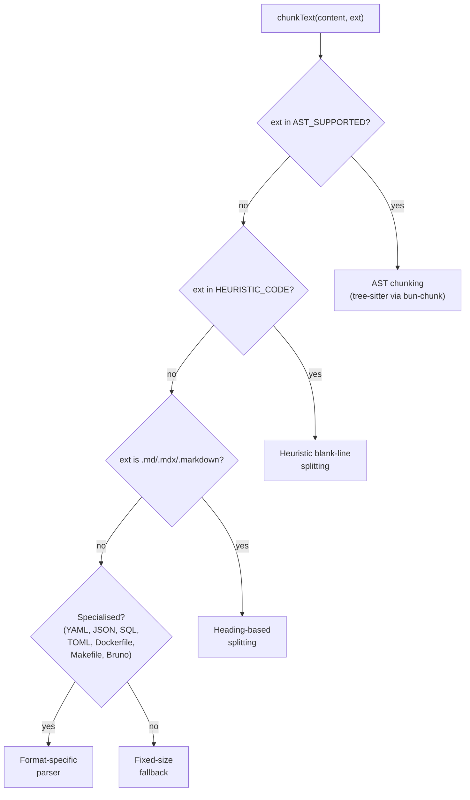
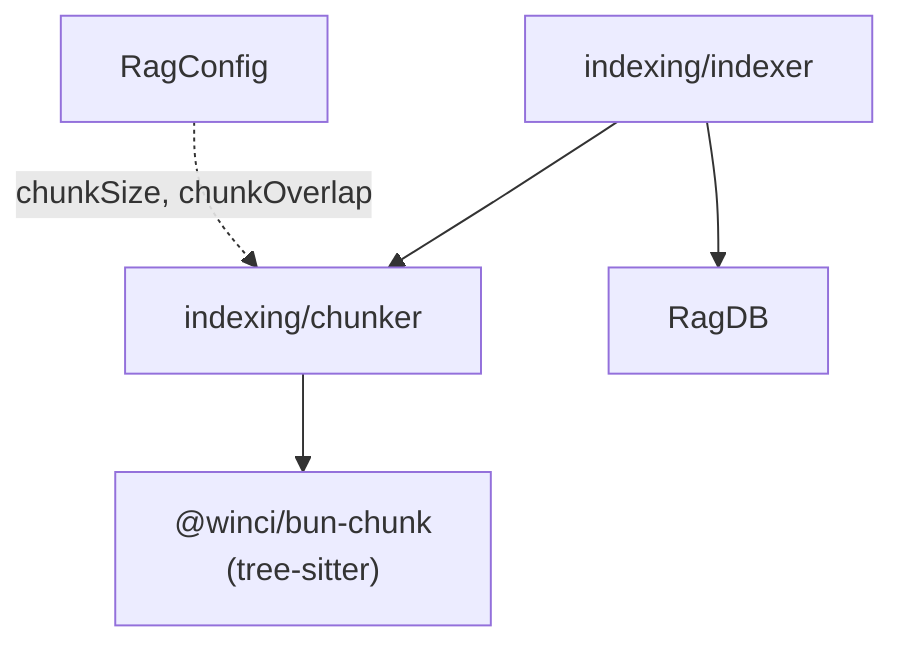

# Chunk

A Chunk is the atomic unit of indexed content in local-rag. Each chunk
represents a semantically meaningful fragment of a file — a function, a class,
a markdown section, or a fixed-size text block — and carries optional metadata
about its origin.

**Source:** `src/indexing/chunker.ts`

## Signatures

### Chunk interface

```ts
export interface Chunk {
  text: string;
  index: number;
  startLine?: number;
  endLine?: number;
  imports?: ChunkImport[];
  exports?: ChunkExport[];
  parentName?: string;
  /** Symbol name from AST (e.g. "emit", "constructor") */
  name?: string;
  /** AST chunk type (e.g. "method", "field", "class") */
  chunkType?: string;
  hash?: string;
}
```

### ChunkTextResult interface

```ts
export interface ChunkTextResult {
  chunks: Chunk[];
  fileImports?: ChunkImport[];
  fileExports?: ChunkExport[];
}
```

### chunkText function

```ts
export async function chunkText(
  content: string,
  extension: string,
  chunkSize?: number,       // default 512 (characters)
  chunkOverlap?: number,    // default 50 (characters)
  filePath?: string,
): Promise<ChunkTextResult>;
```

## Constants

| Name | Value | Notes |
|---|---|---|
| `DEFAULT_CHUNK_SIZE` | 512 | Characters, **not** tokens |
| `DEFAULT_CHUNK_OVERLAP` | 50 | Characters of overlap between adjacent fixed-size chunks |
| `KNOWN_EXTENSIONS` | Set of ~60 entries | Files with unrecognised extensions are skipped by the indexer |

## Chunking strategies

`chunkText` selects a strategy based on the file extension:



### AST-aware (24 languages via tree-sitter)

Supported extensions: `.ts`, `.tsx`, `.js`, `.jsx`, `.py`, `.go`, `.rs`,
`.java`, `.c`, `.h`, `.cpp`, `.cc`, `.cxx`, `.hpp`, `.hh`, `.hxx`, `.cs`,
`.rb`, `.php`, `.scala`, `.sc`, `.kt`, `.kts`, `.lua`, `.zig`, `.zon`,
`.ex`, `.exs`, `.sh`, `.bash`, `.zsh`, `.toml`, `.yaml`, `.yml`, `.hs`,
`.lhs`, `.ml`, `.mli`, `.dart`, `.html`, `.htm`, `.css`, `.scss`, `.less`

Produces chunks with `imports`, `exports`, `name`, `chunkType`, and
`parentName` metadata. Line numbers are converted from 0-indexed (bun-chunk)
to 1-indexed (local-rag convention).

### Heuristic blank-line splitting

For languages without tree-sitter support: `.swift`, `.fish`, `.tf`, `.proto`,
`.graphql`, `.gql`, `.mod`, `.xml`, `.jenkinsfile`, `.vagrantfile`,
`.gemfile`, `.rakefile`, `.brewfile`, `.procfile`

### Heading-based (Markdown)

Splits on `#`-prefixed headings, then by size if a section exceeds
`chunkSize`.

### Specialised parsers

Format-specific logic for YAML, JSON, SQL, TOML, Dockerfile, Makefile, and
Bruno `.bru` files.

### Fixed-size fallback

Plain character-window splitting with `chunkOverlap` overlap. Used for `.txt`
and any recognised extension that doesn't match the above strategies.

## Relationships



## Usage

```ts
import { chunkText, type Chunk } from "../indexing/chunker";

const result = await chunkText(sourceCode, ".ts", 512, 50, "src/db/index.ts");
for (const chunk of result.chunks) {
  console.log(chunk.name, chunk.startLine, chunk.endLine);
}
```

## See also

- [RagDB](rag-db.md) — stores embedded chunks in the `chunks` + `vec_chunks` tables
- [Hybrid Search](hybrid-search.md) — retrieves and ranks chunks at query time
- [RagConfig](rag-config.md) — `chunkSize` and `chunkOverlap` defaults
