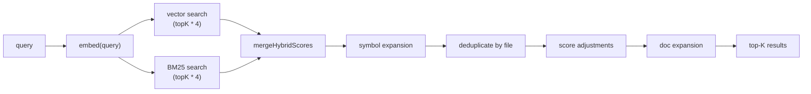
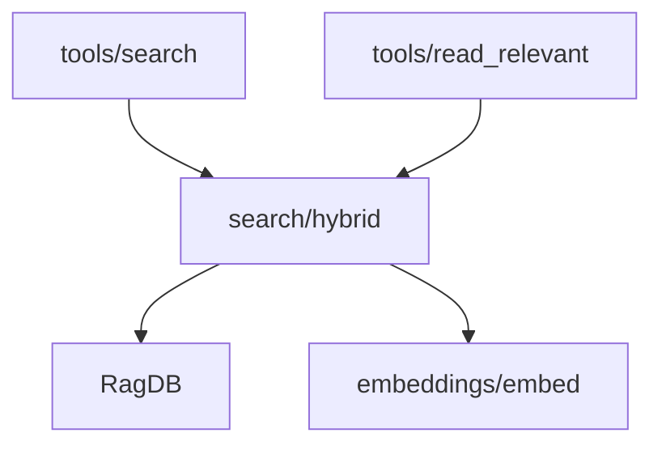

# Hybrid Search

Combines vector (semantic) and BM25 (keyword) search into a single ranked
result list with score adjustments for path context, dependency importance,
and generated-file demotion.

**Source:** `src/search/hybrid.ts`

## Signatures

### File-level search

```ts
export async function search(
  query: string,
  db: RagDB,
  topK?: number,          // default 5
  threshold?: number,     // default 0
  hybridWeight?: number,  // default 0.7
  generatedPatterns?: string[],
): Promise<DedupedResult[]>;
```

### Chunk-level search

```ts
export async function searchChunks(
  query: string,
  db: RagDB,
  topK?: number,          // default 8
  threshold?: number,     // default 0.3
  hybridWeight?: number,  // default 0.7
  generatedPatterns?: string[],
): Promise<ChunkResult[]>;
```

### Score merging

```ts
export function mergeHybridScores<T extends { score: number; path: string; chunkIndex: number }>(
  vectorResults: T[],
  textResults: T[],
  hybridWeight: number,
): T[];
```

## Result types

```ts
export interface DedupedResult {
  path: string;
  score: number;
  snippets: string[];
}

export interface ChunkResult {
  path: string;
  score: number;
  content: string;
  chunkIndex: number;
  entityName: string | null;
  chunkType: string | null;
  startLine: number | null;
  endLine: number | null;
  parentId: number | null;
}
```

## Pipeline



For `searchChunks` the pipeline is similar but skips file-level deduplication
and adds parent grouping (replacing sibling sub-chunks with their parent when
2+ siblings appear).

## Score adjustments

All adjustments are applied after hybrid merging:

| Adjustment | Effect | Condition |
|---|---|---|
| Source boost | x 1.10 | Path matches `src/`, `lib/`, `app/`, `pkg/`, etc. |
| Test demotion | x 0.85 | Path matches test/spec patterns |
| Filename affinity | + 10%/word | Query words found in the filename stem |
| Path segment affinity | + 5%/word | Query words found in directory segments |
| Boilerplate demotion | x 0.80 | Basename in known boilerplate set (`types.go`, `doc.go`, etc.) |
| Generated demotion | x 0.75 | Path matches configured `generated` patterns |
| Dep graph boost | + 0.05 * log2(importers + 1) | File has reverse dependencies in the graph |

## Behaviour details

- **Hybrid weight** defaults to 0.7 (70% vector, 30% BM25). Configurable via
  `hybridWeight` in `.mimirs/config.json`.
- **Symbol expansion** extracts identifiers from the query (camelCase,
  snake_case, dot-qualified) and runs `db.searchSymbols` for exact matches.
  Hits get a 0.75 base score or a 1.3x boost if the file already appeared.
- **Doc expansion** ensures markdown files in the top-K don't displace code
  results — the window is widened by the number of doc results.
- **Parent grouping** (`searchChunks` only) collapses sibling sub-chunks into
  their parent chunk when >= `parentGroupingMinCount` (default 2) siblings
  appear, preventing method-level fragments from consuming multiple slots.

## Relationships



## Usage

```ts
import { search, searchChunks } from "../search/hybrid";

// File-level: which files are relevant?
const files = await search("authentication middleware", db);

// Chunk-level: get actual code snippets with line ranges
const chunks = await searchChunks("authentication middleware", db);
```

## See also

- [RagDB](rag-db.md) — provides vector and BM25 primitives consumed by the hybrid layer
- [Chunk](chunk.md) — the unit of content that search operates on
- [RagConfig](rag-config.md) — `hybridWeight`, `searchTopK`, and `generated` patterns
