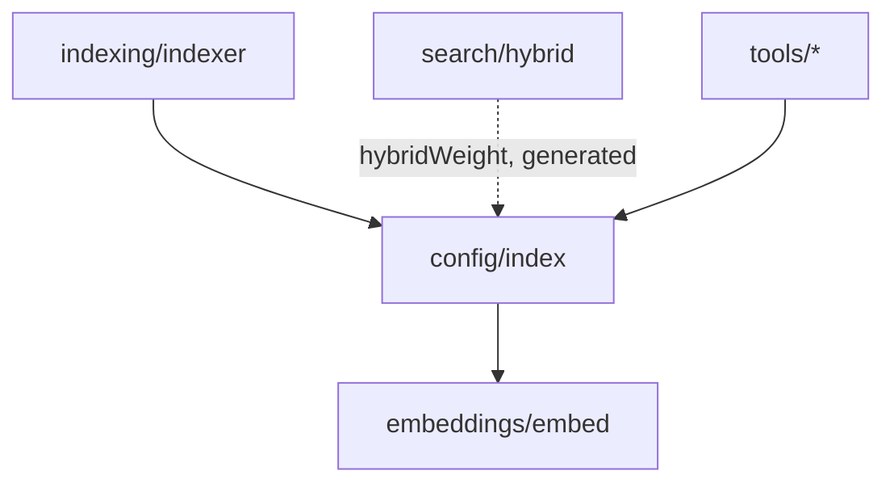

# RagConfig

Typed configuration object for a mimirs project. Loaded from
`.mimirs/config.json` with Zod validation; missing files get populated with
sensible defaults.

**Source:** `src/config/index.ts`

## Signatures

### Type

```ts
const RagConfigSchema = z.object({ ... });
export type RagConfig = z.infer<typeof RagConfigSchema>;
```

### Functions

```ts
export async function loadConfig(projectDir: string): Promise<RagConfig>;
export function applyEmbeddingConfig(config: RagConfig): void;
```

## Fields

| Field | Type | Default | Description |
|---|---|---|---|
| `include` | `string[]` | 50+ glob patterns | File patterns to index (source, markdown, config, infra) |
| `exclude` | `string[]` | 20+ glob patterns | Patterns to skip (node_modules, .git, build output, etc.) |
| `generated` | `string[]` | `[]` | Glob patterns for generated files (demoted -50% in search) |
| `chunkSize` | `number` | 512 | Max chunk size in **characters** (not tokens). Min 64. |
| `chunkOverlap` | `number` | 50 | Overlap between adjacent fixed-size chunks in characters. Min 0. |
| `hybridWeight` | `number` | 0.7 | Vector vs BM25 balance. 1.0 = pure vector, 0.0 = pure BM25. |
| `searchTopK` | `number` | 10 | Default number of results returned by search. Min 1. |
| `embeddingModel` | `string?` | `"Xenova/all-MiniLM-L6-v2"` | ONNX model ID for embeddings |
| `embeddingDim` | `number?` | 384 | Embedding vector dimensionality |
| `embeddingMerge` | `boolean` | `true` | Whether to merge oversized chunk embeddings via windowing |
| `incrementalChunks` | `boolean` | `false` | Re-index only changed chunks within a file |
| `indexBatchSize` | `number?` | 50 | Chunks per embedding batch. Min 1. |
| `indexThreads` | `number?` | auto | ONNX worker threads for parallel embedding |
| `parentGroupingMinCount` | `number` | 2 | Min sibling chunks before parent grouping triggers in search. Min 2. |
| `benchmarkTopK` | `number` | 5 | Top-K for benchmark evaluation |
| `benchmarkMinRecall` | `number` | 0.8 | Minimum recall threshold for benchmarks |
| `benchmarkMinMrr` | `number` | 0.6 | Minimum MRR threshold for benchmarks |

## Behaviour

### loadConfig

1. Resolves `<projectDir>/.mimirs/config.json`.
2. If the file does not exist, writes `DEFAULT_CONFIG` as JSON and returns it.
3. If the file exists, parses JSON and validates with `RagConfigSchema`.
4. On invalid JSON or validation failure, logs a warning and returns
   `DEFAULT_CONFIG`.

There is no hidden merge logic -- whatever is on disk is what runs.

### applyEmbeddingConfig

Reads `embeddingModel` and `embeddingDim` from config (falling back to
`DEFAULT_MODEL_ID` / `DEFAULT_EMBEDDING_DIM`) and calls `configureEmbedder`
to set the active model. Must be called after `loadConfig()` when embeddings
will be used.

## Relationships



## Default include patterns (excerpt)

Source code (AST-aware): `**/*.ts`, `**/*.tsx`, `**/*.js`, `**/*.jsx`,
`**/*.py`, `**/*.go`, `**/*.rs`, `**/*.java`, `**/*.c`, `**/*.h`,
`**/*.cpp`, `**/*.cs`, `**/*.rb`, `**/*.php`, `**/*.scala`, `**/*.kt`,
`**/*.lua`, `**/*.zig`, `**/*.ex`, `**/*.hs`, `**/*.ml`, `**/*.dart`

Markdown / text: `**/*.md`, `**/*.mdx`, `**/*.markdown`, `**/*.txt`

Build / config: `**/Makefile`, `**/Dockerfile`, `**/*.yaml`, `**/*.toml`,
`**/*.tf`, `**/*.proto`, `**/*.graphql`, `**/*.sql`, `**/*.bru`

## Default exclude patterns (excerpt)

`node_modules/**`, `.git/**`, `dist/**`, `build/**`, `out/**`, `.next/**`,
`coverage/**`, `.env`, `.env.*`, `.idea/**`, `.vscode/**`,
`__pycache__/**`, `.venv/**`, `target/**`, `vendor/**`, `.mimirs/**`

## Usage

```ts
import { loadConfig, applyEmbeddingConfig } from "../config";

const config = await loadConfig("/path/to/project");
applyEmbeddingConfig(config);

console.log(config.chunkSize);    // 512
console.log(config.hybridWeight); // 0.7
```

## See also

- [RagDB](rag-db.md) -- database initialized using embedding dimensions from config
- [Hybrid Search](hybrid-search.md) -- uses `hybridWeight`, `searchTopK`, and `generated`
- [Chunk](chunk.md) -- uses `chunkSize` and `chunkOverlap`
- [Config module](../modules/config/) -- module context
- [API Surface](../api-surface.md) -- configuration options table
