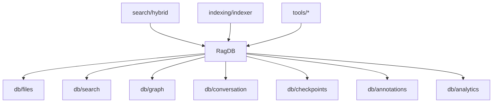

# RagDB

Central database facade for mimirs. Wraps a SQLite database (with
sqlite-vec and FTS5) and delegates every operation to specialised sub-modules.

**Source:** `src/db/index.ts`

## Signature

```ts
export class RagDB {
  private db: Database;

  constructor(projectDir: string, customRagDir?: string);
}
```

`projectDir` is used only during construction to locate (or create)
`.mimirs/index.db`. It is **not** stored as a field. An optional `customRagDir`
overrides the default path; the `RAG_DB_DIR` environment variable is also
respected as a fallback.

## Constructor behaviour

1. Calls `loadCustomSQLite()` -- on macOS, points `bun:sqlite` at Homebrew's
   vanilla SQLite build so extension loading works.
2. Resolves the `.mimirs` directory (`customRagDir` > `RAG_DB_DIR` env >
   `projectDir/.mimirs`), creating it if needed. Throws with a clear message
   if the directory is read-only (`EROFS`, `EACCES`).
3. Opens `index.db` in WAL mode with a 5 s busy timeout.
4. Loads the `sqlite-vec` extension.
5. Runs `initSchema()` -- creates all tables, virtual tables (vec0 / fts5),
   triggers, and indexes.
6. Runs migrations (`migrateChunksEntityColumns`,
   `migrateParentChunkColumns`, `migrateGraphColumns`).

## Delegated operations

RagDB exposes thin pass-through methods that forward to sub-module functions,
always injecting the private `this.db` handle as the first argument.

| Domain | Sub-module | Key methods |
|---|---|---|
| Files | `./files` | `upsertFile`, `upsertFileStart`, `removeFile`, `getFileByPath`, `getAllFilePaths`, `insertChunkBatch`, `insertChunkReturningId`, `getChunkById`, `pruneDeleted`, `getChunkHashes`, `deleteStaleChunks`, `updateChunkPositions`, `updateFileHash`, `getStatus` |
| Search | `./search` | `search` (vector), `textSearch` (BM25), `searchChunks`, `textSearchChunks`, `searchSymbols`, `findUsages` |
| Graph | `./graph` | `upsertFileGraph`, `resolveImport`, `getUnresolvedImports`, `getGraph`, `getSubgraph`, `getImportsForFile`, `getImportersOf`, `getDependsOn`, `getDependedOnBy` |
| Conversation | `./conversation` | `upsertSession`, `getSession`, `updateSessionStats`, `insertTurn`, `getTurnCount`, `searchConversation`, `textSearchConversation` |
| Checkpoints | `./checkpoints` | `createCheckpoint`, `listCheckpoints`, `searchCheckpoints`, `getCheckpoint` |
| Annotations | `./annotations` | `upsertAnnotation`, `getAnnotations`, `searchAnnotations`, `deleteAnnotation` |
| Analytics | `./analytics` | `logQuery`, `getAnalytics`, `getAnalyticsTrend` |

## Relationships



RagDB is the most-imported symbol in the codebase (~45+ importers). Virtually
every MCP tool handler, every search function, and the indexer depend on it.

## Schema highlights

| Table / Virtual table | Purpose |
|---|---|
| `files` | Indexed file paths + content hashes |
| `chunks` | Text snippets per file with optional entity metadata, line ranges, content hashes, and parent references |
| `vec_chunks` (vec0) | Embedding vectors for semantic search |
| `fts_chunks` (fts5) | Full-text index for BM25 keyword search |
| `file_imports` / `file_exports` | Dependency graph edges with default/namespace/re-export flags |
| `conversation_sessions` / `conversation_turns` / `conversation_chunks` | Chat history |
| `vec_conversation` / `fts_conversation` | Search indexes for conversation |
| `conversation_checkpoints` / `vec_checkpoints` | Milestone markers with vector search |
| `annotations` / `fts_annotations` / `vec_annotations` | Persistent notes on files/symbols |
| `query_log` | Search analytics |

## Usage

```ts
import { RagDB } from "../db";

const db = new RagDB("/path/to/project");
const file = db.getFileByPath("src/main.ts");
const status = db.getStatus(); // { totalFiles, totalChunks, lastIndexed }
db.close();
```

## See also

- [DB module](../modules/db/) -- module overview and sub-module breakdown
- [DB internals](../modules/db/internals.md) -- detailed function reference
- [Hybrid Search](hybrid-search.md) -- consumes RagDB for vector + BM25 queries
- [Chunk](chunk.md) -- data produced by the chunker and stored via RagDB
- [RagConfig](rag-config.md) -- configuration that controls search and indexing parameters
