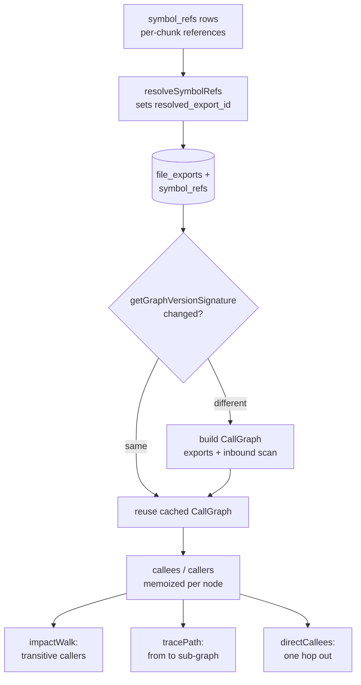

# Call graph construction and traversal

Several tools answer questions about how code reaches code: who calls a function (its blast radius), how one symbol reaches another, what a function calls one hop out, and which tests run for a change. All of them sit on top of one shared subsystem — a symbol-level call graph built from the index and walked in memory. This page documents that subsystem once so the flow pages can defer here. It is the engine behind [impact](../tools/impact.md), [trace](../tools/trace.md), and [callees](../tools/callees.md), and it shares its database layer with the file-level dependency tools [depends_on](../tools/depends-on.md), [dependents](../tools/dependents.md), [project_map](../tools/project-map.md), and the importer walk behind the [affected CLI](../cli/affected.md).

The subsystem has two halves. The **store** (`src/db/graph.ts`) holds the persisted graph data — imports, exports, and per-chunk symbol references — and exposes the forward edges (what a callable calls) and reverse edges (what calls it). The **walker** (`src/graph/trace.ts`) turns those edges into the two queries an agent actually asks: transitive callers as a pruned tree, and the connecting sub-graph between two symbols. Resolution is purely static name-matching, which is the source of every limit on this page.

## What the graph is made of

The graph is not stored as adjacency lists. It is derived on demand from three index tables. `file_imports` and `file_exports` give the file-level import graph. The call graph lives in `symbol_refs`: one row per identifier occurrence inside a chunk, written by `upsertSymbolRefs` from bun-chunk's per-chunk reference map (`src/db/graph.ts:12-27`). Each row records the chunk it sits in, the file, the referenced name, the line, and — once resolution runs — a `resolved_export_id` pointing at the `file_exports` row it targets cross-file (or null when it does not resolve).

That `resolved_export_id` is the single edge that makes a call graph possible. It is populated by `resolveSymbolRefs`, which runs per file against that file's resolved imports (`src/db/graph.ts:39-186`). For each ref name, it looks up the import row by local binding, follows it to the target file, finds a matching `file_exports` row there, and stores that export id on the ref. Three subtleties are handled explicitly and are worth knowing before you change resolution:

- **Same-file edges count.** A first UPDATE resolves any ref whose name matches an export in its own file, so a helper called by a sibling function in the same module is a real inbound edge, not an apparent library root (`src/db/graph.ts:87-105`).
- **Aliased imports resolve to the original.** `aliasToImported` maps a local binding back to the exported name, so `import { getDB as g }` lets a ref to `g` resolve to `getDB`. This UPDATE is name-scoped, not scope-scoped — if the alias name also names an unrelated local elsewhere in the file, that local's refs resolve too, which is why `usages` can over-report (`src/db/graph.ts:62-137`).
- **Namespace members resolve by line co-location.** For `import * as ns; ns.foo()`, bun-chunk emits two refs at the same line — `ns` and `foo`. A separate pass resolves `foo` by joining on `(file_id, line)` to the namespace import whose target exports that name (`src/db/graph.ts:147-183`).

A ref that matches no import — a third-party symbol, a type reference, a dynamically dispatched call — keeps `resolved_export_id = NULL`. The walker treats those as leaves, and that is exactly where chains end.

## Edges: forward and reverse

The walker never touches the tables directly. It calls four edge accessors on the store, all keyed by whether the callable is exported or file-local:

- **Forward (callees).** `getCalleeRefsForExport` returns every ref emitted from the chunks that make up an export's body, folding child chunks into their named parent so a function large enough that bun-chunk split it still shows its callees (`src/db/graph.ts:250-276`). `getCalleeRefsForLocalSymbol` does the same for a non-exported symbol by joining on `chunks.entity_name` instead of `file_exports` (`src/db/graph.ts:415-444`).
- **Reverse (callers).** `getCallersOfExport` returns one row per distinct enclosing callable that holds a resolved ref to the export, folding body-slice chunks up to their named parent so the caller is the function, not an anonymous slice (`src/db/graph.ts:732-741`). `getCallersOfLocalSymbol` returns same-file callers of a non-exported name, restricted to unresolved refs so a local shadowing an import is not double-counted (`src/db/graph.ts:750-759`).

Exported callables are the only ones with cross-file reach. A non-exported (local) callable is not importable, so its callers are always same-file — a fact the walker relies on when it decides which nodes can be ambient. The store deliberately tracks only `function` and `method` kinds as callable; classes, constants, and types are excluded because instantiating or referencing them is not a "call" in the sense these tools mean (`src/db/graph.ts:198-209`, `src/db/graph.ts:542-582`).

## Building the in-memory graph and caching it

Each walk runs against a `CallGraph` object that front-loads the expensive lookups once (`src/graph/trace.ts:44-57`). Its constructor loads every callable export into two maps (by id, and by `fileId:name` so callers can be matched to their declaration) and runs one project-wide inbound-count scan via `countInboundRefsByExport`. After that, `callees` and `callers` memoize their results per node, so a node revisited during a walk costs no further database hits (`src/graph/trace.ts:81-151`). Both accessors deduplicate by node key and drop self-edges, so recursion and a function listing itself as its own caller never appear as noise.

Building that view used to repeat on every `impact`, `trace`, and `callees` call — a full export load plus a full inbound scan each time. It is now cached per database handle in a `WeakMap`, keyed by a cheap version signature (`src/graph/trace.ts:157-166`). The signature is `getGraphVersionSignature`: a colon-joined string of the row count and max id of `file_exports`, the row count and max id of `symbol_refs`, the file count, and the max `indexed_at` (`src/db/index.ts:1043-1058`). When that string is unchanged the cached graph is reused; when it differs a fresh `CallGraph` is built. The counts are in the signature on purpose — a pure deletion (removing a file with no exports) changes neither the max id nor the max timestamp, so without the counts the cache would keep reporting a deleted file as a live caller. **To change what invalidates the cache, edit `getGraphVersionSignature`**; to change what the walk caches per call, edit the `CallGraph` constructor and its memo maps.

## Resolving a symbol name to one node

Every walk starts from a name, and a name is ambiguous: the same function name can be defined in many files, and walking the wrong one gives a confidently wrong answer. `resolveSymbol` turns a name (and an optional file) into exactly one node, or reports why it could not (`src/graph/trace.ts:189-214`).

It calls `getCallablesByName`, which unions two sources: exported functions and methods from `file_exports`, and non-exported functions and methods from the chunk table that have no matching export row (`src/db/graph.ts:777-831`). When a `file` argument is given, candidates are filtered on a **path-segment boundary** — the path must equal the normalized argument or end with `/` plus it — so `file: "db.ts"` does not also match `indexed-db.ts`. Before this boundary check existed, exactly one wrong candidate could survive and the tools would run on it with status `ok` and no warning (`src/graph/trace.ts:191-200`). An export and a same-name local in the same file are then collapsed to the export, since they are one declaration seen two ways (`src/graph/trace.ts:204-210`).

The outcome is one of three statuses, and the resolving tool decides what the caller sees:

- **`not_found`** — zero candidates after filtering. The tool returns a line noting the name may be a class, constant, or type (none of which are tracked), live in an excluded path, or not be indexed yet (`src/tools/graph-tools.ts:253-257`).
- **`ambiguous`** — more than one distinct candidate survives. The tool lists up to 15 candidate paths with their export/local kind and asks for a `file` (`src/tools/graph-tools.ts:26-34`).
- **`ok`** — exactly one candidate. The walk proceeds against that node.

`trace` resolves both endpoints this way and refuses to do graph work unless both come back `ok` (`src/tools/graph-tools.ts:296-303`).

## Traversal: the impact walk

`impactWalk` answers "who transitively calls this" and is deliberately two walks in one (`src/graph/trace.ts:244-330`). The first is a **display pass**: a breadth-first walk outward over caller edges, building the tree the agent reads, bounded three ways so it cannot explode:

- **Depth.** Expansion stops past `maxDepth` (default 3, from the `hops` argument). A node at the limit that still has callers flips `truncated` so the tree signals it was cut (`src/graph/trace.ts:266-269`).
- **Budget.** At most `budget` nodes (default 80, from `maxNodes`) are expanded. Because the walk is breadth-first, the budget is spent on the nearest callers first and deeper ones are dropped (`src/graph/trace.ts:286-289`).
- **Already seen.** A node reached twice is shown once, marked `seen`, and not re-expanded, so diamonds and cycles do not duplicate subtrees (`src/graph/trace.ts:275-278`).

The second is a **count pass**: the same caller edges walked with no depth, budget, or ambient bound, accumulating the true set of distinct callers and the files they live in (`src/graph/trace.ts:295-316`). It reuses the memoized edges from the display pass, so overlapping nodes cost nothing extra. This is what keeps the headline honest — the printed tree may show 8 of 40 callers, but the header reports all 40. To prevent a pathological hot symbol from running the count unbounded, it stops at `COUNT_CAP = 2000`; past that, `totalCapped` is set and the total is reported as `≥N` (`src/graph/trace.ts:242`, `src/graph/trace.ts:308-311`). `totalCallers` is floored at `shownCallers` so count-cap ordering can never report fewer than were actually drawn (`src/graph/trace.ts:323`).

### Ambient fan-in cutoff

Some callables are called from everywhere — a logger, a small string helper. Walking *into* them explodes the tree without explaining anything about the change. The display pass prunes them: a caller whose inbound count exceeds `AMBIENT_FANIN = 25` is shown as a leaf marked `ambient`, its name and count recorded for the renderer's footer, and its own callers are never walked (`src/graph/trace.ts:75-77`, `src/graph/trace.ts:280-285`).

The decisive detail is *how* fan-in is measured. `isAmbient` reads `inboundOf`, which looks up the count for that **specific export id** in the map from `countInboundRefsByExport` — never a count by name (`src/graph/trace.ts:41`, `src/graph/trace.ts:72-77`). Counting by name would be wrong: a common method name like `search` would inherit a project-wide tally and get pruned even where one particular `search` has two real callers. The store's count also only includes refs that resolve to a real export, because counting parameters, locals, and type references would push names like `db` or `path` into the hundreds and make legitimate walks look ambient (`src/db/graph.ts:522-540`, `src/db/graph.ts:841-865`). Local (non-exported) callables are never ambient — their caller set is same-file, so it is naturally small (`src/graph/trace.ts:73`). **To tune the cutoff, change `AMBIENT_FANIN`; to change what counts toward it, change the WHERE clause in `countInboundRefsByExport`.**

## Traversal: the trace walk

`tracePath` answers "how does `from` reach `to`" as a set intersection (`src/graph/trace.ts:401-496`). A node lies on some `from→to` path if and only if `from` reaches it forward (over callee edges) *and* it reaches `to` (it is backward-reachable from `to` over caller edges). The function runs two breadth-first searches — forward callees from `from`, backward callers from `to` — and intersects the visited sets (`src/graph/trace.ts:431-435`).

Both searches are run **uncapped** (`Infinity` depth and budget), so reachability is never a false negative: if any statically resolvable path exists, it is found. The visited-set in `bfs` still bounds each search to the graph size, so "uncapped" terminates (`src/graph/trace.ts:370-399`, `src/graph/trace.ts:409-412`). The `budget` argument (default 300) only limits how much of the connecting sub-graph is *drawn*, never whether a connection is found.

If the intersection does not contain both endpoints, the two are not connected through any static path. The result is `found: false`, and because the reachability search was complete this is a definitive no-path answer, not a depth cutoff — `truncated` stays false (`src/graph/trace.ts:437-452`). To help the caller find the gap, it returns two frontiers: the deepest nodes reached forward from `from`, and the direct callers of `to` (each capped at 8). When a path does exist, it builds a forward tree over the sub-graph and computes the shortest path with a plain BFS `shortestPath`; the spine is always kept in the drawn tree while other nodes fill the remaining display budget, and `subgraphSize` still reports the true connecting size even when the drawn tree is truncated (`src/graph/trace.ts:454-496`, `src/graph/trace.ts:498-526`).

`directCallees` is the simplest walker: one hop out, deduplicated, no recursion — it just returns `CallGraph.callees` of the root (`src/graph/trace.ts:337-348`).

## The static-resolution limit and how results say so

Every limit on this page reduces to one fact: edges exist only where a ref carries a `resolved_export_id` (cross-file) or matches a same-file callable (local). A callee or caller that resolves to nothing indexed is dropped as a leaf inside `CallGraph.callees`/`callers` (`src/graph/trace.ts:90-114`). So any hop that is not a direct lexical call — a callback passed as a value, an interface method dispatched to an implementation, a dependency injected at runtime — has no edge, and a chain ends there.

This is surfaced to the caller, never hidden. When `impact` finds zero callers, the message distinguishes a local symbol ("only same-file callers are tracked") from an export ("it looks like an entry point, or is only reached via dynamic dispatch") (`src/graph/trace.ts:654-660`). When `trace` finds no path, it states plainly that resolution is static and a dynamic-dispatch hop breaks the chain, then prints the two frontiers so the reader can inspect the gap themselves (`src/graph/trace.ts:710-723`). `callees` says the same when a symbol resolves nothing: "it's a leaf, or its calls are dynamic / into unindexed code" (`src/tools/graph-tools.ts:336-340`). The contract is that the tool admits the boundary rather than presenting a truncated graph as complete.

## The file-level importer walk

One function in the same module works on the *file* import graph rather than the symbol call graph, and several flows reach it. `transitiveImporters` computes the closure of every file that transitively imports a set of seed files, using `getImportersOf` (a reverse lookup over `file_imports`) and a visited set that guarantees termination without a depth cap (`src/graph/trace.ts:540-556`, `src/db/graph.ts:1178-1185`). `collectTests` uses it for `impact`'s "broad" tests (test files that import the target's file), and `affectedTests` uses it directly for the [affected CLI](../cli/affected.md) and tool — mapping changed files to ids, walking their importer closure, and keeping the test files (`src/graph/trace.ts:558-584`, `src/graph/trace.ts:597-623`). The file-level dependency tools [depends_on](../tools/depends-on.md) and [dependents](../tools/dependents.md) read the same `file_imports` table through `getDependsOn`/`getDependedOnBy` (`src/db/graph.ts:1188-1209`), and [project_map](../tools/project-map.md) builds its picture from `getGraph`/`getSubgraph` over those import edges (`src/db/graph.ts:1002-1167`). These share the store but not the symbol-level walk; the call-graph cache and ambient prune do not apply to them.

## Invariants and where they are enforced

- **The cached graph matches the index.** Enforced by the version signature in `getGraphVersionSignature`, which includes row counts so pure deletions invalidate (`src/db/index.ts:1043-1058`).
- **A node is never its own caller or callee.** Enforced in `CallGraph.callees`/`callers` by dropping self-edges on node key (`src/graph/trace.ts:112`, `src/graph/trace.ts:133`, `src/graph/trace.ts:146`).
- **Fan-in is per export id, not per name.** Enforced by `inboundOf` reading the id-keyed map from `countInboundRefsByExport`, and by that query counting only refs with a non-null `resolved_export_id` (`src/graph/trace.ts:72-77`, `src/db/graph.ts:530-536`).
- **Reachability is complete even when display is bounded.** Enforced by running the trace BFS uncapped and only bounding the drawn tree by `budget` (`src/graph/trace.ts:431-435`, `src/graph/trace.ts:484`).
- **The impact headline is never smaller than the drawn tree.** Enforced by `Math.max(counted.size - 1, shown.size)` on `totalCallers` (`src/graph/trace.ts:323`).
- **Stale cross-file edges never survive a re-index or removal.** Foreign keys are not enforced in bun:sqlite, so `upsertFileGraph` and `clearFileGraph` manually null any `resolved_export_id` pointing at exports being deleted, and `resolveSymbolRefsForFiles` runs a global orphan cleanup before re-resolving (`src/db/graph.ts:906-945`, `src/db/graph.ts:963-981`, `src/db/graph.ts:890-904`).

## Seams to change it

- **Add a walk strategy** (a new question over the same edges): add a function in `src/graph/trace.ts` that takes a `CallGraph` via `getCallGraph(db)` and calls `callees`/`callers`, following `directCallees` as the minimal template.
- **Tune a bound:** `AMBIENT_FANIN` (ambient cutoff, line 41), the `maxDepth`/`budget` defaults inside `impactWalk` (lines 249-250), `COUNT_CAP` (line 242), and the trace display `budget` default (line 412) are all module-level or local constants in `src/graph/trace.ts`.
- **Change resolution semantics:** edit `resolveSymbolRefs` for how refs become edges, or the boundary filter in `resolveSymbol` for how a name and file pick a node (`src/db/graph.ts:39-186`, `src/graph/trace.ts:191-200`).
- **Change cache invalidation:** edit `getGraphVersionSignature` (`src/db/index.ts:1043-1058`).
- **Change what is callable:** the `fe.type IN ('function', 'method')` and `chunk_type IN (...)` filters in `getCallableExports`, `getCallablesByName`, and `getLocalCallable` define the universe of nodes (`src/db/graph.ts:569`, `src/db/graph.ts:788`, `src/db/graph.ts:319`).

## Key source files

- `src/graph/trace.ts` — the walker: the `CallGraph` cached view and its memoized `callees`/`callers`, the per-database cache keyed on the version signature, `resolveSymbol`, `impactWalk` (display + count passes, ambient prune), `tracePath` (forward∩backward intersection, shortest-path spine), `directCallees`, and the file-level `transitiveImporters`/`affectedTests` importer walk.
- `src/db/graph.ts` — the store: `upsertSymbolRefs`/`resolveSymbolRefs` write and resolve the ref edges; `getCalleeRefsForExport`/`getCalleeRefsForLocalSymbol` and `getCallersOfExport`/`getCallersOfLocalSymbol` are the forward/reverse edge accessors; `countInboundRefsByExport` is the per-export fan-in scan; `getCallablesByName`/`getCallableExports`/`getLocalCallable` define and resolve callable nodes; `getImportersOf`/`getDependsOn`/`getDependedOnBy`/`getGraph`/`getSubgraph` serve the file-level import graph.
- `src/db/index.ts` — `getGraphVersionSignature`, the cheap signature that drives call-graph cache invalidation.
