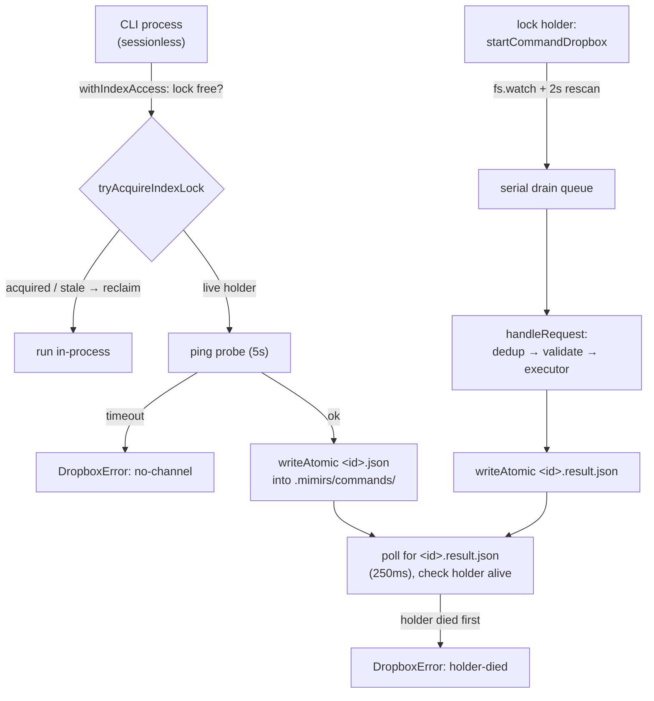

# Drop-box command channel

mimirs runs one writer per project: the server instance that holds the index
lock owns the SQLite database, the file watcher, and all indexing. But the CLI
is sessionless — `mimirs index`, `mimirs conversation index`, and friends are
separate short-lived processes that have no handle to that running server. When
a live server already holds the lock, a second process must not open the same
database to index it (that races the writer). The drop-box command channel is
how a sessionless process hands a job to the lock holder and waits for the
result, without sockets. A CLI process drops a small JSON request file into
`.mimirs/commands/`, the lock holder consumes it and writes a result file back,
and the requester polls for that result. The same code path works on Windows —
there is no Unix-socket/named-pipe split (`src/control/protocol.ts:5-12`).

Flows that need the lock to do their work rely on this: the
[ping command](../cli/ping.md) sends a bare health-check through it, the
[index command](../cli/index.md) and [conversation command](../cli/conversation.md)
delegate their reindex to the holder through it, and the
[server start flow](../server/start.md) is what stands up the consumer side so
those requests get answered.

## The file protocol

A request lives at `.mimirs/commands/<id>.json`; its result lands next to it at
`.mimirs/commands/<id>.result.json`. The directory is derived once by
`commandsDir()` and the two filenames by `requestPath()` / `resultPath()`
(`src/control/protocol.ts:59-69`). The split matters because both sides scan the
same flat folder: `isRequestFile()` treats a name as a request only when it ends
in `.json` but not `.result.json` (`src/control/protocol.ts:71-74`), so results
and requests never get confused for each other.

Every write into this folder is atomic. `writeAtomic()` writes to a `<path>.tmp`
sibling and then `renameSync`s it into place (`src/control/protocol.ts:76-82`).
Rename is atomic on a POSIX filesystem, so a reader scanning the folder never
observes half-written JSON — it sees the file either absent or complete. The
`.tmp` suffix is also chosen so `isRequestFile` rejects an in-flight write. Both
the producer's request and the consumer's result go through `writeAtomic`.

The request envelope is fixed by `requestSchema`: an `id` constrained to
`[A-Za-z0-9._-]`, a `cmd` string, an `args` object, the sender's `pid`, and a
protocol `version` (`src/control/protocol.ts:40-46`). The result envelope is
`CommandResult` — `id`, a `status` of `ok | error | expired | unsupported`, an
optional human `detail`, and optional `stats` (`src/control/protocol.ts:50-57`).

## The closed command set is the trust boundary

`.mimirs/` is writable by anyone who can already write the repo and run its
code, so the channel's safety does not come from access control — it comes from
never interpreting request content as anything executable. `cmd` is a closed
enum, and each command declares a strict zod schema for its arguments in
`commandArgSchemas` (`src/control/protocol.ts:26-36`):

- `ping` — `{}` (empty, strict). A health check that proves the channel works.
- `index.git` — `{ since?: string }`. Re-index git commit history.
- `index.conversation` — `{}`. Re-index all conversation transcripts.
- `index.files` — `{ patterns?: string[] }`. Re-index project files, optionally
  scoped to include patterns.

`CommandName` is the key type of that object, so a command the enum does not
name cannot type-check on the producer side and is rejected on the consumer side
(see below). Arguments are validated per command with `.strict()`, so unexpected
keys are refused rather than passed through. Nothing in a request is ever turned
into a shell string — the args are typed values handed to a fixed executor
function. Adding a command means adding one entry to `commandArgSchemas` plus the
matching executor; that is the only seam.

## Consumer: only the lock holder, one request at a time

`startCommandDropbox()` is the consumer (`src/control/consumer.ts:38-219`). It is
started only from the server's indexing-work path, which the lock holder alone
runs — a query-only server (one that lost the race for the lock) never calls it,
so there is never more than one consumer per project draining the folder. The
caller passes a `CommandExecutors` map: one async function per command name that
returns a `stats` object (`src/control/consumer.ts:18-20`). The
[server start flow](../server/start.md) supplies the real executors, wiring
`ping` to a pid/version reply and the three `index.*` commands to the server's
own indexing routines.

Requests drain through a single serial queue so two indexing jobs never overlap.
`drain()` holds one shared `drainPromise`; while it runs it repeatedly takes a
batch of queued paths, clears the queue, and processes each path in order, then
picks up anything that arrived mid-pass (`src/control/consumer.ts:115-144`).
Two subtle invariants are enforced here. The body begins with
`await Promise.resolve()` on purpose: with an empty queue the async function
would otherwise run to completion synchronously and execute its `finally`
(`drainPromise = null`) *before* the assignment to `drainPromise` lands, leaving
a permanently-resolved promise that makes every later `drain()` a silent no-op.
And the `finally` re-checks `queue.size` and re-drains, because an `add` can slip
in between the final loop check and the reset.

`handleRequest()` is where a single request is validated and run
(`src/control/consumer.ts:56-111`). The order is deliberate, and each failure
still writes a result file so the producer never waits out its timeout on a bad
request:

1. Dedup: if the id is already in the in-memory `processed` set or a result file
   already exists, delete the request and stop. This is what makes a duplicate
   filesystem event harmless.
2. Parse the JSON; an unparseable file yields `status: "error"` with the parse
   message, using the id recovered from the filename.
3. Validate the envelope with `requestSchema`; a bad shape yields `error`.
4. Reject a request whose `version` is newer than this server's
   `PROTOCOL_VERSION` with `unsupported` — a newer CLI against an older server
   degrades loudly.
5. Reject a `cmd` not in `commandArgSchemas` with `unsupported`.
6. Validate the args with that command's strict schema; a mismatch yields
   `error`.
7. Run the executor; success writes `ok` with its `stats`, a thrown error writes
   `error` with the message.

`finish()` writes the result with `writeAtomic` and unlinks the request
(`src/control/consumer.ts:50-54`), so a handled request leaves exactly one result
file behind for the producer to collect.

## Delivery is guaranteed by polling, not by the watcher

The consumer learns about new files two ways, and the second is what makes
delivery reliable. A non-recursive `fs.watch` on the folder triggers a rescan
(`src/control/consumer.ts:194-200`). The watch event's filename is deliberately
ignored: on macOS a rename-into-place is reported under the *source* name
(`<id>.json.tmp`) and never fires for the target, so any event just rescans the
whole (tiny) folder via `enqueuePending()`, and `handleRequest`'s dedup absorbs
the redundancy (`src/control/consumer.ts:175-192`).

But `fs.watch` is best-effort: a request that lands between the startup drain and
the watcher becoming active gets no event (macOS FSEvents activates
asynchronously), and platforms may drop events under load. So the consumer also
rescans once right after registering the watcher and then polls every 2 seconds
via `setInterval(enqueuePending, 2_000)`, whose timer is `unref`'d so it never
holds the process open (`src/control/consumer.ts:202-210`). The 2-second poll is
the actual delivery guarantee; the watcher only makes the common case fast. A
lost event costs seconds of latency, not a hung command, because the producer is
polling for its result the whole time anyway. **Do not remove the post-watch
rescan or the poll interval as redundant** — they are the correctness guarantee,
not an optimization.

## Startup drain and orphan expiry

When the consumer starts it sweeps the folder once before watching
(`src/control/consumer.ts:146-173`). Three cases:

- A result file (`.result.json`) or temp file (`.tmp`) older than
  `REQUEST_TTL_MS` is deleted — an uncollected result whose reader is long gone,
  or an abandoned write. This keeps the folder from growing without bound.
- A request file older than `REQUEST_TTL_MS` is finished with `status: "expired"`
  rather than run. `REQUEST_TTL_MS` is 5 minutes (`src/control/protocol.ts:24`).
  This is the safety property the TTL exists for: a command dropped against a
  server that then died must not fire a surprise reindex when the IDE reopens
  minutes later.
- Every other request file is queued and drained normally.

## Producer: run locally, or delegate to the holder

The producer side is `withIndexAccess()`, the CLI's three-step fallback for any
job that needs the index lock (`src/control/producer.ts:142-184`):

1. **Lock free** → `tryAcquireIndexLock` succeeds, so run `runLocal()` in-process
   while holding the lock, then release it. Returns `{ mode: "local", value }`.
2. **Lock stale** → the holder PID is dead, `tryAcquireIndexLock` reclaims the
   lock, and the job runs in-process the same way.
3. **Live holder** → hand the job to it over the channel. Returns
   `{ mode: "remote", result }`.

Step 3 pings first. A holder running a mimirs build from before this channel
existed would never answer, and the real command would burn its full timeout
polling. So `withIndexAccess` sends a `ping` with a 5-second `probeTimeoutMs`; if
that times out it raises `DropboxError("no-channel")` telling the user to restart
the server (`src/control/producer.ts:161-173`). Only after a successful ping does
it send the real command. If the holder dies mid-job — surfaced as
`DropboxError("holder-died")` — it reclaims the lock and retries in-process once
(`src/control/producer.ts:176-183`).

`sendCommand()` does the drop-and-wait (`src/control/producer.ts:58-119`). It
mints a sortable, collision-resistant id from a base-36 timestamp plus a UUID
fragment, writes the request atomically, then polls every `POLL_MS` (250ms) until
a deadline (`DEFAULT_TIMEOUT_MS` is 15 minutes; the ping probe overrides it to
5s). Each poll: if the result file exists, parse and return it, deleting the
result (a parse failure means the server's TTL GC swept it mid-read, so keep
polling). Otherwise check the holder is still alive via `readLockHolderPid` +
`isPidAlive`; a dead holder throws `holder-died` (with one extra poll first, in
case the result landed in the same instant). If `onProgress` is set, it streams
the first line of `.mimirs/status`, which long-running indexers update as they
work. On deadline it withdraws the request file — best-effort, so a busy server
does not fire it after the caller gave up — and throws `timeout`.

`readLockHolderPid` reads the PID from `.mimirs/index.lock` and guards against a
corrupted `"0"`, which on a `kill(0)` liveness probe would read as a
permanently-alive holder (`src/control/producer.ts:28-41`).

## Failure modes a caller observes

Everything the channel can go wrong with surfaces as a typed `DropboxError`
(`src/control/producer.ts:18-26`) or a `CommandResult.status`:

- `no-channel` — a live server holds the lock but did not answer a ping; it
  predates the command channel. Restart it.
- `holder-died` — the server exited before finishing; the producer reclaims the
  lock and retries in-process once, and only re-throws if that also fails.
- `timeout` — no result within the deadline; the request is withdrawn.
- result `status: "unsupported"` — unknown command or a request from a newer
  protocol version.
- result `status: "error"` — unparseable request, bad envelope, bad args, or the
  executor threw.
- result `status: "expired"` — the request sat unhandled past the 5-minute TTL.

## Key source files

- `src/control/protocol.ts` — the wire format: command enum and per-command zod
  schemas, request/result envelopes, path helpers, `writeAtomic`, and the
  `PROTOCOL_VERSION` / `REQUEST_TTL_MS` constants.
- `src/control/producer.ts` — the requester: `withIndexAccess` local-or-delegate
  fallback, `sendCommand` drop-and-poll, `readLockHolderPid`, and `DropboxError`.
- `src/control/consumer.ts` — the lock holder's side: `startCommandDropbox`, the
  serial drain queue, `handleRequest` validation pipeline, startup orphan expiry,
  and the watch + poll delivery guarantee.
