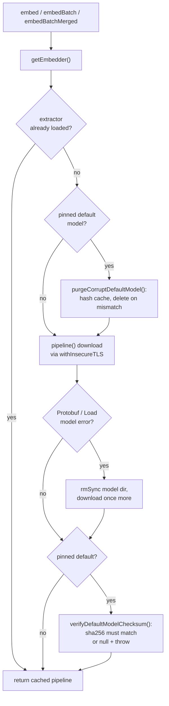

# Embedding model loading and caching

Everywhere mimirs turns text into a vector — indexing a chunk, embedding a
search query, saving a checkpoint, attaching a note — it goes through one small
module. That module owns a single loaded model for the whole process, downloads
and verifies the model the first time it is needed, splits oversized text so the
model never silently drops the tail, and decides how many CPU threads inference
may use. Centralizing all of this means a query and the index it searches always
use the *same* model, dimension, and pooling, and that the security and
windowing rules are written once instead of in every caller. Both the search and
write tools rely on it: `search_conversation`, `search_checkpoints`, and
`search_commits` embed a query before searching; `create_checkpoint` and
`annotate` embed text before writing it; and the `benchmark-models` CLI drives
the same module to swap models in and out. This page covers what happens inside
the module; what each caller does with the resulting vector lives on that
caller's page. The whole mechanism lives in `src/embeddings/embed.ts`.

## The shape of the module

The module exposes a few small functions and keeps everything else private. The
public surface is:

- `embed(text)` — one text in, one normalized `Float32Array` out
  (`src/embeddings/embed.ts:274-282`).
- `embedBatch(texts)` — many texts in one inference call
  (`src/embeddings/embed.ts:284-310`).
- `embedBatchMerged(texts)` — same, but transparently windows any text longer
  than the model's token limit (`src/embeddings/embed.ts:370-414`).
- `configureEmbedder(...)` — point the singleton at a different model
  (`src/embeddings/embed.ts:105-129`).
- `getEmbedder(...)` — load the model (or return the already-loaded one) and run
  the integrity checks (`src/embeddings/embed.ts:225-272`).
- `resetEmbedder()` — drop the loaded model and tokenizer
  (`src/embeddings/embed.ts:417-420`).
- Identity getters — `getEmbeddingDim`, `getModelId`, `getEmbeddingVariant`
  (`src/embeddings/embed.ts:423-439`).

The query tools call `embed` (`src/tools/conversation-tools.ts:47`,
`src/tools/checkpoint-tools.ts:50`, `src/tools/git-history-tools.ts:86`); the
bulk indexers call `embedBatchMerged` or `embedBatch`
(`src/indexing/indexer.ts:578`, `src/git/indexer.ts:362`,
`src/conversation/indexer.ts:167`). All of them funnel into `getEmbedder`.

## One model per process: the singleton

Loading an ONNX model and tokenizer is expensive, so the module loads each at
most once and keeps it in a module-level variable: `extractor` for the feature
extraction pipeline and `tokenizer` for the matching tokenizer
(`src/embeddings/embed.ts:86-87`). Alongside them sit the *current identity* of
that singleton — model id, dimension, pooling, dtype, and revision — which start
at the pinned defaults (`src/embeddings/embed.ts:81-85`).

`getEmbedder` is the lazy-load gate. If `extractor` is already set it returns it
immediately; otherwise it builds the pipeline once and stores it
(`src/embeddings/embed.ts:229`, `src/embeddings/embed.ts:271`). Because the
singleton is process-wide, two indexes built by the same process can only differ
in model if something explicitly reconfigures the embedder between them.

`configureEmbedder` is how you change models. It computes the effective
revision — the pinned `DEFAULT_MODEL_REVISION` for the default model, otherwise
the caller's revision or `"main"` — then compares the requested model id,
dimension, pooling, dtype, and revision against the current identity. Only if
*something actually differs* does it null out `extractor` and `tokenizer` and
record the new identity (`src/embeddings/embed.ts:113-128`). Calling it with the
same arguments is a no-op, so it is safe to call defensively without forcing a
reload. It must run *before* `getEmbedder`, because once the pipeline is cached
`getEmbedder` will not rebuild it on its own.

`resetEmbedder` is the blunt version: it unconditionally clears both
`extractor` and `tokenizer` so the next call reloads, without touching the
recorded identity (`src/embeddings/embed.ts:417-420`). Its doc comment marks it
for testing, but the model-comparison flow leans on it in production: the
[benchmark-models CLI](../cli/benchmark-models.md) calls `configureEmbedder`
then `resetEmbedder` around each candidate model so every model is loaded fresh
into its own throwaway index, and restores the default pair at the end so a
long-lived process is not left configured for the last candidate.

The identity getters exist so the database can detect a mismatch on reopen.
`getEmbeddingVariant` returns `"<pooling>|<dtype>"` (for example `mean|q8`)
because two indexes can share a model id and dimension yet still produce an
incompatible vector space if one used mean pooling and the other CLS, or q8
versus fp32 weights (`src/embeddings/embed.ts:437-439`).

## The pinned default model and checksum verification

The default model is `Xenova/all-MiniLM-L6-v2` at 384 dimensions
(`src/embeddings/embed.ts:53-54`). Left to itself, transformers.js fetches from
the mutable `main` ref on Hugging Face, so whatever the hub happens to serve at
download time is what gets loaded. The module instead pins an immutable commit,
`DEFAULT_MODEL_REVISION = "751bff37182d3f1213fa05d7196b954e230abad9"`
(`src/embeddings/embed.ts:60`), and pins the expected file hashes:

- `DEFAULT_MODEL_SHA256` — the sha256 of the q8 ONNX weights
  (`onnx/model_quantized.onnx`) at that revision
  (`src/embeddings/embed.ts:65`).
- `DEFAULT_TOKENIZER_SHA256` — the sha256 of `tokenizer.json` at that revision
  (`src/embeddings/embed.ts:69`).

Pinning the revision makes the download immutable on Hugging Face's side. The
checksums catch what a pin cannot: a compromised mirror, a man-in-the-middle, or
a corrupted transfer that produces a file that still parses. Both checks apply
*only* to the pinned default. `isPinnedDefaultModel()` returns true only when the
current model id, dtype (`q8`), and revision all match the pinned default, so any
custom model or non-default dtype skips verification entirely — there is no known
hash for it (`src/embeddings/embed.ts:148-154`).

Where the cached file lives matters. transformers.js keys its cache by revision
whenever the revision is not `"main"`, so the pinned default lands under
`<cache>/Xenova/all-MiniLM-L6-v2/<revision>/`. `defaultModelDir`,
`defaultModelOnnxPath`, and `defaultTokenizerPath` reconstruct exactly that
revision-keyed path, so the hash always reads the file the loader actually reads
(`src/embeddings/embed.ts:135-145`). The cache root itself is a stable directory
under the home folder, `~/.cache/mimirs/models`, chosen so downloaded models
survive `bunx` temp-dir cleanup between runs (`src/embeddings/embed.ts:14-16`).

Verification happens at two points, on either side of the download:

1. **Before** the download, `getEmbedder` calls `purgeCorruptDefaultModel()` when
   the pinned default is active. It hashes the already-cached weights; if a copy
   exists and its hash does not match the pin, it deletes the whole model
   directory and warns, so the next step re-downloads cleanly
   (`src/embeddings/embed.ts:168-177`, called at
   `src/embeddings/embed.ts:241`). This runs up front specifically so a
   proxy-mangled or truncated cache fails as a clear checksum miss rather than
   as a cryptic ONNX "Protobuf parsing failed" deep inside the runtime.
2. **After** a successful load, `getEmbedder` calls
   `verifyDefaultModelChecksum()`. This is the fail-closed gate: it hashes the
   cached weights and, on mismatch, deletes the cache and throws; if the file is
   *missing* it also throws, because absence means the revision-keyed path
   assumption broke and the module would otherwise be verifying nothing. On any
   throw, `getEmbedder` first nulls `extractor` and `tokenizer` so a rejected
   model is never left loaded for the next caller, then re-throws
   (`src/embeddings/embed.ts:185-201`, guarded at
   `src/embeddings/embed.ts:260-269`).

The tokenizer gets the identical treatment in `getTokenizer`:
`verifyDefaultTokenizerChecksum()` runs after load and throws on a missing or
mismatched `tokenizer.json`, deleting the cache (`src/embeddings/embed.ts:206-223`,
guarded at `src/embeddings/embed.ts:322-324`). The tokenizer is verified because
it shapes every embedding and every windowing decision, so a swapped tokenizer
would silently corrupt results even with correct weights.

### The retry branch

The first download attempt is wrapped in a try/catch. If the pipeline throws an
error whose message contains `"Protobuf parsing failed"` or `"Load model"` —
the signatures of a corrupt ONNX file — `getEmbedder` deletes the model
directory and retries the download exactly once. Any other error propagates
unchanged (`src/embeddings/embed.ts:243-257`). This retry is a second line of
defense behind the up-front purge: the purge handles a *known-bad-hash* cache;
the retry handles a parse failure that slips through (for example a custom model
with no hash to check).

### The TLS escape hatch

Model and tokenizer downloads run inside `withInsecureTLS`
(`src/embeddings/embed.ts:245`, `src/embeddings/embed.ts:253`,
`src/embeddings/embed.ts:319-321`). When the environment variable
`MIMIRS_INSECURE_TLS=1` is set, this helper saves
`NODE_TLS_REJECT_UNAUTHORIZED`, sets it to `"0"` for the duration of the
download, and restores it in a `finally` (`src/embeddings/embed.ts:31-51`). It
exists for machines behind a TLS-intercepting proxy whose root CA cannot be
added through `NODE_EXTRA_CA_CERTS`. The first time it triggers it prints a
one-time warning whose wording depends on `isPinnedDefaultModel()`: for the
pinned default it notes that integrity is still enforced by the sha256 checksum;
for any other model it warns that there is *no* integrity verification, because
only the default has a known hash (`src/embeddings/embed.ts:33-42`). Dropping
transport trust is therefore safe for the default — the post-download checksum
still rejects a tampered file — but unverified for custom models.

## Token windowing and merged embeddings

The model has a hard input limit of `MODEL_MAX_TOKENS = 256` tokens
(`src/embeddings/embed.ts:78`). Feed it more and the tail is simply truncated:
the embedding represents only the first 256 tokens and the rest of the chunk is
invisible to search. `embedBatchMerged` is what prevents that for the indexing
paths.

For each input text, `embedBatchMerged` first tokenizes it and compares the
token count against `MODEL_MAX_TOKENS`. A text at or under the limit is marked
`short` and passes through unchanged. A longer text is marked `oversized` and
split by `tokenWindows` into overlapping slices (`src/embeddings/embed.ts:383-396`).

`tokenWindows` encodes the text once, then walks the token id array in steps of
`MODEL_MAX_TOKENS` with a back-step of `MERGE_WINDOW_OVERLAP = 32` tokens between
windows, decoding each slice back to text (`src/embeddings/embed.ts:79`,
`src/embeddings/embed.ts:330-348`). The 32-token overlap means consecutive
windows share context at their boundary, so meaning that straddles a cut point is
not lost. A text whose token count is at or under the window size returns as a
single unchanged window (`src/embeddings/embed.ts:337`).

All short texts and all windows from every oversized text are flattened into one
list and embedded in a *single* `embedBatch` call, so windowing does not multiply
the number of inference round-trips (`src/embeddings/embed.ts:380-399`). A
`mapping` array remembers, for each original input, whether it was short (one
flat index) or oversized (a `[flatStart, flatEnd)` range of window indices). After
inference, the results are reassembled: short texts take their single embedding;
oversized texts have their window embeddings collapsed by `mergeEmbeddings`
(`src/embeddings/embed.ts:402-413`).

`mergeEmbeddings` is a plain average-then-renormalize. It sums the window
vectors component-wise, divides by the window count to get the mean, then divides
by the mean's L2 norm so the merged vector is unit length again — matching the
normalization `embed`/`embedBatch` apply to every other vector
(`src/embeddings/embed.ts:350-362`). Renormalizing matters because averaging
unit vectors generally yields a shorter vector, and the rest of the system
assumes every stored embedding is normalized for cosine comparison.

Windowing is opt-out per project. The indexers pick `embedBatchMerged` when
`config.embeddingMerge` is not explicitly `false`, falling back to plain
`embedBatch` otherwise (`src/indexing/indexer.ts:578`,
`src/indexing/indexer.ts:773`). The single-text `embed` and the conversation
indexer use plain inference with no windowing, so an oversized query or
conversation chunk is truncated at 256 tokens
(`src/embeddings/embed.ts:274-282`, `src/conversation/indexer.ts:167`).

## The dimension guard

`embedBatch` slices one flat output buffer back into per-text vectors, and it
slices by the model's *actual* output dimension, not the configured one. After
inference it reads `output.dims?.at(-1)` and, if that differs from `currentDim`,
throws a `Embedding dim mismatch` error naming both numbers
(`src/embeddings/embed.ts:297-303`). This is deliberate: slicing a 384-wide
buffer as if it were 768 would shift every vector after the first into misaligned
garbage with no error at all. Failing loudly at the boundary turns a
silent-corruption bug into a clear configuration error pointing at
`embeddingDim`. The actual slicing then uses `currentDim` to cut equal-width
windows out of the flat `Float32Array` (`src/embeddings/embed.ts:304-309`).

## Thread count

Inference threads are chosen by `defaultThreadCount()`, used when a caller does
not pass an explicit `threads` argument to `getEmbedder`
(`src/embeddings/embed.ts:230`). It returns `max(2, floor(cpus().length / 3))`
(`src/embeddings/embed.ts:89-99`), and that thread count is wired into the ONNX
runtime session as both `intraOpNumThreads` and `interOpNumThreads`
(`src/embeddings/embed.ts:234-237`).

The `cores / 3` divisor is **deliberately conservative and must not be raised
for throughput.** mimirs indexes in the background while a developer is working,
and embedding is roughly 95% of index time. Raw throughput pulls the other way —
measured on a 10-core M-series machine, per-chunk time falls from ~19.4 ms at 2
threads to ~9.4 ms at 6 and ~9.0 ms at 8 — a 1.5–2x speedup that is exactly the
trap. The project originally shipped at `cores / 2`, users reported that indexing
made their machines unusable, and the default was lowered on purpose. Day-to-day
machine responsiveness wins over index speed for the *default*; a user who wants
a fast foreground index sets `config.indexThreads` explicitly
(`src/config/index.ts:26`). That config value is threaded straight through the
indexers into `getEmbedder`, `embedBatch`, and `embedBatchMerged` as the
`threads` argument, overriding the default when present
(`src/indexing/indexer.ts:581`, `src/indexing/indexer.ts:776`,
`src/indexing/indexer.ts:927`).

## Invariants this module maintains

- **One model per process.** `extractor` and `tokenizer` are loaded at most once
  and reused; changing models requires `configureEmbedder` (which clears them on
  a real change) or `resetEmbedder` (`src/embeddings/embed.ts:86-87`,
  `src/embeddings/embed.ts:113-128`).
- **The pinned default is integrity-checked before use.** A cached default whose
  weights or tokenizer fail their sha256 is deleted, and a fresh load that still
  fails throws rather than returning a possibly-tampered model
  (`src/embeddings/embed.ts:185-223`, `src/embeddings/embed.ts:260-269`).
- **A rejected model is never left loaded.** Any verification throw nulls both
  singletons before propagating (`src/embeddings/embed.ts:263-267`,
  `src/embeddings/embed.ts:323`).
- **Stored vectors are unit-normalized.** Single, batch, and merged paths all
  produce L2-normalized vectors (`src/embeddings/embed.ts:280`,
  `src/embeddings/embed.ts:292`, `src/embeddings/embed.ts:357-360`).
- **Configured dimension matches model output, or the call fails.** The
  dimension guard in `embedBatch` refuses to slice a mismatched buffer
  (`src/embeddings/embed.ts:297-303`).

## Failure modes and what callers observe

| Situation | What happens | What the caller sees |
|---|---|---|
| Cached default weights corrupt (bad hash) | `purgeCorruptDefaultModel` deletes the cache before load and warns; download retries | A `[mimirs] Cached embedding model failed checksum...` warning, then a transparent re-download (`src/embeddings/embed.ts:168-177`) |
| ONNX parse failure on load | Model dir deleted, download retried exactly once | One retry; only a second failure surfaces (`src/embeddings/embed.ts:243-257`) |
| Default weights still fail checksum after load | Cache deleted, `Error` thrown, singletons cleared | A thrown `Embedding model checksum mismatch...` error (`src/embeddings/embed.ts:193-200`) |
| Default tokenizer fails checksum | Cache deleted, `Error` thrown | A thrown `Tokenizer checksum mismatch...` error (`src/embeddings/embed.ts:215-222`) |
| Revision-keyed file missing after load | Throws rather than proceed unverified | A thrown `...is missing — cache layout changed...` error (`src/embeddings/embed.ts:187-191`, `src/embeddings/embed.ts:208-213`) |
| Configured dim ≠ model output dim | `embedBatch` throws before returning | A thrown `Embedding dim mismatch...` error naming both numbers (`src/embeddings/embed.ts:298-303`) |
| Empty input array | Returns `[]` immediately, no model load | Empty result; no download, no inference (`src/embeddings/embed.ts:289`, `src/embeddings/embed.ts:375`) |

## Seams to change it

- **Swap the default model:** bump `DEFAULT_MODEL_ID` and `DEFAULT_EMBEDDING_DIM`
  *and* re-pin all three of `DEFAULT_MODEL_REVISION`, `DEFAULT_MODEL_SHA256`, and
  `DEFAULT_TOKENIZER_SHA256` together — the hashes are tied to the revision *and*
  the dtype, so the q4/fp16 variants have different hashes
  (`src/embeddings/embed.ts:53-69`).
- **Support a model that needs different pooling:** custom models are configured
  through `configureEmbedder`, which already accepts a `pooling` argument
  (`mean`/`cls`/`none`) and a `dtype`; the comment block at
  `src/embeddings/embed.ts:71-76` records which model families want which pooling.
- **Tune windowing:** `MODEL_MAX_TOKENS` (window size) and
  `MERGE_WINDOW_OVERLAP` (overlap) are the two constants; change them in lockstep
  with the model's real context limit (`src/embeddings/embed.ts:78-79`).
- **Change the default thread count:** edit `defaultThreadCount`, but read the
  rationale first — the conservative divisor is intentional, and the per-project
  override is `config.indexThreads` (`src/embeddings/embed.ts:89-99`).
- **Change the merge strategy:** `mergeEmbeddings` is a standalone
  average-and-renormalize; swap it for a different pooling of window vectors
  without touching the windowing logic (`src/embeddings/embed.ts:350-362`).

## Flows that rely on this mechanism

- [search_conversation](../tools/search-conversation.md) — embeds the query once
  before running its hybrid vector + keyword search.
- [search_checkpoints](../tools/search-checkpoints.md) and
  [create_checkpoint](../tools/create-checkpoint.md) — embed query text, and
  title-plus-summary text, respectively.
- [annotate](../tools/annotate.md) and
  [get_annotations](../tools/get-annotations.md) — embed a note before storing
  it, and embed a query before searching notes.
- [search_commits](../tools/search-commits.md) — embeds the query before
  searching indexed commit history.
- [benchmark-models](../cli/benchmark-models.md) — drives `configureEmbedder`
  and `resetEmbedder` to load each candidate model in turn.
- [checkpoint CLI](../cli/checkpoint.md) — the terminal counterpart to the
  checkpoint tools, embedding the same title-plus-summary text on `create`.

## Key source files

| File | Role in this mechanism |
|---|---|
| `src/embeddings/embed.ts` | The entire mechanism: the model/tokenizer singletons, `configureEmbedder`/`getEmbedder`/`resetEmbedder`, the pinned-default checksum verification and corrupt-cache purge, the TLS escape hatch, token windowing and `embedBatchMerged`, the dimension guard, and `defaultThreadCount`. |
| `src/config/index.ts` | Defines `indexThreads`, the per-project override for the conservative default thread count. |
| `src/indexing/indexer.ts` | A primary caller: chooses `embedBatchMerged` vs `embedBatch` per `config.embeddingMerge` and threads `config.indexThreads` into the embedder. |
