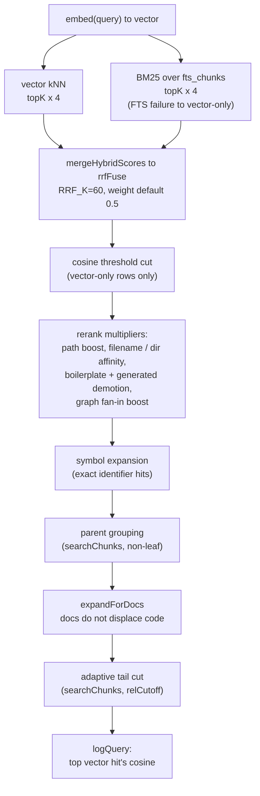

# Hybrid search ranking

Every meaning-based lookup in mimirs has the same problem to solve: two
independent rankers see the same chunk table, and their scores cannot be
compared. A semantic vector scan returns chunks by embedding distance; a BM25
keyword scan returns them by full-text rank. Those numbers live on different
scales, so naively averaging them lets whichever scorer happens to produce
larger magnitudes dominate, and the blend weight goes nearly inert. This page
documents the one subsystem that resolves that — it fuses the two lists by
*rank* instead of score, then reranks the survivors through a fixed series of
boosts and demotions, and finally records an analytics signal. It lives in
`src/search/hybrid.ts` and is the shared engine behind the file-level
[search tool](../tools/search.md), the chunk-level
[read_relevant tool](../tools/read-relevant.md), the placement-oriented
[write_relevant tool](../tools/write-relevant.md), and the terminal commands
[`mimirs search`](../cli/search.md), [`mimirs read`](../cli/read.md), and
[`mimirs demo`](../cli/demo.md). Every one of those flows defers its ranking
explanation here.

There are two public entry points. `search()` (`src/search/hybrid.ts:342-431`)
returns one row per file, deduplicated, for "where does this live." `searchChunks()`
(`src/search/hybrid.ts:504-698`) returns individual chunks with no file
deduplication, for "show me the actual code." They share the fusion core and a
nearly identical rerank, but differ in how they handle parents, thresholds, and
deduplication. What each *caller* does with the result is documented on that
flow's own page; this page covers what happens inside the engine.

## Reciprocal-rank fusion: the core

The fusion is `rrfFuse` (`src/search/hybrid.ts:77-103`), described in its own
header comment as the single source of truth for all hybrid fusion. It takes two
lists already sorted best-first — a primary and a secondary — plus a `weight` and
a `key` function that identifies an item across both lists.

The algorithm throws the raw scores away and uses only *position*. For each
list, an item at rank `i` (zero-based) is assigned a contribution of
`RRF_K / (RRF_K + i)`, where `RRF_K` is the constant `60`
(`src/search/hybrid.ts:83-88`). That value is `1.0` at the top of a list
(`60 / 60`) and decays smoothly down it (`60 / 61`, `60 / 62`, …), staying in
`(0, 1]`. The two contributions are then combined per key as
`weight * primaryRank + (1 - weight) * secondaryRank`
(`src/search/hybrid.ts:101`). An item present in only one list still survives:
the list it is missing from contributes `0` for that key, because
`Map.get(...) ?? 0` supplies the fallback (`src/search/hybrid.ts:101`).

The union of keys is built so that a primary-list item wins ties on the carried
payload: every primary item is inserted into the `items` map first, then a
secondary item is added only if its key is not already present
(`src/search/hybrid.ts:92-97`). The output preserves the *original* payload of
whichever list owned the key first, with only the `score` field overwritten by
the fused value.

`rrfFuse` is generic over `{ score: number }` and is keyed by the caller. The
chunk-aware wrapper is `mergeHybridScores` (`src/search/hybrid.ts:109-115`),
which calls `rrfFuse` with the key `` `${r.path}:${r.chunkIndex}` `` so that two
different chunks of the same file are distinct fusion entries. Both `search()`
and `searchChunks()` call `mergeHybridScores`; the conversation and git-history
search paths call `rrfFuse` directly with their own keys, which is why the core
is generic.

In both public entry points the primary list is always the **vector** results
and the secondary list is the **text** (BM25) results
(`src/search/hybrid.ts:365`, `src/search/hybrid.ts:572`). So `weight` is the
trust placed in the semantic ranking. The default comes from
`DEFAULT_HYBRID_WEIGHT = 0.5` (`src/search/hybrid.ts:63`) — equal trust in the
semantic and lexical rank signals — and the header comment records that a sweep
over keyword and semantic query sets put the optimum there, with recall
collapsing once the vector signal is starved below about `0.3`
(`src/search/hybrid.ts:59-62`). Callers pass `config.hybridWeight`, which has the
same default `0.5` (`src/config/index.ts:23`); a value outside `[0, 1]` is
rejected by the config schema before it reaches here.

Why this design holds: the two leg scores genuinely are non-comparable. The
vector leg converts a Euclidean distance into `1 / (1 + distance)`
(`src/db/search.ts:143`, `src/db/search.ts:234`); the text leg converts the
FTS5 BM25 rank into `1 / (1 + |rank|)` (`src/db/search.ts:188`,
`src/db/search.ts:286`). A linear blend of those is dominated by magnitude, not
agreement. Rank fusion is scale-free and, as the comment notes, keeps the fused
scores compressed near the top so the downstream boosts still have room to
reorder them (`src/search/hybrid.ts:65-75`).

The diagram shows the full stage order. Not every stage runs in both entry
points: the cosine threshold cut, parent grouping, and the adaptive tail cut are
`searchChunks()`-only; file deduplication is `search()`-only. The sections below
walk each stage and note where the two diverge.

## The relevance threshold: which rows it filters, which bypass it

The `threshold` parameter is the most subtle part of this engine, because the
scale it was named for no longer exists. It is documented to callers as a 0–1
cosine relevance floor, but after the RRF migration the fused score is a
positional rank value (a single-list maximum is `weight ≤ 1`, decaying fast), so
comparing `threshold` against the fused score would silently filter out almost
everything (`src/search/hybrid.ts:557-564`). The engine resolves this by
comparing `threshold` against the **true cosine** of each chunk's vector match,
recovered separately from the fused score.

That cosine is captured *before* fusion. `searchChunks()` walks the raw vector
results and builds `cosineByKey`, mapping each `` `${path}:${chunkIndex}` `` to
`vectorScoreToCosine(v.score)` (`src/search/hybrid.ts:565-568`). It also records
the set of keys that the text search returned, `textKeys`
(`src/search/hybrid.ts:569`). The filter then keeps a fused row when either:

- its key is in `textKeys` — it matched by keyword, so it is kept regardless of
  cosine; or
- its recovered cosine is `null` or `>= threshold`
  (`src/search/hybrid.ts:573-578`).

So the threshold filters **only vector-only rows whose cosine falls below it**.
A row that also matched the keyword index bypasses the cut entirely. The header
comment records why: a keyword match is its own relevance signal, and filtering
rows that matched both ways (weak cosine + strong keyword) made adding the
semantic signal strictly worse than having none
(`src/search/hybrid.ts:560-564`). The `cos == null` bypass covers rows that came
only from the text list and therefore have no vector score to convert.

The conversion itself is `vectorScoreToCosine` (`src/db/search.ts:20-26`).
Embeddings are L2-normalized and `vec_chunks` uses vec0's Euclidean distance, so
the stored `1 / (1 + distance)` is not a cosine and bottoms out near `0.333` —
a raw `< 0.3`-style test could never fire on it. The helper inverts the stored
score back to a distance and applies `cosine = 1 − distance² / 2`, clamped to
`[-1, 1]`, returning `null` for a missing or non-positive score.

The default `threshold` differs by entry point. `searchChunks()` defaults it to
`0.3` (`src/search/hybrid.ts:508`); `search()` defaults it to `0`
(`src/search/hybrid.ts:346`) and applies it differently — there it is a plain
`result.score < threshold` skip on the fused score during file dedup, only when
`threshold > 0` (`src/search/hybrid.ts:371`). Every current `search()` caller
passes `0`, so that branch is dormant in practice; the cosine-based cut is the
one that matters and it is `searchChunks()`-only.

## The boosts and demotions applied after fusion

Once the surviving rows are fused (and, in `searchChunks()`, threshold-cut), a
fixed series of score adjustments reorders them. The two entry points compute the
same set of adjustments but assemble them slightly differently — `search()` runs
them as three composed map passes, `searchChunks()` folds them into a single
inline `.map()`.

The complete adjustment set, in the order applied:

1. **Path-type boost/demotion.** Test files are multiplied by `0.85`. In
   `search()` only, source-tree files (paths containing `src/`, `lib/`, `app/`,
   `pkg/`, `packages/`, `internal/`, or `cmd/`) are multiplied by `1.1`
   (`src/search/hybrid.ts:119-132`). `searchChunks()` deliberately drops the
   source-tree bump: the inline comment explains it was measured as adding
   nothing because cross-helper agreement is already captured by the RRF fusion,
   so re-boosting it double-counts (`src/search/hybrid.ts:579-586`). Test
   patterns come from the shared `TEST_PATTERNS` in `src/utils/test-paths.ts`,
   so the demotion stays consistent with the impact tool.
2. **Boilerplate demotion.** A fixed `BOILERPLATE_BASENAMES` set
   (`types.go`, `doc.go`, `types.ts`, `types.d.ts`, `index.d.ts`,
   `constants.go`, `defaults.go`, `conversion.go`) is multiplied by `0.8` — these
   files carry vocabulary but no implementation (`src/search/hybrid.ts:137-140`,
   `src/search/hybrid.ts:219-221`, `src/search/hybrid.ts:591-592`). This is an
   early return in `search()` (it short-circuits the affinity computation) and an
   `else if` branch in `searchChunks()`.
3. **Generated demotion.** Files matching the configured `generated` glob
   patterns are multiplied by `GENERATED_DEMOTION = 0.75`
   (`src/search/hybrid.ts:146`, `src/search/hybrid.ts:223-225`,
   `src/search/hybrid.ts:593-594`). The matcher is built once per call by
   `buildGeneratedMatcher` (`src/search/hybrid.ts:148-198`), which compiles the
   glob list into directory-prefix, any-depth-directory, filename-suffix, and
   filename-prefix tests rather than running a glob library per row. With an empty
   pattern list (the default — `config.generated` defaults to `[]`) it returns
   `() => false` and the branch never fires.
4. **Filename and directory affinity.** For files that are neither boilerplate
   nor generated, query words that appear in the filename stem add `+0.1` each,
   and query words that appear in a directory path segment add `+0.05` each. The
   query words are extracted by lowercasing, splitting on
   `[\s_/.-]+`, and dropping anything under three characters or in `STOP_WORDS`
   (`src/search/hybrid.ts:209-211`, `src/search/hybrid.ts:596-597`). The
   directory match is intentionally stricter than the filename match — a segment
   must *contain* the query word, so `podautoscaler` matches `autoscaler` but
   `ragdb` does not match `db` (`src/search/hybrid.ts:233-244`,
   `src/search/hybrid.ts:602-608`). In `search()` these become a single
   multiplier `boost` (`src/search/hybrid.ts:242-248`); in `searchChunks()` they
   are folded directly into the running `multiplier`.
5. **Dependency-graph (fan-in) boost.** An additive boost rewards widely-imported
   files: `0.05 * log2(importerCount + 1)`, where `importerCount` is
   `db.getImportersOf(file.id).length` (`src/search/hybrid.ts:329-340`,
   `src/search/hybrid.ts:611-617`). The comment records that this was swept on
   ContextBench and `0.05` is the peak — higher buries the target under
   well-imported hubs. A file the index does not know, or one with zero
   importers, gets no boost.
6. **Whole-class (parent) boost — `searchChunks()` only.** When `parentBoost`
   is non-zero (default `chunkParentBoost = 0.3`, `src/config/index.ts:44`), a
   leaf chunk is lifted by its enclosing file's parent-blob match score times the
   boost (`src/search/hybrid.ts:537-547`, `src/search/hybrid.ts:622-624`). The
   per-file parent scores are computed before the leaf filter by fusing only the
   synthetic parent rows (`chunkIndex === -1`) and taking the max per path. Parent
   rows themselves (when `leafOnly` is off) are explicitly excluded from this
   boost so they never self-promote above their own children — the comment notes
   that letting them self-boost ranked every parent above its children and
   defeated the tight-spans goal.

The final per-row arithmetic differs between the two: `search()` applies its path,
filename, and graph adjustments as `r.score * multiplier` then a separate additive
graph boost across composed passes ending in a sort
(`src/search/hybrid.ts:405-410`); `searchChunks()` computes
`r.score * multiplier + boost + pBoost` in one expression and sorts after
(`src/search/hybrid.ts:625-627`). Because the multipliers and additive boosts are
applied on top of the compressed RRF score, a final score can rise above the
nominal `1.0` ceiling of a raw fused value — this is expected and is why the
displayed scores are positional, not probabilities.

> **Known bug in `applyFilenameBoost` (file-level `search()` only).** The
> filename-affinity stage in `search()` has two scoring defects that
> `searchChunks()`'s inline copy already fixes. The stem is split with
> `stem.split(/[_-]+/)` with no length guard
> (`src/search/hybrid.ts:228`), so a stem like `__init__` produces
> `["", "init", ""]` and the empty string matches *every* query word via
> `sw.includes(qw)` / `qw.includes(sw)`, inflating `stemMatchCount`. And the
> query words are not deduplicated, so a repeated term double-counts the affinity.
> The effect scales with query length — catastrophic on long issue text, mild on
> short topic queries. The fix mirrors `searchChunks()`: filter stem words to
> length `>= 3` and dedupe the query words with `[...new Set(...)]`. It was left
> unfixed here because `search()` feeds a different (file-level) benchmark that
> needs separate re-verification.

## What callers configure versus what is fixed

The two entry points have wide signatures, but most parameters are passed through
from `config`, and several constants are not configurable at all.

Caller-tunable (via arguments, ultimately `config`):

- `topK` — result count. `search()` defaults to `5` and the tools pass
  `config.searchTopK` (default `8`); `searchChunks()` defaults to `8` but the
  leaf-only callers pass `5`. The candidate over-fetch is always `topK * 4` so
  fusion, dedup, and reranking have spares (`src/search/hybrid.ts:355`,
  `src/search/hybrid.ts:528`).
- `threshold` — the cosine floor described above (`search()` default `0`,
  `searchChunks()` default `0.3`).
- `hybridWeight` — the RRF blend weight (default `0.5`).
- `generatedPatterns` — globs for the generated demotion (default `[]`).
- `filter` — a `PathFilter` of `extensions` / `dirs` / `excludeDirs`. It is
  pushed into SQL by the db layer, but symbol-expanded hits bypass SQL, so they
  are re-checked in memory by `matchesFilter` (`src/search/hybrid.ts:12-39`,
  `src/search/hybrid.ts:397`, `src/search/hybrid.ts:639`). `write_relevant`
  always passes `undefined` here.
- `searchChunks()`-only chunk knobs: `parentGroupingMinCount` (default `2`),
  `leafOnly` (default `true`), `symbolExpand`, `parentBoost`
  (`chunkParentBoost`, default `0.3`), `relCutoff` (`chunkRelCutoff`, default
  `0.85`), and `steepSkip` (`chunkSteepSkip`, default `0.15`)
  (`src/search/hybrid.ts:504-524`, `src/config/index.ts:34-46`).

Fixed in source, not configurable:

- `RRF_K = 60`, the rank-fusion smoothing constant (`src/search/hybrid.ts:83`).
- The boost magnitudes: test demotion `0.85`, source bump `1.1`, boilerplate
  `0.8`, generated `0.75`, filename `+0.1`/word, directory `+0.05`/word, graph
  `0.05 * log2`.
- The candidate over-fetch multiplier `4` (`src/search/hybrid.ts:355`,
  `src/search/hybrid.ts:528`).
- The boilerplate basename set and the source-path regex
  (`src/search/hybrid.ts:119-121`, `src/search/hybrid.ts:137-140`).
- The doc-expansion cap of `2 × topK` (`src/search/hybrid.ts:318`).

To tune a boost, the seam is the corresponding constant or the inline arithmetic;
to add a *new* rerank stage, add a map pass in `search()` before the final sort
(`src/search/hybrid.ts:405-410`) and the matching branch inside the
`searchChunks()` inline map (`src/search/hybrid.ts:579-625`), keeping the two in
sync. To swap the fusion strategy, change `rrfFuse` — every hybrid path goes
through it.

## The shared late stages

Three stages run near the end and are worth naming because they change the count
and identity of returned rows.

**Symbol expansion.** When the query contains code-like identifiers (mixed case,
underscore, or dot; three or more characters; not a stop word), each is looked up
by exact name. `extractIdentifiers` produces the list
(`src/search/hybrid.ts:268-276`). In `search()`, `mergeSymbolResults` boosts an
already-present file's score by `1.3` or adds a symbol-only hit at base score
`0.75` (`src/search/hybrid.ts:278-296`, `src/search/hybrid.ts:390-403`). In
`searchChunks()`, the same idea injects the defining symbol's chunk at base score
`0.75`, skipping keys already seen and (in leaf-only mode) parent rows, then
re-sorts (`src/search/hybrid.ts:629-661`). This surfaces named helpers that pure
semantic search misses; it is gated by `symbolExpand` in the chunk path and
always on in `search()`.

**Parent grouping (`searchChunks()`, non-leaf only).** When two or more sibling
chunks share a `parentId`, `groupByParent` replaces them with the parent chunk
(emitted with `chunkIndex: -1`), keeping the group's best score, unless the
parent is already present or missing from the db
(`src/search/hybrid.ts:438-498`, `src/search/hybrid.ts:665`). This stops several
methods of one class from consuming several slots. It is skipped in leaf-only mode
because that mode wants tight child spans, not promoted parents.

**Doc expansion.** Markdown files are useful context but should not evict code.
`expandForDocs` looks at the top-`topK` slice; if it mixes docs (`.md`/`.mdx`)
and code, it walks further down the pool until the original code-slot count is
restored, capped at `2 × topK`; if the slice is all docs or all code it returns
exactly `topK` (`src/search/hybrid.ts:304-326`, `src/search/hybrid.ts:413`,
`src/search/hybrid.ts:668`). Because of this, a call can return slightly more rows
than `topK`.

**Adaptive tail cut (`searchChunks()` only).** When `relCutoff` is non-zero, a
final pass trims the weak tail. It finds an anchor score — the value the score
curve settles at — by skipping steep head steps where the relative drop exceeds
`steepSkip`, so a single inflated top result cannot set the bar too high, then
keeps only rows scoring `>= anchor * relCutoff`
(`src/search/hybrid.ts:670-682`). This produces fewer, tighter spans while
keeping the confident head.

## Failure modes and what callers observe

- **Keyword-search failure.** The BM25 query is wrapped in a `try/catch` in both
  entry points; on a thrown FTS error it logs at debug level and continues with an
  empty text list, so fusion runs vector-only
  (`src/search/hybrid.ts:358-363`, `src/search/hybrid.ts:530-535`). The caller
  sees results, just without the lexical signal — never an error.
- **Empty index / no matches.** Both entry points simply return an empty array;
  the calling flow turns that into its own "no results" message. The analytics
  row is still written (below).
- **Over-aggressive threshold.** A high `threshold` in `searchChunks()` can drop
  every vector-only row, leaving only keyword matches (or nothing). The default
  `0.3` is intentionally permissive.
- **Missing graph/parent data.** A file unknown to the index gets no graph boost;
  a missing parent chunk leaves the children un-grouped
  (`src/search/hybrid.ts:487-489`). Neither is an error.

## State change: the analytics log

Both entry points end by writing exactly one `query_log` row via `db.logQuery`,
unconditionally — including the empty-result case, because the write lives in the
engine, not in the formatting code (`src/search/hybrid.ts:422-428`,
`src/search/hybrid.ts:689-695`). The logged "top score" is deliberately *not* the
result's fused score (which sits near `1.0` at the top and would flatten the
analytics) and *not* the raw vector score (which bottoms out near `0.333`).
Instead it is `vectorScoreToCosine(vectorResults[0]?.score)` — the true cosine of
the top vector hit — so the stored value stays on a real cosine scale and the
low-relevance (`< 0.3`) heuristic in [search_analytics](../tools/search-analytics.md)
remains meaningful. When there is no vector hit, the helper returns `null` and the
top path is stored as `null` with `result_count` `0`. The row records the query
text, the final result count, that cosine, the top path, and a duration measured
inside the engine.

## Key source files

- `src/search/hybrid.ts` — the entire mechanism: `rrfFuse` /
  `mergeHybridScores` (fusion core), `search()` (file-level entry point),
  `searchChunks()` (chunk-level entry point), the cosine threshold cut, every
  boost/demotion, symbol expansion, `groupByParent`, `expandForDocs`, the
  adaptive tail cut, and the analytics write.
- `src/db/search.ts` — the leg scorers (`1 / (1 + distance)` for vector,
  `1 / (1 + |rank|)` for BM25) and `vectorScoreToCosine`, which recovers a true
  cosine from the stored L2-based score for both the threshold cut and the log.
- `src/utils/test-paths.ts` — the shared `TEST_PATTERNS` driving the test-file
  demotion, kept in sync with the impact tool.
- `src/config/index.ts` — the defaults the callers feed in: `hybridWeight`
  (0.5), `searchTopK` (8), `generated` ([]), `parentGroupingMinCount` (2),
  `leafOnly` (true), `chunkParentBoost` (0.3), `chunkRelCutoff` (0.85),
  `chunkSteepSkip` (0.15).
