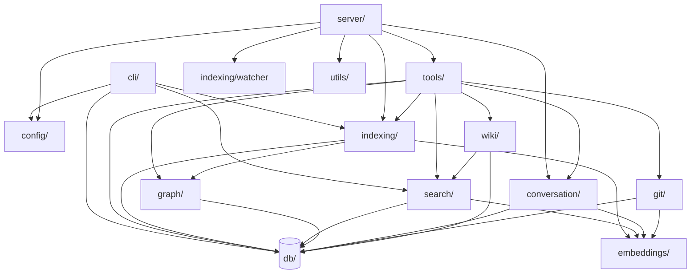

# Module map

This page is for someone trying to figure out where to put a new feature or follow an import. It maps the top-level directories under `src/`, says what each owns, and names the boundaries that must not be crossed.

## The directories at a glance

`cli/` and `server/` are entry-point packages. `tools/`, `indexing/`, `search/`, `graph/`, `conversation/`, `git/`, and `wiki/` are services. `db/`, `embeddings/`, `config/`, and `utils/` are leaves — they have no upstream dependency on a service or entry point.

## Entry points: cli/ and server/

`src/cli/index.ts:85-159` is the `mimirs` shell dispatcher: a giant `switch` on `args[0]` that delegates to a per-command module under `src/cli/commands/`. Every command file opens its own `RagDB`, calls `loadConfig`, and either runs a one-shot job or prints a result. The `serve` command is special — it dynamically imports the server module so a native-dep failure on Apple Silicon's SQLite still leaves `mimirs doctor` working (`src/cli/index.ts:16-18`, `src/cli/commands/serve.ts:12-49`).

`src/server/index.ts` is the long-running MCP process. It depends on `src/tools/index.ts:1-16` for tool registration and on `src/indexing/indexer.ts`, `src/indexing/watcher.ts`, and `src/conversation/indexer.ts` for background work. The server is the only thing in the project that does signal handling, status-file writes, and the index-lock dance — those concerns are not shared with the CLI.

See [mimirs serve](cli/serve.md) and [mimirs init](cli/init.md) for two flows that exercise this split.

## The tools surface

`src/tools/index.ts` is the only thing the server imports from `tools/`. It exposes two contracts:

- `resolveProject(directory, getDB)` (`src/tools/index.ts:21-37`) turns an optional `directory` argument into `{ projectDir, db, config }`. Every tool handler calls this on its way in. It centralizes path resolution, config loading, and embedding-model activation, so individual tool files don't reimplement it. This is also why the same tool can be used by the server on behalf of an editor and by a CLI command on behalf of a human — `resolveProject` doesn't care about the caller.
- `registerAllTools(server, getDB, getConnectedDBs, writeStatus)` (`src/tools/index.ts:39-56`) wires every per-topic registrar (search, index, graph, conversation, checkpoint, annotation, analytics, git, git-history, server-info, wiki). Adding a new MCP tool means adding a new `registerX` import and one call here.

See [server_info](tools/server-info.md) and [search](tools/search.md) for two handlers that use the same `resolveProject` pattern.

## Services: indexing, search, graph, conversation, git, wiki

Each service directory owns one capability and is reachable through `RagDB`:

- `src/indexing/indexer.ts:695-799` exports `indexDirectory`, which walks the include globs, hashes each file, calls the chunker and embedder, writes rows through `RagDB`, and resolves the graph at the end. `indexFile` (`src/indexing/indexer.ts:682-693`) is the single-file variant the watcher calls.
- `src/indexing/watcher.ts` watches the project dir for changes and re-runs `indexFile` plus graph resolution. It only ever runs in the lock-holding server.
- `src/search/hybrid.ts:313-397` is the hybrid vector + FTS pipeline used by both the `search` tool and the `mimirs search` CLI.
- `src/graph/resolver.ts` walks `file_imports` and rewrites them with resolved file ids; it's called by both `indexDirectory` (after a full pass) and the watcher (after a single-file pass).
- `src/conversation/` reads Claude Code's session JSONL files and indexes turns.
- `src/git/indexer.ts` walks `git log` output and writes commit rows plus embeddings.

The wiki module is unusual. `src/wiki/rebuild.ts` is a self-contained sub-pipeline: it owns its own discovery JSON, its own prompt-building code, and its own validators. It depends on `RagDB` for indexed-file content and on `src/search` for retrieval, but nothing in the rest of the codebase imports from `wiki/` except the tool handler at `src/tools/wiki-tools.ts`. The intent is that wiki generation can be ripped out or replaced without touching the indexing or search layers.

## Leaves: db, embeddings, config, utils

`src/db/index.ts:89-845` exposes `RagDB`, a thin class wrapping `bun:sqlite` plus `sqlite-vec`. All schema and migrations live here; everything above goes through these methods rather than running SQL directly. Per-table helpers live in `src/db/files.ts`, `src/db/search.ts`, `src/db/graph.ts`, `src/db/conversation.ts`, `src/db/checkpoints.ts`, `src/db/annotations.ts`, `src/db/analytics.ts`, and `src/db/git-history.ts`; `RagDB` is the facade.

`src/embeddings/embed.ts` is a process-level singleton model loader. Services depend on it directly. Configuration of model id and dim happens once per `resolveProject` via `applyEmbeddingConfig` in `src/config/index.ts:166-170`.

`src/config/index.ts:131-160` owns the on-disk `.mimirs/config.json`: parsing, defaults, validation, and embedding-config application. See [Configuration](configuration.md) for the surface this module presents.

`src/utils/` holds things that don't belong to one service: `index-lock.ts` (process lock), `dir-guard.ts` (refuses to index `$HOME` or `/`), `log.ts` (structured log levels), and `path.ts` (normalized slash handling for cross-platform globs).

## Why the imports flow one way

Every service depends on `src/db/index.ts` and (if it deals with vectors) on `src/embeddings/embed.ts`. Tool handlers depend on services. The server depends on tools and on the indexer/watcher directly (because it owns the lifecycle of background indexing). The CLI depends on services directly (because each command is a one-shot job, not a long-lived process). Nothing in `db/`, `embeddings/`, `config/`, or `utils/` imports from a service — the leaves stay unaware of which entry point opened them, which is what lets the test suite and the benchmark scripts construct a `RagDB` directly without going through either front door.

## Key source files

- `src/cli/index.ts` — top-level CLI command switch.
- `src/server/index.ts` — MCP server process and its lifecycle.
- `src/tools/index.ts` — tool registration and the `resolveProject` contract.
- `src/indexing/indexer.ts` — `indexDirectory` and `indexFile`, the writer for `files`/`chunks`/graph rows.
- `src/search/hybrid.ts` — hybrid search service used by both front doors.
- `src/db/index.ts` — `RagDB` facade over SQLite with the full schema.
