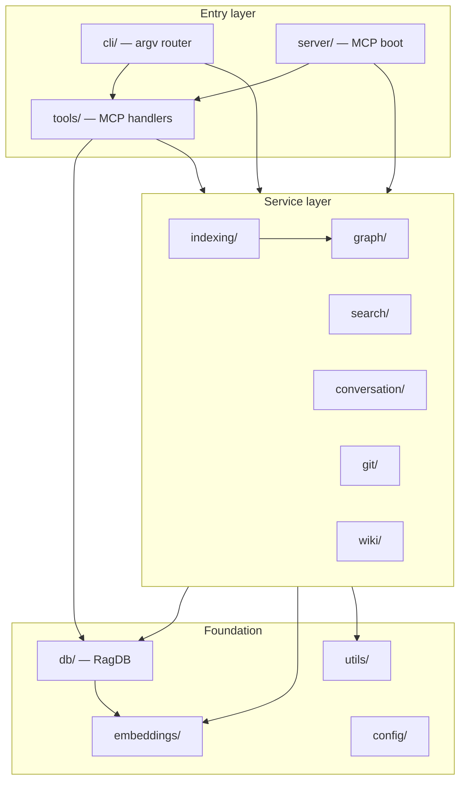

# Module map

This page is for anyone deciding which directory a change belongs in. It lays out the top-level folders under `src/`, what each one is responsible for, and — most importantly — the direction imports are allowed to flow between them. mimirs has a layered shape: two entry layers (the CLI and the MCP server) sit on top of a service layer, which sits on top of a storage-and-utilities foundation. Keeping changes on the right side of those boundaries is what keeps the codebase from tangling.

## The layers and their direction

The dependency rule is one-directional: **entry points depend on services, services depend on storage + embeddings + utils, and the foundation depends on nobody above it.** A handler should never be imported by a service; the database layer should never import a tool or a CLI command.

## Entry layer: cli/, server/, tools/

There are two front doors and they share their handlers. `src/cli/index.ts` is the argv router: its `main` function reads `command` and dispatches to one command module per subcommand — `serve`, `init`, `index`, `search`, `read`, `status`, `remove`, `analytics`, `map`, `history`, `checkpoint`, and the rest (`src/cli/index.ts:85-139`). Each command module under `src/cli/commands/` opens its own `RagDB` and calls service functions directly. `src/server/index.ts` is the other door: `startServer` builds an `McpServer`, hands it to `registerAllTools`, and connects a stdio transport (`src/server/index.ts:88-207`).

Both doors share the `src/tools/` layer through one contract. The MCP server registers every tool family from `registerAllTools` (`src/tools/index.ts:39-56`), and every handler resolves its target project through `resolveProject`, which validates the directory, loads config, applies the embedding config, and returns `{ projectDir, db, config }` (`src/tools/index.ts:21-37`). That shared resolution is *why* the server and CLI can expose the same capability without duplicating project setup: a tool handler and the matching CLI command both end up calling the same service with the same `RagDB`. The seam to add an MCP tool is one import plus one `registerXTools(...)` call in `registerAllTools`; to add a CLI command, one `case` in the `main` switch plus a command module. See [mimirs serve](server/start.md) and [index_files](tools/index-files.md).

## Service layer: indexing, search, graph, conversation, git, wiki

The services do the real work and are called by both entry layers. `src/indexing/` turns files into rows: `indexDirectory` and `indexFile` scan, chunk, parse, embed, and upsert (`src/indexing/indexer.ts:681-695`). It is the most-imported service — server boot, the `index_files` handler, several CLI commands, and benchmarks all call it. `src/search/` ranks: `search` and `searchChunks` run hybrid vector + full-text retrieval (`src/search/hybrid.ts:313-397`). `src/graph/` resolves the import/symbol graph that indexing populates; `src/conversation/` parses and indexes session JSONL; `src/git/` parses and indexes commit history.

These services are siblings, not a chain — with one deliberate exception. The indexer imports the graph resolver (`src/indexing/indexer.ts:3` region, where `graph/resolver.ts` is among its imports) because resolving imports is part of building the index. The search service does *not* import the indexer; it reads the graph the indexer already wrote, straight from the database (`src/search/hybrid.ts:301-311`). Keep that boundary: cross-service coupling belongs at write time (indexing computes the graph) not at read time (search consumes it). The [search](tools/search.md) flow shows the read side.

## Foundation: db, embeddings, config, utils

The bottom layer is shared by everything above and imports nothing above itself. `src/db/index.ts` exports the `RagDB` class (`src/db/index.ts:89`), which composes the per-concern store modules (`files`, `search`, `graph`, `conversation`, `checkpoints`, `annotations`, `analytics`, `git-history`) and is the single object both doors read and write — its fan-in of more than fifty reflects that every command, tool, service, and test reaches storage through it. `src/embeddings/` owns the model and vector dimension; both `db/` and the indexing and search services depend on it, which is why the embedding model is effectively a project-wide contract rather than a service-local detail. `src/config/` loads and validates the per-project config consumed by `resolveProject`. `src/utils/` holds the leaf helpers — the process-level index lock (`src/utils/index-lock.ts`), path normalization, the home-directory guard, and logging — that any layer may call.

## The wiki module as a self-contained sub-pipeline

`src/wiki/` is its own corner of the codebase rather than a peer service. It is a single module, `src/wiki/rebuild.ts`, which defines the entire wiki rebuild workflow and its data shapes — the prefetch, planning, and page structures all live there (`src/wiki/rebuild.ts:9-86`). It depends only on the foundation: it imports `RagDB` and `AnnotationRow` from the database and `normalizePath` from utils, and nothing else from the service layer (`src/wiki/rebuild.ts:4-5`). It is reached through exactly one thin handler, `src/tools/wiki-tools.ts`, which calls `runWikiRebuild` (`src/tools/wiki-tools.ts:3`). That isolation is intentional: the wiki sub-pipeline can be changed without touching indexing, search, or the graph, and it reuses the same `RagDB` the rest of the system already maintains rather than building its own store.

## Key source files

- `src/cli/index.ts` — the argv router (`main`) that dispatches each subcommand to a `commands/` module; the CLI front door.
- `src/server/index.ts` — `startServer`; the MCP front door that registers tools and runs background services.
- `src/tools/index.ts` — `registerAllTools` and `resolveProject`; the shared seam that lets the server and CLI use the same handlers and project setup.
- `src/indexing/indexer.ts` — `indexDirectory`/`indexFile`; the central indexing service and the one place a service imports the graph layer.
- `src/search/hybrid.ts` — `search`/`searchChunks`; the ranking service that reads the graph from storage instead of importing the indexer.
- `src/db/index.ts` — `RagDB`; the foundation store every layer depends on, importing only embeddings and its own store modules.
- `src/wiki/rebuild.ts` — the self-contained wiki rebuild sub-pipeline, depending only on the database and utils.
