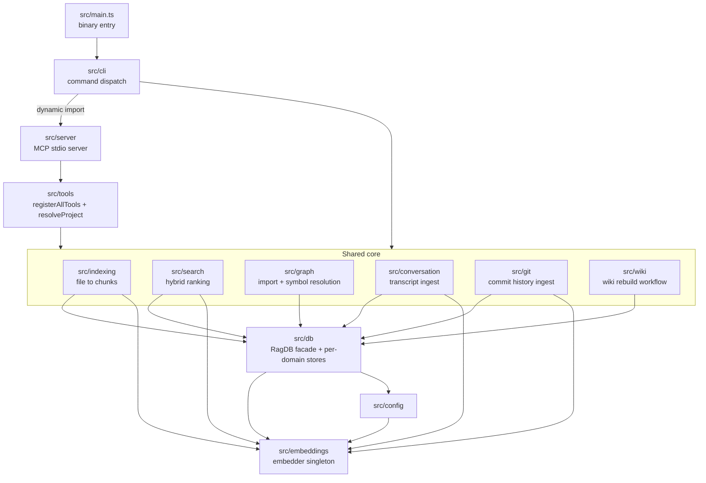
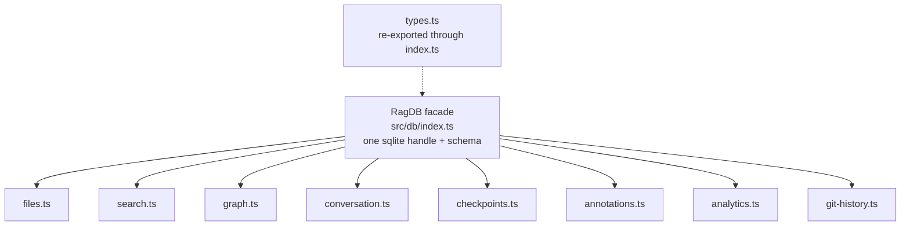

# Module Map

This page is the bird's-eye view of the `src/` tree: what each top-level directory owns, which directories are allowed to import which, and where the load-bearing seams are. It is written for a maintainer deciding *where* a change belongs — which file owns a behavior, which boundary a new feature must respect, and what breaks if you cross a boundary the wrong way. For how any single command or tool actually runs end to end, follow the linked flow pages; this page only ties them together.

## The two front doors and the shared core

Everything in mimirs is one of two things: a *front door* that a human or an AI agent talks to, or part of a *shared core* that does the real work. There are exactly two front doors.

The first is the command-line interface in `src/cli`. The binary entry point `src/main.ts` does almost nothing: it calls `main()` and, if anything throws, writes the message and stack into `.mimirs/server-error.log` before exiting non-zero, because stderr is often invisible inside an MCP client (`src/main.ts:5-34`). `main()` lives in `src/cli/index.ts`, reads `process.argv`, and a `switch` dispatches on the first argument to one command module under `src/cli/commands/` (`src/cli/index.ts:105-174`). Each command is a thin shell: parse flags, build or open a database, call into the core, and print. Adding a CLI command means adding one `import` and one `case` in `src/cli/index.ts`, plus a command module and a line in `usage()`.

The second front door is the MCP server in `src/server`. `src/server/index.ts` opens a stdio MCP server and exposes the same core through tools instead of commands. It keeps a per-directory map of open databases and hands callers a lazy `getDB(projectDir)` factory that opens a `RagDB` on first use and caches it for the process lifetime, so background tasks like the file watcher never lose the handle out from under them (`src/server/index.ts:34-51`). The reason the two front doors stay genuinely separate is in `src/cli/index.ts:16-18`: `serve` is imported *dynamically* inside the dispatch `switch` (`src/cli/index.ts:107-111`), because the server's transitive dependencies pull in native modules (`bun:sqlite`, `sqlite-vec`) and a top-level `await` that would crash the whole CLI at module-load time — so plain commands like `doctor` must not load them eagerly.

Between those two front doors and the core sits the tool registry in `src/tools`. `src/tools/index.ts` is the single place that knows the full tool set: `registerAllTools` calls one `registerX` function per tool family, passing each the MCP server and the `getDB` factory (`src/tools/index.ts:39-56`). It also owns `resolveProject`, the helper every tool uses to turn an optional `directory` argument into a concrete `{ projectDir, db, config }` triple — resolving the path to an absolute one, checking it exists, loading config, and applying the embedding config before any embedding happens (`src/tools/index.ts:21-37`). Adding a tool is therefore a two-line change: a `registerX` import and one call inside `registerAllTools`.

## The shared core and what each directory owns

`src/indexing` turns files on disk into stored chunks. `indexDirectory` collects matching files, eagerly loads the embedding model so progress reporting reflects it, then processes each file; `indexFile` does the same for one path (`src/indexing/indexer.ts:682-770`). It depends on `src/db` to persist, `src/embeddings` to vectorize, `src/graph` to resolve imports, and its own sibling files `chunker.ts` and `parse.ts` to cut files into semantic chunks. It is also the only directory that owns concurrency safety for writes: before touching the index it acquires a process-level lock so two indexers — two IDE windows, or a CLI run overlapping the server — cannot race past each other's deletes and double-write chunk rows (`src/indexing/indexer.ts:717-730`).

`src/search` ranks chunks for a query. Its `search` function embeds the query once, runs both a vector search and a BM25 text search through the database, merges the two with a configurable hybrid weight, deduplicates by file, expands exact symbol matches, applies source/filename/graph boosts, and logs the query for analytics (`src/search/hybrid.ts:313-397`). One boost is worth naming because it crosses a boundary on purpose: `applyGraphBoost` reads each result's importer count from the graph tables and nudges widely-imported files up the ranking (`src/search/hybrid.ts:301-311`). Search reaches into `src/db` and `src/embeddings`, but nothing reaches back into search except the front doors and benchmark tooling.

`src/graph` owns the meaning of imports and symbol references. `resolver.ts` resolves an import specifier to a concrete file using `@winci/bun-chunk` and, as a fallback, the database's own file table (`src/graph/resolver.ts:1-8`). The indexer calls it while indexing; the graph store in `src/db/graph.ts` persists the resolved edges; and `project_map`, `depends_on`, and the search graph-boost all read them back.

`src/conversation` and `src/git` are two more *ingest* directories that feed the same database. Conversation indexing reads Claude Code JSONL transcripts, parses them into turns, chunks them, and embeds them (`src/conversation/indexer.ts:1-8`); git indexing shells out to `git`, parses commits, and embeds their messages and diff summaries (`src/git/indexer.ts:1-4`). Both depend on `src/db` and `src/embeddings` exactly the way file indexing does — they are parallel pipelines writing into different tables of the same store, not a special case.

`src/wiki` owns the wiki rebuild workflow that produced this page; `rebuild.ts` orchestrates it and reads the index through `src/db`. `src/config` owns the `.mimirs/config.json` schema, its defaults, and loading: the Zod schema and `loadConfig` live in `src/config/index.ts:17-160`. `src/utils` holds the leaf helpers everything else depends on but that depend on nothing internal: structured logging (`log.ts`), path normalization (`path.ts`), the indexing lock (`index-lock.ts`), and the guard that refuses to index system directories (`dir-guard.ts`).

## The database facade and its per-domain stores

`src/db` is the spine. Every front door, every ingest pipeline, and search all go through it, and almost nothing in the project does SQL anywhere else. That is by design: `src/db/index.ts` exports a single `RagDB` class (`src/db/index.ts:90`) that owns the one open `bun:sqlite` handle, loads the `sqlite-vec` extension, and creates the full schema — chunk tables, vector virtual tables, FTS5 virtual tables, the import/export/symbol graph tables, conversation tables, checkpoints, the query log, git-history tables, and annotations (`src/db/index.ts:170-420`).

The class itself stays thin. The actual queries live in eight per-domain store modules — `files.ts`, `search.ts`, `graph.ts`, `conversation.ts`, `checkpoints.ts`, `annotations.ts`, `analytics.ts`, and `git-history.ts` — each imported as a namespace at the top of `src/db/index.ts:11-18`. Every public method on `RagDB` is a one-line delegation that passes `this.db` into the matching store function: `getFileByPath` forwards to `fileOps.getFileByPath(this.db, path)`, `search` forwards to `searchOps.vectorSearch`, `getDependsOn` forwards to `graphOps.getDependsOn`, and so on (`src/db/index.ts:593-760`). Types are re-exported from `src/db/types.ts` through the same `index.ts` so callers only ever write `import { RagDB, type SearchResult } from "../db"` (`src/db/index.ts:21-34`).

This is the contract a maintainer must keep: the store modules never open a database, hold no connection, and take the handle as their first argument; `RagDB` never writes SQL inline. To add a query, add a function to the right store module and one delegating method on `RagDB`. To add a whole new domain, add a store module, import it as a namespace, and add its delegations. Reaching past the facade to run raw SQL, or having a store open its own connection, breaks the single-handle invariant — and the schema is built around that single handle, including triggers that keep the FTS and vector tables in sync with the base `chunks` table on every insert, update, and delete (`src/db/index.ts:202-220`).

## Embeddings: one model, configured once, shared everywhere

`src/embeddings` is the deepest leaf in the tree — it imports nothing from inside the project, and it is imported by indexing, search, conversation ingest, git ingest, and `src/db` itself. It exists to guarantee that every vector in a given index was produced by the same model at the same dimension.

It enforces that with module-level singleton state in `src/embeddings/embed.ts`: a current model id, a current dimension, and a lazily-built extractor and tokenizer (`src/embeddings/embed.ts:22-25`). `getEmbedder` builds the Transformers feature-extraction pipeline on first use and reuses it thereafter, even retrying once after deleting a corrupted model cache (`src/embeddings/embed.ts:44-76`); `embed` and `embedBatch` call it and return normalized `Float32Array` vectors (`src/embeddings/embed.ts:78-102`). The only way to change which model runs is `configureEmbedder(modelId, dim)`, which resets the singleton when either value changes (`src/embeddings/embed.ts:35-42`).

`src/config` is what actually drives that switch, and the two functions that call it mark the two boundaries where a project's embedding choice takes effect. `applyEmbeddingConfig` is the async path the front doors use after `loadConfig` (`src/config/index.ts:166-170`). `applyEmbeddingConfigFromDisk` is the synchronous path called from inside the `RagDB` constructor *before* the schema is built, reading only the embedding fields straight off disk so the vector virtual tables are created at the configured dimension instead of the default 384 (`src/config/index.ts:182-203`, invoked at `src/db/index.ts:130-132`). The vector tables embed that dimension in their DDL via `getEmbeddingDim()` (`src/db/index.ts:191-194`), and the constructor refuses to open an index whose stored dimension disagrees with the configured one — failing loudly at open time rather than with a cryptic vector-insert error later (`src/db/index.ts:149-168`).

The invariant to respect: the embedder is a global, so the configured model must be settled before the first `embed` call and before the schema is created. If you add a new code path that vectorizes — a new ingest pipeline, a new tool — call `resolveProject` (which applies the config) or `applyEmbeddingConfig` on the way in, and read the dimension from `getEmbeddingDim()` rather than hard-coding 384.

## Import boundaries and how to keep them

The directories form a layered graph with no cycles across layers. The front doors (`src/cli`, `src/server`) and the tool registry (`src/tools`) depend downward on the core. The core directories — `indexing`, `search`, `graph`, `conversation`, `git`, `wiki` — depend on `src/db` and `src/embeddings` but not on each other's internals, with the one deliberate read-only exception that search consults the graph tables through `RagDB`. `src/db` depends on `src/config` and `src/embeddings`. `src/config` depends only on `src/embeddings`. `src/embeddings` and `src/utils` depend on nothing internal.

That ordering is what lets `src/db` carry a fan-in of roughly five dozen importers and `src/embeddings` over forty, while neither imports anything that could pull a front door back into the core. Two facts keep it honest. First, all database access funnels through the `RagDB` facade, so a schema or query change has one place to land. Second, all vectorization funnels through the embedder singleton, so the model is consistent across every pipeline. A maintainer adding code should keep new files inside whichever layer matches their job, route persistence through `RagDB`, route vectorization through `src/embeddings`, and register any new surface at the one front-door seam — `src/cli/index.ts` for a command, `src/tools/index.ts` for a tool.

For concrete examples of these pieces in motion, see the [mimirs serve](cli/serve.md) and [mimirs index](cli/index.md) command flows, the [search](tools/search.md) and [read_relevant](tools/read-relevant.md) tool flows, and the [mimirs search](cli/search.md) and [mimirs init](cli/init.md) command flows.

## Key source files

- `src/main.ts` — binary entry point; calls `main()` and writes a crash log on fatal errors.
- `src/cli/index.ts` — CLI front door; parses argv and dispatches to command modules, dynamically importing `serve`.
- `src/server/index.ts` — MCP server front door; per-directory `getDB` cache and tool registration.
- `src/tools/index.ts` — the one tool registry; `registerAllTools` and `resolveProject`.
- `src/db/index.ts` — the `RagDB` facade, full schema, and one-line delegations to per-domain store modules.
- `src/embeddings/embed.ts` — the embedder singleton: model/dim state, lazy pipeline, `embed`/`embedBatch`, `configureEmbedder`.
- `src/indexing/indexer.ts` — file-to-chunks pipeline; `indexDirectory`/`indexFile` and the index lock.
- `src/search/hybrid.ts` — hybrid vector + BM25 ranking with symbol, path, and graph boosts.
- `src/config/index.ts` — `.mimirs/config.json` schema and the two functions that apply embedding config.
