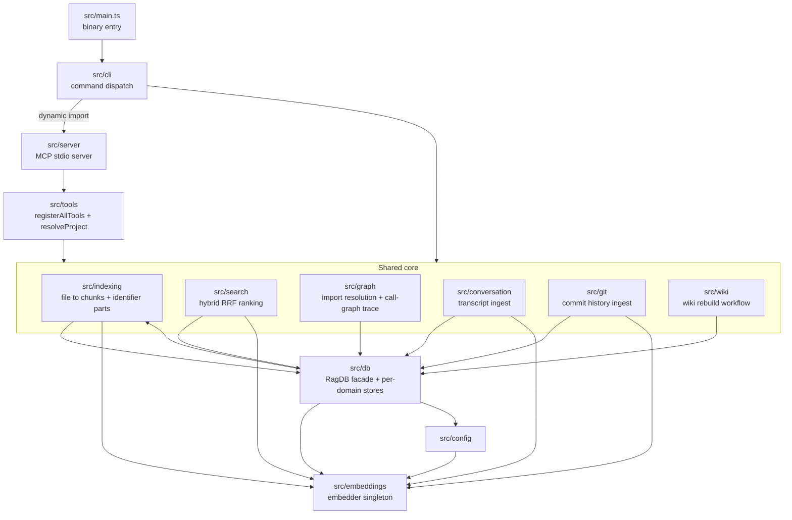
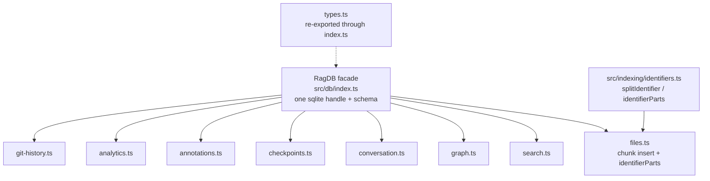

# Module Map

This page is the bird's-eye view of the `src/` tree: what each top-level directory owns, which directories are allowed to import which, and where the load-bearing seams are. It is written for a maintainer deciding *where* a change belongs — which file owns a behavior, which boundary a new feature must respect, and what breaks if you cross a boundary the wrong way. For how any single command or tool actually runs end to end, follow the linked flow pages; this page only ties them together.

## The two front doors and the shared core

Everything in mimirs is one of two things: a *front door* that a human or an AI agent talks to, or part of a *shared core* that does the real work. There are exactly two front doors.

The first is the command-line interface in `src/cli`. The binary entry point `src/main.ts` does almost nothing: it calls `main()` and, if anything throws, prints `[mimirs] FATAL: <message>` to stderr and exits non-zero (`src/main.ts:5-40`). It persists a crash log to `.mimirs/server-error.log` only when the failing command was `serve` (`src/main.ts:14-36`), because an ordinary CLI command — a mistyped benchmark filename, say — prints a clean error to stderr, and writing a "server crashed" log for it would mislead `doctor` and pollute the cwd's `.mimirs/`. `main()` lives in `src/cli/index.ts`, reads `process.argv.slice(2)` (`src/cli/index.ts:26-27`), and a `switch` dispatches on the first argument to one command module under `src/cli/commands/` (`src/cli/index.ts:113-185`). Each command is a thin shell: parse flags, build or open a database, call into the core, and print. Adding a CLI command means adding one `import` and one `case` in `src/cli/index.ts`, plus a command module and a line in `usage()` (`src/cli/index.ts:29-87`).

The second front door is the MCP server in `src/server`. `src/server/index.ts` opens a stdio MCP server and exposes the same core through tools instead of commands. It keeps a per-directory map of open databases (`dbMap`, `src/server/index.ts:28`) and hands callers a lazy `getDB(projectDir)` factory that opens a `RagDB` on first use and caches it for the process lifetime, so background tasks like the file watcher never lose the handle out from under them (`src/server/index.ts:43-54`). The cache is bounded: at most `DB_MAP_MAX` (8) project databases stay open, and when a new directory pushes past that, the least-recently-accessed entry is evicted — never the primary project, and never an entry touched within `DB_IDLE_MS` (ten minutes), so a minutes-long `index_files` on a secondary directory cannot have its handle closed mid-use (`src/server/index.ts:40-41`, `src/server/index.ts:56-60`). The reason the two front doors stay genuinely separate is in `src/cli/index.ts:17-19`: `serve` is imported *dynamically* inside the dispatch `switch` (`src/cli/index.ts:115-118`), because the server's transitive dependencies pull in native modules (`bun:sqlite`, `sqlite-vec`) and top-level `await` that would crash the whole CLI at module-load time — so plain commands like `doctor` must not load them eagerly.

Between those two front doors and the core sits the tool registry in `src/tools`. `src/tools/index.ts` is the single place that knows the full tool set: `registerAllTools` first wraps the server so every handler's thrown error becomes a readable, actionable text response (`withFriendlyErrors`, `src/tools/index.ts:100-128`), then calls one `registerX` function per tool family — eleven of them — passing each the wrapped server and the `getDB` factory (`src/tools/index.ts:130-148`). Those eleven families register 29 MCP tools in total. The largest family is the graph tools (`src/tools/graph-tools.ts`), which alone registers eight: `project_map`, `usages`, `depends_on`, `dependents`, `impact`, `trace`, `callees`, and `affected`. `src/tools/index.ts` also owns `resolveProject`, the helper every tool uses to turn an optional `directory` argument into a concrete `{ projectDir, db, config }` triple — resolving the path to an absolute one, refusing to scaffold a fresh index under a mistyped directory unless `allowCreate` is set, loading config, and applying the embedding config from the same raw-disk read the `RagDB` constructor uses before any embedding happens (`src/tools/index.ts:33-83`). Adding a tool is therefore a small change in one place: a `registerX` import and one call inside `registerAllTools`, plus the `server.tool(...)` registration in the family module.

## The shared core and what each directory owns

`src/indexing` turns files on disk into stored chunks. `indexDirectory` is now a thin queue wrapper: it chains each request for a directory behind the previous one through a per-directory promise queue so two overlapping calls for the same project run in sequence rather than interleaving, then delegates to `indexDirectoryInner` (`src/indexing/indexer.ts:859-878`). `indexFile` does the single-path version (`src/indexing/indexer.ts:838`). File collection respects `.gitignore`: `collectFiles` asks git for the project's non-ignored files via `git ls-files --cached --others --exclude-standard -z` (`listGitFiles`, `src/indexing/indexer.ts:246-252`) and only falls back to a recursive `readdir` for non-git directories, with the config include/exclude globs applied on top of whichever source produced the list (`src/indexing/indexer.ts:269-315`). After scanning, the inner function eagerly loads the embedding model so progress reporting reflects it (`src/indexing/indexer.ts:925-927`). The directory depends on `src/db` to persist, `src/embeddings` to vectorize, `src/graph` to resolve imports (`resolveImports`, `src/indexing/indexer.ts:980`), and its own sibling files `chunker.ts` and `parse.ts` to cut files into semantic chunks. It is also the only directory that owns concurrency safety for writes: before touching the index it acquires a process-level lock so two indexers — two IDE windows, or a CLI run overlapping the server — cannot race past each other's deletes and double-write chunk rows (`tryAcquireIndexLock`, `src/indexing/indexer.ts:907`, released in the `finally` at `src/indexing/indexer.ts:1005-1006`). The major phases of a run — `scan`, `model-load`, `prune`, `resolve-imports`, `resolve-symbol-refs` — are wrapped in `timed()` from `src/utils/profiler.ts`, a zero-overhead no-op unless `MIMIRS_PROFILE=1` turns on per-phase timing.

One small file in this directory carries weight out of proportion to its size: `src/indexing/identifiers.ts`. FTS5's default tokenizer splits on whitespace and punctuation but not on case boundaries, so `getDependsOn` is one opaque token and a plain-text search for `depends` cannot match it. `splitIdentifier` cracks a single identifier into its lowercase word parts (≥2 chars) across camelCase, snake_case, kebab, and dotted forms (`src/indexing/identifiers.ts:13-20`), and `identifierParts` runs that over a whole chunk of text and returns the deduplicated word-parts of every *compound* identifier as a space-joined string — single plain words are skipped because they already live in the snippet itself, and tokens longer than 80 characters are dropped so a base64 or hex blob cannot make the case-boundary regex go quadratic (`src/indexing/identifiers.ts:27-41`). This is produced during indexing and consumed by the database FTS path: it is the bridge that makes identifier search work, described in full in the FTS subsection below.

`src/search` ranks chunks for a query. Its `search` function embeds the query once, runs both a vector search and a BM25 text search through the database, fuses the two result lists by rank, deduplicates by file, expands exact symbol matches, applies source/filename/generated/graph boosts, and logs the query for analytics (`src/search/hybrid.ts:342-431`). The fusion is the part worth getting right. Vector cosine scores and BM25-derived scores live on different, non-comparable scales, so a raw linear blend is dominated by whichever has the larger magnitude — the hybrid weight becomes nearly inert. Instead, `rrfFuse` performs **reciprocal-rank fusion**: each result contributes `K/(K+rank)` from its list (with `K = 60`), and the two contributions are blended by the `hybridWeight` toward the primary (vector) list (`src/search/hybrid.ts:77-103`). `mergeHybridScores` is a thin wrapper that keys results by `path:chunkIndex` and delegates straight to `rrfFuse` (`src/search/hybrid.ts:109-115`); it is the single source of truth for fusion, used by both chunk search and conversation search. The default `hybridWeight` is `0.5` — equal weight to the semantic and lexical rank signals, the optimum found by a sweep over keyword and semantic query sets (`src/search/hybrid.ts:59-63`). Because the fused score is now positional (~1 at the top, not a cosine), the analytics log records the raw top vector hit's cosine as the relevance signal instead, so "avg top score" and the low-relevance heuristic stay meaningful (`src/search/hybrid.ts:415-428`). One boost crosses a boundary on purpose: `applyGraphBoost` reads each result's importer count from the graph tables and nudges widely-imported files up the ranking (`src/search/hybrid.ts:329`). Search reaches into `src/db` and `src/embeddings`, but nothing reaches back into search except the front doors and benchmark tooling.

`src/graph` owns the meaning of imports and symbol references, and it holds two distinct modules that both read the graph tables back through `RagDB`. The first is `resolver.ts`: `resolveImportsForFile` resolves each unresolved import specifier on a file to a concrete indexed file by calling `resolveSpecifier`, which understands the file's language plus the project's tsconfig paths and Go module (`src/graph/resolver.ts:68-99`, `src/graph/resolver.ts:316`). The same file also builds the project dependency map that `project_map` and the [mimirs map](cli/map.md) command print, grouping edges by file or directory (`generateProjectMap`, `src/graph/resolver.ts:370`). The indexer calls `resolveImports` while indexing and the watcher calls `resolveImportsForFile` on a single changed file; the graph store in `src/db/graph.ts` persists the resolved edges; and `project_map`, `depends_on`, `dependents`, and the search graph-boost all read them back.

The second module is `trace.ts`, the symbol-level call-graph walker. Where the resolver works at file granularity, `trace.ts` works at callable granularity: it reads the forward and reverse call edges the database already resolved (`getCalleeRefsForExport`, `getCallersOfExport`) and turns them into the questions an agent actually asks — `impactWalk` returns the transitive callers of a symbol as a pruned tree (blast radius, `src/graph/trace.ts:244`), and `tracePath` returns the reachable sub-graph of every call path between two symbols (`src/graph/trace.ts:401`). It is bounded on purpose: a callable with more than `AMBIENT_FANIN` (25) distinct callers is cited rather than expanded so a hot utility cannot explode the walk (`src/graph/trace.ts:41`, `src/graph/trace.ts:76`), and the count pass is capped at `COUNT_CAP` (2000) so a pathological symbol reports `≥N` instead of running unbounded (`src/graph/trace.ts:242`, `src/graph/trace.ts:308`). The `impact` and `trace` MCP tools consume these from `src/tools/graph-tools.ts:263` and `src/tools/graph-tools.ts:305`, and the file-level `transitiveImporters`/`affectedTests` helpers in the same module back the `affected` MCP tool (`src/tools/graph-tools.ts:386`) and the `affected` CLI command dispatched from `src/cli/index.ts:144-146` (`src/graph/trace.ts:540`, `src/graph/trace.ts:598`). Resolution is static name-match, so a dynamic-dispatch hop (callback, interface→impl, DI) ends a chain — a limit the tool output states to the caller rather than hiding.

`src/conversation` and `src/git` are two more *ingest* directories that feed the same database. Conversation indexing reads Claude Code JSONL transcripts, parses them into turns, chunks them, and embeds them with `embedBatch` (`src/conversation/indexer.ts:6`, `src/conversation/indexer.ts:167`); git indexing shells out to `git`, parses commits, and embeds their messages and diff summaries with `embedBatchMerged` (`src/git/indexer.ts:3`, `src/git/indexer.ts:362`). Both depend on `src/db` and `src/embeddings` exactly the way file indexing does — they are parallel pipelines writing into different tables of the same store, not a special case.

`src/wiki` owns the wiki rebuild workflow that produced this page; `rebuild.ts` orchestrates it and reads the index through the `RagDB` type it imports from `src/db` (`src/wiki/rebuild.ts:4`), wired in by the `wiki` tool through `resolveProject` (`src/tools/wiki-tools.ts:41`). `src/config` owns the `.mimirs/config.json` schema, its defaults, and loading: the Zod schema and `loadConfig` live in `src/config/index.ts:161`. `src/utils` holds the leaf helpers everything else depends on but that depend on nothing internal: structured logging (`log.ts`), path normalization (`path.ts`), the indexing lock (`index-lock.ts`), the profiler (`profiler.ts`), and the guard that refuses to index system directories (`dir-guard.ts`).

## The database facade and its per-domain stores

`src/db` is the spine. Every front door, every ingest pipeline, and search all go through it, and almost nothing in the project does SQL anywhere else. That is by design: `src/db/index.ts` exports a single `RagDB` class (`src/db/index.ts:101`) that owns the one open `bun:sqlite` handle, loads the `sqlite-vec` extension, and creates the full schema — chunk tables, vector virtual tables, FTS5 virtual tables, the import/export/symbol graph tables, conversation tables, checkpoints, the query log, git-history tables, and annotations (`initSchema`, `src/db/index.ts:292`). The constructor runs four guards in order before building the schema: it applies the embedding config from disk, opens the SQLite handle in WAL mode, then asserts the stored dimension and model/variant match the configured one, builds the schema, records the embedding model on first creation, and normalizes legacy annotation paths (`src/db/index.ts:143-155`).

The class itself stays thin. The actual queries live in eight per-domain store modules — `files.ts`, `search.ts`, `graph.ts`, `conversation.ts`, `checkpoints.ts`, `annotations.ts`, `analytics.ts`, and `git-history.ts` — each imported as a namespace at the top of `src/db/index.ts`, with `types.ts` re-exported through it. Every public method on `RagDB` is a one-line delegation that passes `this.db` into the matching store function: `getFileByPath` forwards to the file store, `search` forwards to the vector-search store, `getDependsOn` forwards to the graph store, and so on. Types are re-exported from `src/db/types.ts` through the same `index.ts` so callers only ever write `import { RagDB, type SearchResult } from "../db"`.

This is the contract a maintainer must keep: the store modules never open a database, hold no connection, and take the handle as their first argument; `RagDB` never writes SQL inline. To add a query, add a function to the right store module and one delegating method on `RagDB`. To add a whole new domain, add a store module, import it as a namespace, and add its delegations. Reaching past the facade to run raw SQL, or having a store open its own connection, breaks the single-handle invariant — and the schema is built around that single handle, including triggers that keep the FTS and vector tables in sync with the base `chunks` table on every insert, update, and delete (`src/db/index.ts:331-348`).

### Identifier-aware full-text search

The `chunks` table carries a `parts` column alongside `snippet` (`src/db/index.ts:316`), and the FTS5 virtual table indexes both columns: `fts_chunks(snippet, parts)` as an external-content table over `chunks` (`src/db/index.ts:324-329`). The `parts` column is exactly the output of `identifierParts` from `src/indexing/identifiers.ts`. It is filled at write time, not in a separate pass: the chunk-insert paths in the file store compute `identifierParts(snippet)` as they write each chunk row (`src/db/files.ts:102`, `src/db/files.ts:134`, `src/db/files.ts:181`), and the AFTER INSERT/UPDATE/DELETE triggers carry `parts` into the FTS index automatically (`src/db/index.ts:331-340`). Existing indexes built before this column existed are migrated in place by `migrateSearchPartsColumn`, which adds the column, drops and recreates the FTS table over `(snippet, parts)`, backfills `parts` for every existing chunk with `identifierParts`, and reseeds the index with an FTS5 `'rebuild'` — all inside one transaction so a crash mid-migration cannot leave text search silently empty, and with no re-embedding needed (`src/db/index.ts:760-816`). The payoff at query time: the BM25 text search half of hybrid fusion can match `depends` against `getDependsOn` because the split word now lives in the index.

## Embeddings: one model, configured once, shared everywhere

`src/embeddings` is the deepest leaf in the tree — it imports nothing from inside the project except the profiler, and it is imported by indexing, search, conversation ingest, git ingest, and `src/db` itself. It exists to guarantee that every vector in a given index was produced by the same model at the same dimension.

It enforces that with module-level singleton state in `src/embeddings/embed.ts`: a current model id, dimension, pooling, dtype, and revision, plus a lazily-built extractor and tokenizer (`src/embeddings/embed.ts:81-87`). `getEmbedder` builds the Transformers feature-extraction pipeline on first use and reuses it thereafter, hash-checking and purging a corrupted default-model cache up front and retrying once after deleting it if the load still fails on a parse error (`src/embeddings/embed.ts:225-272`); `embed` and `embedBatch` call it and return normalized `Float32Array` vectors, with `embedBatch` failing loudly if the model's actual output dimension disagrees with the configured one rather than silently slicing every vector into misaligned garbage (`src/embeddings/embed.ts:274-310`). The only way to change which model runs is `configureEmbedder(modelId, dim, ...)`, which resets the singleton when any of model, dim, pooling, dtype, or revision changes (`src/embeddings/embed.ts:105-128`). The default thread count is deliberately conservative — `cores/3` — because indexing runs in the background while people work; raising it for throughput is a known trap (`defaultThreadCount`, `src/embeddings/embed.ts:89-99`).

`src/config` is what actually drives that switch, and the two functions that call it mark the two boundaries where a project's embedding choice takes effect. `applyEmbeddingConfig` is the path the front doors use after `loadConfig` (`src/config/index.ts:282-285`). `applyEmbeddingConfigFromDisk` is the synchronous path called from inside the `RagDB` constructor *before* the schema is built, reading only the embedding fields straight off disk so the vector virtual tables are created at the configured dimension instead of the default 384 (`src/config/index.ts:297`, invoked at `src/db/index.ts:143-145`). The vector tables embed that dimension in their DDL via `getEmbeddingDim()` (`src/db/index.ts:319-321`), and the constructor refuses to open an index whose stored dimension — or recorded model and pooling/dtype variant — disagrees with the configured one, failing loudly at open time rather than with a cryptic vector-insert error or silently wrong results later (`assertEmbeddingDimCompatible` / `assertEmbeddingModelCompatible`, `src/db/index.ts:151-152`, `src/db/index.ts:226-290`). A custom non-default model is honored only behind the `MIMIRS_ALLOW_CUSTOM_MODEL=1` opt-in, because a cloned repo's project-local config is attacker-controllable (`allowCustomModel`, `src/config/index.ts:223-225`).

The invariant to respect: the embedder is a global, so the configured model must be settled before the first `embed` call and before the schema is created. If you add a new code path that vectorizes — a new ingest pipeline, a new tool — call `resolveProject` (which applies the config) or `applyEmbeddingConfig` on the way in, and read the dimension from `getEmbeddingDim()` rather than hard-coding 384.

## Import boundaries and how to keep them

The directories form a layered graph with no cycles across layers. The front doors (`src/cli`, `src/server`) and the tool registry (`src/tools`) depend downward on the core. The core directories — `indexing`, `search`, `graph`, `conversation`, `git`, `wiki` — depend on `src/db` and `src/embeddings`, and they avoid reaching into each other's internals with three narrow, deliberate exceptions. Search consults the graph tables through `RagDB` for its graph-boost; indexing imports the graph resolver directly — `src/indexing/indexer.ts:10` calls `resolveImports` and `src/indexing/watcher.ts:7` calls `resolveImportsForFile` from `src/graph/resolver.ts`, so import edges are resolved as part of indexing rather than in a separate pass; and `src/db/files.ts:7` imports `identifierParts` from `src/indexing/identifiers.ts` so the FTS `parts` column is computed at chunk-write time. The last exception is the only place `src/db` reaches up into `src/indexing`, and it reaches a pure, dependency-free function, so no cycle forms. `src/db` otherwise depends on `src/config` and `src/embeddings`. `src/config` depends only on `src/embeddings`. `src/embeddings` and `src/utils` depend on nothing internal.

That ordering is what lets `src/db` carry a fan-in of roughly a hundred importers (most of them tests and benchmarks) and `src/embeddings` over sixty, while neither imports anything that could pull a front door back into the core. Three facts keep it honest. First, all database access funnels through the `RagDB` facade, so a schema or query change has one place to land. Second, all vectorization funnels through the embedder singleton, so the model is consistent across every pipeline. Third, all hybrid fusion funnels through `rrfFuse`, so the ranking math has one place to land. A maintainer adding code should keep new files inside whichever layer matches their job, route persistence through `RagDB`, route vectorization through `src/embeddings`, and register any new surface at the one front-door seam — `src/cli/index.ts` for a command, `src/tools/index.ts` for a tool.

For concrete examples of these pieces in motion, see the [mimirs serve](cli/serve.md) and [mimirs index](cli/index.md) command flows, the [search](tools/search.md) and [read_relevant](tools/read-relevant.md) tool flows, and the [mimirs search](cli/search.md) and [mimirs init](cli/init.md) command flows.

## Key source files

- `src/main.ts` — binary entry point; calls `main()`, prints a fatal error to stderr, and persists a crash log only for `serve`.
- `src/cli/index.ts` — CLI front door; parses argv and dispatches to command modules, dynamically importing `serve`.
- `src/server/index.ts` — MCP server front door; per-directory `getDB` cache with bounded LRU eviction and tool registration.
- `src/tools/index.ts` — the one tool registry; `registerAllTools` (eleven families, 29 tools), the friendly-error wrapper, and `resolveProject`.
- `src/db/index.ts` — the `RagDB` facade, full schema (including the FTS `parts` column and sync triggers), embedding-compatibility guards, and one-line delegations to per-domain store modules.
- `src/db/files.ts` — chunk insert paths; computes `identifierParts(snippet)` into the `parts` column at write time.
- `src/indexing/identifiers.ts` — identifier splitting (`splitIdentifier`, `identifierParts`) that feeds the identifier-aware FTS path.
- `src/embeddings/embed.ts` — the embedder singleton: model/dim/pooling/dtype/revision state, lazy pipeline, `embed`/`embedBatch`, `configureEmbedder`.
- `src/indexing/indexer.ts` — file-to-chunks pipeline; `indexDirectory` queue wrapper, `indexFile`, git-aware file collection, and the index lock.
- `src/search/hybrid.ts` — hybrid vector + BM25 ranking fused by reciprocal-rank fusion (`rrfFuse`, K=60) with symbol, path, generated, and graph boosts.
- `src/graph/resolver.ts` — import-specifier resolution and project-map generation, read back through `RagDB`.
- `src/graph/trace.ts` — symbol-level call-graph walks (`impactWalk`, `tracePath`, `affectedTests`) behind the impact/trace tools and the `affected` CLI command.
- `src/config/index.ts` — `.mimirs/config.json` schema, `loadConfig`, the custom-model gate, and the two functions that apply embedding config.
