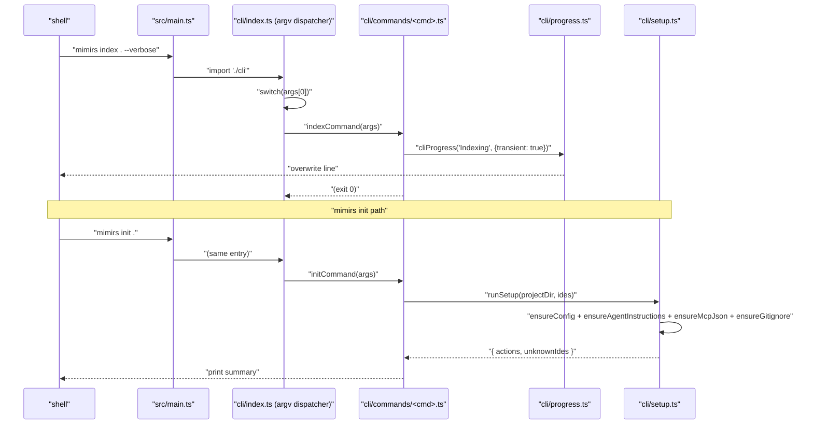

# cli

The CLI entry layer. `src/main.ts` defers straight here; `index.ts` is the argv dispatcher that routes `mimirs <subcommand>` to one of 19 command handlers in `commands/`. `progress.ts` is the terminal renderer that powers `mimirs index`'s one-line "N/M files — path" display, and `setup.ts` is the installer — on `mimirs init` it seeds `.mimirs/config.json`, appends a gitignore line, drops an MCP snippet into each IDE's config, and writes a `## Using mimirs tools` block into the project's agent-instructions files.

Entry file: `src/cli/index.ts`.

## Public API

The module's surface is split three ways. `index.ts` itself exports nothing — it's an argv-driven entry script. `progress.ts` exports `cliProgress` (plus an internal `createQuietProgress`). `setup.ts` exports the `init`-command building blocks:

```ts
// progress.ts
export function cliProgress(msg: string, opts?: { transient?: boolean }): void

// setup.ts
export interface SetupResult { actions: string[]; unknownIdes: string[]; }
export type KnownIDE = "claude" | "cursor" | "windsurf" | "copilot" | "jetbrains";

export function runSetup(projectDir: string, ides?: string[]): Promise<SetupResult>
export function confirm(question: string): Promise<boolean>
export function detectAgentHints(projectDir: string): string[]
export function ensureAgentInstructions(projectDir: string, ides?: string[]): Promise<string[]>
export function ensureConfig(projectDir: string): Promise<string | null>
export function ensureGitignore(projectDir: string): Promise<string | null>
export function ensureMcpJson(projectDir: string, ides?: string[]): Promise<string[]>
export function mcpConfigSnippet(projectDir: string): string
export function parseIdeFlag(value: string): string[]
export function unknownIdes(ides?: string[]): string[]
```

The `ensure*` helpers create their target file if missing; if the file exists and already contains the `<!-- mimirs -->` marker (or the `## Using mimirs tools` heading), they **skip** it and return `null` — they do not rewrite. Fresh content on a pre-marked file requires deleting the block (or the file) manually first.

## How it works



1. **Dispatch.** `cli/index.ts` runs at module load. It reads `process.argv.slice(2)`, looks at `args[0]`, and calls the matching `*Command(args)` from `commands/`. Unknown commands fall through to `usage()`.
2. **Why `serve` is dynamic-imported.** Every other command import is static, but `serve` is loaded via dynamic `import()` inside the dispatcher. The transitive deps pull in `bun:sqlite`, `sqlite-vec`, and top-level `await` calls that would crash the whole CLI at module load if they fail. A `doctor` command that can't even load would be useless; the dynamic import keeps failure scoped to `mimirs serve`.
3. **Progress UI.** Each long-running command (`index`, `history index`, `benchmark`) threads a progress callback down to the domain code. `cliProgress` distinguishes transient (`\r`-overwriting) and persistent messages; `createQuietProgress(totalFiles)` is the default renderer without `--verbose`, parsing `file:start` / `file:done` / `Embedded N/M` / `Found` / `Pruned` / `Resolved` messages into a single updating line.
4. **`setup.ts` is self-healing once, not on every run.** Every generated block is bracketed by a `<!-- mimirs -->` marker (or the `.mdc` / Windsurf frontmatter equivalent). On the next `mimirs init`, the helper sees the marker and returns `null` — `runSetup` reports "no action taken" rather than overwriting. The upside is that user edits to the block survive; the downside is that template updates in `INSTRUCTIONS_BLOCK` don't propagate without manual deletion.

## Per-file breakdown

### `index.ts` — argv dispatcher

The top-level dispatcher. Imports every command handler statically except `serve` (see above). The body is a `switch` over `command` with `init`, `index`, `search`, `read`, `status`, `remove`, `analytics`, `benchmark`, `benchmark-models`, `eval`, `map`, `conversation`, `checkpoint`, `annotations`, `session-context`, `history`, `doctor`, `cleanup`, `demo`, `serve`, and a default `usage()`. All command handlers take the raw `args` array and do their own option parsing.

### `progress.ts` — terminal rendering

`cliProgress(msg, opts)` is the universal callback handed to the indexer. Transient mode writes `\r${msg.padEnd(cols-1)}` so the next transient message overwrites it; clearing writes a blank line before any persistent message to avoid interleaved output. `createQuietProgress(totalFiles)` is a higher-level factory that parses progress events into a single updating line, suppressing the per-file chatter.

### `setup.ts` — `mimirs init` / doctor helpers

`runSetup` fans out to the four `ensure*` helpers and returns a consolidated `SetupResult` with `actions` (human-readable log lines) and `unknownIdes` (any `--ide` values that didn't match the `KnownIDE` set). `mcpConfigSnippet(projectDir)` returns the JSON fragment that `ensureMcpJson` merges into each IDE's MCP config via `upsertMcpJson` (which reads the JSON, adds `mcpServers.mimirs` only if absent, and rewrites). `detectAgentHints(projectDir)` scans the project for existing `.mcp.json` / `.cursor` / `.junie` / `.windsurf` markers so the `doctor` command can print the right guidance. `confirm(question)` is a thin `readline` wrapper used by the cleanup command. `ensureAgentInstructions` targets five files per run: `CLAUDE.md`, `.cursor/rules/mimirs.mdc`, `.windsurf/rules/mimirs.md`, `.junie/guidelines/mimirs.md`, and `.github/copilot-instructions.md` — the non-Claude ones only fire if `--ide` names them or the corresponding directory already exists.

## Configuration

The CLI has no env vars or config fields of its own — it's the surface that consumes `RagConfig` from `config/index.ts` and accepts flags:

- `--ide IDEs` — comma-separated list (`claude,cursor,windsurf,copilot,jetbrains`, or `all`). Unknown values accumulate in `SetupResult.unknownIdes`.
- `-v` / `--verbose` — switches `mimirs index` from `createQuietProgress` to plain `cliProgress`, surfacing per-file lines.
- `--dir D` — overrides cwd for every command that indexes or reads. Forwarded to `RagDB(projectDir)`; does not set `RAG_PROJECT_DIR` for child processes.
- `--top N`, `--threshold T`, `--patterns`, `--since REF`, `--author A`, `--out F`, `--focus F`, etc. — per-command flags documented in the `usage()` text.

## Known issues

- **`serve` dynamic import masks early failures.** A syntax error in `src/server/*` only surfaces when the user actually runs `mimirs serve`, not at CLI load. The tradeoff is intentional (see above) but worth knowing when debugging startup issues — `mimirs doctor` probes the serve entry specifically.
- **`cliProgress` assumes `process.stdout.columns`.** In non-TTY environments (CI logs, redirected output) `columns` is undefined; the code defaults to 80, but the `\r` carriage-return loses meaning entirely, producing one line per update. Use `-v` / `--verbose` to get persistent per-line output in that environment.
- **`ensure*` helpers skip on marker, don't refresh.** Once `<!-- mimirs -->` is in a file, a subsequent `mimirs init` does nothing to that file even if `INSTRUCTIONS_BLOCK` has changed. To pick up template updates, delete the block (or the file) and re-run init.
- **`upsertMcpJson` skips on invalid JSON.** If an existing `.mcp.json` (or `.cursor/mcp.json`, etc.) has a syntax error, init reports "Skipped … (invalid JSON — fix it manually or delete it)" rather than overwriting, but the overall init still succeeds — a user may miss the warning in the summary.
- **Windsurf MCP entries live in `~/.codeium`.** `ensureMcpJson` writes both the standalone (`~/.codeium/windsurf/mcp_config.json`) and plugin (`~/.codeium/mcp_config.json`) locations when Windsurf is selected or `.windsurf/` exists. Users not expecting home-dir writes can be surprised.

## See also

- [Architecture](../architecture.md)
- [Getting Started](../guides/getting-started.md)
- [Conventions](../guides/conventions.md)
