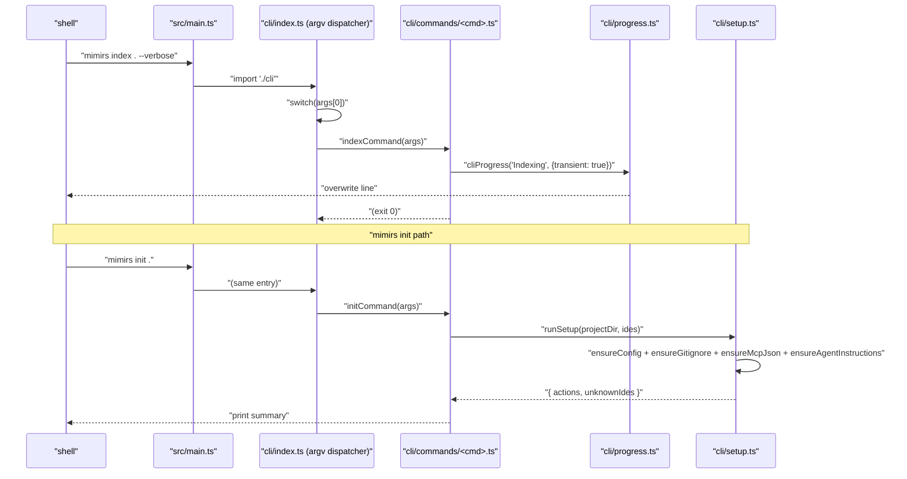

# cli

The CLI entry layer. `src/main.ts` defers straight here; `index.ts` is the argv dispatcher that routes `mimirs <subcommand>` to one of 19 command handlers in `commands/`. `progress.ts` is the terminal-renderer that powers `mimirs index`'s one-line "N/M files — path" display, and `setup.ts` is the installer — on `mimirs init`, it seeds `.mimirs/config.json`, appends a gitignore line, drops an MCP snippet into each IDE's config, and writes a `## Using mimirs tools` block into the project's agent-instructions file.

Entry file: `src/cli/index.ts`.

## Public API

The module's surface is split three ways. `index.ts` itself exports nothing — it's an argv-driven entry script. `progress.ts` exports two progress-renderer helpers. `setup.ts` exports the `init`-command building blocks:

```ts
// progress.ts
cliProgress(msg: string, opts?: { transient?: boolean }): void
// (plus createQuietProgress(totalFiles) — internal to the index command)

// setup.ts
runSetup(projectDir: string, ides?: string[]): Promise<SetupResult>

interface SetupResult { actions: string[]; unknownIdes: string[]; }
type KnownIDE = "claude" | "cursor" | "windsurf" | "copilot" | "jetbrains";

confirm(question: string): Promise<boolean>
detectAgentHints(projectDir: string): string[]
ensureAgentInstructions(projectDir: string, ides?: string[]): Promise<string[]>
ensureConfig(projectDir: string): Promise<string | null>
ensureGitignore(projectDir: string): Promise<string | null>
ensureMcpJson(projectDir: string, ides?: string[]): Promise<string[]>
mcpConfigSnippet(projectDir: string): string
parseIdeFlag(value: string): string[]
unknownIdes(ides?: string[]): string[]
```

`ensure*` helpers are self-healing: each creates the target file if missing and appends a marked block (guarded by `<!-- mimirs -->`) if present. Repeat runs are idempotent.

## How it works



1. **Dispatch.** `cli/index.ts` runs at module load. It reads `process.argv.slice(2)`, reads `args[0]`, and calls the matching `*Command(args)` from `commands/`. Unknown commands fall through to `usage()`.
2. **Why `serve` is dynamic-imported.** Every other command import is static, but `serve` is loaded via dynamic `import()` inside the dispatcher. The transitive deps pull in `bun:sqlite`, `sqlite-vec`, and top-level `await` calls that would crash the whole CLI at module load if they fail. A doctor command that can't even load would be useless; the dynamic import keeps failure scoped to `mimirs serve`.
3. **Progress UI.** Each long-running command (`index`, `history index`, `benchmark`) threads a progress callback down to the domain code. `cliProgress` distinguishes transient (`\r`-overwriting) and persistent messages; `createQuietProgress(totalFiles)` is the default renderer without `--verbose`, suppressing per-file lines and keeping a single `Indexing: 42/120 files (35%) | 3/9 — src/foo.ts` line updating in place.
4. **`setup.ts` marker block.** Every generated block is bracketed by `<!-- mimirs -->` markers (or their language-appropriate equivalents). Subsequent runs detect the marker, delete the previous block, and write the new one — no double-stacking, no drift from template updates. `INSTRUCTIONS_BLOCK` in `setup.ts` is the source of truth for the `## Using mimirs tools` section that appears in `CLAUDE.md` / `AGENTS.md` / `.cursorrules`.

## Per-file breakdown

### `index.ts` — argv dispatcher

The top-level dispatcher. Imports every command handler statically except `serve` (see above). The body is a `switch` over `command` with `init`, `index`, `search`, `read`, `status`, `remove`, `analytics`, `benchmark`, `benchmark-models`, `eval`, `map`, `conversation`, `checkpoint`, `annotations`, `session-context`, `history`, `doctor`, `cleanup`, `demo`, `serve`, and a default `usage()`. All command handlers take the raw `args` array and do their own option parsing.

### `progress.ts` — terminal rendering

`cliProgress(msg, opts)` is the universal callback handed to the indexer. Transient mode writes `\r${msg.padEnd(cols-1)}` so the next transient message overwrites it; clearTransient writes a blank line before any persistent message to avoid interleaved output. `createQuietProgress(totalFiles)` is a higher-level factory that parses `file:start`, `file:done`, `Embedded N/M`, and a few summary prefixes (`Found`, `Pruned`, `Resolved`) into a single updating progress line, suppressing the per-file chatter.

### `setup.ts` — `mimirs init` / doctor helpers

`runSetup` fans out to the four `ensure*` helpers and returns a consolidated `SetupResult` with `actions` (human-readable log lines) and `unknownIdes` (any `--ide` values that didn't match the `KnownIDE` set). `mcpConfigSnippet(projectDir)` returns the JSON fragment that `ensureMcpJson` merges into each IDE's MCP config. `detectAgentHints(projectDir)` scans the project for existing `CLAUDE.md` / `AGENTS.md` / `.cursorrules` files so `ensureAgentInstructions` can pick the right target. `confirm(question)` is a thin `readline` wrapper used by the cleanup command.

## Configuration

The CLI has no env vars or config fields of its own — it's the surface that consumes `RagConfig` from `config/index.ts` and accepts flags:

- `--ide IDEs` — comma-separated list (`claude,cursor,windsurf,copilot,jetbrains`, or `all`). Unknown values accumulate in `SetupResult.unknownIdes`.
- `-v` / `--verbose` — switches `mimirs index` from `createQuietProgress` to plain `cliProgress`, surfacing per-file lines.
- `--dir D` — overrides cwd for every command that indexes or reads. Forwarded to `RagDB(projectDir)`; does not set `RAG_PROJECT_DIR` for child processes.
- `--top N`, `--threshold T`, `--patterns`, `--since REF`, `--author A`, `--out F`, `--focus F`, etc. — per-command flags documented in the `usage()` text.

## Known issues

- **`serve` dynamic import masks early failures.** A syntax error in `src/server/*` only surfaces when the user actually runs `mimirs serve`, not at CLI load. The tradeoff is intentional (see above) but worth knowing when debugging startup issues — use `mimirs doctor`, which probes the serve entry specifically.
- **`cliProgress` assumes `process.stdout.columns`.** In non-TTY environments (CI logs, redirected output) `columns` is undefined; the code defaults to 80 but the `\r` carriage-return loses meaning entirely, producing one line per update. Set `-v` / `--verbose` to get persistent per-line output in that environment.
- **`ensureAgentInstructions` only writes one file.** If a project has both `CLAUDE.md` and `AGENTS.md`, the helper writes to the first match returned by `detectAgentHints`. A project using multiple agents gets one up-to-date instructions block and one stale one.

## See also

- [Architecture](../architecture.md)
- [Getting Started](../guides/getting-started.md)
- [Conventions](../guides/conventions.md)
