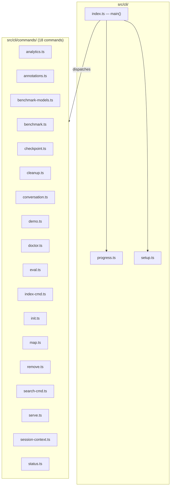
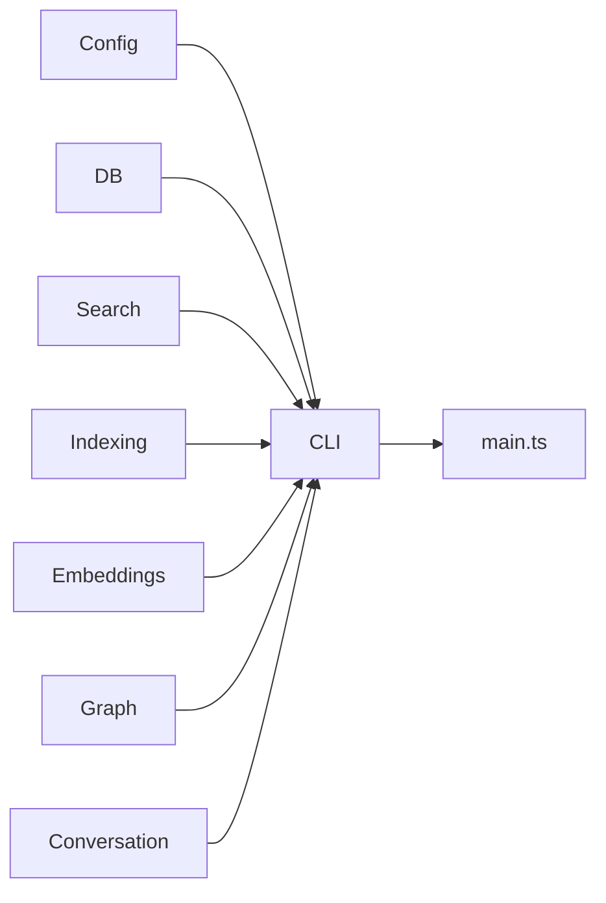

# CLI Module

The CLI module (`src/cli/`) is the command-line interface for mimirs. It
parses arguments, dispatches to command handlers, provides progress display,
and handles first-run setup across multiple AI agent hosts (Claude Code,
Cursor, Windsurf, Copilot).

## Structure

## Entry Point -- `main()`

`src/cli/index.ts` exports a `main()` function that reads `process.argv`,
identifies the command name, and dispatches to the matching handler via a
`switch` statement. Every command is implemented in its own file under
`src/cli/commands/`.

## Setup -- `setup.ts`

Handles first-run configuration and IDE integration. Key exports:

- **`runSetup()`** -- interactive setup wizard
- **`ensureConfig()`** -- creates `.mimirs/config.json` with defaults if absent
- **`ensureAgentInstructions()`** -- injects mimirs tool guidance into the
  agent's instruction file (e.g., `CLAUDE.md`)
- **`ensureMcpJson()`** -- writes the MCP server entry into the IDE's config
- **`ensureGitignore()`** -- adds `.mimirs/` to `.gitignore`
- **`mcpConfigSnippet()`** -- generates the JSON snippet for MCP registration
- **`detectAgentHints()`** -- auto-detects which AI agent is in use
- **`parseIdeFlag()`** -- parses `--ide` flag value
- **`confirm()`** -- simple y/n prompt

Supported IDEs: Claude Code, Cursor, Windsurf, Copilot.

## Progress -- `progress.ts`

CLI progress display utilities for long-running operations like indexing and
embedding. Used by command handlers to show real-time feedback in the terminal.

## Commands

| Command | File | Purpose |
|---------|------|---------|
| `analytics` | `analytics.ts` | View search analytics and query trends |
| `annotations` | `annotations.ts` | Manage persistent file/symbol annotations |
| `benchmark-models` | `benchmark-models.ts` | Compare embedding model performance |
| `benchmark` | `benchmark.ts` | Run search quality benchmarks |
| `checkpoint` | `checkpoint.ts` | Create and list project checkpoints |
| `cleanup` | `cleanup.ts` | Remove stale data from the index |
| `conversation` | `conversation.ts` | Index and search conversation history |
| `demo` | `demo.ts` | Run an interactive demo |
| `doctor` | `doctor.ts` | Diagnose common setup problems |
| `eval` | `eval.ts` | Evaluate search result quality |
| `index` | `index-cmd.ts` | Index project files |
| `init` | `init.ts` | Initialize mimirs in a project |
| `map` | `map.ts` | Generate project dependency maps |
| `remove` | `remove.ts` | Remove files from the index |
| `search` | `search-cmd.ts` | Search the index from the terminal |
| `serve` | `serve.ts` | Start the MCP server |
| `session-context` | `session-context.ts` | Show session context information |
| `status` | `status.ts` | Show index status and statistics |

## Dependencies and Dependents

- **Depends on:** Config, DB, Search, Indexing, Embeddings, Graph, Conversation
- **Depended on by:** `main.ts` entry point

## See Also

- [CLI Internals](internals.md) -- detailed breakdown of setup and command dispatch
- [Server module](../server/) -- MCP server started by the `serve` command
- [Config module](../config/) -- configuration loaded during setup
- [Architecture overview](../../architecture.md)
