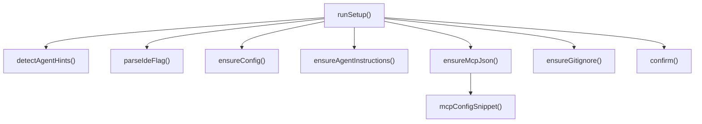

# CLI Internals

Detailed breakdown of the CLI module's internal files.

## `index.ts` -- Command Dispatch

The `main()` function is the CLI entry point. It:

1. Reads `process.argv` to extract the command name and arguments.
2. Uses a `switch` statement to dispatch to the appropriate command handler.
3. Each command handler is imported from `src/cli/commands/`.

The dispatch is straightforward -- no plugin system or dynamic loading. Adding
a new command means adding a `case` branch and a corresponding file in
`commands/`.

## `setup.ts` -- First-Run Configuration

The setup module handles onboarding across multiple IDE environments. The flow:

### IDE Detection

`detectAgentHints()` inspects the project directory for IDE-specific markers:

- **Claude Code** -- looks for `CLAUDE.md` or `.claude/` directory
- **Cursor** -- looks for `.cursor/` or `.cursorrules`
- **Windsurf** -- looks for `.windsurf/` or `.windsurfrules`
- **Copilot** -- looks for `.github/copilot-instructions.md`

`parseIdeFlag()` converts the `--ide` argument string into an enum value.

### Config and Instructions

- `ensureConfig()` creates `.mimirs/config.json` with `DEFAULT_CONFIG` values if
  the file does not exist.
- `ensureAgentInstructions()` appends mimirs usage guidance to the IDE's
  instruction file (e.g., `CLAUDE.md`).
- `ensureMcpJson()` writes the MCP server registration into the IDE's MCP
  config file. Uses `mcpConfigSnippet()` to generate the JSON payload.
- `ensureGitignore()` appends `.mimirs/` to the project's `.gitignore`.

### User Confirmation

`confirm(prompt)` is a simple y/n readline prompt. Returns a boolean. Used
throughout setup to allow users to skip individual steps.

## `progress.ts` -- Progress Display

Provides terminal progress indicators for long-running operations. Used by
command handlers (especially `index` and `conversation`) to show real-time
feedback. Outputs to stderr to avoid interfering with stdout data.

## Command Files

All 18 command handlers live in `src/cli/commands/`. Each exports a function
that receives parsed arguments and executes the command logic. Commands
typically:

1. Load config via the Config module.
2. Open or create a `RagDB` instance.
3. Perform the operation using the appropriate module (Search, Indexing, etc.).
4. Display results using `progress.ts` or direct console output.

| File | Command | Key Operations |
|------|---------|---------------|
| `analytics.ts` | `analytics` | Reads query log from DB, displays trends |
| `annotations.ts` | `annotations` | CRUD operations on file/symbol annotations |
| `benchmark-models.ts` | `benchmark-models` | Runs embedding benchmarks across models |
| `benchmark.ts` | `benchmark` | Runs search quality benchmarks |
| `checkpoint.ts` | `checkpoint` | Creates checkpoints, lists history |
| `cleanup.ts` | `cleanup` | Prunes stale files and orphaned chunks |
| `conversation.ts` | `conversation` | Indexes JSONL logs, searches conversation |
| `demo.ts` | `demo` | Interactive demo walkthrough |
| `doctor.ts` | `doctor` | Checks SQLite, embeddings, config health |
| `eval.ts` | `eval` | Evaluates search precision/recall |
| `index-cmd.ts` | `index` | Triggers file indexing pipeline |
| `init.ts` | `init` | Runs setup wizard |
| `map.ts` | `map` | Generates and displays project maps |
| `remove.ts` | `remove` | Removes files from the index |
| `search-cmd.ts` | `search` | Runs search queries, displays results |
| `serve.ts` | `serve` | Starts MCP server via Server module |
| `session-context.ts` | `session-context` | Displays session metadata |
| `status.ts` | `status` | Shows index statistics |

## See Also

- [CLI overview](index.md) -- module summary and command table
- [Config module](../config/) -- configuration loaded during setup
- [Server module](../server/) -- started by the `serve` command
