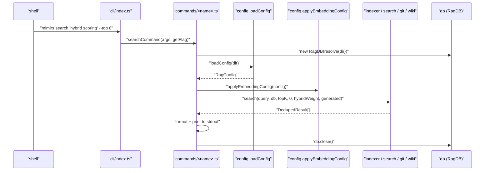

# commands

The 19 subcommand handlers behind `mimirs <cmd>`. Each file exports one (occasionally two) `*Command(args, getFlag)` function; every one is invoked by `cli/index.ts`, which receives `process.argv.slice(2)` and a helper to read long flags like `--ide`, `--top`, `--dir`, `--patterns`. Handlers are the thin translation layer between argv and the rest of the codebase — they construct `RagDB(projectDir)`, call `loadConfig` + `applyEmbeddingConfig`, hand off to the domain module (indexer, search, git indexer, conversation, wiki, etc.), and print results.

No business logic lives here. This layer is where CLI flags meet typed calls.

## How it works

Every command follows the same shape:

1. Resolve the project directory — either `args[N]` if it doesn't look like a flag, or `process.cwd()`.
2. Instantiate `RagDB(dir)`. The constructor runs schema migrations and loads `sqlite-vec`.
3. Call `loadConfig(dir)` → `applyEmbeddingConfig(config)` so per-project model overrides apply before the first `embed()`.
4. Do the work — usually one call into a domain module.
5. Print to `cli.log` / `cli.error` (stdout/stderr split, see `utils/log`).
6. Close the DB.

## Per-file breakdown

### `index-cmd.ts` — `mimirs index [dir]`

The most-run command. Resolves the directory, applies `--patterns` to `config.include` if supplied, then runs `indexDirectory`. Chooses between `cliProgress` (verbose) and `createQuietProgress(totalFiles)` (default one-line-updater) based on `-v` / `--verbose`. `createQuietProgress` is instantiated lazily on the `Found N files to index` message so it knows the total up front.

### `init.ts` — `mimirs init [dir] [--ide IDEs]`

Runs `runSetup(dir, ides)` (config, gitignore, MCP snippets, agent instructions) and then offers to do the first index pass. Writes a `.mimirs/status` progress file in parallel with terminal output so an IDE installer can watch without parsing stderr.

### `search-cmd.ts` — `mimirs search` / `mimirs read`

Two exports (`searchCommand`, `readCommand`). `search` calls `search(query, db, topK, 0, config.hybridWeight, config.generated)` and prints path + score + snippet. `read` calls `searchChunks` for chunk-level results with exact line ranges — same shape the `read_relevant` MCP tool returns.

### `status.ts` — `mimirs status [dir]`

No arguments beyond directory. Prints `db.getStatus()` (file count, chunk count, DB size). Also reports whether the embedding model matches `config.embeddingModel` — mismatches signal "you need a DB reset".

### `remove.ts` — `mimirs remove <file>`

One file, one call to `db.removeFile(path)`. Cascaded deletes handle the chunks + FTS + vec rows.

### `analytics.ts` — `mimirs analytics [--days N]`

Prints the query log rollup — top queries, zero-result rate, 90th percentile latency. Powered by `db.getAnalytics(days)` and `getAnalyticsTrend(days)`.

### `map.ts` — `mimirs map [dir] [--focus F] [--zoom L] [--max N]`

Wraps `generateProjectMap` from the graph module. `--focus` restricts the subgraph to a file's neighborhood; `--zoom` toggles file-level vs directory-level collapsing; `--max N` caps node count.

### `benchmark.ts` / `benchmark-models.ts` — recall@K harnesses

`benchmark` runs the search recall benchmark against a fixture JSON and exits non-zero if `recallAtK < config.benchmarkMinRecall` or `mrr < config.benchmarkMinMrr`. `benchmark-models` indexes the project once per candidate embedding model and reports per-model scores — used when tuning `embeddingModel`.

### `eval.ts` — `mimirs eval <file>`

Runs each task in the eval fixture twice (with RAG and without), writing traces to `--out`. Consumed by the `eval` test target and by `benchmarks/quality-bench-worker.ts`.

### `conversation.ts` — `search`, `sessions`, `index`

Three subcommands: `search` calls `db.searchConversation`; `sessions` lists indexed sessions with turn/token counts; `index` walks `~/.claude/projects/<slug>/` and indexes every JSONL file through `indexConversation`.

### `checkpoint.ts` — `create`, `list`, `search`

The CLI face of the checkpoint-tools module. Create takes `<type> <title> 
` plus `--files` / `--tags`; list and search take the usual filter flags.

### `annotations.ts` — `mimirs annotations`

Lists annotations (optionally filtered by `--path`). Deletion happens through the MCP `delete_annotation` tool, not this command — there's no `mimirs annotation remove`.

### `session-context.ts` — session start summary

The headless equivalent of the `session_context` MCP call. Prints recent commits, active files, and open annotations. Useful as a shell hook.

### `history.ts` — `history index`, `history search`, `history status`

Wrapper over the git indexer. `index` takes `--since REF` for incremental reindex, reusing `db.getLastIndexedCommit()` as the default anchor. `search` runs `db.searchGitCommits` with `--author` / `--since` filters.

### `demo.ts` — `mimirs demo`

Interactive guided walk-through that runs `search`, `read`, `project_map` on a canned query so new users see what each command prints. Imports many domain modules directly.

### `doctor.ts` — `mimirs doctor`

A battery of checks: Bun present, SQLite capable of extensions (with per-platform `brew install sqlite` / `libsqlite3-dev` / `sqlite-devel` fixups), `.mimirs/` writable, embedding model downloadable. Each check returns `null` for pass or a string error. Invoked when a user's `serve` fails — crucial because `serve` defers loading until after doctor's checks would have fired.

### `cleanup.ts` — `mimirs cleanup [-y]`

The opposite of `init`. Removes `.mimirs/`, strips `mimirs` from every known MCP config, removes the `<!-- mimirs -->`-bracketed block from agent-instructions files, and prunes the `.mimirs/` line from `.gitignore`. `-y` skips the confirmation prompt. A file that becomes whitespace-only after removal is deleted rather than left empty.

### `serve.ts` — `mimirs serve`

The MCP entry. Dynamic-imports `src/server` so module-load failures write a diagnostic `server-error.log` + `status` file to `.mimirs/` before rethrowing — otherwise the IDE would see a stdio pipe close with no indication why. Forwards to `startServer()` from the server module and keeps the process alive on stdin/stdout.

## Internals

- **`getFlag(flag)`** is the shared long-flag helper the dispatcher hands every command. It scans argv for `--foo value` (or `--foo=value`), returns `undefined` when absent. Commands use it uniformly — there's no per-command arg parser.
- **Directory resolution idiom.** `resolve(args[N] && !args[N].startsWith("--") ? args[N] : ".")`. This appears verbatim in ~14 commands and lets a user write `mimirs index --patterns foo` without the directory arg clashing with the flag.
- **`RAG_PROJECT_DIR` precedence in `doctor` / `serve` only.** These two commands honour `process.env.RAG_PROJECT_DIR` as a fallback because MCP invocations pass it instead of argv. The other commands use `process.cwd()` directly.
- **Silent status-file writes.** `init` and `serve` write to `.mimirs/status` behind `try/catch`; failures are swallowed because the status file is a convenience, never a correctness requirement.

## Configuration

- `--dir D` / positional dir — every command accepts a trailing directory.
- `--verbose` / `-v` — per-file output in `index` and `history index`.
- `--yes` / `-y` — skip confirmation in `init` and `cleanup`.
- `--patterns glob1,glob2` — override `config.include` for one `index` run.
- `--top N`, `--threshold T`, `--author A`, `--since S`, `--days N`, `--out F`, `--focus F`, `--zoom file|directory`, `--max N`, `--tags t1,t2`, `--files f1,f2`, `--ide I1,I2` — per-command.
- `process.env.RAG_PROJECT_DIR` — read by `doctor` and `serve`.

## Known issues

- **Commands don't share argv validation.** Each handler re-implements "directory is first non-flag arg" inline. A user who writes `mimirs index -- src/foo` gets surprising results because `--` isn't treated as an end-of-flags marker.
- **`serveCommand` rethrows after diagnostics.** The process exits with a non-zero code, which is fine for launched-by-IDE flows but surprising if a user runs `mimirs serve` in a terminal expecting a retry loop.
- **Cleanup is best-effort about MCP configs.** If an IDE stores its MCP config in a non-standard path (e.g. a Windsurf fork), `cleanup` won't find it. A warning would help but there's no enumeration API.
- **Doctor runs checks sequentially.** SQLite-extension loading is the slow step; on a cold cache it can take several seconds while doctor appears hung. No progress indicator.

## See also

- [Architecture](../architecture.md)
- [Getting Started](../guides/getting-started.md)
- [Conventions](../guides/conventions.md)
- [Testing](../guides/testing.md)
