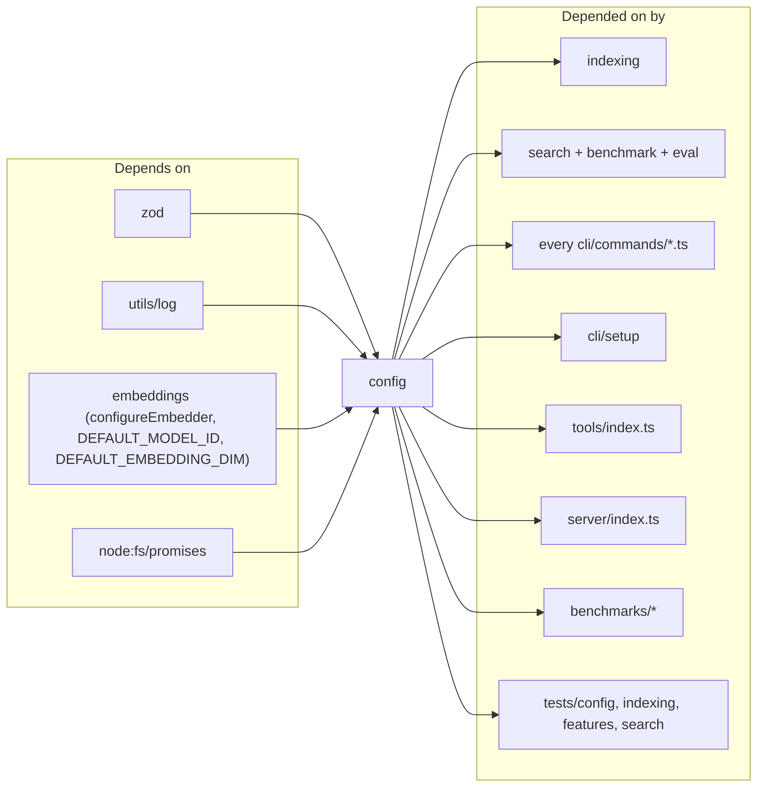

# config

A single file (`src/config/index.ts`) that owns the project's runtime configuration. It defines the Zod schema `RagConfigSchema`, ships a `DEFAULT_CONFIG` with opinionated defaults, and exports `loadConfig(projectDir)` plus `applyEmbeddingConfig(config)`. The contract is deliberately flat: what lives on disk in `.mimirs/config.json` is what runs — no merge layering, no hidden overrides. Fan-in is 29 (indexer, search, every CLI command, benchmark harnesses, tests) and the module imports only `utils/log` and `embeddings` in return.

## Public API

```ts
type RagConfig = z.infer<typeof RagConfigSchema>

loadConfig(projectDir: string): Promise<RagConfig>
applyEmbeddingConfig(config: RagConfig): void
```

`loadConfig` is self-healing: if `.mimirs/config.json` is missing it writes the defaults and returns them; if the file exists but is invalid JSON or fails schema validation, it logs a warning and returns the defaults unchanged (never throws). `applyEmbeddingConfig` forwards `embeddingModel` / `embeddingDim` into `configureEmbedder` so the embeddings singleton picks up per-project overrides before the first embed call.

## Dependencies and Dependents



## Configuration

Every field in `RagConfigSchema` with its default:

| Field | Default | Purpose |
|---|---|---|
| `include` | 60+ glob patterns covering 24 AST-aware languages + Markdown + build files + scripts + schema languages | Which files the indexer walks |
| `exclude` | `node_modules`, `.git`, `dist`, `build`, `.env*`, `.mimirs`, `coverage`, language-specific caches, IDE dirs | Walk-time exclusions |
| `generated` | `[]` | Glob patterns whose matches get ×0.75 score demotion in search |
| `chunkSize` | `512` | Soft target char count for paragraph-fallback chunker (min 64) |
| `chunkOverlap` | `50` | Character overlap between paragraph-fallback chunks |
| `hybridWeight` | `0.7` | 70% vector / 30% BM25 in hybrid ranking |
| `searchTopK` | `10` | Default file-level search result count |
| `indexBatchSize` | `50` | Files processed per index transaction batch |
| `indexThreads` | unset | ONNX thread override; embedding uses `max(2, cores/3)` when unset |
| `incrementalChunks` | `false` | When true, diff chunk hashes and embed only new ones (opt-in) |
| `embeddingMerge` | `true` | Window + merge oversized texts rather than truncating |
| `embeddingModel` | unset | HuggingFace model id override (default `Xenova/all-MiniLM-L6-v2`) |
| `embeddingDim` | unset | Required if `embeddingModel` is set to a non-384-dim model |
| `parentGroupingMinCount` | `2` | Min sibling chunks before search replaces them with the parent |
| `benchmarkTopK` | `5` | Top-K for the recall@K benchmark harness |
| `benchmarkMinRecall` | `0.8` | Benchmark CLI exits non-zero below this |
| `benchmarkMinMrr` | `0.6` | Benchmark CLI exits non-zero below this |

## Known issues

- **No validation-error propagation.** `loadConfig` returns defaults on validation failure and logs a warning through `log.warn`. Unusual schema errors may therefore be masked; check the log before assuming the config was honoured.
- **Self-healing writes only once.** The default file is only written when missing. If a field is added to the schema in a later mimirs version, existing `config.json` files keep their old shape and the new field just takes its default — there is no migration.
- **CSS is included in source but disabled.** The default `include` list comments out `*.css` / `*.scss` / `*.less` because class names add noise to code search. Reinstate them manually if the project is CSS-heavy.

## See also

- [Architecture](../architecture.md)
- [Getting Started](../guides/getting-started.md)
- [Conventions](../guides/conventions.md)
