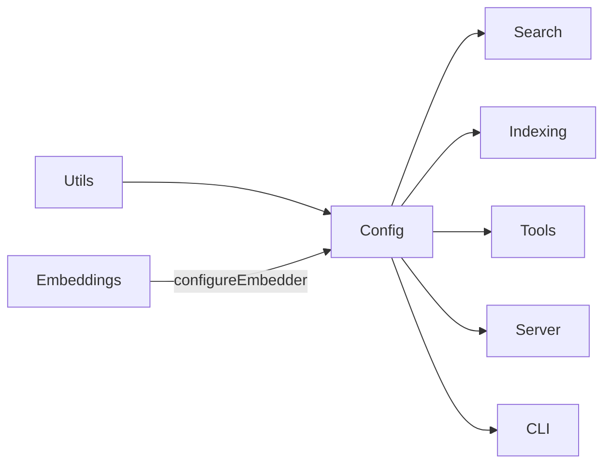

# Config Module

The Config module (`src/config/`) manages project-level configuration for
mimirs. It defines the schema, defaults, and loading logic for
`.mimirs/config.json`.

## Entry Point -- `index.ts`

A single file module with the following exports:

- **`RagConfigSchema`** -- Zod schema defining all config fields and their
  validation rules.
- **`DEFAULT_CONFIG`** -- Default values used when creating a new config file.
- **`loadConfig(projectDir)`** -- Reads `.mimirs/config.json`, validates it
  against the Zod schema, and returns the parsed config. Auto-creates the file
  with defaults if it does not exist.
- **`applyEmbeddingConfig(config)`** -- Takes a loaded config and calls
  `configureEmbedder()` from the Embeddings module to set the active model
  and dimension.

## Config Location

Configuration is stored at `<projectDir>/.mimirs/config.json`. The file is
auto-created with `DEFAULT_CONFIG` values on first access.

## Key Config Fields

> **Important:** `chunkSize` and `chunkOverlap` are measured in **characters**,
> not tokens. This is a common source of confusion.

The Zod schema validates all fields. Unknown keys are rejected. Refer to
`RagConfigSchema` in `src/config/index.ts` for the full set of fields and
their types.

## Dependencies and Dependents

- **Depends on:** Utils, Embeddings (`configureEmbedder`)
- **Depended on by:** Search, Indexing, Tools, Server, CLI

## See Also

- [Embeddings module](../embeddings/) -- provides `configureEmbedder()` called
  by `applyEmbeddingConfig`
- [Utils module](../utils/) -- utility functions used by config loading
- [CLI module](../cli/) -- `ensureConfig()` in setup creates the config file
- [Architecture overview](../../architecture.md)
