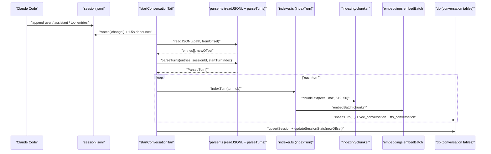

# conversation

Two files that give mimirs memory across Claude Code sessions. `parser.ts` reads the JSONL transcripts Claude Code writes to disk, parses user/assistant entries plus tool-use results into one `ParsedTurn` per round-trip, and exposes helpers for walking the file incrementally by byte offset. `indexer.ts` takes those turns, chunks the combined text, embeds it, and inserts it into the DB's conversation tables. `startConversationTail` then watches the file for appends and keeps the index live during an ongoing session. Fan-in is 7: the MCP server, the `conversation` and `checkpoint` CLI commands, `tools/checkpoint-tools`, and the conversation test suites.

## Public API

| Export | File | Purpose |
|---|---|---|
| `JournalEntry` (interface) | `parser.ts` | Raw JSONL entry shape: `type` (`user` / `assistant` / `queue-operation` / `file-history-snapshot`), optional `uuid`, `parentUuid`, `timestamp`, `sessionId`, `message` with `ContentBlock[]` and token usage, and `toolUseResult` with filenames + duration |
| `ContentBlock` (type) | `parser.ts` | Union: `text`, `thinking`, `tool_use` (name + input), `tool_result` (id + content) |
| `ParsedTurn` (interface) | `parser.ts` | One conversational round: `userText`, `assistantText`, `toolsUsed`, `filesReferenced`, `tokenCost`, `summary` (first 200 chars), plus `turnIndex` / `timestamp` / `sessionId` / `toolResults` |
| `ToolResultInfo` (interface) | `parser.ts` | `toolName`, `content`, `durationMs`, `filenames` |
| `SessionInfo` (interface) | `parser.ts` | `sessionId`, `jsonlPath`, `mtime`, `size` — returned by the session-discovery helpers used by the `conversation` CLI |

The runtime entry points (`readJSONL`, `parseTurns`, `buildTurnText`, `indexConversation`, `startConversationTail`) are internal to the module plus a handful of callers (the MCP server, the `conversation` CLI command, and `checkpoint-tools`); they don't appear in the export summary above.

## How it works

1. **Read from offset.** `readJSONL(path, fromOffset)` stats the file, `Buffer.alloc`s only the new bytes, reads via `openSync`/`readSync`, and returns `{ entries, newOffset }` — subsequent calls are cheap even on multi-megabyte transcripts.
2. **Parse turns.** `parseTurns` walks entries and pairs user messages with the next assistant message (plus any intervening `tool_use` / `tool_result` blocks), collapsing them into one `ParsedTurn`. A small policy throws away redundant tool-result content: Claude's own `Read` / `Glob` / `Write` / `Edit` / `NotebookEdit` results are skipped because the code index already has that content (`SKIP_CONTENT_TOOLS`); other tool results are kept when they're under `SHORT_RESULT_THRESHOLD` (500 chars).
3. **Build turn text.** `buildTurnText(turn)` composes the user message, assistant message, tool summaries, and file references into a single markdown-shaped blob.
4. **Chunk, embed, insert.** `chunkText` runs with `".md"` so paragraph-fallback splitting applies (no AST parser on conversation text). Chunks are embedded in one `embedBatch` call and inserted through `db.insertTurn`, which writes a `conversation_turns` row plus `vec_conversation` / `fts_conversation` rows in one transaction. A zero-id return means the turn was already indexed — idempotent by `(sessionId, turnIndex)`.
5. **Update session row.** `upsertSession` / `updateSessionStats` record `mtimeMs` and the new offset so the next tail tick starts from the right place; an initial `processNewData()` runs before the watcher is armed, so sessions are indexed even if no further writes arrive.

## Key exports

| Export | Kind | Source of truth |
|---|---|---|
| `JournalEntry` | interface | `parser.ts` |
| `ContentBlock` | type | `parser.ts` |
| `ParsedTurn` | interface | `parser.ts` |
| `ToolResultInfo` | interface | `parser.ts` |
| `SessionInfo` | interface | `parser.ts` |

## Configuration

- `TAIL_DEBOUNCE_MS = 1500` — internal constant in `indexer.ts`. The tail watcher coalesces rapid JSONL appends into one reindex pass; Claude Code can write multiple lines per streamed chunk and a debounce avoids thrashing.
- `SKIP_CONTENT_TOOLS` — `Read`, `Glob`, `Write`, `Edit`, `NotebookEdit`. These tool results aren't embedded because the same content is already in the code index; only the tool name is recorded in `toolsUsed` for the turn.
- `SHORT_RESULT_THRESHOLD = 500` — maximum size in chars for tool results that are kept verbatim. Above this, results from `SKIP_CONTENT_TOOLS` tools are dropped entirely and longer results from other tools are truncated.
- Chunk size / overlap for conversation text are hard-coded to `512` / `50` in `indexTurn`. Changing `RagConfig.chunkSize` / `chunkOverlap` does not affect conversation chunking.

## Known issues

- **`parseTurns` pairs by ordering, not `parentUuid`.** If the JSONL contains an out-of-order assistant reply (rare but possible in error-retry flows), the pairing can mis-attribute tool results. The subsequent turn usually re-syncs.
- **Tail debounce swallows fast partial writes.** If an assistant turn spans many small appends, the 1.5-second debounce batches them — good for throughput, bad if you want "almost-live" indexing within a single turn.
- **`upsertSession` stores `mtimeMs` but doesn't reconcile clock skew.** If the JSONL file is moved between filesystems with different mtime resolutions, the heuristic "has anything changed?" can under- or over-trigger.
- **Offset is bytes, not lines.** If a transcript file is ever rewritten (not appended to), the stored offset becomes meaningless. The tail watcher will re-read from the bogus offset and probably index nothing — delete the session row to recover.
- **Malformed JSONL lines are silently dropped.** `readJSONL` catches the `JSON.parse` throw and moves on; if Claude Code ever writes a partial line (say, from a kill signal) it's lost without warning.

## See also

- [Architecture](../architecture.md)
- [Data Flows](../data-flows.md)
- [Conventions](../guides/conventions.md)
