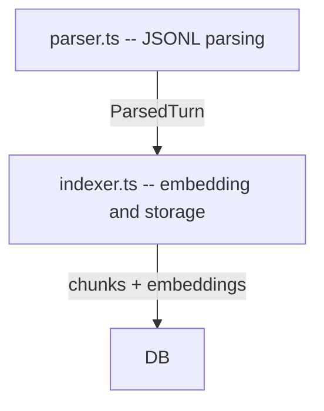
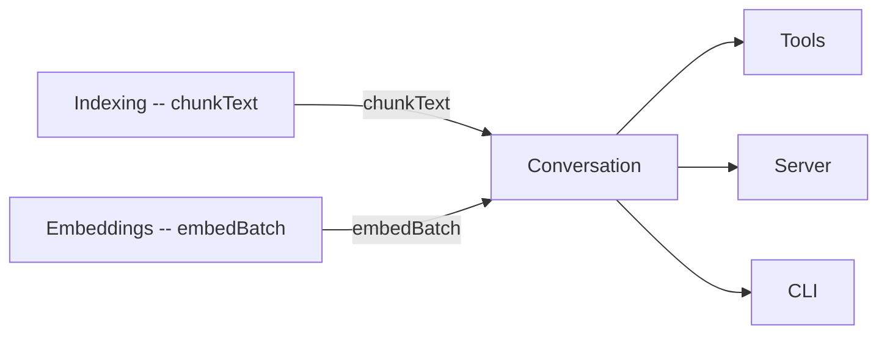

# Conversation Module

The Conversation module (`src/conversation/`) parses and indexes Claude Code
conversation history from JSONL log files. It enables semantic search over
past sessions, allowing the AI agent to recall previous discussions and
decisions.

## Structure

## Files

### `parser.ts` -- JSONL Log Parsing

Parses Claude Code's JSONL conversation logs into structured data. Exports:

- **`readJSONL(path, fromOffset)`** -- Reads a JSONL file, optionally starting
  from a byte offset for incremental reads.
- **`parseTurns(entries, sessionId, startIndex)`** -- Converts raw journal
  entries into `ParsedTurn` objects, grouping by conversation turn. A "turn"
  starts with a user text message and includes everything until the next user
  text message. Tool use/result exchanges within a turn are aggregated.
- **`buildTurnText(turn)`** -- Renders a `ParsedTurn` into plain text suitable
  for embedding.
- **`discoverSessions(projectDir)`** -- Scans the Claude Code data directory
  (`~/.claude/projects/<encoded-path>/`) to find all available session JSONL
  files. Returns sessions sorted by modification time (most recent first).

#### Types

| Type | Description |
|------|-------------|
| `JournalEntry` | Raw JSONL log entry |
| `ContentBlock` | Individual content block within an entry |
| `ParsedTurn` | A complete conversation turn (user or assistant) |
| `ToolResultInfo` | Metadata about a tool call within a turn |
| `SessionInfo` | Session discovery metadata (path, id, timestamps) |

### `indexer.ts` -- Conversation Indexing

Indexes parsed conversation turns into the database for semantic search.
Exports:

- **`indexConversation(jsonlPath, sessionId, db, fromOffset?, startTurnIndex?, onProgress?)`**
  -- Main entry point. Reads, parses, chunks, embeds, and stores conversation
  data. Supports incremental indexing via `fromOffset` and `startTurnIndex`.
- **`startConversationTail(jsonlPath, sessionId, db, onEvent?)`** -- Watches a
  JSONL file for new entries and indexes them in real time. Used by the MCP
  server to keep conversation search up to date during a session.

> **Note:** `indexTurn` is a private function internal to `indexer.ts`. It is
> **not exported** and should not be called directly.

## Dependencies and Dependents

- **Depends on:** Indexing (`chunkText`), Embeddings (`embedBatch`)
- **Depended on by:** Tools, Server, CLI

## See Also

- [Embeddings module](../embeddings/) -- generates embeddings for conversation chunks
- [Tools module](../tools/) -- `search_conversation` tool wraps this module
- [Server module](../server/) -- uses `startConversationTail` for live indexing
- [DB module](../db/) -- conversation tables that store the indexed data
- [Data Flow](../../data-flow.md) -- conversation indexing pipeline diagram
- [Architecture overview](../../architecture.md)
