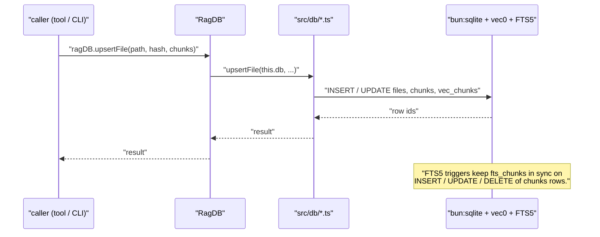
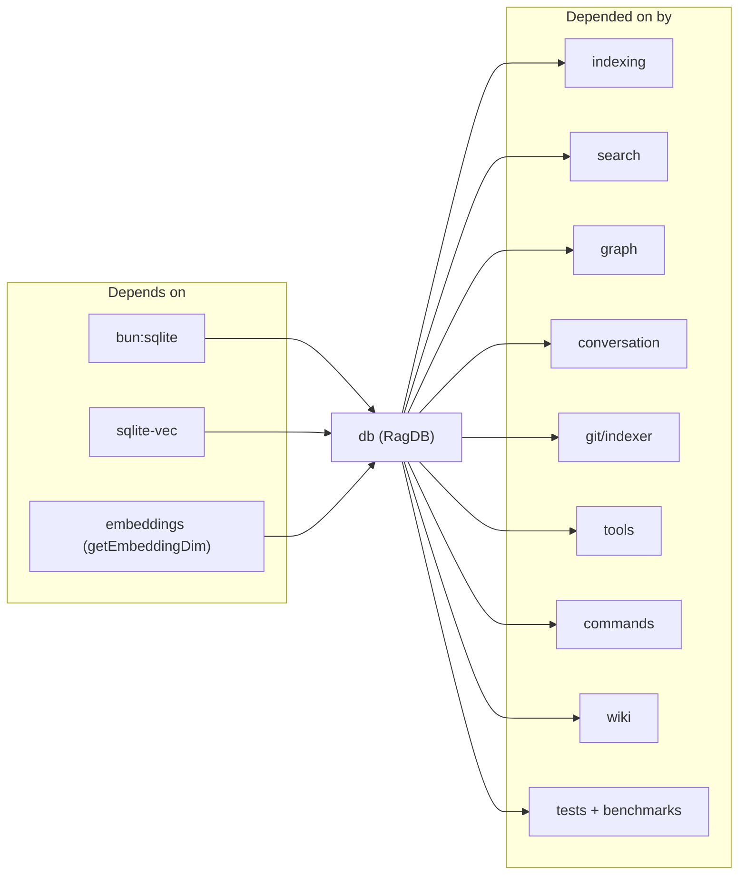

# db

The `db` module is the persistence boundary of mimirs. Every other module — indexer, search, conversation, graph, tools, CLI — reaches the SQLite store through the `RagDB` facade exported from `src/db/index.ts`. The class holds a single `bun:sqlite` connection with `sqlite-vec` loaded, runs schema migrations on open, and forwards work into ten topic files (`files.ts`, `search.ts`, `graph.ts`, `conversation.ts`, `checkpoints.ts`, `annotations.ts`, `analytics.ts`, `git-history.ts`, `types.ts` for row shapes, plus `index.ts` itself). No code outside this module opens `Database` directly; the facade is the rule.

## How it works

1. **Open** — `new RagDB(projectDir)` calls `loadCustomSQLite()` (points bun at Homebrew SQLite on macOS), creates `.mimirs/` (or `RAG_DB_DIR`), opens `index.db`, sets `journal_mode=WAL`, `busy_timeout=5000`, loads `sqlite-vec`, and runs `initSchema()`.
2. **Route** — every instance method on `RagDB` forwards into one of the per-concern files. The facade itself holds no SQL; each sub-file's function takes the raw `Database` parameter, which makes them trivially unit-testable against an in-memory DB.
3. **Persist** — writes go through triggers: inserting a chunks row fires an FTS insert; updating it fires a delete + insert on FTS. Only `vec_chunks` rows are written explicitly with the embedding bytes — FTS and the core table stay in lockstep automatically.

## Per-file breakdown

### `index.ts` — `RagDB` facade

The class. Constructor takes `projectDir` and an optional `customRagDir`; resolution precedence is `customRagDir → RAG_DB_DIR → <projectDir>/.mimirs`. `initSchema()` runs the full CREATE-IF-NOT-EXISTS block — files, chunks, `vec_chunks(FLOAT[dim])`, `fts_chunks`, FTS sync triggers, `file_imports` / `file_exports`, conversation tables, checkpoints, `vec_checkpoints`, `query_log`, `git_commits` / `git_commit_files`, `vec_git_commits`, and `fts_git_commits`. The embedding dimension is read lazily from `getEmbeddingDim()` so `configureEmbedder(modelId, dim)` calls before schema init produce the right `vec0` column width.

### `files.ts` — file rows and chunks

Owns `getFileByPath`, `getAllFilePaths`, `upsertFileStart`, `upsertFile`, `insertChunkBatch`, `removeFile`, `pruneDeleted`, `getStatus`. `upsertFileStart` returns the file id as the streaming path — the indexer calls it first, then `insertChunkBatch(fileId, chunks, startIndex)` in transactional batches. `pruneDeleted(existingPaths)` drops rows whose path is no longer on disk; cascaded deletes clean up `chunks`, `vec_chunks`, and both `file_*` graph tables.

### `search.ts` — vector + BM25 + symbols

Exposes `vectorSearch`, `vectorSearchChunks`, `textSearch`, `textSearchChunks`, `searchSymbols`, and `findUsages`. Vector searches run `SELECT * FROM vec_chunks WHERE embedding MATCH ?` with `k = topK`; text searches run FTS5 `MATCH` against `fts_chunks`. Chunk-level variants do not dedupe by file; file-level variants aggregate to one row per path. `searchSymbols` walks the `chunks` + `file_exports` tables to answer "what is the type/declaration of this name" without re-embedding; `findUsages` is the grep-adjacent fallback that returns line-anchored snippets.

### `graph.ts` — imports / exports / resolution

Owns `upsertFileGraph` (bulk-writes `file_imports` and `file_exports` for a file), `getGraph`, `getSubgraph(fileIds, maxHops)`, `getImportersOf`, `getImportsForFile`, plus the two-pass resolver's helpers `getUnresolvedImports` and `resolveImport(importId, resolvedFileId)`. Unresolved imports are inserted with `resolved_file_id = NULL` during the first walk; the resolver then runs after all files are indexed and patches the ids.

### `conversation.ts` — JSONL sessions and turns

`upsertSession`, `getSession`, `updateSessionStats`, and `getTurnCount` manage session rows keyed by Claude Code session uuid; `insertTurn(sessionId, turnIndex, timestamp, userText, assistantText, toolsUsed, filesReferenced, tokenCost, summary, chunks)` writes one row to `conversation_turns` plus N chunks + N embeddings in one transaction. `searchConversation` and `textSearchConversation` are the query variants against `vec_conversation` and `fts_conversation`.

### `checkpoints.ts` — session-scoped decisions

`createCheckpoint`, `getCheckpoint`, `listCheckpoints`, `searchCheckpoints`. Rows land in `conversation_checkpoints`; the accompanying `vec_checkpoints` table holds the embedding so `searchCheckpoints` can blend semantic match with `type` / `sessionId` filters.

### `annotations.ts` — inline notes

`getAnnotations(path?, symbolName?)`, `deleteAnnotation(id)`, `searchAnnotations(queryEmbedding, topK)`. Writes happen through the `annotate` MCP tool, which inserts on `annotations` (defined in the schema). Read-side is what surfaces `[NOTE]` blocks inline in `read_relevant` output.

### `analytics.ts` — query log

`logQuery(query, resultCount, topScore, topPath, durationMs)` is called by every hybrid search; `getAnalytics(days)` and `getAnalyticsTrend(days)` aggregate `query_log` into the payloads the `search_analytics` tool returns.

### `git-history.ts` — commits

`GitCommitInsert` is the write-side shape; `insertCommitBatch(commits)` uses `INSERT OR IGNORE` on the unique `hash` column so re-runs are idempotent. `getLastIndexedCommit` anchors the next `git log` range; `hasCommit(hash)` is the fast-path dedupe. `searchGitCommits` / `textSearchGitCommits` query `vec_git_commits` / `fts_git_commits` with optional `author`, `since`, `until`, `path` filters. `getFileHistory(filePath, topK, since?)` is the file-scoped query backing the `file_history` tool.

### `types.ts` — row shapes

Eleven interfaces re-exported through `index.ts`: `StoredFile`, `StoredChunk`, `SearchResult`, `ChunkSearchResult`, `UsageResult`, `SymbolResult`, `AnnotationRow`, `CheckpointRow`, `ConversationSearchResult`, `GitCommitRow`, `GitCommitSearchResult`. Having them in one file is what makes the `import { ... } from "../db"` idiom work across the codebase.

## Dependencies and Dependents

## Internals

- **`sqlite-vec` requires a vanilla SQLite build.** On macOS, `loadCustomSQLite()` calls `Database.setCustomSQLite()` with the Homebrew path (`/opt/homebrew/opt/sqlite/lib/libsqlite3.dylib` or the Intel equivalent) and throws a specific `brew install sqlite` error otherwise. On Linux, a list of common distro paths is tried; if none match, the loader falls through and lets `sqlite-vec.load()` raise its own error. Windows uses bun's bundled SQLite.
- **Every embedding column sizes itself from `getEmbeddingDim()`.** `vec_chunks`, `vec_conversation`, `vec_checkpoints`, and `vec_git_commits` all use `FLOAT[${getEmbeddingDim()}]` at schema-init time. Switching models requires dropping the db — existing vec rows would be dimensionally wrong.
- **FTS stays in sync via triggers.** Three triggers per FTS-backed table (`*_ai` / `*_ad` / `*_au`) forward every chunk insert/delete/update to the FTS5 virtual table. No code path writes to FTS directly.
- **`WAL` + `busy_timeout=5000`.** Journal mode is WAL so the indexer can write while a search reads; the 5-second busy timeout accommodates the rare lock contention during bulk upserts.
- **Unresolved imports linger.** `upsertFileGraph` always inserts imports with `resolved_file_id = NULL`. `src/graph/resolver.ts` runs after the walk and patches them via `resolveImport`, avoiding a file-ordering dependency.

## Configuration

- `RAG_DB_DIR` (env) — relocates the whole index outside the project directory. Resolved before `.mimirs/` default. Use when the project dir is read-only (nix store, Docker image).
- `customRagDir` (constructor arg) — takes precedence over the env var. Tests use it with `createTempDir()`.

## Known issues

- **macOS system SQLite fails silently on `sqlite-vec` load.** The constructor throws a specific error pointing to `brew install sqlite` before the load would otherwise fail with a confusing "extension not supported" message.
- **EACCES / EROFS on `.mimirs/`.** The constructor catches the mkdir error, names the offending path, and instructs the caller to set `RAG_DB_DIR`. Other OS errors propagate unchanged.
- **Re-indexing after a model change requires a DB reset.** Changing the embedding model changes `getEmbeddingDim()`, which means new `vec_chunks` inserts would be dimensionally incompatible with existing rows. Delete `.mimirs/index.db` and re-index.

## See also

- [types](types.md)
- [files](files.md)
- [git-history](git-history.md)
- [conversation](conversation.md)
- [graph](graph.md)
- [Architecture](../../architecture.md)
- [Data Flows](../../data-flows.md)
- [Conventions](../../guides/conventions.md)
