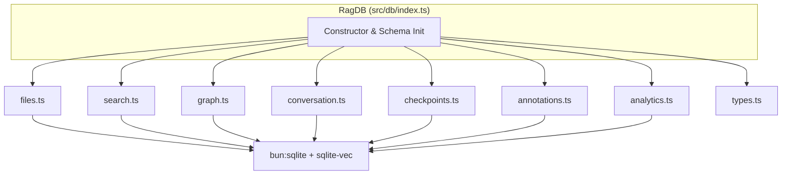
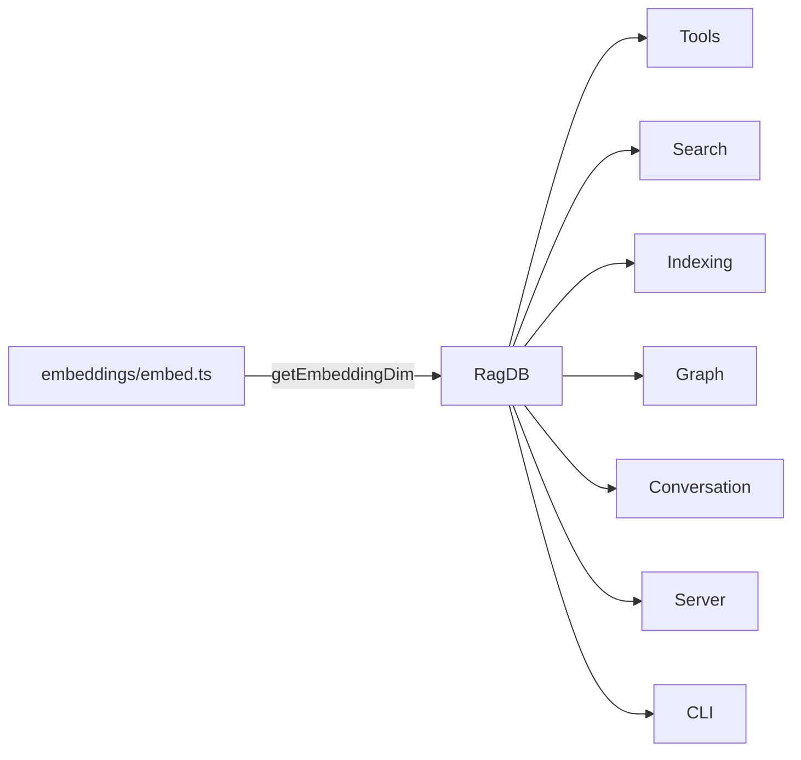

# DB Module

The DB module (`src/db/`) is the persistence layer for mimirs. It wraps
SQLite via `bun:sqlite`, loading the [sqlite-vec](https://github.com/asg017/sqlite-vec)
extension for vector similarity search and using FTS5 for BM25 full-text
ranking.

## Architecture



## Entry Point -- `RagDB` Class

All database access flows through the `RagDB` class exported from
`src/db/index.ts`. The constructor accepts:

```ts
constructor(projectDir: string, customRagDir?: string)
```

- **projectDir** -- used to derive the default `.mimirs/` storage directory.
- **customRagDir** -- explicit override. If omitted, falls back to
  `RAG_DB_DIR` env var, then `<projectDir>/.rag`.

On instantiation the class:

1. Calls `loadCustomSQLite()` -- on macOS, swaps Apple's bundled SQLite
   (which lacks extension support) for Homebrew's build.
2. Creates the `.mimirs/` directory if absent.
3. Opens `index.db` with WAL mode and a 5-second busy timeout.
4. Loads the sqlite-vec extension.
5. Runs `initSchema()` to create all tables, virtual tables, triggers,
   and indexes.
6. Runs incremental migrations (`migrateChunksEntityColumns`,
   `migrateParentChunkColumns`, `migrateGraphColumns`).

The underlying `Database` handle is **private** -- consumers interact
exclusively through the facade methods on `RagDB`.

## Tables

| Table | Engine | Purpose |
|---|---|---|
| `files` | regular | Indexed file paths and content hashes |
| `chunks` | regular | Code/doc snippets with entity metadata and line ranges |
| `vec_chunks` | vec0 | Vector embeddings for chunk similarity search |
| `fts_chunks` | FTS5 | BM25 full-text index over chunk snippets |
| `file_imports` | regular | Import edges for the dependency graph |
| `file_exports` | regular | Export declarations per file |
| `conversation_sessions` | regular | Claude Code JSONL session metadata |
| `conversation_turns` | regular | Individual conversation turns with summaries |
| `conversation_chunks` | regular | Chunked conversation text |
| `vec_conversation` | vec0 | Vector embeddings for conversation search |
| `fts_conversation` | FTS5 | BM25 full-text index over conversation chunks |
| `conversation_checkpoints` | regular | Milestone markers across sessions |
| `vec_checkpoints` | vec0 | Vector embeddings for checkpoint search |
| `query_log` | regular | Search analytics (query text, scores, timing) |
| `annotations` | regular | Persistent notes on files and symbols |
| `fts_annotations` | FTS5 | Full-text index over annotation notes |
| `vec_annotations` | vec0 | Vector embeddings for annotation search |

## Sub-Modules

The `RagDB` class delegates to seven sub-module files. Each receives the raw
`Database` handle as its first argument.

| File | Responsibility |
|---|---|
| [`files.ts`](internals.md#filests--filechunk-crud) | File and chunk CRUD, pruning, incremental updates |
| [`search.ts`](internals.md#searchts--search-queries) | Vector and FTS queries for chunks and symbols |
| [`graph.ts`](internals.md#graphts--dependency-graph) | Import/export graph storage, BFS subgraph extraction |
| [`conversation.ts`](internals.md#conversationts--conversation-tables) | Session and turn persistence, conversation search |
| [`checkpoints.ts`](internals.md#checkpointsts--checkpoints) | Checkpoint create/list/search |
| [`annotations.ts`](internals.md#annotationsts--annotations) | Annotation upsert with FTS+vector sync |
| [`analytics.ts`](internals.md#analyticsts--analytics) | Query logging and trend analysis |

## Dependencies and Dependents



- **Depends on:** `embeddings/embed.ts` (for `getEmbeddingDim` used to size
  `vec0` virtual table columns).
- **Depended on by:** Tools, Search, Indexing, Graph, Conversation, Server, CLI.

## macOS SQLite Workaround

Apple ships a custom SQLite build that blocks extension loading. On Darwin,
`loadCustomSQLite()` searches for Homebrew's vanilla SQLite at:

1. `/opt/homebrew/opt/sqlite/lib/libsqlite3.dylib` (Apple Silicon)
2. `/usr/local/opt/sqlite/lib/libsqlite3.dylib` (Intel)

If neither is found, the constructor throws with a message suggesting
`brew install sqlite`.

## See Also

- [Internals](internals.md) -- detailed breakdown of every sub-module file
- [Search module](../search/) -- higher-level search orchestration that calls into DB
- [Indexing module](../indexing/) -- file indexing pipeline that writes to DB
- [Graph module](../graph/) -- graph operations built on the DB graph sub-module
- [Architecture overview](../../architecture.md)
