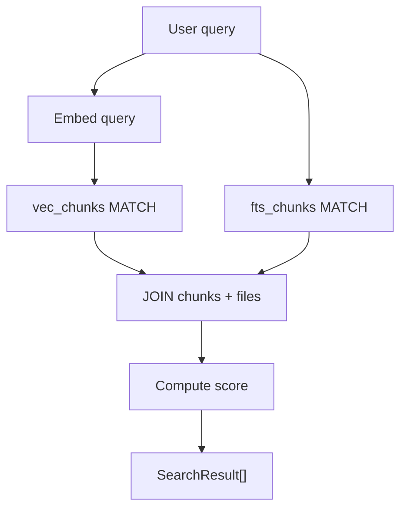
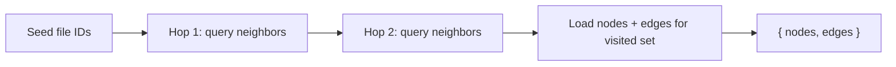
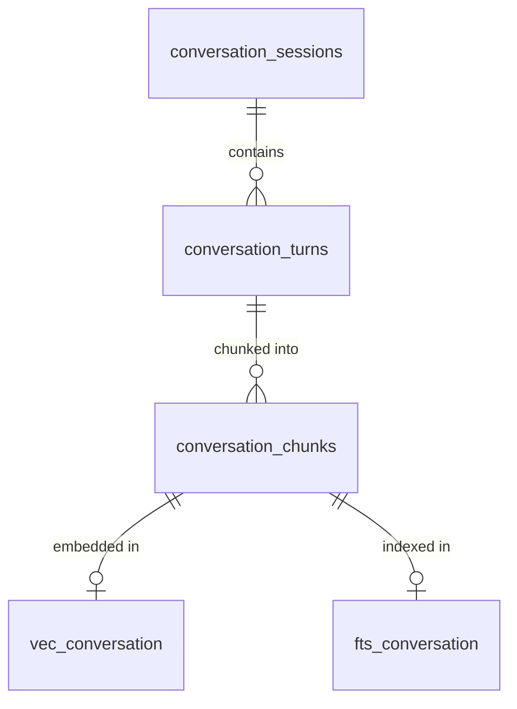

# DB Module Internals

Detailed breakdown of each sub-module file inside `src/db/`. Every function
in these files takes a raw `bun:sqlite` `Database` handle as its first
argument. The [`RagDB`](index.md) facade class wraps each one, forwarding
its private `db` handle.

---

## `types.ts` -- Shared Interfaces

Defines the TypeScript interfaces used across all DB sub-modules and their
consumers. Re-exported from `src/db/index.ts` so dependents can import from
`"../db"`.

| Interface | Fields | Used By |
|---|---|---|
| `StoredChunk` | `id`, `fileId`, `chunkIndex`, `snippet`, `entityName`, `chunkType`, `startLine`, `endLine`, `parentId` | files, search |
| `StoredFile` | `id`, `path`, `hash`, `indexedAt` | files |
| `SearchResult` | `path`, `score`, `snippet`, `chunkIndex`, `entityName`, `chunkType` | search (file-level) |
| `ChunkSearchResult` | `path`, `score`, `content`, `chunkIndex`, `entityName`, `chunkType`, `startLine`, `endLine`, `parentId` | search (chunk-level) |
| `UsageResult` | `path`, `line`, `snippet` | findUsages |
| `SymbolResult` | `path`, `symbolName`, `symbolType`, `snippet`, `chunkIndex` | searchSymbols |
| `AnnotationRow` | `id`, `path`, `symbolName`, `note`, `author`, `createdAt`, `updatedAt` | annotations |
| `CheckpointRow` | `id`, `sessionId`, `turnIndex`, `timestamp`, `type`, `title`, `summary`, `filesInvolved`, `tags` | checkpoints |
| `ConversationSearchResult` | `turnId`, `turnIndex`, `sessionId`, `timestamp`, `summary`, `snippet`, `toolsUsed`, `filesReferenced`, `score` | conversation |

---

## `files.ts` -- File/Chunk CRUD

Manages the `files`, `chunks`, `vec_chunks`, and `fts_chunks` tables. All
multi-statement operations use `db.transaction()` for atomicity.

### Functions

**`getFileByPath(db, path)`** -- Looks up a file record by its path. Returns
`StoredFile | null`.

**`upsertFileStart(db, path, hash)`** -- Idempotent file upsert that preserves
the `files.id` primary key (keeping `file_imports.resolved_file_id` foreign
keys intact). If the file already exists, it deletes all existing chunks and
their vector embeddings inside a transaction, then updates the hash and
timestamp. Returns the file ID.

**`updateFileHash(db, fileId, hash)`** -- Updates only the hash and
`indexed_at` timestamp without touching chunks. Used by the incremental
update path.

**`insertChunkBatch(db, fileId, chunks, startIndex)`** -- Bulk-inserts chunks
within a transaction. For each chunk, inserts into `chunks` and then into
`vec_chunks` with the embedding. Handles all metadata columns: `entity_name`,
`chunk_type`, `start_line`, `end_line`, `content_hash`, `parent_id`.

**`insertChunkReturningId(db, fileId, chunk, chunkIndex)`** -- Single-chunk
insert that returns the new chunk ID. Used to create parent chunks whose IDs
are referenced by child chunks.

**`getChunkById(db, chunkId)`** -- Fetches a chunk by primary key, joining
against `files` for the path. Used at query time for parent-chunk lookups.

**`upsertFile(db, path, hash, chunks)`** -- Convenience wrapper: calls
`upsertFileStart` then `insertChunkBatch`.

**`removeFile(db, path)`** -- Deletes a file and all its chunks/vectors in
a transaction. Returns `true` if the file existed.

**`pruneDeleted(db, existingPaths)`** -- Compares all indexed file paths
against a `Set` of paths that still exist on disk. Removes any that are
missing. Returns the count of pruned files.

**`getChunkHashes(db, fileId)`** -- Returns a `Set<string>` of `content_hash`
values for a file's chunks. Empty if the file was heuristic-chunked (no
hashes).

**`deleteStaleChunks(db, fileId, keepHashes)`** -- Deletes chunks whose
`content_hash` is not in the keep set (or is null). Used during incremental
re-indexing. Returns the number deleted.

**`updateChunkPositions(db, fileId, updates)`** -- Batch-updates
`chunk_index`, `start_line`, and `end_line` for kept chunks, matched by
`content_hash`.

**`getAllFilePaths(db)`** -- Returns `{ id, path }[]` for every indexed file.

**`getStatus(db)`** -- Returns aggregate stats: `totalFiles`, `totalChunks`,
and `lastIndexed` timestamp.

---

## `search.ts` -- Search Queries

Provides both vector similarity and BM25 full-text search across the chunk
tables, plus symbol and usage lookups via the graph tables.

### Scoring

- **Vector search:** `score = 1 / (1 + distance)` where distance comes from
  sqlite-vec's `MATCH` operator.
- **Text search:** `score = 1 / (1 + |rank|)` where rank is FTS5's BM25 rank
  (negative values indicate better matches).

### Functions

**`vectorSearch(db, queryEmbedding, topK=5)`** -- File-level vector search.
Joins `vec_chunks -> chunks -> files`. Returns `SearchResult[]`.

**`textSearch(db, query, topK=5)`** -- File-level BM25 search via
`fts_chunks`. Sanitizes the query through `sanitizeFTS()` before matching.
Returns `SearchResult[]`.

**`vectorSearchChunks(db, queryEmbedding, topK=8)`** -- Chunk-level vector
search. Returns `ChunkSearchResult[]` including `startLine`, `endLine`, and
`parentId`.

**`textSearchChunks(db, query, topK=8)`** -- Chunk-level BM25 search.
Returns `ChunkSearchResult[]`.

**`searchSymbols(db, query, exact=false, type?, topK=20)`** -- Searches
`file_exports` by name using `LIKE` (or exact match). Joins against `chunks`
to find the corresponding snippet. Optionally filters by export type.
Returns `SymbolResult[]`.

**`findUsages(db, symbolName, exact, top)`** -- Finds call sites for a
symbol. First identifies which files define the symbol (via `file_exports`),
then uses FTS5 phrase search to find chunks containing the name, excluding
defining files. Applies a regex refinement pass to locate the exact line
within each matching chunk. Returns `UsageResult[]`.

### Query Flow



---

## `graph.ts` -- Dependency Graph

Manages the `file_imports` and `file_exports` tables that form the project's
dependency graph. Supports forward and reverse dependency lookups plus BFS
subgraph extraction.

### Functions

**`upsertFileGraph(db, fileId, imports, exports)`** -- Replaces all imports
and exports for a file within a transaction. Each import record includes
`source`, `names`, `is_default`, and `is_namespace` flags. Each export
includes `name`, `type`, `is_default`, `is_reexport`, and
`reexport_source`.

**`resolveImport(db, importId, resolvedFileId)`** -- Sets the
`resolved_file_id` foreign key on a previously unresolved import.

**`getUnresolvedImports(db)`** -- Returns all imports where
`resolved_file_id IS NULL`, joining against `files` for the importer's path.

**`getGraph(db)`** -- Loads the full dependency graph. Batch-loads all
exports in a single query (not per-file) for performance. Returns
`{ nodes, edges }` where each node carries its exports and each edge links
importer to importee.

**`getSubgraph(db, fileIds, maxHops=2)`** -- Extracts a neighborhood around
the given file IDs using BFS. Batches frontier queries in groups of 499 to
stay within SQLite's 999-parameter limit. Returns the same
`{ nodes, edges }` shape as `getGraph`.

**`getImportsForFile(db, fileId)`** -- Returns raw import rows for a file.

**`getImportersOf(db, fileId)`** -- Returns file IDs of all files that
import the given file.

**`getDependsOn(db, fileId)`** -- Returns `{ path, source }[]` for
resolved dependencies (what this file imports).

**`getDependedOnBy(db, fileId)`** -- Returns `{ path, source }[]` for
reverse dependencies (who imports this file).

### Subgraph BFS



---

## `conversation.ts` -- Conversation Tables

Persists Claude Code conversation sessions, turns, and their searchable
chunks. Each turn is chunked and embedded for vector search, and also
indexed via FTS5.

### Functions

**`upsertSession(db, sessionId, jsonlPath, startedAt, mtime, readOffset)`**
-- Inserts or updates a conversation session. Uses `ON CONFLICT` upsert on
`session_id`.

**`getSession(db, sessionId)`** -- Fetches session metadata including
`mtime`, `readOffset`, and `turnCount`.

**`updateSessionStats(db, sessionId, turnCount, totalTokens, readOffset)`**
-- Updates running counts after indexing new turns.

**`insertTurn(db, sessionId, turnIndex, timestamp, userText, assistantText, toolsUsed, filesReferenced, tokenCost, summary, chunks)`**
-- Inserts a conversation turn and its chunks/vectors in a transaction.
Uses `INSERT OR IGNORE` to skip already-indexed turns (matched by the
`UNIQUE(session_id, turn_index)` constraint). Returns the turn ID (0 if
skipped).

**`getTurnCount(db, sessionId)`** -- Returns the number of indexed turns
for a session.

**`searchConversation(db, queryEmbedding, topK=5, sessionId?)`** -- Vector
search over conversation chunks. Deduplicates by turn ID (one result per
turn). When `sessionId` is provided, over-fetches then filters.

**`textSearchConversation(db, query, topK=5, sessionId?)`** -- BM25
full-text search over conversation chunks. Same deduplication and filtering
logic as the vector variant.

### Data Model



---

## `checkpoints.ts` -- Checkpoints

Manages milestone markers that capture decisions, blockers, and direction
changes across conversation sessions.

### Functions

**`createCheckpoint(db, sessionId, turnIndex, timestamp, type, title, summary, filesInvolved, tags, embedding)`**
-- Inserts a checkpoint row and its vector embedding in a transaction.
`filesInvolved` and `tags` are JSON-serialized. Returns the checkpoint ID.

**`listCheckpoints(db, sessionId?, type?, limit=20)`** -- Lists checkpoints
ordered by timestamp descending. Optionally filters by session and/or type.
Parses JSON arrays for `filesInvolved` and `tags`.

**`searchCheckpoints(db, queryEmbedding, topK=5, type?)`** -- Vector
similarity search over checkpoint embeddings. Over-fetches by 2x, then
applies optional type filter.

**`getCheckpoint(db, id)`** -- Fetches a single checkpoint by ID.

---

## `annotations.ts` -- Annotations

Persistent notes attached to files or individual symbols. Each annotation is
triple-indexed: relational (by path/symbol), FTS5 (full-text on note), and
vec0 (semantic similarity).

### Functions

**`upsertAnnotation(db, path, note, embedding, symbolName?, author?)`** --
Creates or updates an annotation. Matching logic: if `symbolName` is
provided, matches on `(path, symbol_name)`; otherwise matches on `(path,
symbol_name IS NULL)`. On update, manually syncs FTS and vec indexes
(delete old, insert new). Returns the annotation ID.

**`getAnnotations(db, path?, symbolName?)`** -- Fetches annotations with
optional path and symbol filters. Ordered by `updated_at DESC`.

**`searchAnnotations(db, queryEmbedding, topK=10)`** -- Vector similarity
search over annotation embeddings.

**`deleteAnnotation(db, id)`** -- Removes an annotation and its FTS/vec
entries in a transaction. Returns `true` if found and deleted.

### Index Sync

Because FTS5 content tables with `content=` external content do not
auto-sync on UPDATE, the annotation functions manually issue FTS delete
commands before re-inserting updated text:

```sql
INSERT INTO fts_annotations(fts_annotations, rowid, note)
  VALUES ('delete', ?, ?);
```

The same pattern applies to `vec_annotations`.

---

## `analytics.ts` -- Analytics

Logs every search query and provides aggregate analytics for monitoring
index quality.

### Functions

**`logQuery(db, query, resultCount, topScore, topPath, durationMs)`** --
Appends a row to `query_log` with the query text, result count, top hit
score/path, and execution duration.

**`getAnalytics(db, days=30)`** -- Returns a comprehensive analytics object:

| Field | Description |
|---|---|
| `totalQueries` | Count of queries in the time window |
| `avgResultCount` | Mean results per query |
| `avgTopScore` | Mean top-hit score (null if no scores) |
| `zeroResultQueries` | Top 10 queries that returned nothing |
| `lowScoreQueries` | Top 10 queries with `topScore < 0.3` |
| `topSearchedTerms` | Top 10 most frequent query strings |
| `queriesPerDay` | Daily query counts |

**`getAnalyticsTrend(db, days=7)`** -- Compares the current period against
the immediately preceding period of the same length. Returns `{ current,
previous, delta }` where each contains `totalQueries`, `avgTopScore`, and
`zeroResultRate`.

---

## See Also

- [DB module overview](index.md)
- [RagDB entity](../../entities/rag-db.md) -- class-level reference
- [Search module](../search/) -- orchestration layer that calls these DB functions
- [Indexing module](../indexing/) -- writes files/chunks/graph data through RagDB
- [Embeddings module](../embeddings/) -- produces the vectors stored in vec0 tables
