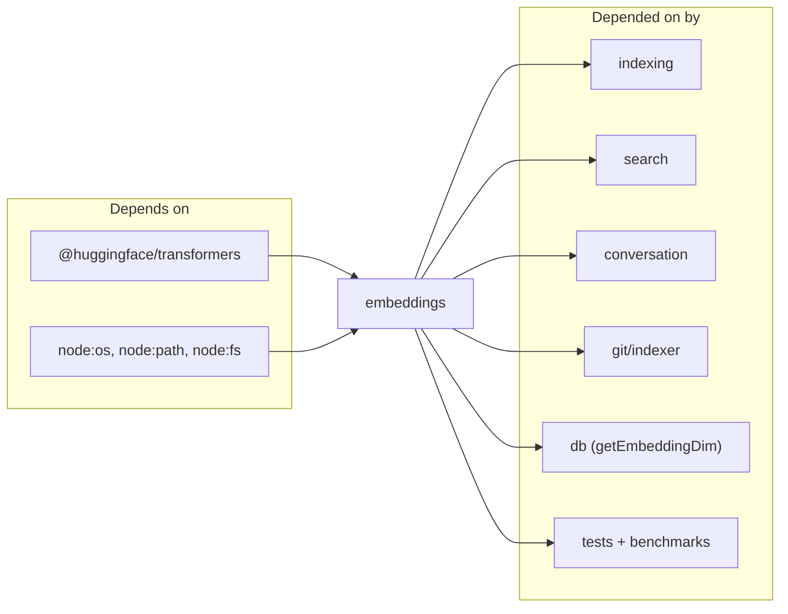

# embeddings

The embeddings module is the ONNX boundary of the project: one file (`src/embeddings/embed.ts`) wraps the `@huggingface/transformers` feature-extraction pipeline and exposes a narrow public API — `embed`, `embedBatch`, `mergeEmbeddings`, plus singleton accessors for the pipeline (`getEmbedder`) and tokenizer (`getTokenizer`). The default model is `Xenova/all-MiniLM-L6-v2` producing 384-dim L2-normalized vectors; texts longer than the 256-token window are split into overlapping windows (32-token overlap) and merged back into a single vector so every chunk lands on the same unit sphere. Fan-in is 17 — indexer, search, conversation indexer, git indexer, config, benchmarks, and most tests depend on this module.

## Public API

```ts
embed(text: string, threads?: number, onProgress?: (msg: string) => void): Promise<Float32Array>
embedBatch(texts: string[], threads?: number, onProgress?: (msg: string) => void): Promise<Float32Array[]>
getEmbedder(threads?: number, onProgress?: (msg: string) => void): Promise<FeatureExtractionPipeline>
getTokenizer(): Promise<PreTrainedTokenizer>
mergeEmbeddings(embeddings: Float32Array[]): Float32Array
```

`embed` is the single-string path used at query time. `embedBatch` is the high-throughput path the indexer uses — one call produces N contiguous vectors sliced out of a single Float32Array. `embedBatchMerged` (exported from the file but filtered out of the key-exports surface) is the oversized-text variant: it tokenizes, windows texts that exceed `MODEL_MAX_TOKENS = 256` using `MERGE_WINDOW_OVERLAP = 32`, runs one `embedBatch` over the flat list, then reassembles. `mergeEmbeddings` is the pure function at its heart — mean across the window set, then unit-normalize.

## Dependencies and Dependents



## Configuration

The module reads no runtime flags directly; configuration flows through `config.applyEmbeddingConfig` which calls `configureEmbedder(modelId, dim)`. That function resets the pipeline and tokenizer singletons only if either value actually changed, so the same config re-apply is a no-op. The cache directory is pinned at `~/.cache/mimirs/models` via `env.cacheDir` so models survive `bunx` temp-dir cleanup between invocations. Thread count defaults to `max(2, cores/3)` — tune via the `threads` argument or the `indexThreads` config field.

## Known issues

- **First use downloads ~23 MB of model weights.** `getEmbedder` fetches the MiniLM ONNX archive on the first call of the process; offline machines get a specific load error instead of a silent retry per file.
- **Corrupted cache recovery is one-shot.** The loader catches "Protobuf parsing failed" and "Load model" errors, deletes the cached model directory, and retries exactly once. A second failure propagates.
- **Model switches require a DB reset.** Changing `embeddingModel` / `embeddingDim` mid-lifetime works for the singleton, but existing `vec_chunks` / `vec_conversation` / `vec_checkpoints` / `vec_git_commits` rows are dimensionally frozen at schema creation — drop `.mimirs/index.db` and re-index.

## See also

- [Architecture](../architecture.md)
- [Data Flows](../data-flows.md)
- [Getting Started](../guides/getting-started.md)
