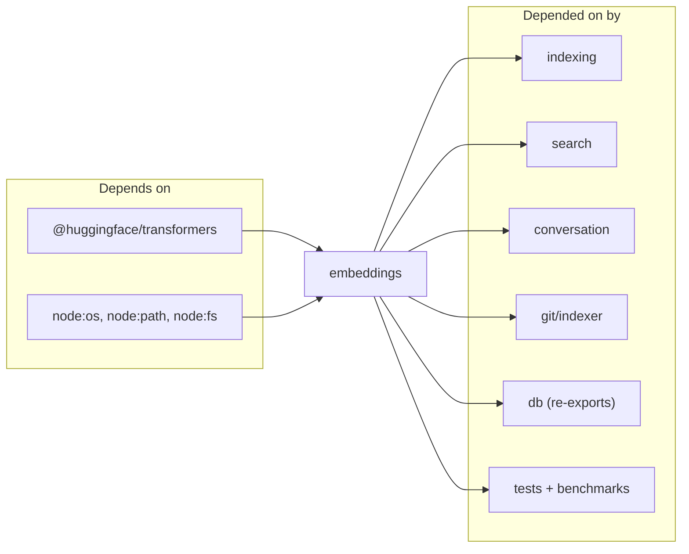

# embeddings

The embeddings module is the ONNX boundary of the project: one file (`src/embeddings/embed.ts`) wraps the `@huggingface/transformers` feature-extraction pipeline and exposes a narrow API — `embed`, `embedBatch`, `mergeEmbeddings`, plus singleton accessors for the pipeline and tokenizer. The default model is `Xenova/all-MiniLM-L6-v2` producing 384-dim L2-normalized vectors; oversized texts are split into overlapping 256-token windows and merged back into a single vector so every chunk, no matter its length, ends up on the same unit sphere. The module has fan-in 17 — indexer, search, conversation indexer, git indexer, benchmarks, and most tests depend on it.

## Public API

```ts
embed(text: string, threads?: number, onProgress?: (msg: string) => void): Promise<Float32Array>
embedBatch(texts: string[], threads?: number, onProgress?: (msg: string) => void): Promise<Float32Array[]>
getEmbedder(threads?: number, onProgress?: (msg: string) => void): Promise<FeatureExtractionPipeline>
getTokenizer(): Promise<PreTrainedTokenizer>
mergeEmbeddings(embeddings: Float32Array[]): Float32Array
```

`embed` is the single-string path used by query-time search; `embedBatch` is the high-throughput path the indexer uses during the initial walk. `embedBatchMerged` (exported from the file but not re-exported elsewhere) is the variant that handles texts longer than the model's 256-token window by tokenizing, splitting into overlapping windows, embedding each, and averaging + renormalizing the result. `mergeEmbeddings` is the pure function at the heart of that merge — mean across the window set, then unit-normalize.

## Dependencies and Dependents



## Configuration

The module reads no runtime flags directly, but `src/config/index.ts` calls `configureEmbedder(modelId, dim)` whenever a project config overrides the default model. That function resets the singleton if either the model id or the dimension changes, so switching models mid-process is safe — the next `getEmbedder` call re-initializes the pipeline. The cache directory is pinned at `~/.cache/mimirs/models` via `env.cacheDir` so models survive `bunx` temp-dir cleanup between invocations.

## Known issues

- **First use downloads ~23 MB of model weights.** `getEmbedder` will fetch the MiniLM ONNX archive on first run; if the machine is offline, indexing aborts with a specific error instead of retrying per file.
- **Corrupted cache recovery is one-shot.** The pipeline loader catches "Protobuf parsing failed" and "Load model" errors, deletes the cached model directory, and retries exactly once. A second failure propagates.
- **Thread count defaults to `max(2, cores/3)`.** On low-core machines this reserves headroom for the rest of the indexer; tune with the `threads` argument when calling directly.

## See also

- [Architecture](../architecture.md)
- [Data Flows](../data-flows.md)
- [Getting Started](../guides/getting-started.md)
