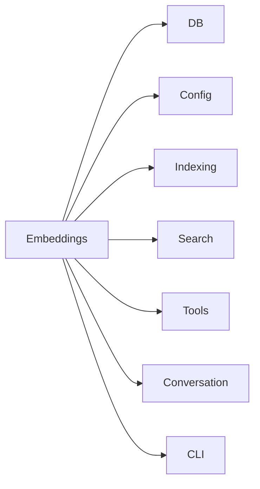

# Embeddings Module

The Embeddings module (`src/embeddings/`) provides local vector embedding via
Transformers.js ONNX models. It is a **leaf module** with no internal
dependencies -- every other module that needs embeddings imports from here.

## Entry Point -- `embed.ts`

A single file module. All embedding operations run locally (no API calls).

### Core Functions

- **`embed(text, threads?, onProgress?)`** -- Embeds a single text string.
  Returns a `Float32Array` vector.
- **`embedBatch(texts, threads?, onProgress?)`** -- Embeds multiple texts in
  batch. Returns an array of `Float32Array` vectors (one per input).
- **`embedBatchMerged(texts, threads?, onProgress?)`** -- Embeds multiple texts
  with windowed merging for oversized chunks. Splits text exceeding 256 tokens
  into overlapping windows, embeds each window separately, then mean-pools into
  a single vector. Returns an array of `Float32Array` vectors.
- **`mergeEmbeddings(embeddings)`** -- Combines multiple embedding vectors into
  one via mean pooling + L2 normalization.

### Configuration Functions

- **`getEmbedder(threads?, onProgress?)`** -- Returns the singleton embedding
  pipeline, initializing it on first call.
- **`getTokenizer()`** -- Returns the tokenizer for the active model.
- **`configureEmbedder(modelId, dim)`** -- Sets the embedding model and
  dimension. Must be called before any embedding operations. Used by the
  Config module's `applyEmbeddingConfig()`.
- **`getEmbeddingDim()`** -- Returns the current embedding dimension.
- **`resetEmbedder()`** -- Clears the cached pipeline (for testing or model
  switching).
- **`getModelId()`** -- Returns the active model identifier.

### Constants

| Constant | Value | Description |
|----------|-------|-------------|
| `EMBEDDING_DIM` | 384 | Default embedding vector dimension |
| `DEFAULT_MODEL_ID` | `"Xenova/all-MiniLM-L6-v2"` | Default ONNX model |
| `DEFAULT_EMBEDDING_DIM` | 384 | Default dimension (same as `EMBEDDING_DIM`) |

### Model Details

- **Model cache:** `~/.cache/mimirs/models` -- models are downloaded once
  and reused across projects.
- **Token limit:** 256 tokens per window with 32-token overlap for long texts.
- **Pooling:** Mean pooling + L2 normalization produces unit-length vectors
  suitable for cosine similarity via dot product.

## Dependencies and Dependents

- **Depends on:** Nothing (leaf module)
- **Depended on by:** DB, Config, Indexing, Search, Tools, Conversation, CLI

## See Also

- [Config module](../config/) -- calls `configureEmbedder` to set model/dimension
- [DB module](../db/) -- uses `getEmbeddingDim` to size `vec0` virtual table columns
- [Indexing module](../indexing/) -- uses `embedBatch` and `embedBatchMerged`
- [Conversation module](../conversation/) -- uses `embedBatch` for conversation chunks
- [Architecture overview](../../architecture.md)
