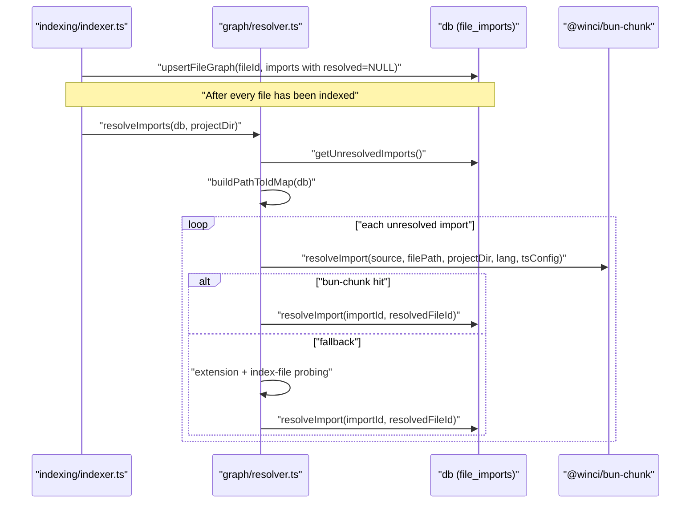
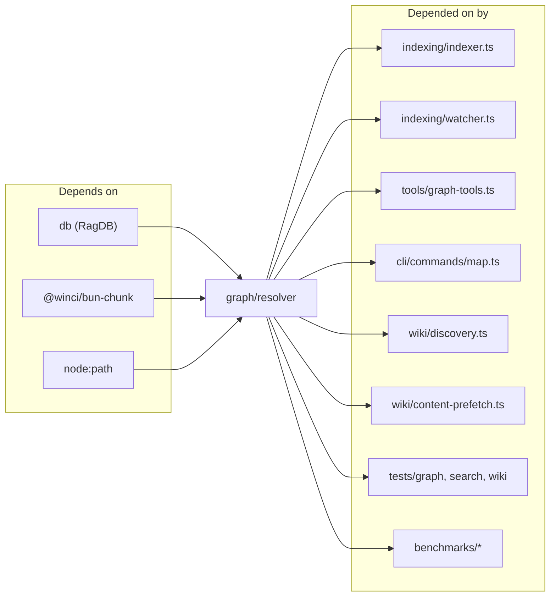

# graph

A single file (`src/graph/resolver.ts`) that turns the raw `file_imports` rows emitted during indexing into a real dependency graph. The module exposes two narrow helpers (`buildIdToPathMap` and the `GraphOptions` shape used by `project_map`) but its centre of gravity is `resolveImports(db, projectDir)`, the second pass the indexer runs after every file is upserted. Fan-in is 14: the indexer, the watcher, the `project_map` CLI + MCP tool, wiki discovery, and several benchmarks all depend on it.

## Public API

```ts
export interface GraphOptions {
  zoom?: "file" | "directory";
  focus?: string;
  maxHops?: number;
  showExternals?: boolean;
  format?: "text" | "json";
  projectDir: string;
}

export function buildIdToPathMap(pathToId: Map<string, number>): Map<number, string>
```

The heavyweight functions (`resolveImports`, `resolveImportsForFile`, `generateProjectMap`, `buildPathToIdMap`) aren't in the top-level export summary but are the real interface. `resolveImports` runs the full two-pass fix-up on every unresolved row; `resolveImportsForFile(db, fileId, projectDir)` is the incremental variant the watcher calls after re-indexing a single file, with optional prebuilt `pathToId` / `idToPath` maps to avoid repeated table scans. `generateProjectMap` honours the caller-requested `zoom` directly — there is no node-count cap or auto-switch to directory view anymore.

## How it works



1. **First pass runs during indexing.** `upsertFileGraph` always writes imports with `resolved_file_id = NULL`. No file-ordering dependency is introduced because the resolver runs after every file is on disk in the DB.
2. **bun-chunk filesystem resolver.** For `.ts/.tsx/.js/.jsx` it honours `tsconfig.json` paths via `loadTsConfig`; for Python it follows relative `from .x import ...`; for Rust it follows `crate::` paths. The resolved absolute path is looked up in `pathToId`; a hit writes the id back via `RagDB.resolveImport`.
3. **DB fallback.** When bun-chunk returns nothing but the source is relative (`.` / `/`), the resolver probes `basePath`, `basePath + .ts`/`.tsx`/`.js`/`.jsx`, and `basePath + /index.<ext>` against the indexed path set. First hit wins.
4. **Bare specifiers are skipped** unless the importer is Rust or Python — their conventions put non-`.` prefixes on what are really internal imports.

## Dependencies and Dependents



## Configuration

- `projectDir` — resolver works in absolute paths; the caller passes `projectDir` so `tsconfig.json` can be loaded and so bun-chunk can compute project-relative resolutions.
- `RESOLVE_EXTENSIONS` — internal constant `[".ts", ".tsx", ".js", ".jsx"]`. The DB fallback is TypeScript/JavaScript-only; other languages rely entirely on bun-chunk.
- `GraphOptions.maxHops` (default 2) — subgraph-extraction depth from `focus` for the `project_map` tool. No `maxNodes` cap exists; `generateProjectMap` renders whatever the graph produces at the requested `zoom`.

## Known issues

- **DB fallback is JS/TS-only.** If bun-chunk doesn't resolve a Python / Rust / Go import, the fallback does not retry with language-specific conventions — the import just stays `NULL`.
- **Re-indexing a renamed file leaves stale resolutions.** `resolveImports` only touches `NULL` rows; if a file is renamed, imports from other files that were previously resolved to the old id are not re-pointed. The watcher's `resolveImportsForFile` helps when the renaming file's own imports are re-written, but incoming edges need a fresh `resolveImports` pass.
- **`tsconfig.json` is loaded once per `resolveImports` call.** Changing `tsconfig.json` mid-run requires restarting the indexer; the loader doesn't re-read the file per import.
- **No node-count cap on `project_map`.** Large projects render the full graph; callers that need a bounded view pass `focus` + `maxHops` or switch to `zoom: "directory"` explicitly. Prior `maxNodes` auto-switch to directory view was removed — output is now exactly what the caller asks for.

## See also

- [Architecture](../architecture.md)
- [Data Flows](../data-flows.md)
- [Conventions](../guides/conventions.md)
