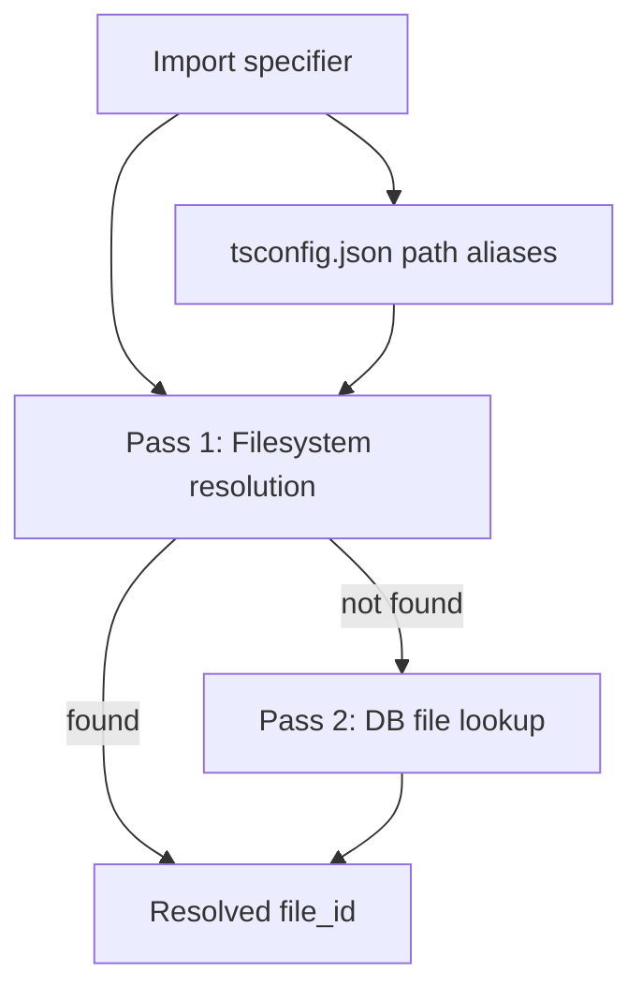
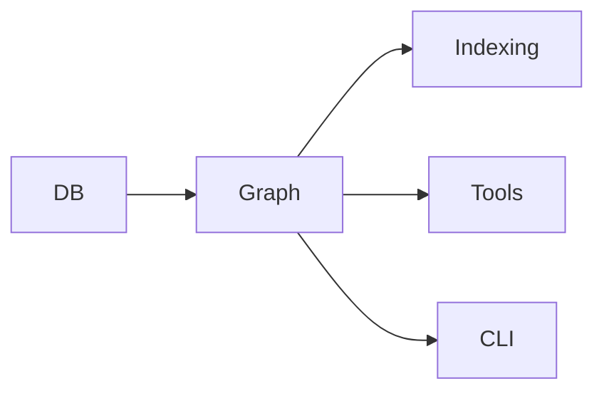

# Graph Module

The Graph module (`src/graph/`) resolves import/export relationships between
files and generates text-based dependency maps. It powers the `project_map`,
`depends_on`, and `depended_on_by` tools.

## Entry Point -- `resolver.ts`

A single file module with three main exports:

### `resolveImports(db, projectDir)`

Resolves import paths for **all** indexed files. Uses a two-pass strategy:

1. **Bun-chunk filesystem resolution** -- attempts to resolve import specifiers
   to actual files on disk using Node/Bun module resolution rules.
2. **DB-based fallback** -- for imports that cannot be resolved on the
   filesystem, searches the database's file index for matches.

Handles TypeScript path aliases by reading `tsconfig.json` `compilerOptions.paths`.

### `resolveImportsForFile(db, fileId, projectDir)`

Same resolution logic as `resolveImports` but scoped to a single file.
Used by the watcher when a single file changes, to update that file's
dependency graph and the graphs of all its importers.

### `generateProjectMap(db, opts)`

Builds a text-based Mermaid dependency graph. Accepts `GraphOptions`:

```ts
interface GraphOptions {
  zoom?: "file" | "directory";
  focus?: string;
  maxNodes?: number;
  maxHops?: number;
  showExternals?: boolean;
  projectDir: string;
}
```

Supports two zoom levels:

- **File level** -- shows individual file dependencies. Default mode for small
  graphs (<= maxNodes).
- **Directory level** -- aggregates file relationships into module-level
  dependencies. Auto-switches when the node count exceeds `maxNodes` (default 50).

The `focus` option zooms into a specific file's neighborhood using BFS
subgraph extraction (`db.getSubgraph`), showing only files within `maxHops`
(default 2) of the focused file.

## Import Resolution Details

The two-pass approach handles real-world TypeScript/JavaScript projects:



- **Relative imports** (`./foo`, `../bar`) -- resolved against the importing
  file's directory.
- **Path aliases** (`@/utils/log`) -- mapped via `tsconfig.json` paths.
- **Bare specifiers** (`lodash`) -- skipped (external packages).

## Dependencies and Dependents



- **Depends on:** DB
- **Depended on by:** Indexing, Tools, CLI

## See Also

- [DB module](../db/) -- stores import/export edges in `file_imports` and
  `file_exports` tables
- [Tools module](../tools/) -- `project_map`, `depends_on`, `depended_on_by`,
  and `find_usages` tools wrap this module
- [Architecture overview](../../architecture.md)
