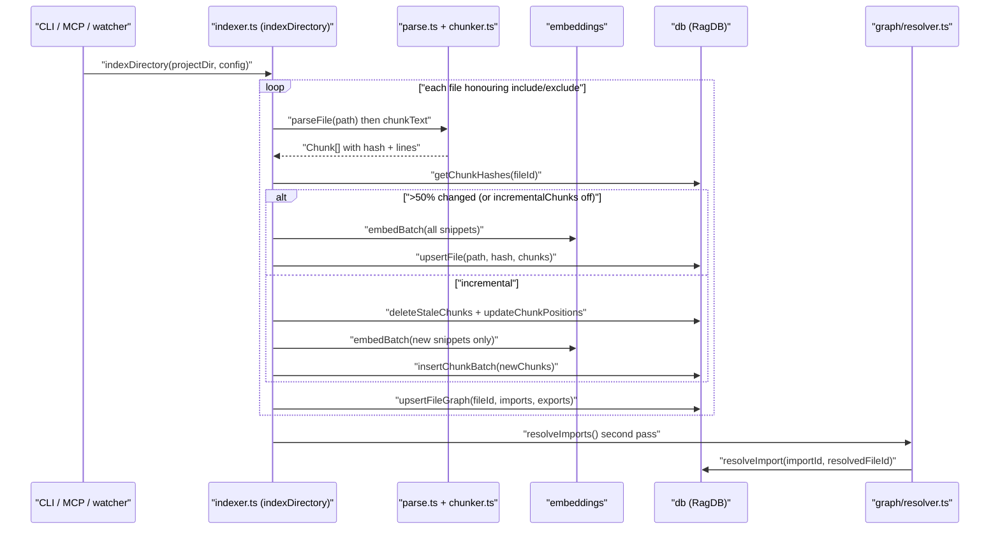

# indexing

The pipeline that turns files on disk into embedded chunks in SQLite. Four files: `indexer.ts` orchestrates the walk, `parse.ts` reads + extracts frontmatter, `chunker.ts` produces AST-aware chunks via `bun-chunk`, and `watcher.ts` keeps the index in sync with edits. This is the largest write-path in the system; every CLI `index` invocation, every MCP `index_files` call, and every session-start hook that refreshes the index runs through `indexDirectory` here.

## How it works

1. **Walk** — the walker honours `.gitignore` plus `config.include` / `config.exclude`. Files over a size threshold are skipped with a log line.
2. **Parse + chunk** — `parseFile` reads the file and extracts Markdown frontmatter; the chunker dispatches to AST-aware chunking for 24 languages or paragraph-fallback otherwise. Each chunk carries a content hash.
3. **Diff or rewrite** — when `config.incrementalChunks` is on and the file already has chunks indexed, `getChunkHashes(fileId)` is diffed against the new set. If more than 50% of chunks changed, the code falls through to a full re-index; otherwise stale chunks are deleted, kept chunks get position updates, and only new chunks are embedded.
4. **Embed** — batches of ~50 chunks flow through `embedBatch` (or `embedBatchMerged` when `config.embeddingMerge` is on, which windows oversized texts and averages the results). Writes stream into the DB alongside embedding to cap memory at one batch.
5. **Graph** — `upsertFileGraph` writes imports/exports with `resolved_file_id = NULL`; the resolver pass runs after the whole walk.

## Per-file breakdown

### `indexer.ts` — walker + orchestration

The biggest file in the module. Owns the public `indexDirectory(projectDir, config, opts)` plus the `processFile` / `processFileIncremental` state machine. `processFile` is the full-rewrite path (parse → chunk → embed all → upsert). `processFileIncremental` is the incremental path: fetches old chunk hashes, computes new-vs-old count, bails back to `processFile` if >50% changed, otherwise deletes stale, updates positions, and embeds only new chunks. Also owns `aggregateGraphData(chunks)` — the fallback graph extractor used when `bun-chunk` didn't return file-level imports/exports.

### `chunker.ts` — AST-aware chunking

Wraps [bun-chunk](https://github.com/TheWinci/bun-chunk). Exports `chunkText(content, ext, options): ChunkTextResult`. For supported extensions the chunker yields one chunk per function/class/method with line ranges and a content hash; for everything else it falls back to paragraph chunks of `chunkSize` chars with `chunkOverlap` overlap. Tiny siblings are merged so no chunk is embedded nearly empty.

### `parse.ts` — file reader with frontmatter

`parseFile(filePath, raw): ParsedFile` — reads the content, detects the extension, and if it's Markdown strips the YAML frontmatter into a `Record<string, unknown>`. Keeps parsing cheap so the walker can fan out widely.

### `watcher.ts` — filesystem watch

`startWatcher(directory, db, config, onEvent): Watcher` — wraps bun's `fs.watch` with debouncing. On `change` it calls `processFile` for the single file; on `delete` it calls `RagDB.removeFile(path)`. `close()` stops the watcher. Used by `mimirs index --watch` and by the MCP `index_files` tool when long-running clients want ongoing sync.

## Configuration

- `include` / `exclude` / `generated` — the walker reads these directly from `RagConfig`.
- `chunkSize` / `chunkOverlap` — feed the paragraph-fallback chunker.
- `indexBatchSize` (default 50) — how many chunks are embedded and written per transaction.
- `indexThreads` — forwarded to `embedBatch` and ultimately the ONNX session.
- `incrementalChunks` (default `false`) — opt-in. When off, every re-index of a changed file is a full rewrite.
- `embeddingMerge` (default `true`) — switches between `embedBatchMerged` (windowed for oversized texts) and the plain `embedBatch`.

## Known issues

- **Incremental rebuild threshold is fixed.** >50% changed triggers a full re-index. For files where 49% changed incremental still runs; for 51% it doesn't. No knob — by design, but worth knowing when benchmarking.
- **`aggregateGraphData` fallback is heuristic.** When `bun-chunk` doesn't return file-level imports/exports, the indexer aggregates them from per-chunk data. The fallback doesn't pick up file-level re-exports the way the AST-level extractor does.
- **Watcher debounce is short.** Rapid saves from formatters can trigger duplicate re-indexes. If you see repeated work, inspect the watcher event stream.
- **Abort signal threaded but not comprehensive.** `opts.signal` is honoured between chunk batches and at file boundaries, not mid-embedding. A very long embed call will complete before the abort takes effect.

## See also

- [Architecture](../architecture.md)
- [Data Flows](../data-flows.md)
- [Conventions](../guides/conventions.md)
