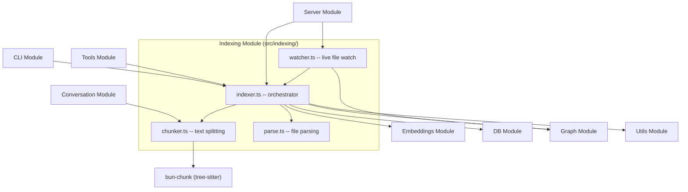

# Indexing Module

The Indexing module (`src/indexing/`) is responsible for turning source files
into searchable chunks with embeddings. It handles file parsing, intelligent
chunking across 30+ languages, incremental updates, and live file watching.

## Architecture



## Files

| File | Purpose |
|---|---|
| `indexer.ts` | Orchestrates the full indexing pipeline: collect, hash, parse, chunk, embed, store |
| `chunker.ts` | Splits file content into semantic chunks using language-aware strategies |
| `parse.ts` | Detects file type, resolves virtual extensions, strips markdown frontmatter |
| `watcher.ts` | Watches the filesystem for changes and triggers incremental re-indexing |

## Indexer -- `indexer.ts`

### `indexDirectory()`

The main entry point for batch indexing an entire project.

```ts
indexDirectory(
  dir: string,
  db: RagDB,
  config: RagConfig,
  onProgress?: (msg: string, opts?: { transient?: boolean }) => void,
  signal?: AbortSignal
): Promise<IndexResult>
```

**Pipeline:**

1. **Guard** -- rejects dangerous directories (home, root) via `checkIndexDir`.
2. **Collect** -- scans for files matching `config.include` globs, excluding
   `config.exclude` patterns.
3. **Eagerly load** the embedding model so progress reflects model download
   before per-file work begins.
4. **Process each file** via `processFile`:
   - Compute content hash; skip if unchanged.
   - Call `parseFile` to detect type and strip frontmatter.
   - Call `chunkText` to split into semantic chunks.
   - Detect parent groups and create parent chunks for multi-method classes.
   - Attempt **incremental update** (`processFileIncremental`) if the file
     already exists in the DB and fewer than 50% of chunks changed.
   - Otherwise, embed chunks in **batches of 50** and write all to DB.
   - Call `upsertFileGraph` to update the import/export dependency graph.
5. **Prune** -- remove DB entries for files that no longer exist on disk.
6. **Resolve imports** -- rebuild the full file dependency graph.

Files larger than **50 MB** are skipped.

### `processFileIncremental()`

Chunk-level incremental update. When a file changes but most chunks remain
the same, this avoids re-embedding unchanged content:

1. Compare old chunk hashes against new chunk hashes.
2. If more than 50% changed, bail out (full re-index is more efficient).
3. Update the file hash without deleting chunks.
4. Delete stale chunks (old hashes not in new set).
5. Update positions of kept chunks (line numbers may shift).
6. Embed and insert only the new chunks.

### `IndexResult`

```ts
interface IndexResult {
  indexed: number;   // files that were (re-)indexed
  skipped: number;   // files unchanged since last index
  pruned: number;    // DB entries removed for deleted files
  errors: string[];  // per-file error messages
}
```

## Chunker -- `chunker.ts`

### `chunkText()`

The core splitting function. Strategy is chosen automatically based on file
extension.

```ts
chunkText(
  content: string,
  extension: string,
  chunkSize?: number,    // default: 512 (characters, not tokens)
  chunkOverlap?: number,
  filePath?: string
): Promise<ChunkTextResult>
```

### Chunking Strategies

| Strategy | When | How |
|---|---|---|
| **AST-aware** | 30+ tree-sitter languages (TS, JS, Python, Go, Rust, Java, C/C++, C#, Ruby, PHP, Scala, HTML, CSS, Kotlin, Lua, Zig, Elixir, Bash, TOML, YAML, Haskell, OCaml, Dart) | Uses `bun-chunk` tree-sitter bindings to split at function/class/block boundaries. Extracts imports, exports, entity names, and types. |
| **Heading-based** | Markdown (`.md`, `.mdx`, `.markdown`) | Splits on heading boundaries (`#`, `##`, etc.), then by size |
| **Heuristic** | Swift, Fish, Terraform, Protobuf, GraphQL, XML, and other code-like files without tree-sitter support | Splits on blank-line-separated blocks, then by size |
| **Fixed-size** | Fallback for unrecognized formats | Splits at `chunkSize` boundaries with overlap |

Small files (content length <= `chunkSize`) are returned as a single chunk
without splitting. Tiny consecutive chunks are merged to avoid creating
embeddings for near-empty fragments.

### `KNOWN_EXTENSIONS`

An exported `Set<string>` of every extension the chunker can handle (~60
entries). Files with extensions outside this set are skipped by the indexer --
binaries and unrecognized formats never enter the DB.

### Key Interfaces

```ts
interface Chunk {
  text: string;
  index: number;
  startLine?: number;
  endLine?: number;
  imports?: ChunkImport[];
  exports?: ChunkExport[];
  parentName?: string;
  name?: string;
  chunkType?: string;
  hash?: string;
}

interface ChunkTextResult {
  chunks: Chunk[];
  fileImports?: ChunkImport[];
  fileExports?: ChunkExport[];
}
```

## Parser -- `parse.ts`

### `parseFile()`

```ts
parseFile(filePath: string, raw: string): ParsedFile
```

Detects the file's effective extension and optionally processes content:

- **Extension resolution** -- basename files without extensions are mapped to
  virtual extensions: `Makefile` becomes `.makefile`, `Dockerfile` becomes
  `.dockerfile`, `Vagrantfile` becomes `.vagrantfile`, etc. Prefix-based
  matching handles variants like `Dockerfile.dev`.
- **Markdown frontmatter** -- strips YAML frontmatter via `gray-matter` and
  builds weighted text that promotes `name`, `description`, `type`, and
  `tags` fields for better search relevance.

```ts
interface ParsedFile {
  path: string;
  content: string;
  frontmatter: Record<string, unknown> | null;
  extension: string;
}
```

## Watcher -- `watcher.ts`

### `startWatcher()`

```ts
startWatcher(
  directory: string,
  db: RagDB,
  config: RagConfig,
  onEvent?: (msg: string) => void
): Watcher
```

Monitors the project directory for file changes using `fs.watch` with
`{ recursive: true }`.

**Behavior:**

- **Debounce** -- each file change is debounced by **2 seconds** to batch
  rapid edits (e.g., IDE auto-save).
- **Include/exclude** -- pre-compiles `config.include` and `config.exclude`
  globs once at startup. Events for non-matching files are ignored.
- **File deleted** -- calls `db.removeFile()` to prune the entry.
- **File changed** -- calls `indexFile()` to re-index, then
  `resolveImportsForFile()` to update the dependency graph for both the
  changed file and all its importers.
- **Cleanup** -- the returned `Watcher` handle has a `close()` method that
  cancels pending timers and closes the `fs.watch` handle.

```ts
interface Watcher {
  close(): void;
}
```

## Dependencies

| Direction | Module |
|---|---|
| Imports from | [DB](../db/), [Embeddings](../embeddings/), [Graph](../graph/), [Utils](../utils/) |
| Imported by | [Server](../server/), [Tools](../tools/), [Conversation](../conversation/), [CLI](../cli/) |

## See Also

- [Chunk entity](../../entities/chunk.md) -- the data structure produced by
  the chunker
- [Search Module](../search/) -- queries the chunks and embeddings
  that this module produces
- [DB Module](../db/) -- where chunks, embeddings, and file metadata
  are persisted
- [Graph Module](../graph/) -- dependency graph built from
  import/export data extracted during chunking
- [Embeddings Module](../embeddings/) -- the embedding model used to
  vectorize chunks
- [Data Flow](../../data-flow.md) -- file indexing pipeline diagram
- [Architecture](../../architecture.md) -- system-wide overview
