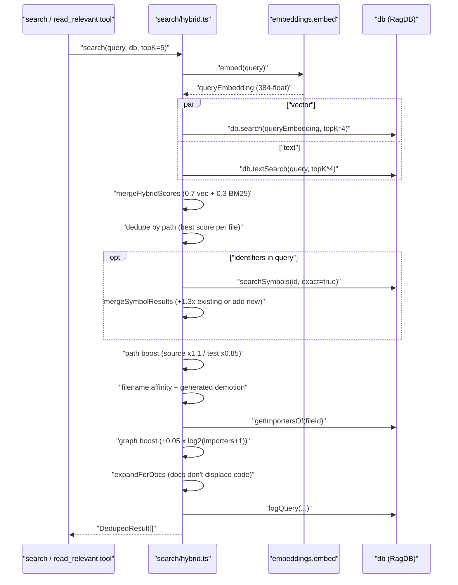

# search

The search module is the read-path counterpart to indexing. Four files: `hybrid.ts` runs the actual query (vector + BM25 + symbol expansion + path boosts), `usages.ts` holds two small regex helpers the `find_usages` tool depends on, `benchmark.ts` is a recall@K harness for fixture-driven quality regression testing, and `eval.ts` compares agent behaviour with and without the RAG index. Fan-in is 22 — the MCP `search` / `read_relevant` tools, the `search` / `demo` / `benchmark` / `eval` CLI commands, and most of the benchmark harnesses in `benchmarks/`.

## Public API

Sixteen exports across the four files. Runtime surface:

```ts
// hybrid.ts — the actual query
search(query: string, db: RagDB, topK?: number, threshold?: number,
       hybridWeight?: number, generatedPatterns?: string[]): Promise<DedupedResult[]>

searchChunks(query: string, db: RagDB, topK?: number, threshold?: number,
             hybridWeight?: number, generatedPatterns?: string[]): Promise<ChunkResult[]>

mergeHybridScores<T>(vector: T[], text: T[], weight: number): T[]
```

Benchmark / eval surface (CLI-facing):

```ts
// benchmark.ts
loadBenchmarkQueries(path): Promise<BenchmarkQuery[]>
runBenchmark(queries, db, projectDir, topK?, hybridWeight?): Promise<BenchmarkSummary>
formatBenchmarkReport(summary, topK?): string

// eval.ts
loadEvalTasks(path): Promise<EvalTask[]>
runEval(tasks, db, projectDir, topK?): Promise<EvalSummary>
formatEvalReport(summary): string
saveEvalTraces(traces, outputPath): Promise<void>
```

`usages.ts` exports `escapeRegex(s)` and `sanitizeFTS(query)` (wraps each token in double quotes so FTS5 treats `+ - * AND OR NOT NEAR ( )` as literals, not operators).

## How it works



1. **Embed the query.** `embed()` turns the string into a 384-float vector.
2. **Two parallel fetches.** `db.search` runs `SELECT FROM vec_chunks WHERE embedding MATCH ?`; `db.textSearch` runs FTS5 `MATCH`. Each pulls `topK * 4` so there's headroom for deduplication and boosting. FTS failures fall back to vector-only silently.
3. **Hybrid merge.** `mergeHybridScores` keys by `path:chunkIndex` and computes `hybridWeight * vectorScore + (1 - hybridWeight) * textScore`. Default 0.7 vector / 0.3 BM25.
4. **Dedupe by path.** Best score per file wins; snippets accumulate. `searchChunks` deliberately skips this step so two chunks from the same file can both appear.
5. **Symbol expansion.** `extractIdentifiers` pulls camelCase/PascalCase/snake_case tokens from the query (min 3 chars, filtered through a stop-word list). Each hits `db.searchSymbols` exact-mode; matches either boost an existing result (`×1.3`) or enter with base score `0.75`.
6. **Score adjustments.** `applyPathBoost` demotes test paths (`×0.85`) and boosts source paths (`×1.1`). `applyFilenameBoost` adds `0.1` per query-word match in the filename stem and `0.05` per match in path segments; `BOILERPLATE_BASENAMES` like `types.go` or `index.d.ts` get `×0.8`; files matching the user's `generated` glob patterns get `×0.75`.
7. **Graph boost.** `applyGraphBoost` fetches `getImportersOf(fileId)` and adds `0.05 × log2(importers + 1)` — a file imported by 8 others gets about `+0.15`.
8. **Doc expansion.** `expandForDocs` expands `topK` by the number of `.md`/`.mdx` files in the initial slice, so docs become bonus context rather than displacing code.
9. **Analytics.** `db.logQuery` records the query, result count, top score, top path, and duration; `search_analytics` surfaces this later.

`searchChunks` follows the same shape but with one extra twist: `groupByParent` replaces sibling chunks with their parent when ≥`parentGroupingMinCount` (default 2) children from the same parent appear. A single class chunk beats three separate method chunks at representing "this class".

## Per-file breakdown

### `hybrid.ts` — the search runtime

Biggest file in the module. Owns `search` and `searchChunks` plus every ranking adjustment. The internal helpers are not exported but drive most of the behaviour: `applyPathBoost`, `applyFilenameBoost` (with `buildGeneratedMatcher` for config-driven demotion), `mergeSymbolResults`, `expandForDocs`, `applyGraphBoost`, and `groupByParent`. Constants worth knowing: `DEFAULT_HYBRID_WEIGHT = 0.7`, `GENERATED_DEMOTION = 0.75`, `BOILERPLATE_BASENAMES`, `TEST_PATTERNS` / `SOURCE_PATTERNS` regex arrays, and the `STOP_WORDS` set used by `extractIdentifiers`.

### `usages.ts` — find_usages helpers

Tiny — two exports. `escapeRegex` is the standard regex-metachar escape. `sanitizeFTS` quotes every token so FTS5 operators (`+ - * AND OR NOT NEAR ( )`) are treated as literals. The module's top-of-file comment explains the larger design: `find_usages` works at query time (FTS match → exclude defining files via `file_exports` → word-boundary regex within chunk → absolute line number from `start_line`) rather than pre-indexing call sites.

### `benchmark.ts` — recall@K harness

`loadBenchmarkQueries` reads a JSON file of `{ query, expected: string[] }` pairs. `runBenchmark` calls `search` once per query, computes recall (fraction of expected files in top-K), reciprocal rank (`1/rank` of first expected file, `0` if missed), and hit/miss. The `BenchmarkSummary` rolls those into `recallAtK`, `mrr`, and `zeroMissRate`. `formatBenchmarkReport` pretty-prints the summary for the `benchmark` CLI command, which exits non-zero when below `benchmarkMinRecall` / `benchmarkMinMrr`.

### `eval.ts` — with/without-RAG comparison

`runEval` runs each task twice — once with RAG (the agent gets search results) and once without — and records an `EvalTrace` per condition. The `EvalSummary` compares `avgSearchResults`, `avgFilesReferenced`, `avgDurationMs`, and `fileHitRate` across the two conditions. `saveEvalTraces` persists raw traces for offline inspection. Consumed by the `eval` CLI command and by `benchmarks/quality-bench-worker.ts`.

## Internals

- **`hybridWeight` is a tuning knob, not a constant.** The default of 0.7 is in `hybrid.ts` and also in `DEFAULT_CONFIG`. Changing it biases toward semantic match (higher) or keyword match (lower); benchmark runs accept it as an override.
- **`searchSymbols(id, exact=true, undefined, 5)`** — the fourth arg caps symbol expansion at 5 matches per identifier. The exact-match flag avoids flooding results with partial prefix hits.
- **`buildGeneratedMatcher` has four fast paths.** `dir/**` → directory prefix, `dirname/**` (no slash) → dir-at-any-depth, `**/*suffix` → basename endsWith, `**/prefix*` → basename regex. Everything else falls through to a regex-escaped substring match. The matcher is built once per `search` call and reused for every result.
- **Parent grouping only triggers on 2+ siblings.** `config.parentGroupingMinCount = 2`. One sibling by itself is kept as-is — promoting a single method chunk to its class would lose precision.
- **FTS failures are non-fatal.** If `db.textSearch` throws (malformed query, escaping bug), the code logs at debug level and falls back to vector-only. Users don't see the error in the response.

## Configuration

- `hybridWeight` (default `0.7`) — vector vs BM25 blend.
- `searchTopK` (default `10`) — file-level default for the MCP `search` tool.
- `generated` (config) — glob patterns that trigger the `×0.75` demotion at ranking time. Matches are checked against the full path and basename.
- `parentGroupingMinCount` (default `2`) — threshold at which `groupByParent` replaces children with the parent chunk.
- `benchmarkTopK` (default `5`), `benchmarkMinRecall` (`0.8`), `benchmarkMinMrr` (`0.6`) — used by `benchmark.ts` via the `benchmark` CLI command.

## Known issues

- **`STOP_WORDS` is English-specific.** Non-English queries lose identifier-candidate words to the filter. For most real queries the stop words also happen to be uninteresting, but for a query like "file cache size" `file` is dropped from identifier expansion (not from the vector/BM25 paths, which still see it).
- **Symbol expansion can fire off 5 `searchSymbols` calls per query.** Each is SQL-cheap, but on long queries with many identifiers the overhead is visible in `search_analytics`. No hard cap on total identifiers.
- **`applyGraphBoost` probes the DB once per result.** For a `topK * 4`-sized pool that's up to 20 `getFileByPath` + `getImportersOf` calls per search. Both are indexed; still noticeable on huge indexes.
- **`BOILERPLATE_BASENAMES` is a fixed set.** Go and TypeScript-leaning (`types.go`, `types.ts`, `index.d.ts`). Other languages' boilerplate files aren't caught.

## See also

- [Architecture](../architecture.md)
- [Data Flows](../data-flows.md)
- [Conventions](../guides/conventions.md)
- [Testing](../guides/testing.md)
