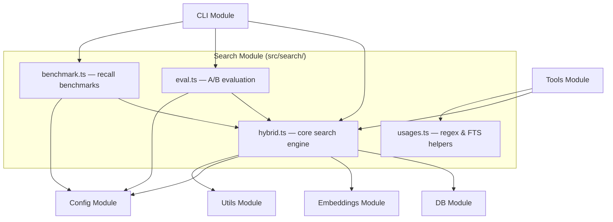

# Search Module

The Search module (`src/search/`) implements hybrid semantic + keyword search
over the indexed codebase. It combines vector similarity (embeddings) with
BM25 full-text ranking, applies path-based heuristics, and includes tooling
for evaluation and benchmarking.

## Architecture



## Files

| File | Purpose |
|---|---|
| `hybrid.ts` | Core hybrid search engine -- merges vector and BM25 results with score adjustments |
| `usages.ts` | Helper utilities: `escapeRegex`, `sanitizeFTS` for safe FTS5 queries |
| `eval.ts` | A/B evaluation framework comparing search with and without RAG |
| `benchmark.ts` | Search quality benchmarks measuring recall and MRR |

## Core Search -- `hybrid.ts`

### `search()`

File-level search. Returns deduplicated results grouped by file path, keeping
the best score per file.

```ts
search(
  query: string,
  db: RagDB,
  topK?: number,        // default: 5
  threshold?: number,   // default: 0
  hybridWeight?: number,// default: 0.7
  generatedPatterns?: string[]
): Promise<DedupedResult[]>
```

**Pipeline:**

1. Embed the query string.
2. Run vector similarity search (`db.search`) for `topK * 4` candidates.
3. Run BM25 text search (`db.textSearch`) for `topK * 4` candidates.
   Falls back to vector-only if FTS fails.
4. Merge results via `mergeHybridScores`.
5. Deduplicate by file path, accumulating snippets.
6. Expand with symbol search -- extracts identifiers from the query and
   boosts files that match by exact symbol name (1.3x boost for existing
   results, 0.75 base score for symbol-only matches).
7. Apply path-based score adjustments (see below).
8. Sort by score and return the top K.

### `searchChunks()`

Chunk-level search. Returns individual semantic chunks ranked by relevance --
no file deduplication, so two chunks from the same file can both appear.

```ts
searchChunks(
  query: string,
  db: RagDB,
  topK?: number,        // default: 8
  threshold?: number,   // default: 0.3
  hybridWeight?: number,// default: 0.7
  generatedPatterns?: string[]
): Promise<ChunkResult[]>
```

Uses the same hybrid merge pipeline but operates on chunk-level DB methods
(`db.searchChunks`, `db.textSearchChunks`) and applies score adjustments
per-chunk rather than per-file.

### `mergeHybridScores()`

```ts
mergeHybridScores<T>(
  vectorResults: T[],
  textResults: T[],
  hybridWeight: number  // default: 0.7
): T[]
```

Combines vector and BM25 result lists using weighted scoring. The default
weight of **0.7** means 70% vector similarity, 30% BM25 keyword match.
Results that appear in both lists get a combined score; results in only one
list get their single-source score scaled by the appropriate weight.

### Score Adjustments

After merging, both `search` and `searchChunks` apply multiplicative
adjustments based on file metadata:

| Adjustment | Effect | Rationale |
|---|---|---|
| Source boost | +10% | Files in `src/`, `lib/`, `app/`, `pkg/` directories |
| Test demotion | -15% | Files matching test patterns (`*.test.*`, `*_test.*`, etc.) |
| Filename affinity | +10% per word | Query words found in the filename stem |
| Path segment match | +5% per word | Query words found in parent directory names |
| Boilerplate demotion | -20% | Known low-signal files (`types.go`, `doc.go`, `index.d.ts`, etc.) |
| Generated demotion | -25% | Files matching `config.generated` glob patterns |
| Dep graph boost | +0.05 * log2(importers + 1) | Files imported by many others are more central |

### Key Interfaces

```ts
interface DedupedResult {
  path: string;
  score: number;
  snippets: string[];
}

interface ChunkResult {
  path: string;
  score: number;
  content: string;
  chunkIndex: number;
  entityName: string;
  chunkType: string;
  startLine: number;
  endLine: number;
  parentId: number;
}
```

## FTS Helpers -- `usages.ts`

Two utility functions for safe text operations. **Not imported by
`hybrid.ts`** -- used by the Tools module for usage-search features.

- **`escapeRegex(s)`** -- escapes all regex metacharacters in a string.
- **`sanitizeFTS(query)`** -- prevents FTS5 operator injection by wrapping
  each token in double quotes. FTS5 treats bare `+`, `-`, `*`, `AND`, `OR`,
  `NOT`, `NEAR`, and parentheses as operators; quoting forces literal matching.

## A/B Evaluation -- `eval.ts`

Compares search quality with and without RAG by running identical tasks
under both conditions.

### Functions

| Function | Purpose |
|---|---|
| `loadEvalTasks(path)` | Parse a JSON file of `{ task, grading, expectedFiles? }` entries |
| `runEvalTask(task, db, projectDir, condition, topK?)` | Run a single task under "with-rag" or "without-rag" condition |
| `runEval(tasks, db, projectDir, topK?)` | Run all tasks under both conditions, return summary |
| `formatEvalReport(summary)` | Format results as a human-readable table |
| `saveEvalTraces(traces, outputPath)` | Persist traces as JSON for later analysis |

### Types

```ts
interface EvalTask {
  task: string;
  grading: string;        // human-readable criteria
  expectedFiles?: string[];
}

interface EvalTrace {
  task: string;
  grading: string;
  condition: "with-rag" | "without-rag";
  searchResults: DedupedResult[];
  filesReferenced: string[];
  searchCount: number;
  durationMs: number;
}

interface EvalSummary {
  totalTasks: number;
  withRag: { avgSearchResults, avgFilesReferenced, avgDurationMs, fileHitRate };
  withoutRag: { avgSearchResults, avgFilesReferenced, avgDurationMs, fileHitRate };
  traces: EvalTrace[];
}
```

The report compares avg results, avg files found, file hit rate, and avg
latency between the two conditions, plus a per-task breakdown.

## Benchmarks -- `benchmark.ts`

Measures retrieval quality using recall@K and mean reciprocal rank (MRR).

### Functions

| Function | Purpose |
|---|---|
| `loadBenchmarkQueries(path)` | Parse a JSON file of `{ query, expected }` entries |
| `runBenchmark(queries, db, projectDir, topK?, hybridWeight?)` | Execute all queries and compute metrics |
| `formatBenchmarkReport(summary, topK?)` | Format results with missed/partial breakdown |

### Types

```ts
interface BenchmarkQuery {
  query: string;
  expected: string[];  // file paths that should appear in results
}

interface BenchmarkResult {
  query: string;
  expected: string[];
  results: { path: string; score: number }[];
  recall: number;          // fraction of expected files found
  reciprocalRank: number;  // 1/rank of first expected file
  hit: boolean;            // at least one expected file found
}

interface BenchmarkSummary {
  total: number;
  recallAtK: number;     // average recall across queries
  mrr: number;           // mean reciprocal rank
  zeroMissRate: number;  // fraction of queries that missed all expected files
  results: BenchmarkResult[];
}
```

The CLI `benchmark` command exits non-zero if recall or MRR fall below
configured thresholds (`benchmarkMinRecall`, `benchmarkMinMrr`).

## Dependencies

| Direction | Module |
|---|---|
| Imports from | [DB](../db/index.md), [Config](../config/index.md), [Embeddings](../embeddings/index.md), [Utils](../utils/index.md) |
| Imported by | [Tools](../tools/index.md), [CLI](../cli/index.md) |

## See Also

- [DB Module -- Search Operations](../db/index.md) -- the underlying SQLite
  vector and FTS5 queries that `hybrid.ts` calls
- [Embeddings Module](../embeddings/index.md) -- how query strings are
  converted to vectors
- [Indexing Module](../indexing/index.md) -- how content enters the search
  index
- [Architecture](../../architecture.md) -- system-wide overview
