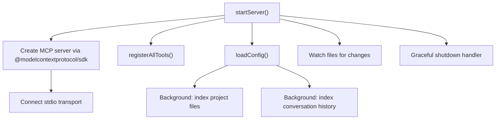
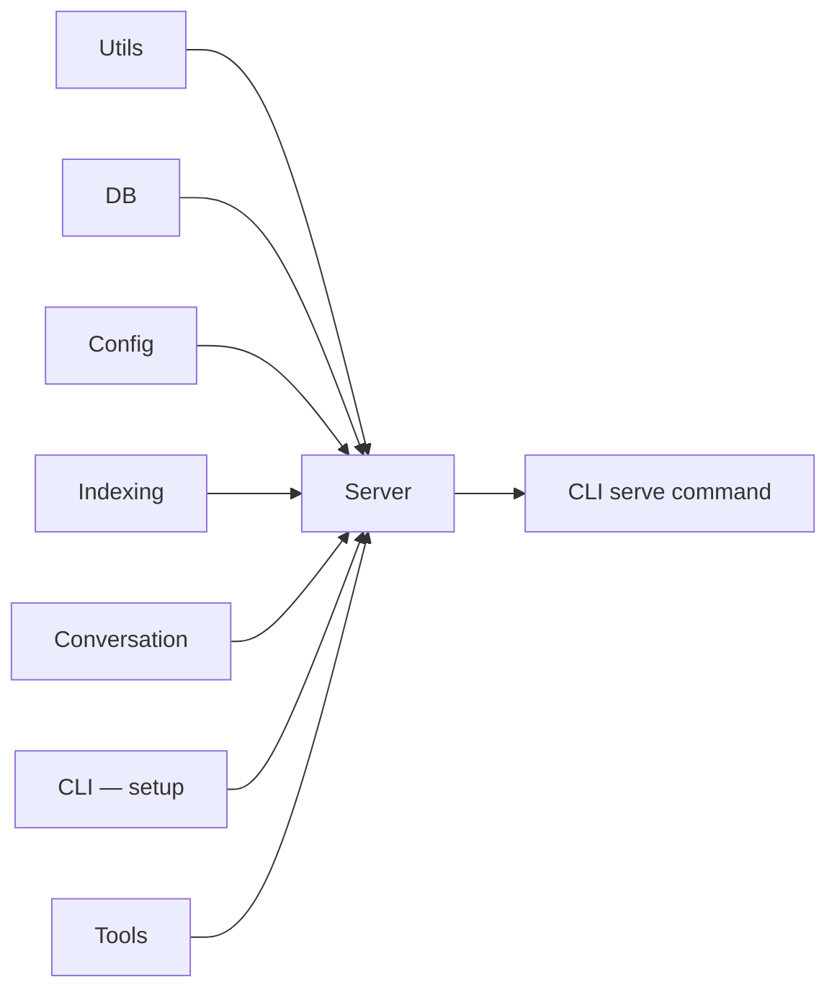

# Server Module

The Server module (`src/server/`) implements the MCP (Model Context Protocol)
server that exposes mimirs's capabilities to AI agents over stdio transport.

## Entry Point -- `index.ts`

A single file module exporting `startServer()`. This function orchestrates the
entire server lifecycle:

### Startup Sequence

1. **Create MCP server** -- instantiates the server using
   `@modelcontextprotocol/sdk`.
2. **Connect stdio transport** -- the server communicates with the AI agent
   over stdin/stdout (MCP standard).
3. **Register tools** -- calls `registerAllTools()` from the Tools module to
   make all mimirs tools available to the agent.
4. **Load config** -- reads `.mimirs/config.json` via the Config module.
5. **Background indexing** -- kicks off file indexing in the background so the
   server is responsive immediately while the index builds.
6. **Conversation indexing** -- indexes conversation history from Claude Code
   JSONL logs, with live tailing for the current session.
7. **File watching** -- monitors the project directory for file changes and
   re-indexes affected files automatically.
8. **Graceful shutdown** -- handles `SIGINT`/`SIGTERM` to close the database
   and clean up resources.

### Key Behaviors

- The server is **single-project**: one server instance per project directory.
- File watching triggers incremental re-indexing -- only changed files are
  reprocessed.
- Conversation tailing keeps search over the current session up to date in
  real time.
- All logging goes to stderr (the MCP diagnostic channel) to avoid corrupting
  the stdio protocol.

## Dependencies and Dependents

- **Depends on:** Utils, DB, Config, Indexing, Conversation, CLI (setup), Tools
- **Depended on by:** CLI `serve` command

## See Also

- [Tools module](../tools/) -- all MCP tools registered by the server
- [Config module](../config/) -- configuration loaded at startup
- [Conversation module](../conversation/) -- conversation tailing for live indexing
- [CLI module](../cli/) -- `serve` command starts the server
- [Architecture overview](../../architecture.md)
