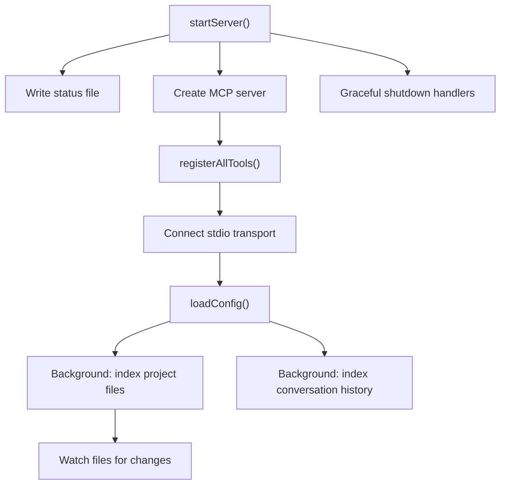
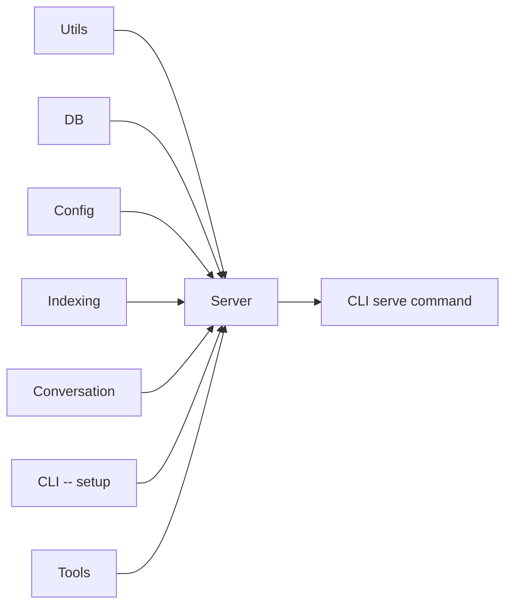

# Server Module

The Server module (`src/server/`) implements the MCP (Model Context Protocol)
server that exposes mimirs's capabilities to AI agents over stdio transport.

## Entry Point -- `index.ts`

A single file module exporting `startServer()`. This function orchestrates the
entire server lifecycle:

### Startup Sequence

1. **Write status** -- writes `starting` to `.mimirs/status` with version and
   timestamp. Overwrites any stale status from a previous instance.
2. **Register shutdown handlers** -- `SIGINT`, `SIGTERM`, `SIGHUP`, stdin
   close, uncaught exceptions, and unhandled rejections all trigger graceful
   cleanup. Each handler writes an `interrupted` status with the reason.
3. **Create MCP server** -- instantiates the server using
   `@modelcontextprotocol/sdk`.
4. **Register tools** -- calls `registerAllTools()` from the Tools module to
   make all mimirs tools available to the agent.
5. **Connect stdio transport** -- done **immediately** after tool registration
   so the MCP client's `initialize` handshake is answered before any slow
   startup work. Without this, the client may time out.
6. **Preflight DB** -- verifies the database can be opened. Transient lock
   errors are not cached (next tool call retries). Permanent errors (missing
   Homebrew SQLite, read-only filesystem) are cached so every tool call gets
   a clear error message.
7. **Background indexing** -- kicks off file indexing with progress reported
   via the status file. Does not block server startup.
8. **Conversation indexing** -- indexes conversation history from Claude Code
   JSONL logs, with live tailing for the most recent session.
9. **File watching** -- starts after initial indexing completes, monitoring
   the project directory for changes and re-indexing affected files.

### Key Behaviors

- The server manages a **lazy-init DB map** -- one `RagDB` per project
  directory, kept open for the server's lifetime. Cleanup happens on shutdown.
- The `instanceId` (`pid:<N>`) written to the status file prevents a new
  server instance from overwriting another's status.
- All logging goes to stderr (the MCP diagnostic channel) to avoid corrupting
  the stdio protocol.
- The `doctor` CLI command and status file help diagnose startup failures
  without needing server logs.

## Dependencies and Dependents

- **Depends on:** Utils, DB, Config, Indexing, Conversation, CLI (setup), Tools
- **Depended on by:** CLI `serve` command

## See Also

- [Tools module](../tools/) -- all MCP tools registered by the server
- [Config module](../config/) -- configuration loaded at startup
- [Conversation module](../conversation/) -- conversation tailing for live indexing
- [CLI module](../cli/) -- `serve` command starts the server
- [Architecture overview](../../architecture.md)
