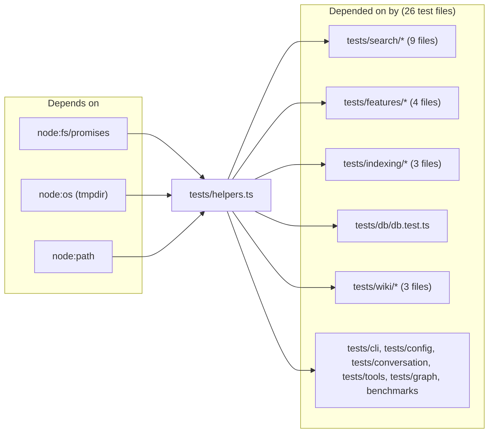

# tests

A single-file helper module (`tests/helpers.ts`) that 26 test files in the suite import. It exports three functions — `createTempDir`, `writeFixture`, `cleanupTempDir` — which together realise the "real SQLite in a tempdir" pattern the project prefers over mocking. There is no test runner logic here: this is purely the fixture-scaffolding layer that lets integration tests create an isolated `.mimirs` per test, write fixture sources into it, then tear it down cleanly.

## Public API

| Export | Type | Purpose |
|---|---|---|
| `createTempDir()` | function | `mkdtemp(tmpdir()/rag-test-)` — returns an absolute path to a fresh directory per call |
| `writeFixture(dir, relativePath, content)` | function | Writes `content` to `dir/relativePath`, creating parent directories as needed; returns the full path |
| `cleanupTempDir(dir)` | function | `rm -rf` the temp directory; used in `afterEach` so a failing test doesn't leak state into the next |

The canonical use site is the `beforeEach` / `afterEach` shape from most integration tests:

```ts
let tempDir: string;
beforeEach(async () => { tempDir = await createTempDir(); });
afterEach(async () => { await cleanupTempDir(tempDir); });
```

## Dependencies and Dependents



## Configuration

- `os.tmpdir()` — the base directory, resolved once per `createTempDir` call. On macOS this is typically `/var/folders/...`; on Linux `/tmp`. Tests honour whatever the OS/env dictates; no override is exposed.
- Temp dir prefix is fixed at `rag-test-`. Useful for `ls /tmp | grep rag-test-` when hunting for leaked state after a killed test run.

## Known issues

- **No registry of outstanding temp dirs.** If a test is killed with SIGKILL between `createTempDir` and `cleanupTempDir`, the directory is left on disk. The prefix makes cleanup easy (`rm -rf /tmp/rag-test-*`) but there is no automatic reaping.
- **`writeFixture` uses `substring(0, lastIndexOf("/"))` for the parent dir.** Portable across Linux/macOS since paths returned by `mkdtemp(tmpdir())` use forward slashes; would need adjustment on Windows with backslash paths.

## See also

- [Testing](../guides/testing.md)
- [Architecture](../architecture.md)
- [Conventions](../guides/conventions.md)
